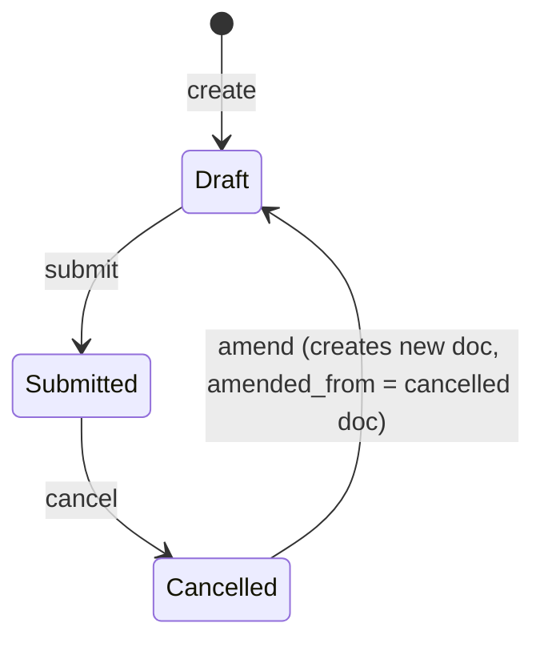

# Income Tax Slab

**Source:** `hrms/payroll/doctype/income_tax_slab/income_tax_slab.json`, `income_tax_slab.py`, `income_tax_slab.js`
**[[Submittable Document Lifecycle|Submittable]]:** yes   **Tree:** no   **[[Naming and Autoname Rules|Naming]]:** `Prompt`, `naming_rule: "Set by user"` — the user types the `name` on creation (e.g. "Tax Slab FY 2024-25")
**Module:** Payroll

## Schema

| Field (fieldname) | Label | Type | Options/Link Target | Required | Default | Read-Only | Notes |
|---|---|---|---|---|---|---|---|
| disabled | Disabled | Check | — | no | `0` | no | `allow_on_submit: 1` — can be toggled even after the document is submitted, without needing amend. Used as a hard gate at consumption time (Salary Slip throws if the resolved slab is disabled). |
| *(section_break_2)* | — | Section Break | — | — | — | — | layout only |
| effective_from | Effective from | Date | — | yes | — | no | `in_list_view`. Compared against the consuming Payroll Period's start date at consumption time (see Business Logic / cross-doctype linkage). |
| company | Company | Link | `Company` | no | — | no | Optional — a slab may be company-specific or left blank (implying it can be used across companies; no company-scoping enforcement found in this doctype's own validate). |
| *(column_break_3)* | — | Column Break | — | — | — | — | layout only |
| currency | Currency | Link | `Currency` | yes | — | no | `fetch_from: company.default_currency`; also force-overwritten in `validate()` whenever `company` is set (see Validation Rules #1). `print_hide`. |
| standard_tax_exemption_amount | Standard Tax Exemption Amount | Currency | — | no | — | no | A flat annual exemption amount, applied unconditionally in addition to any declared/proof exemption when `allow_tax_exemption` is enabled (see Business Logic / cross-doctype linkage). |
| allow_tax_exemption | Allow Tax Exemption | Check | — | no | `0` | no | Description: "If enabled, Tax Exemption Declaration will be considered for income tax calculation." Master switch controlling whether Salary Slip looks up Employee Tax Exemption Declaration/Proof Submission and the standard exemption amount at all. |
| amended_from | Amended From | Link | [[Income Tax Slab]] | no | — | yes | Standard Frappe amend-chain pointer. `no_copy`, `print_hide`. |
| *(taxable_salary_slabs_section)* | Taxable Salary Slabs | Section Break | — | — | — | — | groups `slabs` |
| slabs | Taxable Salary Slabs | Table | [[Taxable Salary Slab]] | yes | — | no | The bracket rows — see `Taxable Salary Slab.md`. |
| *(section_break_cajo)* | — | Section Break | — | — | — | — | layout only |
| tax_relief_limit | Taxable Income Relief Threshold Limit | Currency | — | no | — | no | `non_negative`. Description: "Maximum annual taxable income eligible for full tax relief. No tax is applied if income does not exceed this limit." Hard short-circuit — see Business Logic. |
| *(column_break_pdmy)* | — | Column Break | — | — | — | — | layout only |
| *(taxes_and_charges_on_income_tax_section)* | Taxes and Charges on Income Tax | Section Break | — | — | — | — | `collapsible: 1`, `collapsible_depends_on: other_taxes_and_charges`; groups `other_taxes_and_charges` |
| other_taxes_and_charges | Other Taxes and Charges | Table | [[Income Tax Slab Other Charges]] | no | — | no | Surcharge/cess-style additional charges — see `Income Tax Slab Other Charges.md`. |

`row_format: "Dynamic"` at the doctype level (grid rendering hint only, no business-logic effect).

## Child Tables

- `slabs` -> `Taxable Salary Slab` (own file: `Taxable Salary Slab.md`) — the bracket definitions.
- `other_taxes_and_charges` -> `Income Tax Slab Other Charges` (own file: `Income Tax Slab Other Charges.md`) — surcharge/cess rows layered on top of bracket tax.

## State Machine

Plain list:
- (none) -> submit -> Submitted — guard: `slabs` table must be non-empty (`reqd: 1` on the `slabs` field means Frappe's mandatory-table-has-at-least-one-row check applies); `currency` and `effective_from` must be set (`reqd: 1`).
- Submitted -> cancel -> Cancelled — no doctype-specific guard beyond Frappe's standard cancel permission check.
- Cancelled -> amend -> new Draft — standard Frappe amend, sets `amended_from` on the new document to the cancelled document's name.

There is no separate `status`/`workflow_state` field on this doctype — only the standard `docstatus` (0 Draft / 1 Submitted / 2 Cancelled) plus the independent `disabled` checkbox, which is orthogonal to `docstatus` (a Submitted, non-cancelled slab can still be individually `disabled` to pull it out of use without cancelling/amending).

## Validation Rules (exact, in execution order)

1. IF `self.company` is set THEN `self.currency = erpnext.get_company_currency(self.company)` — this UNCONDITIONALLY overwrites whatever `currency` value was on the form with the company's configured default currency, every time the document is saved while `company` is set (source: `validate`). This is a value-correction, not a `frappe.throw`.

No other server-side validation exists on this controller. In particular: **no check exists anywhere in `income_tax_slab.py` enforcing that only one Income Tax Slab can be the "default" or active slab per company** — see Port Notes and the Cross-Doctype Invariant note below; the doctype has no `is_default` field at all.

## Business Logic / Calculations

### Overview of the full tax-computation chain (entry point: `calculate_tax_by_tax_slab`)

This is the core algorithm `Salary Slip` calls (via `from hrms.payroll.doctype.income_tax_slab.income_tax_slab import calculate_tax_by_tax_slab`) once it has resolved which `Income Tax Slab` document applies to the current payslip's employee/period. Full call signature: `calculate_tax_by_tax_slab(annual_taxable_earning, tax_slab, eval_globals=None, eval_locals=None)`.

1. IF `annual_taxable_earning <= tax_slab.tax_relief_limit` THEN return `(0, 0)` immediately — no tax, no charges, regardless of bracket configuration. (Guard: if `tax_relief_limit` is left blank/0 on the slab, this comparison is `annual_taxable_earning <= 0`, effectively disabling the relief short-circuit for any positive income — there is no explicit None-check, relying on Currency fields defaulting to `0`.)
2. `tax_amount = calculate_base_tax_from_tax_slabs(annual_taxable_earning, tax_slab, eval_globals, eval_locals)` — walks the `slabs` child table and sums each matching bracket's marginal contribution. **Full algorithm reproduced in `Taxable Salary Slab.md`** (including the exact `+1` bracket-width formula and `condition`-expression gating) — do not re-derive it independently, follow that file's numbered steps exactly.
3. `tax_with_marginal_relief = calculate_tax_with_marginal_relief(tax_slab, tax_amount, annual_taxable_earning)` (imported from `hrms.hr.utils`). IF this returns a truthy value THEN `tax_amount = tax_with_marginal_relief` (full replacement, not additive). In base HRMS this function is a stub decorated `@erpnext.allow_regional` that unconditionally `return None` — see Port Notes; it is a regional-localization extension point only.
4. `tax_amount, surcharge = apply_surcharge_with_marginal_relief(tax_amount, annual_taxable_earning, tax_slab, eval_globals, eval_locals)` — also `@erpnext.allow_regional`, base implementation is `return tax_amount, 0` (no-op pass-through in core HRMS; regional country apps may override this to inject country-specific surcharge-with-relief logic).
5. `tax_amount, other_taxes = calculate_other_charges(tax_amount, annual_taxable_earning, tax_slab)` — iterates `other_taxes_and_charges` child rows, compounding each applicable charge onto the running `tax_amount`. **Full algorithm reproduced in `Income Tax Slab Other Charges.md`** — follow that file's numbered steps exactly (charges compound sequentially, do not compute independently off the base).
6. Return `(tax_amount, surcharge + other_taxes)` — a 2-tuple: the final total tax amount (base + marginal-relief-adjusted + surcharge + other charges, all cumulative), and the combined surcharge-plus-other-charges portion reported separately (used by Salary Slip for its tax breakup display/reporting, out of this doctype's scope).

### `eval_tax_slab_condition` helper

Used by step 2 (delegated into `Taxable Salary Slab.md`'s algorithm) to safely evaluate each bracket row's optional `condition` expression. Default `eval_globals` when the caller passes none: `{int, float, long: int, round, date, getdate, get_first_day, get_last_day}`. Error handling: `NameError` -> `frappe.throw` "Name error" (missing/deleted field); `SyntaxError` -> `frappe.throw` "Syntax error in condition: {0} in Income Tax Slab"; any other `Exception` -> `frappe.throw` "Error in formula or condition: {0} in Income Tax Slab" AND additionally `raise`s the original exception after throwing (redundant defensive double-signal, since `frappe.throw` itself already raises — the trailing bare `raise` re-raises whatever was caught, effectively identical practical behavior to `frappe.throw` alone, but preserve this exact structure in the port only if byte-for-byte behavior matters for wrapped-exception introspection).

### Cross-doctype linkage — exactly what Salary Slip consumes from this doctype (Salary Slip itself is out of scope; documented here as the data-exposure contract)

From `hrms/payroll/doctype/salary_slip/salary_slip.py` (read-only reference, not owned by this file):

1. **Slab resolution (`get_income_tax_slabs`)**: Salary Slip reads `income_tax_slab` directly off the employee's `Salary Structure Assignment` (field `income_tax_slab`, a plain `Link` to this doctype — see `Salary Structure Assignment`, out of scope). There is **no fallback/default-slab lookup of any kind** — if `Salary Structure Assignment.income_tax_slab` is blank, Salary Slip throws `frappe.throw(_("Income Tax Slab not set in Salary Structure Assignment: {0}").format(...), title=_("Missing Tax Slab"))`. The resolved slab document is then fetched via `frappe.get_cached_doc("Income Tax Slab", income_tax_slab)`.
2. IF the resolved slab's `disabled` is truthy THEN `frappe.throw(_("Income Tax Slab: {0} is disabled").format(income_tax_slab))`.
3. IF `getdate(income_tax_slab_doc.effective_from) > getdate(self.payroll_period.start_date)` THEN `frappe.throw(_("Income Tax Slab must be effective on or before Payroll Period Start Date: {0}").format(self.payroll_period.start_date))` — the slab's `effective_from` must be on-or-before the Payroll Period's `start_date`; there is no upper-bound check against `end_date` (a slab dated far in the future relative to `end_date` would still fail on `start_date`, but a slab that is only valid for part of the payroll period is not detected — it's an all-or-nothing eligibility gate on the period start alone).
4. Also validated on `Salary Structure Assignment` itself (not Salary Slip): `validate_income_tax_slab()` throws `frappe.throw(_("Income Tax Slab is mandatory since the Salary Structure {0} has a tax component {1}")...)` when the assigned Salary Structure has a tax-type component but no `income_tax_slab` is set; and separately throws `frappe.throw(_("Currency of selected Income Tax Slab should be {0} instead of {1}").format(self.currency, income_tax_slab_currency))` when the Salary Structure Assignment's `currency` does not match this slab's `currency`.
5. **Exemption-amount resolution (`get_total_exemption_amount` on Salary Slip)** — this is the exact mechanism by which `Employee Tax Exemption Declaration`/`Employee Tax Exemption Proof Submission` amounts flow into tax:
   a. `total_exemption_amount = 0`.
   b. IF `tax_slab.allow_tax_exemption` is falsy THEN skip straight to step (d) — exemption declarations/proofs are ignored entirely regardless of whether they exist, when this slab's `allow_tax_exemption` checkbox is off.
   c. IF `tax_slab.allow_tax_exemption` is truthy:
      - IF `self.deduct_tax_for_unsubmitted_tax_exemption_proof` is truthy (Salary Slip sets this internal flag when `payroll_period.end_date <= self.end_date`, i.e. this payslip is for the last sub-period of the payroll period — forcing proof-based reconciliation at year-end) THEN: look up `frappe.db.get_value("Employee Tax Exemption Proof Submission", {"employee": self.employee, "payroll_period": self.payroll_period.name, "docstatus": 1}, "exemption_amount", cache=True)`. If a submitted (docstatus=1) Proof Submission exists for this employee+payroll period, its `exemption_amount` (the capped/aggregated total from that doctype's own `get_total_exemption_amount()` — see `Employee Tax Exemption Proof Submission.md`) is used as `total_exemption_amount`; if none is found, `total_exemption_amount` stays `0` for this component (submitted PROOF, when required, fully supersedes the declared amount — a missing proof at year-end yields zero exemption, not a fallback to the declaration).
      - ELSE (not yet at the final sub-period): look up `frappe.db.get_value("Employee Tax Exemption Declaration", {"employee": self.employee, "payroll_period": self.payroll_period.name, "docstatus": 1}, "total_exemption_amount", cache=True)`. If a submitted Declaration exists, its `total_exemption_amount` is used; otherwise `total_exemption_amount` stays `0`.
   d. IF `tax_slab.standard_tax_exemption_amount` is truthy THEN `total_exemption_amount += flt(tax_slab.standard_tax_exemption_amount)` — the flat standard exemption is ALWAYS added on top, independent of the `allow_tax_exemption` branch above (i.e. even if `allow_tax_exemption` is off, `standard_tax_exemption_amount` still applies).
   e. Return `total_exemption_amount`.
   This confirms the precedence rule requested: **once a submitted Proof Submission exists for the relevant employee+payroll-period at the point Salary Slip forces year-end reconciliation, it entirely replaces (not merges with) the Declaration's amount** — Salary Slip never sums declaration + proof; it's declaration-until-the-last-period, then proof-only.
6. This `total_exemption_amount` is subtracted directly from `total_taxable_earnings` in Salary Slip's `compute_taxable_earnings_for_year()` (`self.total_taxable_earnings = ... - self.total_exemption_amount`), which becomes (after further adjustments not detailed here as they belong to Salary Slip) the `annual_taxable_earning` input to this doctype's `calculate_tax_by_tax_slab()`.

## Lifecycle Hooks (exact)

| Event | What Runs | Side Effects on Other Doctypes |
|---|---|---|
| validate | Force-overwrites `currency` from `company.default_currency` when `company` is set (Validation Rules #1) | None (read-only lookup via `erpnext.get_company_currency`) |
| (client `refresh`, `.js`) | Adds a "Create > Salary Structure Assignment" button when `docstatus == 1` (Submitted), pre-populating a new Salary Structure Assignment's `income_tax_slab` with this slab's name | Purely a UI convenience; no server-side doc is created until the user saves the new Salary Structure Assignment form. |

## Whitelisted / API Methods

None defined directly on this doctype's controller. The module-level functions `calculate_tax_by_tax_slab`, `calculate_base_tax_from_tax_slabs`, `calculate_other_charges`, `eval_tax_slab_condition` are plain Python functions (not `@frappe.whitelist()`), callable only from server-side code (e.g. Salary Slip), not directly from a frontend/API client.

## [[Permission Model (RBAC)|Permissions]]

| Role | Read | Write | Create | Delete | Submit | Cancel | Amend | Report | Export | Notes |
|---|---|---|---|---|---|---|---|---|---|---|
| System Manager | 1 | 1 | 1 | 1 | 1 | 1 | 1 | 1 | 1 | share, email, print also 1 |
| HR Manager | 1 | 1 | 1 | 1 | 1 | 1 | 1 | 1 | 1 | share, email, print also 1 |
| HR User | 1 | 1 | 1 | 1 | 1 | 1 | 1 | 1 | 1 | share, email, print also 1 |

No `Employee` self-service role has any access — Income Tax Slab is HR/payroll-admin-only master/configuration data. No `if_owner`/`permlevel` restrictions.

## Scheduled Jobs Touching This Doctype

None found in `hrms/hooks.py`. (`Income Tax Slab` appears only in the `company_data_to_be_ignored` list in `hooks.py`, which controls what gets skipped when a Company record is deleted — not a scheduler event.)

## Cross-Doctype Invariant: "at most one default Income Tax Slab per company"

**Not enforced in source.** There is no `is_default` field on `Income Tax Slab` at all (confirmed absent from the full field list above), and no code anywhere in `income_tax_slab.py`, `salary_structure_assignment.py`, or `salary_slip.py` implements a "resolve the default slab for a company" lookup. The linkage is entirely explicit and manual: each `Salary Structure Assignment` document must have its own `income_tax_slab` Link field set directly (validated as mandatory only when the assigned Salary Structure has a tax component — see step 4 above); there is no automatic fallback to a company-wide default when it's blank (Salary Slip throws instead, per step 1 above). Consequently there is also no invariant to violate — an implementer could create arbitrarily many non-disabled `Income Tax Slab` documents for the same `company` with no conflict, because nothing ever asks "which slab is the default for this company." **Flag for the port:** if a "default slab per company" convenience feature is desired in the new system (e.g. to reduce manual selection burden on every Salary Structure Assignment), it would be new functionality with no reference behavior in this codebase to replicate — document it as a deliberate addition, not a ported behavior.

## Related Doctypes

- [[Taxable Salary Slab]] — child table (`slabs`); the bracket rows walked by `calculate_base_tax_from_tax_slabs`.
- [[Income Tax Slab Other Charges]] — child table (`other_taxes_and_charges`); surcharge/cess rows layered on top of the base slab tax.
- [[Income Tax Slab]] — `amended_from` points back to the cancelled document in the standard amend chain.
- [[Salary Structure Assignment]] — holds the `income_tax_slab` Link that resolves which slab document applies to an employee; also validates the slab's currency matches its own.
- [[Salary Slip]] — the consumer: resolves the applicable slab, calls `calculate_tax_by_tax_slab()`, and looks up exemption amounts as described in the Business Logic section.
- [[Employee Tax Exemption Declaration]] — read (when `allow_tax_exemption` is set and not yet at the payroll period's final sub-period) to source `total_exemption_amount`.
- [[Employee Tax Exemption Proof Submission]] — read instead of the Declaration once Salary Slip forces year-end proof reconciliation.
- [[Payroll Period]] — its `start_date` is compared against `effective_from` to determine slab eligibility for a given period.

## Port Notes

- **Regional/localization extension points are stubs in core HRMS.** `calculate_tax_with_marginal_relief` and `apply_surcharge_with_marginal_relief` (both `@erpnext.allow_regional`) and `calculate_annual_eligible_hra_exemption`/`calculate_hra_exemption_for_period` (referenced from the Declaration/Proof Submission doctypes) are all no-op/`None`-returning placeholders in this repository — the real India-specific tax logic they represent lives in a separate regional app (`erpnext.regional.india` or similar, not present in this repo) that monkey-patches/overrides them via the `allow_regional` decorator mechanism. A port targeting only the behavior visible in THIS repository will therefore have: no marginal relief, no surcharge-with-relief adjustment, and zero HRA exemption contribution, ever — reproduce these as true no-ops (not "TODO: implement India tax rules") unless the country-specific behavior is separately sourced and explicitly requested.
- `frappe.get_cached_doc` is used to fetch the resolved slab in Salary Slip — a port should note this is a read-through cache keyed by doctype+name, invalidated on document save; if a slab is edited mid-payroll-run in the target system, cached-vs-fresh read semantics should be considered.
- `disabled` uses `allow_on_submit: 1`, meaning in Frappe's UI this single checkbox is editable on an already-submitted document without going through the amend workflow — this is a [[Implicit Framework Behaviors|Frappe-specific]] "field-level submit-time editability" mechanism the target stack has no free equivalent for; implement it explicitly as "field X remains mutable post-submit while all other fields on this record are locked."
- `company` and `currency` are both optional-then-optionally-forced: `currency` is nominally `reqd: 1` but is silently overwritten whenever `company` is set, and `company` itself is NOT `reqd`, so a slab can exist with no `company` and a manually chosen `currency` that will never be overwritten. Preserve this "conditional server-side overwrite" rather than making `currency` a strict computed/derived-only field, since a company-less slab genuinely accepts a user-chosen currency.
- The `slabs` table's `reqd: 1` combined with Frappe's default child-table-mandatory behavior means a slab document cannot be saved with zero bracket rows — a port should enforce "at least one Taxable Salary Slab row" as an explicit save-time constraint since it isn't visible as an explicit `frappe.throw` in this `.py` file (it's framework-level mandatory-table enforcement, invisible in the controller code but real).
