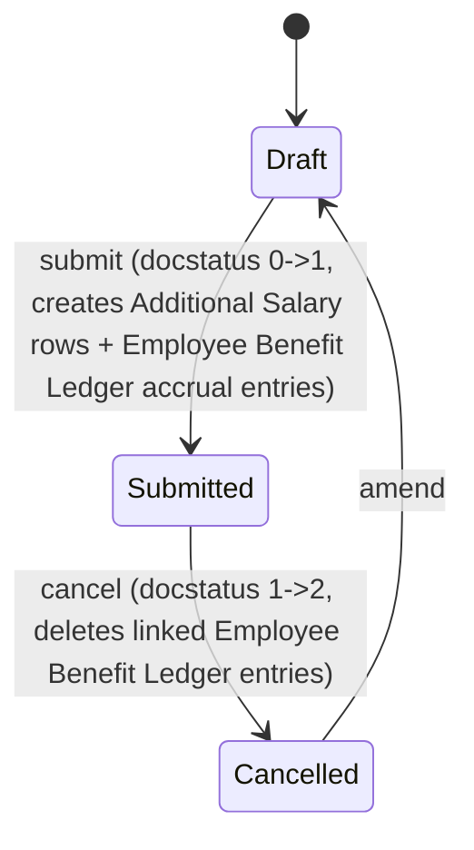

# Payroll Correction

**Source:** `hrms/payroll/doctype/payroll_correction/payroll_correction.json`, `payroll_correction.py`, `payroll_correction.js`
**Submittable:** yes   **Tree:** no   **Naming:** `format:PAYCORR-{payroll_period}-{#####}` (expression naming rule)
**Module:** Payroll

Reverses ("gives back") a specified number of Leave-Without-Pay (LWP) days from an already-processed Salary Slip for a given month, generating arrear-style Additional Salary top-ups for the components proportionally affected.

## Schema

| Field (fieldname) | Label | Type | Options/Link Target | Required | Default | Read-Only | Notes |
|---|---|---|---|---|---|---|---|
| amended_from | Amended From | Link | [[Payroll Correction]] | no | | yes | |
| employee | Employee | Link | [[Employee Core Model]] | yes | | no | |
| employee_name | Employee Name | Data | | no | | yes | fetch_from `employee.employee_name` |
| company | Company | Link | Company | yes | | no | |
| currency | Currency | Link | Currency | no | | no | `depends_on: eval: doc.company && doc.employee`; fetch_from `company.default_currency` (NOT `reqd`, unlike sibling doctypes) |
| payroll_period | Payroll Period | Link | [[Payroll Period]] | yes | | no | |
| month_for_lwp_reversal | Select Month for LWP Reversal | Select | dynamic (client-populated list of month names with LWP, from `fetch_salary_slip_details`) | yes | | no | `depends_on: payroll_period`; drives client-side selection of `salary_slip_reference` |
| salary_slip_reference | Salary Slip Reference | Link | [[Salary Slip]] | yes | | yes | `depends_on: month_for_lwp_reversal`; set client-side from the chosen month |
| working_days | Working Days | Float | | no | | yes | `depends_on: salary_slip_reference`; = `Salary Slip.total_working_days`, set server-side in `validate_days` |
| lwp_days | Total Days Without Pay | Float | | no | | yes | `depends_on: salary_slip_reference`; = `max(working_days - payment_days, 0)`, set server-side |
| days_to_reverse | Days to Reverse | Float | | yes | | no | `depends_on: salary_slip_reference`; description: "cannot exceed the total LWP days recorded for the selected month" |
| payroll_date | Payroll Date | Date | | yes | | no | description: "Choose the date on which you want to create these components as arrears." |
| payment_days | Payment Days | Float | | no | | yes | `depends_on: salary_slip_reference`; = `Salary Slip.payment_days` |
| earning_arrears | Earning Arrears | Table | [[Payroll Correction Child]] | no | | yes | `depends_on: earning_arrears`; computed |
| deduction_arrears | Deduction Arrears | Table | [[Payroll Correction Child]] | no | | yes | `depends_on: deduction_arrears`; computed |
| accrual_arrears | Accrual Arrears | Table | [[Payroll Correction Child]] | no | | yes | `depends_on: accrual_arrears`; computed |

Layout-only fields skipped: section_break_vvay, column_break_uuzk, section_break_xdag, column_break_uyjn, section_break_giud.

## Child Tables

All three arrear tables reuse **Payroll Correction Child** (see `Payroll Correction Child.md`): fields `salary_component` (Link, Salary Component) and `amount` (Float, non_negative).

## State Machine



No explicit `status` field; state is `docstatus` only.

## Validation Rules (exact, in execution order)

`validate()`:
1. IF `self.days_to_reverse <= 0` THEN throw `"Days to Reverse must be greater than zero."`
2. `validate_days()`:
   a. Only runs the body IF `self.days_to_reverse` AND `self.salary_slip_reference` both truthy.
   b. Load the referenced `Salary Slip`; set `self.working_days = salary_slip.total_working_days`, `self.payment_days = salary_slip.payment_days`, `self.lwp_days = max(total_working_days - payment_days, 0)`.
   c. Fetch all OTHER submitted `Payroll Correction` docs for the same `payroll_period` + `salary_slip_reference` + `employee` (excluding self), sum their `days_to_reverse` into `total_days_reversed`.
   d. IF `total_days_reversed + self.days_to_reverse > self.lwp_days` THEN throw `"You cannot reverse more than the total LWP days {0}. You have already reversed {1} days for this employee."` (lwp_days, total_days_reversed) — i.e. the cumulative reversed days across ALL Payroll Correction documents touching this same slip/employee/period cannot exceed the slip's actual LWP day count.
3. `populate_breakup_table()` (see Business Logic below) — recomputes and overwrites the three arrear child tables on every save; internally may `frappe.msgprint` (non-blocking) if no arrear components are found, but does not throw in that case (returns silently, leaving tables empty — this only becomes fatal later at `on_submit` via `validate_arrear_details`).

`on_submit()`:
4. `validate_arrear_details()`: IF all three of `earning_arrears`/`deduction_arrears`/`accrual_arrears` are empty THEN throw `"No arrear details found"`.
5. `create_additional_salary()` (side effect).
6. `create_benefit_ledger_entry()` (side effect).

## Business Logic / Calculations

### `populate_breakup_table()` — the per-day LWP-reversal arrear calculation
1. Load the referenced `salary_slip = frappe.get_doc("Salary Slip", self.salary_slip_reference)`. (IF this somehow resolves falsy THEN throw `"Salary Slip not found."` — dead-code guard since `get_doc` would itself raise if missing; reproduced for completeness.)
2. `precision = salary_slip.precision("gross_pay")` OR System Settings `currency_precision` OR `2` (first non-falsy wins).
3. Clear `earning_arrears`, `deduction_arrears`, `accrual_arrears`.
4. Build a `salary_slip_components` map: for each row in the slip's `earnings` and `deductions` sections where `NOT item.additional_salary` (i.e. base-structure amounts only, excluding anything that came from an Additional Salary): record `{default_amount: item.default_amount or 0, section: "earning_arrears" if from earnings else "deduction_arrears"}` keyed by `salary_component`. For each row in `accrued_benefits`: record `{default_amount: item.amount or 0, section: "accrual_arrears", accrual_component: True}` keyed by `salary_component` (this OVERWRITES any earlier earning/deduction entry for the same component name, since it's the same dict keyed by component — components appearing in both an earning/deduction section AND accrued_benefits would only retain the accrual entry; flag as an inherent limitation of using a single dict keyed only by component name).
5. IF `salary_slip_components` is non-empty: query `Salary Component` for names in that key set where `arrear_component == 1` AND `variable_based_on_taxable_salary == 0` AND `disabled == 0` — these are the `arrear_components` eligible for this correction.
6. IF no `arrear_components` found THEN `frappe.msgprint` (non-blocking) `"No arrear components found in the salary slip. Ensure Arrear Component is checked in the Salary Component master."` and return (tables remain empty).
7. For each eligible component:
   a. IF it's an accrual component: `total_working_days = salary_slip.payment_days` (default 1) — "since accruals do not have default_amount field" (source comment) i.e. accrual components are prorated against payment days, not total working days.
   b. ELSE: `total_working_days = salary_slip.total_working_days` (default 1).
   c. `per_day_amount = flt(component_data.default_amount / total_working_days)`.
   d. `arrear_amount = flt(per_day_amount * self.days_to_reverse)`.
   e. Append `{salary_component: component, amount: flt(arrear_amount, precision)}` into the matching section's child table (`earning_arrears`, `deduction_arrears`, or `accrual_arrears`).

Edge cases explicitly handled: division uses `total_working_days` defaulted to `1` to avoid divide-by-zero if the slip field is somehow falsy/zero; rounding to `precision` (gross_pay's precision, or system default, or 2) applied only at the final per-row `amount`, not on the intermediate `per_day_amount`.

### `create_additional_salary()` (on_submit)
For every row across `earning_arrears` + `deduction_arrears`: insert AND submit a new `Additional Salary`:
```
employee: self.employee
company: self.company
payroll_date: self.payroll_date
salary_component: component.salary_component
currency: self.currency
amount: component.amount
ref_doctype: "Payroll Correction"
ref_docname: self.name
overwrite_salary_structure_amount: 0
```
(No skip-if-zero-amount guard here, unlike Arrear's equivalent method — every row present in the tables generates an Additional Salary regardless of amount, even if `amount == 0`.)

### `create_benefit_ledger_entry()` (on_submit)
For every row in `accrual_arrears` (skip if no `salary_component` or falsy `amount`): look up `is_flexible_benefit` from `Salary Component`, insert a new `Employee Benefit Ledger` entry:
```
employee, employee_name, company: from self
payroll_period: self.payroll_period
salary_component: component.salary_component
transaction_type: "Accrual"
amount: component.amount
reference_doctype: "Payroll Correction"
reference_document: self.name
remarks: "Accrual via Payroll Correction"
salary_slip: self.salary_slip_reference
flexible_benefit: is_flexible_benefit
```
(Note: unlike Arrear's equivalent, this ALSO sets `salary_slip = self.salary_slip_reference` on the ledger entry, linking the accrual back to the specific slip being corrected.)

### `on_cancel()`
`delete_employee_benefit_ledger_entry("reference_document", self.name)` — bulk-deletes `Employee Benefit Ledger` rows referencing this document. Generated `Additional Salary` documents are NOT reversed (same gap pattern as `Arrear`).

## Lifecycle Hooks (exact)

| Event | What Runs | Side Effects on Other Doctypes |
|---|---|---|
| validate | days_to_reverse > 0 check, `validate_days` (cross-checks against other Payroll Corrections on the same slip), `populate_breakup_table` (recomputes arrear tables every save) | Reads Salary Slip, Salary Component, other Payroll Correction docs |
| on_submit | `validate_arrear_details`, `create_additional_salary`, `create_benefit_ledger_entry` | Inserts + submits `Additional Salary` docs; inserts `Employee Benefit Ledger` docs |
| on_cancel | `delete_employee_benefit_ledger_entry("reference_document", self.name)` | Bulk-deletes `Employee Benefit Ledger` rows (Additional Salary docs NOT reversed) |

## Whitelisted / API Methods

| Method name | HTTP-equivalent purpose | Args | Returns | What it does |
|---|---|---|---|---|
| `fetch_salary_slip_details` | POST (form doc method, client-driven month-picker) | none (uses self.employee/payroll_period/company) | `{"months": [...], "slip_details": [...]}` or `None` (with a msgprint) if no matching slips, or `{"months": [], "slip_details": []}` if employee/payroll_period/company not all set | Finds all submitted Salary Slips for the employee in this payroll period/company where `leave_without_pay > 0`; for each, derives the calendar month name (`calendar.month_name[start_date.month]`) and builds a `slip_details` list (`salary_slip_reference`, `absent_days`, `leave_without_pay`, `month_name`, `working_days`, `payment_days`, `start_date`); returns sorted unique month names plus the full detail list, for the client to populate the `month_for_lwp_reversal` Select options and then look up the chosen slip's fields (`salary_slip_reference`, `payment_days`, `working_days`, `lwp_days`) client-side. |

## Permissions

| Role | Read | Write | Create | Delete | Submit | Cancel | Amend | Report | Export | Notes |
|---|---|---|---|---|---|---|---|---|---|---|
| System Manager | yes | yes | yes | yes | yes | n/a (cancel not listed) | n/a | yes | yes | share/email/print also 1 |
| HR Manager | yes | yes | yes | yes | yes | n/a (cancel not listed) | n/a | yes | yes | `select: 1` also set; share/email/print also 1 |
| HR User | yes | yes | yes | yes | yes | n/a (cancel not listed) | n/a | yes | yes | `select: 1` also set; share/email/print also 1 |
| Employee | yes | yes | yes | no | no | n/a | n/a | yes | yes | share/email/print also 1; no delete/submit rights |

Note: no role in this doctype's permissions array has `cancel: 1` or `amend: 1` explicitly set — a submitted Payroll Correction can apparently only be cancelled/amended by roles with framework-level override (e.g. System Manager's implicit privileges), not by explicit doctype permission grant. Reproduce exactly; do not add cancel/amend rights not present in source.

## Scheduled Jobs Touching This Doctype

None found in `hrms/hooks.py`.

## Related Doctypes

- [[Payroll Correction Child]] — child table shape used for all three arrear breakup tables (`earning_arrears`, `deduction_arrears`, `accrual_arrears`).
- [[Salary Slip]] — the already-processed slip this correction reverses LWP days against; read for `total_working_days`, `payment_days`, `gross_pay` precision, and its earnings/deductions/accrued_benefits rows.
- [[Salary Component]] — arrear-eligible components looked up (`arrear_component`, `variable_based_on_taxable_salary`, `disabled` flags).
- [[Additional Salary]] — created and submitted on `on_submit()` for every earning/deduction arrear row.
- [[Employee Benefit Ledger]] — accrual entries inserted on `on_submit()` and bulk-deleted on `on_cancel()`.
- [[Payroll Period]] — scopes the cumulative-days-reversed cross-document guard alongside employee and salary slip reference.
- [[Arrear]] — sibling doctype sharing the same `Payroll Correction Child` shape and a similar Additional-Salary-generation pattern.

## Port Notes

- Like `Arrear`, the three arrear child tables are recomputed on EVERY `validate()` call — treat as fully server-derived, not independently user-editable data, despite `earning_arrears`/`deduction_arrears`/`accrual_arrears` in this doctype (unlike Arrear's) correctly being marked `"read_only": 1` in the JSON, consistent with being system-computed.
- `populate_breakup_table`'s component-map construction (step 4 above) has a real collision bug/limitation: if the same salary component name appears in both an earning/deduction section AND in `accrued_benefits` of the same slip, only the accrual entry survives in `salary_slip_components` (last-write-wins on the shared dict key). This is reproduced from source as-is, not fixed, per ground rules — flag it explicitly since a port might otherwise "fix" this as an obvious bug.
- `create_additional_salary()` here, unlike `Arrear`'s version, does NOT skip zero-amount rows — a port must NOT add a zero-amount skip here even though the sibling doctype has one; the discrepancy is intentional-per-source (or at least present-in-source) and must be preserved.
- `currency` field is NOT marked `reqd` here, unlike almost every other currency-carrying doctype in this module (Additional Salary, Employee Benefit Application, Employee Benefit Claim, Employee Incentive all mark `currency` as `reqd`). Flag this inconsistency; do not silently add a `reqd` constraint not present in source.
- Cumulative-days-reversed guard (`validate_days`) is a cross-document invariant: total `days_to_reverse` across ALL non-cancelled Payroll Correction docs for the same employee+slip+payroll_period must never exceed that slip's actual LWP day count. This is a module-wide invariant worth restating in `_Module-Spec.md`.
- Depends on `Salary Slip` fields `total_working_days`, `payment_days`, `leave_without_pay`, `absent_days`, `gross_pay` (for precision), and its `earnings`/`deductions`/`accrued_benefits` child rows including `default_amount`/`additional_salary` markers — all owned by another module/agent; hard cross-module dependency.
