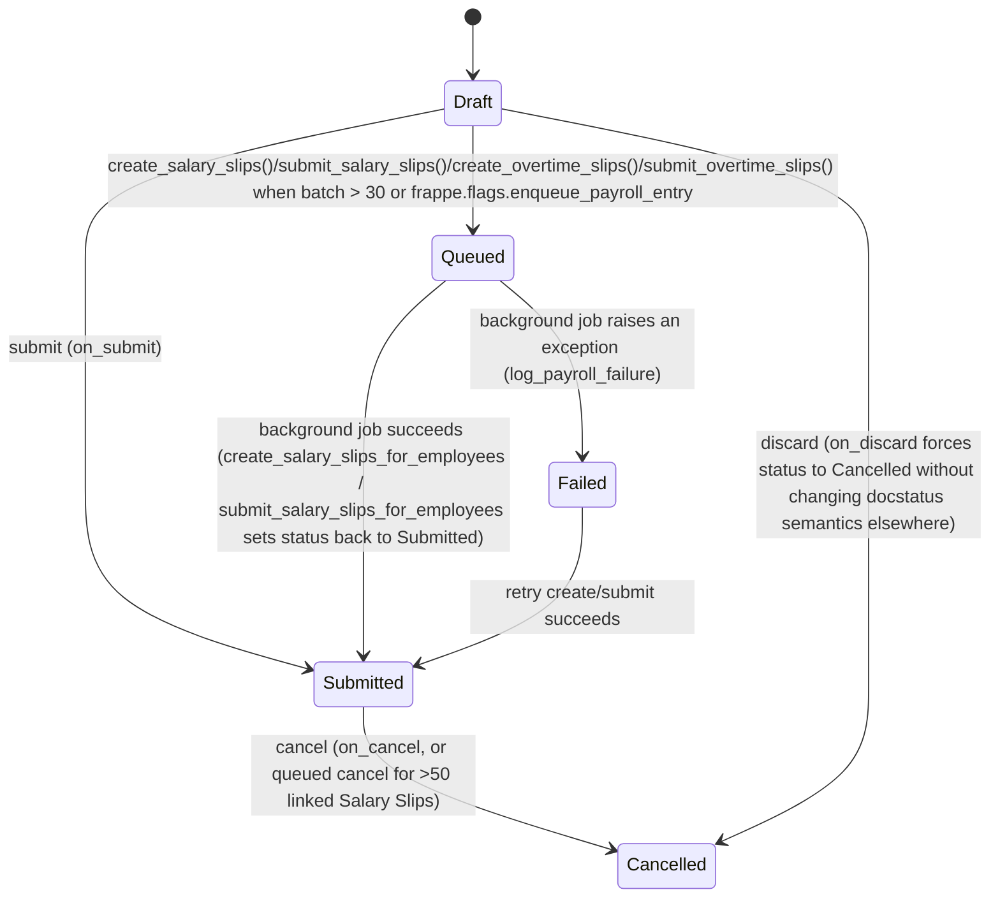

# Payroll Entry

**Source:** `hrms/payroll/doctype/payroll_entry/payroll_entry.json`, `payroll_entry.py`, `payroll_entry.js`
**Submittable:** yes   **Tree:** no   **Naming:** `autoname: "HR-PRUN-.YYYY.-.#####"` (expression/old-style naming rule — prefix `HR-PRUN-`, current year, then a 5-digit auto-incrementing counter, e.g. `HR-PRUN-2026-00001`)
**Module:** Payroll

## Schema

Field order follows the JSON `field_order` array. Layout-only fields (Section Break/Column Break/Tab Break with no label carrying logic) are noted as group headers only.

| Field (fieldname) | Label | Type | Options/Link Target | Required | Default | Read-Only | Notes |
|---|---|---|---|---|---|---|---|
| *(Tab: Overview — `select_payroll_period`)* | | | | | | | |
| posting_date | Posting Date | Date | — | Yes | `Today` | No | |
| company | Company | Link | Company | Yes | — | No | `remember_last_selected_value` |
| currency | Currency | Link | Currency | Yes | — | No | `depends_on: company` |
| payroll_payable_account | Payroll Payable Account | Link | Account | Yes | — | No | `depends_on: company`; must resolve to an Account with `account_type == "Payable"` (validated) |
| status | Status | Select | Draft / Submitted / Cancelled / Queued / Failed | No | — | Yes | print_hide; set exclusively by `set_status()` / `db_set` calls in controller |
| salary_slip_based_on_timesheet | Salary Slip Based on Timesheet | Check | — | No | 0 | No | |
| payroll_frequency | Payroll Frequency | Select | (blank)/Monthly/Fortnightly/Bimonthly/Weekly/Daily | Conditionally | — | No | `mandatory_depends_on: eval:doc.salary_slip_based_on_timesheet == 0` |
| start_date | Start Date | Date | — | Yes | — | No | |
| end_date | End Date | Date | — | Yes | — | No | |
| deduct_tax_for_unsubmitted_tax_exemption_proof | Deduct Tax For Unsubmitted Tax Exemption Proof | Check | — | No | 0 | No | |
| *(Tab: Employees — `employees_tab`; Section: Filter Employees — `section_break_17`)* | | | | | | | |
| branch | Branch | Link | Branch | No | — | No | employee filter |
| department | Department | Link | Department | No | — | No | employee filter; client-side query filtered by `company` |
| designation | Designation | Link | Designation | No | — | No | employee filter |
| grade | Grade | Link | [[Employee Grade]] | No | — | No | employee filter |
| number_of_employees | Number Of Employees | Int | — | No | — | Yes | computed = `len(self.employees)` in `validate()` |
| *(Section: Employee Details — `section_break_24`)* | | | | | | | |
| employees | (no label) | Table | [[Payroll Employee Detail]] | No | — | No | see Child Tables |
| *(Section — `section_break_26`)* | | | | | | | |
| validate_attendance | Validate Attendance | Check | — | No | 0 | No | if checked, gates `on_submit`/`before_submit` attendance check |
| attendance_detail_html | (no label) | HTML | — | No | — | No | client-rendered summary of unmarked-attendance employees; no server persistence |
| *(Tab: Accounting & Payment — `accounting_dimensions_tab`)* | | | | | | | |
| *(Section: Accounting Dimensions — `accounting_dimensions_section`)* | | | | | | | |
| cost_center | Cost Center | Link | Cost Center | Yes | `:Company` (company's default cost center) | No | fallback cost center for accrual JV lines when no per-employee cost center split exists |
| project | Project | Link | Project | No | — | No | |
| bank_account | Bank Account | Link | Bank Account | No | — | No | |
| *(Section: Payment Entry — `account`)* | | | | | | | |
| payment_account | Payment Account | Link | Account | No | — | No | `allow_on_submit: 1`; `fetch_from: bank_account.account`; description "Select Payment Account to make Bank Entry" |
| exchange_rate | Exchange Rate | Float | — | Yes | — | No | precision 9; `depends_on: company` |
| *(Tab: Failure Details — `failure_details_section`, collapsible)* | | | | | | | |
| error_message | Error Message | Text Editor | — | No | — | Yes | `depends_on: eval:doc.status=='Failed'`; `no_copy` |
| amended_from | Amended From | Link | [[Payroll Entry]] | No | — | Yes | standard amendment link; `no_copy`, `print_hide` |
| salary_slips_created | Salary Slips Created | Check | — | No | 0 | Yes | hidden, `no_copy`; internal flag set by `create_salary_slips_for_employees` |
| salary_slips_submitted | Salary Slips Submitted | Check | — | No | 0 | Yes | hidden, `no_copy`; internal flag set by `submit_salary_slips_for_employees` |
| overtime_step | Overtime Slip Step | Select | (blank)/Create/Submit | No | — | No | computed on `onload()`, not persisted by validate; drives client button label |
| *(Tab: Connections — `connections_tab`, dashboard)* | | | | | | | |

Column Break / Section Break / Tab Break fields with no logic (`column_break_5`, `column_break_13`, `column_break_21`, `column_break_35`, `section_break_cypo`) are pure layout and omitted from the table above except where they open a named group.

## Child Tables

- `employees` (Table, fieldtype Table, options [[Payroll Employee Detail]]) — see `Payroll Employee Detail.md`. Populated wholesale (replaced, not merged) by `fill_employee_details()`.

## State Machine

Plain transition list:

| From | Event | To | Guard |
|---|---|---|---|
| (new) | insert | Draft | `validate()` -> `set_status()` maps `docstatus 0` to `"Draft"` |
| Draft | `frm.submit()` -> `on_submit` | Submitted | `before_submit` validations pass (no duplicate slips, payable account is type Payable, no unmarked attendance if `validate_attendance`) |
| Submitted (still doc-level docstatus=1) | `create_salary_slips()` invoked with employees > 30, or `frappe.flags.enqueue_payroll_entry` true | Queued | status forced to `"Queued"` via `db_set` before enqueue |
| Queued | `create_salary_slips_for_employees` background job completes without exception | Submitted | `payroll_entry.db_set({"status": "Submitted", "salary_slips_created": 1, "error_message": ""})` |
| Queued / Submitted | `create_salary_slips_for_employees` or `submit_salary_slips_for_employees` raises | Failed | `log_payroll_failure()` -> `payroll_entry.db_set({"error_message": ..., "status": "Failed"})` |
| Failed | user re-triggers `create_salary_slips` / `submit_salary_slips` | Submitted or Failed again | depends on outcome of the retried job |
| Submitted | `submit_salary_slips()` invoked with >30 unsubmitted slips or `frappe.flags.enqueue_payroll_entry` | Queued | same queuing pattern as creation |
| Submitted | `cancel()` | Cancelled | `docstatus` transitions 1->2 via Frappe framework cancel; if linked Salary Slip count > 50, cancellation itself is queued (`self.queue_action("cancel", timeout=3000)`) rather than status field, but end state after completion is Cancelled |
| Draft | discard | Cancelled | `on_discard` sets `status` to `"Cancelled"` directly (this is a UI "discard draft" action, not a real docstatus cancel) |

Note: `status` is a Select field independent of the framework [[Submittable Document Lifecycle]] `docstatus` (0=Draft/1=Submitted/2=Cancelled). `set_status()` defaults status from `docstatus` (`{0: "Draft", 1: "Submitted", 2: "Cancelled"}[self.docstatus or 0]`) whenever called without an explicit `status` argument, but background/queue code overrides it explicitly to `"Queued"` or `"Failed"` regardless of `docstatus` (which stays 1/Submitted throughout queued/failed processing since the document itself was already submitted).

## Validation Rules (exact, in execution order)

`validate()` (runs on every save, before `before_submit`):
1. `self.number_of_employees = len(self.employees)` — recomputed unconditionally (source: `validate`).
2. `self.set_status()` — recompute `status` from `docstatus` unless explicitly overridden elsewhere (source: `validate` -> `set_status`).

`before_submit()` (runs only on submit, after `validate`):
3. `validate_existing_salary_slips()`: query existing non-cancelled Salary Slips (`docstatus != 2`) for any employee in `self.employees` where `start_date == self.start_date AND end_date == self.end_date`. IF any exist THEN `frappe.throw(msg, title=_("Duplicate Entry"))` where msg is `"Salary Slip already exists for {employees} for the given dates"` plus a `"Reference: {links}"` line (source: `validate_existing_salary_slips`).
4. `validate_payroll_payable_account()`: fetch `Account.account_type` for `self.payroll_payable_account`. IF `account_type != "Payable"` THEN `frappe.throw(_("Account type should be set {Payable} for payroll payable account {account}, please set and try again"))` (source: `validate_payroll_payable_account`).
5. IF `self.get_employees_with_unmarked_attendance()` returns a non-empty list THEN `frappe.throw(_("Cannot submit. Attendance is not marked for some employees."))` — only evaluated (i.e. `get_employees_with_unmarked_attendance` returns non-`None`) when `self.validate_attendance` is checked; otherwise the method returns `None` immediately and the throw is skipped (source: `before_submit`, `get_employees_with_unmarked_attendance`).

`Payroll Settings.validate()` cross-doctype dependency: `validate_payroll_payable_account` does not itself check company/currency consistency of the account — no such check exists in this repo's Payroll Entry controller (Port Note: a stricter port might want to verify account currency matches `self.currency`, but source does not enforce this).

Client-side-only rule (JS `setup`/`set_query` on `employees.employee`): before showing the employee picker, the form checks that `company`, `payroll_frequency`, `start_date`, `end_date` are all set, else throws a client `frappe.throw` listing missing fields. **This has no server-side equivalent** — a port must add an equivalent guard server-side inside whatever endpoint populates the employee table, since `fill_employee_details()` itself will simply return zero employees (or throw "No employees found") if these are blank rather than validating them explicitly.

## Business Logic / Calculations

### 1. Employee selection algorithm — `fill_employee_details()` (whitelisted)

Pseudocode:
1. Build `filters` via `make_filters()`: `{company, branch, department, designation, grade, currency, start_date, end_date, payroll_payable_account, salary_slip_based_on_timesheet}`; additionally include `payroll_frequency` in filters IF `self.salary_slip_based_on_timesheet` is falsy (timesheet-based runs skip the frequency filter entirely).
2. Call `get_employee_list(filters, as_dict=True, ignore_match_conditions=True)`:
   a. `get_salary_structure(company, currency, salary_slip_based_on_timesheet, payroll_frequency)`: select `Salary Structure.name` WHERE `docstatus == 1 AND is_active == "Yes" AND company == filters.company AND currency == filters.currency AND salary_slip_based_on_timesheet == filters.value`; additionally `AND payroll_frequency == filters.payroll_frequency` IF not timesheet-based. IF no matching Salary Structures THEN return `[]` immediately (no employees).
   b. `get_filtered_employees(sal_struct, filters, ...)`: join `Employee` to `Salary Structure Assignment` on `employee`, WHERE:
      - `Salary Structure Assignment.docstatus == 1`
      - `Employee.status != "Inactive"`
      - `Employee.company == filters.company`
      - `Employee.date_of_joining <= filters.end_date` OR `date_of_joining IS NULL`
      - `Employee.relieving_date >= filters.start_date` OR `relieving_date IS NULL`
      - `Salary Structure Assignment.salary_structure IN (sal_struct from step a)`
      - `Salary Structure Assignment.payroll_payable_account == filters.payroll_payable_account`
      - `filters.end_date >= Salary Structure Assignment.from_date` (i.e. the assignment must have started on or before the payroll period end)
      - Then applies optional filters: excludes any employee already in `filters.employees` (used by the employee-picker search, not by `fill_employee_details` which never sets this); AND for each of `branch, department, designation, grade` present in filters, equality filter on `Employee.<field>`.
      - Unless `ignore_match_conditions=True` (which `fill_employee_details` always passes), also applies Frappe's user-permission match conditions on Employee (row-level security) — `fill_employee_details` explicitly bypasses these so an HR Manager building a payroll run isn't limited by their own record-level permissions.
      - Selects `DISTINCT employee, employee_name, department, designation` by default (or `fields` param if supplied).
   c. `remove_payrolled_employees(emp_list, start_date, end_date)`: from the result, drop any employee who already has a *submitted, non-cancelled* Salary Slip (`docstatus == 1`, note: **not** `!= 2` — only exactly submitted slips count here, unlike step 3 below) whose `start_date == filters.start_date AND end_date == filters.end_date` for ANY payroll entry (query is not scoped to `self.name`).
3. IF the resulting employee list is empty THEN `frappe.throw` with a detailed message listing Company/Currency/Payroll Payable Account and any of Branch/Department/Designation/Start date/End date that were set, titled `"No employees found"`.
4. `self.set("employees", employees)` — **replaces** the entire child table (does not merge/append).
5. `self.number_of_employees = len(self.employees)`.
6. `update_employees_with_withheld_salaries()`: for each employee row, look up `get_salary_withholdings(start_date, end_date, pluck="employee")` (Salary Withholding Cycle rows matching `from_date == start_date AND to_date == end_date AND docstatus == 1 AND is_salary_released != 1`); IF the employee is in that withheld list THEN set `employee.is_salary_withheld = 1` on the child row.
7. Return `self.get_employees_with_unmarked_attendance()` (see below) as the RPC's return value, so the client can render an attendance-warning panel even before submit.

Note: `fill_employee_details` does **not** persist the document itself (no `self.save()`); the caller (client JS) marks the form dirty and calls `frm.save()` separately.

### 2. Unmarked-attendance detection — `get_employees_with_unmarked_attendance()` (whitelisted)

1. IF `self.validate_attendance` is falsy, return `None` (no-op).
2. `get_employee_and_attendance_details()`: for every employee in `self.employees`, left-join `Attendance` where `attendance_date BETWEEN self.start_date AND self.end_date AND docstatus == 1`, grouped by employee, returning `{name, date_of_joining, relieving_date, holiday_list, attendance_count}`.
3. Fetch `default_holiday_list` from the `Company`.
4. For each employee row:
   a. `get_payroll_dates_for_employee(details)`: `start_date = max(self.start_date, employee.date_of_joining)`; `end_date = min(self.end_date, employee.relieving_date)` if a relieving date exists and is earlier than `self.end_date`, else `self.end_date`.
   b. `get_holidays_count(details.holiday_list or default_holiday_list, start_date, end_date)`: count `Holiday` rows with `parent == holiday_list AND holiday_date BETWEEN start_date AND end_date` (cached per `(start_date, end_date, holiday_list)` key on the in-memory doc instance for the duration of the call).
   c. `payroll_days = date_diff(end_date, start_date) + 1`.
   d. `unmarked_days = payroll_days - (holidays_count + attendance_count)`.
   e. IF `unmarked_days > 0` THEN append `{employee, employee_name, unmarked_days}` to the result.
5. Return the list of employees with unmarked days (empty list if none).

### 3. Payroll frequency date auto-fill — `get_start_end_dates(payroll_frequency, start_date, company)` (whitelisted, module-level function)

1. IF `payroll_frequency in ("Monthly", "Bimonthly", "")`:
   - Resolve the Fiscal Year covering `start_date` for `company`.
   - `get_month_details(fiscal_year, month_of(start_date))`: computes `month_start_date`, `month_end_date` (last calendar day of that month), `month_mid_start_date` (16th), `month_mid_end_date` (15th) relative to the fiscal year's `year_start_date`. Throws `frappe.throw(_("Fiscal Year {0} not found"))` if the fiscal year record has no `year_start_date`.
   - IF `payroll_frequency == "Bimonthly"`: IF `day(start_date) <= 15` THEN `(start_date, end_date) = (month_start_date, month_mid_end_date)` (1st–15th) ELSE `(month_mid_start_date, month_end_date)` (16th–end).
   - ELSE (`Monthly` or blank): `(start_date, end_date) = (month_start_date, month_end_date)`.
2. IF `payroll_frequency == "Weekly"`: `end_date = start_date + 6 days`.
3. IF `payroll_frequency == "Fortnightly"`: `end_date = start_date + 13 days`.
4. IF `payroll_frequency == "Daily"`: `end_date = start_date`.
5. Returns `{start_date, end_date}`.

### 4. End-date-only recompute — `get_end_date(start_date, frequency)` (whitelisted)

Used when the user edits `start_date` directly (not `payroll_frequency`) — recomputes only `end_date`:
1. `frequency = frequency.lower() or "monthly"`.
2. Map frequency to a `relativedelta` kwarg: monthly=`{months:1}`, fortnightly=`{days:14}`, weekly=`{days:7}`, daily=`{days:1}`; bimonthly uses the monthly kwarg.
3. `end_date = start_date + kwargs - 1 day`.
4. IF frequency is bimonthly, returns `{end_date: ""}` (i.e. deliberately does NOT compute an end date for bimonthly via this path — left for the user/`get_start_end_dates` flow) ELSE returns `{end_date: formatted}`.

### 5. Salary slip creation — `create_salary_slips()` (whitelisted) and `create_salary_slips_for_employees` (module function, invoked sync or via `frappe.enqueue`)

1. `create_salary_slips()`: `self.check_permission("write")`. Build `employees = [row.employee for row in self.employees]`. If empty, no-op.
2. Build `args` dict: `{salary_slip_based_on_timesheet, payroll_frequency, start_date, end_date, company, posting_date, deduct_tax_for_unsubmitted_tax_exemption_proof, payroll_entry: self.name, exchange_rate, currency}`.
3. IF `len(employees) > 30` OR `frappe.flags.enqueue_payroll_entry` (a test/programmatic flag) THEN:
   - `self.db_set("status", "Queued")`.
   - `frappe.enqueue(create_salary_slips_for_employees, timeout=3000, employees=employees, args=args, publish_progress=False)` — **background job**, default queue, no batching beyond a single job handling the whole employee list.
   - `frappe.msgprint("Salary Slip creation is queued. It may take a few minutes", alert=True)`.
4. ELSE (≤30 employees, synchronous path):
   - Call `create_salary_slips_for_employees(employees, args, publish_progress=False)` directly (in the current request).
   - `self.reload()` — refresh the in-memory doc since the function used `db_set`.
5. `create_salary_slips_for_employees(employees, args, publish_progress)`:
   a. `payroll_entry = frappe.get_cached_doc("Payroll Entry", args.payroll_entry)`.
   b. TRY:
      - `salary_slips_exist_for = get_existing_salary_slips(employees, args)` — distinct employees who already have a Salary Slip with `docstatus != 2 AND company == args.company AND payroll_entry == args.payroll_entry AND start_date >= args.start_date AND end_date <= args.end_date AND employee IN employees` (note the **subset date bounds** `>=`/`<=` here differ from the exact-equality check used in `validate_existing_salary_slips`).
      - `employees = set(employees) - set(salary_slips_exist_for)` — **per-employee exclusion**, not batch failure.
      - For each remaining employee (loop, **no explicit try/except per employee** — a single employee's `insert()` failure aborts the whole loop and is caught by the outer try/except):
        - Build `slip_args` with `doctype: "Salary Slip"`, `employee`, and the same period/company/frequency/timesheet/tax/payroll_entry/exchange_rate/currency fields from `args`.
        - `frappe.get_doc(slip_args).insert()` — creates one Salary Slip per employee (Salary Slip's own `validate`/formula logic — out of scope here, see `Salary Slip` doctype file owned by another agent — runs on insert).
        - Increment `count`; if `publish_progress` (false when called via `create_salary_slips()`, true only for other unspecified callers) publish a percentage-complete realtime event titled "Creating Salary Slips...".
      - On success: `payroll_entry.db_set({"status": "Submitted", "salary_slips_created": 1, "error_message": ""})`.
      - IF any employees were skipped as already having slips, `frappe.msgprint` listing them ("Salary Slips already exist for employees {…}, and will not be processed by this payroll.").
   c. EXCEPT Exception as e: IF not `frappe.in_test`, `frappe.db.rollback()`. Then `log_payroll_failure("creation", payroll_entry, e)` — logs an Error Log titled `"Salary Slip {creation} failed for Payroll Entry {name}"`, extracts the last message from `frappe.message_log` (or `str(e)`) as `error_message`, appends a link to the Error Log, and `payroll_entry.db_set({"error_message": ..., "status": "Failed"})`.
   d. FINALLY: IF not `frappe.in_test`, `frappe.db.commit()`. `frappe.publish_realtime("completed_salary_slip_creation", user=frappe.session.user)` — this is what triggers the client's `frm.reload_doc()` listener (see `.js`).

Batching: **no batching by chunks** — a single background job processes the entire employee list in one `frappe.enqueue` call with a 3000-second timeout; the ">30" threshold decides sync vs. async, not chunk size. Per-employee failure isolation exists only for the *"already has a slip"* case (skipped silently); any other per-employee exception (e.g. missing Salary Structure Assignment, validation error inside Salary Slip) aborts remaining employees in that run and marks the whole Payroll Entry `Failed`.

### 6. Salary slip submission — `submit_salary_slips()` (whitelisted) and `submit_salary_slips_for_employees`

1. `submit_salary_slips()`: `self.check_permission("write")`. `salary_slips = self.get_sal_slip_list(ss_status=0)` — Salary Slips with `docstatus == 0` (draft), `start_date >= self.start_date`, `end_date <= self.end_date`, `payroll_entry == self.name`, no `journal_entry` set yet, and `salary_slip_based_on_timesheet` matching this Payroll Entry's flag.
2. Same >30 / `frappe.flags.enqueue_payroll_entry` queuing pattern as creation, calling `submit_salary_slips_for_employees(payroll_entry=self, salary_slips=salary_slips, publish_progress=...)` sync or enqueued.
3. `submit_salary_slips_for_employees`:
   a. `frappe.flags.via_payroll_entry = True` (suppresses the Salary Slip's own automatic email-on-submit, see below).
   b. For each salary slip: load it; IF `net_pay < 0` THEN add to `unsubmitted` (skipped, not retried) ELSE `TRY salary_slip.submit()`, add to `submitted`; `EXCEPT frappe.ValidationError` add to `unsubmitted` — **per-slip isolation**: one slip's validation failure does not abort the rest.
   c. IF `submitted` is non-empty:
      - `payroll_entry.make_accrual_jv_entry(submitted)` — see GL posting below.
      - `payroll_entry.email_salary_slip(submitted)` — IF `Payroll Settings.email_salary_slip_to_employee` THEN for each submitted slip call `ss.email_salary_slip()`.
      - `payroll_entry.db_set({"salary_slips_submitted": 1, "status": "Submitted", "error_message": ""})`.
   d. `show_payroll_submission_status(submitted, unsubmitted, payroll_entry)`: msgprint success/failure/"nothing to submit" banners; does **not** change `status` to `Failed` for individual unsubmitted slips — only an uncaught exception in the surrounding `try` sets `status = "Failed"` via `log_payroll_failure("submission", ...)`.
   e. FINALLY: commit (unless in test), `frappe.publish_realtime("completed_salary_slip_submission", ...)`, reset `frappe.flags.via_payroll_entry = False`.

### 7. GL / accounting posting

This repo (HRMS + ERPNext dependency) **does include full accrual + payment JV posting** (not a thin stub):

**Accrual Journal Entry** — `make_accrual_jv_entry(submitted_salary_slips)`:
1. `employee_wise_accounting_enabled = Payroll Settings.process_payroll_accounting_entry_based_on_employee`.
2. `earnings = get_salary_component_total("earnings", employee_wise_accounting_enabled)`, `deductions = get_salary_component_total("deductions", ...)`:
   - `get_salary_components(component_type)`: join submitted Salary Slip to Salary Detail rows for that `parentfield` (`earnings`/`deductions`), excluding rows where `do_not_include_in_total == 1 AND do_not_include_in_accounts == 1`.
   - For each component row: resolve `employee_cost_centers` via `get_payroll_cost_centers_for_employee(employee, salary_structure)` — looks up the latest submitted `Salary Structure Assignment` (matching employee+structure, `from_date <= self.end_date`, most recent) and its child `Employee Cost Center` percentage split; if none configured, falls back to `Employee.payroll_cost_center`, then `Department.payroll_cost_center`, then the Payroll Entry's own `cost_center` field, at 100%.
   - Split the component amount across cost centers by percentage.
   - IF the component is a deduction referencing an `Additional Salary` whose `ref_doctype == "Employee Advance"`, route it to a separate advance-deduction entry list instead of the aggregate `component_dict` (so employee advance repayments post against the Employee Advance, party-wise).
   - IF `employee_wise_accounting_enabled`, also accumulate per-employee earnings/deductions totals for payable-account posting.
   - `get_account(component_dict)`: resolve each `(salary_component, cost_center)` key to `(account, cost_center) -> amount` via `Salary Component Account` for the company (throws `"Please set account in Salary Component {0}"` if missing).
3. `get_payable_amount_for_earnings_and_deductions`: for each earnings account/cost-center, debit; for each deductions account/cost-center, credit; running `payable_amount = sum(debits) - sum(credits)`.
4. `set_accounting_entries_for_advance_deductions`: for each queued advance-deduction line, add a credit row (party=Employee, reference_type="Employee Advance") and further reduce `payable_amount`.
5. `set_payable_amount_against_payroll_payable_account`: IF `employee_wise_accounting_enabled`, post one payable-credit row per employee (`earnings - deductions` per employee) with `party_type="Employee"`; ELSE post a single aggregate payable-credit row for `payroll_payable_account`.
6. `make_journal_entry(accounts, currencies, payroll_payable_account, voucher_type="Journal Entry", submit_journal_entry=True, submitted_salary_slips=submitted, employee_wise_accounting_enabled)`:
   - Creates a new `Journal Entry` doc: `company`, `posting_date = self.posting_date`, `party_not_required = not employee_wise_accounting_enabled`, `title = payroll_payable_account`, `multi_currency = 1` if >1 currency involved. Saves with `ignore_permissions=True`, then submits it.
   - On success, `set_journal_entry_in_salary_slips(submitted_salary_slips, jv_name)` — bulk `UPDATE Salary Slip SET journal_entry = jv_name WHERE name IN (...)`.
   - On exception during save/submit: `self.log_error("Journal Entry creation against Salary Slip failed")`, then re-raises (propagates up to `submit_salary_slips_for_employees`'s try/except, which marks the Payroll Entry `Failed`).

**Payment (Bank/Cash) Entry** — `make_bank_entry(for_withheld_salaries=False)` (whitelisted, user-triggered, NOT automatic on submit):
1. `self.check_permission("write")`.
2. `employee_wise_accounting_enabled` from Payroll Settings (as above).
3. `get_salary_slip_details(for_withheld_salaries)`: submitted Salary Slips (`docstatus==1`) in the period linked to this Payroll Entry, joined to Salary Detail; excludes "do not include in accounts" rows; filters `status == "Withheld"` when `for_withheld_salaries` else `status != "Withheld"`; includes `total_loan_repayment` if the `lending` app is installed.
4. Sum `salary_slip_total = Σ earnings - Σ deductions` across non-statistical salary components (statistical components — `Salary Component.statistical_component` — are excluded from the payable total entirely, and also excluded from step 2's earnings/deductions totals implicitly by virtue of never appearing under `earnings`/`deductions` object dict since they get filtered by `parent_field in ("earnings", "deductions")` check — note statistical components are simply skipped, not zeroed).
5. `process_loan_repayments_for_bank_entry(salary_details)` (only if the `lending` app is installed — decorated `@if_lending_app_installed`, else this returns `None`/no-op): sums `total_loan_repayment` across unique employees' slips and subtracts it from `salary_slip_total`.
6. IF `salary_slip_total > 0`: `set_accounting_entries_for_bank_entry(salary_slip_total, remark, employee_wise_accounting_enabled)` builds and submits a `Journal Entry` with `voucher_type = "Cash Entry"` if `payment_account.account_type == "Cash"` else `"Bank Entry"`:
   - One credit row against `payment_account` (with `bank_account`) for the total.
   - IF employee-wise accounting enabled: one debit row per employee against `payroll_payable_account` (party=Employee) for `earnings - deductions - total_loan_repayment`, split across that employee's cost centers by percentage; employees with a net-zero amount are skipped (`if not je_payment_amount: continue`).
   - ELSE: a single aggregate debit row against `payroll_payable_account`.
   - IF `for_withheld_salaries`: after creating the bank entry, `link_bank_entry_in_salary_withholdings(salary_details, bank_entry.name)` (delegates into `Salary Withholding` — out of scope, referenced by name only).
7. IF `salary_slip_total <= 0`, no bank entry is created and the method returns `None`.

Multi-currency handling: `get_amount_and_exchange_rate_for_journal_entry` converts each posting line using `self.exchange_rate` when the target account's currency differs from company currency, tracking all distinct currencies encountered to decide `multi_currency` flag on the resulting Journal Entry.

### 8. Overtime slip orchestration (delegates to `Overtime Slip` doctype, referenced by name only)

- `create_overtime_slips()` (whitelisted): filters employees via `filter_employees_for_overtime_slip_creation(start_date, end_date, employee_list)` (in `hrms.hr.doctype.overtime_slip.overtime_slip`), then sync/enqueue (same >30 threshold pattern) calls `create_overtime_slips_for_employees`.
- `submit_overtime_slips()` (whitelisted): fetches `get_unsubmitted_overtime_slips()` for this Payroll Entry, then sync/enqueue calls `submit_overtime_slips_for_employees`.
- `get_unsubmitted_overtime_slips(limit=None)` (whitelisted): Overtime Slip names with `docstatus==0 AND payroll_entry==self.name`.
- `get_overtime_slip_details()` (whitelisted): only runs the eligibility/unsubmitted checks IF `Payroll Settings.create_overtime_slip` is enabled; returns `[has_eligible_employees: bool, has_unsubmitted_slips: bool]`. Drives `overtime_step` shown on the form (`onload()`): `"Submit"` if unsubmitted slips exist, else `"Create"` if eligible employees exist, else `None`.

## Lifecycle Hooks (exact)

| Event | What Runs | Side Effects on Other Doctypes |
|---|---|---|
| `onload` | Computes `overtime_step` (Create/Submit/None) via `get_overtime_slip_details()` when draft & no salary slips created yet & employees exist. When submitted and not yet flagged `salary_slips_submitted`, counts submitted Salary Slips for this Payroll Entry and sets `onload.submitted_ss = True` if all employee rows have a matching submitted slip (detects manual out-of-band submission). | Reads `Salary Slip`, `Overtime Slip` |
| `validate` | Recomputes `number_of_employees`; recomputes `status` from `docstatus` via `set_status()`. | none |
| `before_submit` | `validate_existing_salary_slips()`, `validate_payroll_payable_account()`, unmarked-attendance guard. | Reads `Salary Slip`, `Account`, `Attendance`, `Holiday` |
| `on_submit` | `set_status(update=True, status="Submitted")`; `create_salary_slips()` (sync or enqueued). | Creates `Salary Slip` records; fires `hrms.telemetry.on_payroll_entry_submit` (hooks.py [[Cross-Doctype Hooks (doc_events)]]) |
| `on_cancel` | Sets `ignore_linked_doctypes = (GL Entry, Salary Slip, Journal Entry)`; `delete_linked_salary_slips()` (cancels then deletes every linked Salary Slip); `cancel_linked_journal_entries()` (cancels Journal Entries referencing this Payroll Entry via `Journal Entry Account`, and any Payment Ledger Entries against those JEs); `cancel_linked_payment_ledger_entries()` (cancels Payment Ledger Entries directly against this Payroll Entry); resets `salary_slips_created`/`salary_slips_submitted` to 0; `set_status(update=True, status="Cancelled")`; clears `error_message`. | Deletes `Salary Slip`; cancels `Journal Entry`, `Payment Ledger Entry` |
| `on_discard` (draft-only "discard" action, not a real cancel) | `self.db_set("status", "Cancelled")` only — no linked-doc cleanup. | none |
| `cancel()` (overridden framework method, wraps standard cancel) | IF more than 50 linked Salary Slips exist: msgprint "Payroll Entry cancellation is queued..." and `self.queue_action("cancel", timeout=3000)` (background job runs the real cancel); ELSE calls `self._cancel()` synchronously. | Background job eventually triggers `on_cancel` as above |

## Whitelisted / API Methods

| Method name | HTTP-equivalent purpose | Args | Returns | What it does |
|---|---|---|---|---|
| `fill_employee_details()` | POST doc-method: populate employee table from filters | none (uses doc fields) | `list[dict] \| None` — employees with unmarked attendance | See Business Logic §1; throws if zero employees match |
| `create_salary_slips()` | POST doc-method: create Salary Slip per employee | none | `None` | See Business Logic §5; sync if ≤30 employees else enqueued |
| `submit_salary_slips()` | POST doc-method: submit all draft Salary Slips + post accrual JV | none | `None` | See Business Logic §6 |
| `has_bank_entries()` | GET-style doc-method: check existing payment postings | none | `{"has_bank_entries": bool, "has_bank_entries_for_withheld_salaries": bool}` | Queries `Journal Entry`/`Journal Entry Account` for Bank/Cash Entry vouchers referencing this Payroll Entry; second flag is `not any(employee.is_salary_withheld for employee in self.employees)` (i.e. true only when no employee row is withheld) |
| `make_bank_entry(for_withheld_salaries: bool = False)` | POST doc-method: create payment JV | `for_withheld_salaries` | `Document \| None` — the created Journal Entry, or `None` if nothing payable | See Business Logic §7 |
| `get_employees_with_unmarked_attendance()` | GET-style doc-method: attendance gap report | none | `list[dict] \| None` | See Business Logic §2 |
| `create_overtime_slips()` | POST doc-method | none | `None` | See §8 |
| `submit_overtime_slips()` | POST doc-method | none | `None` | See §8 |
| `get_unsubmitted_overtime_slips(limit: int \| None = None)` | GET-style doc-method | `limit` | `list[str]` (Overtime Slip names) | See §8 |
| `get_overtime_slip_details()` | GET-style doc-method | none | `list[bool]` (`[eligible_employees_exist, unsubmitted_slips_exist]`) | See §8 |
| `get_start_end_dates(payroll_frequency, start_date=None, company=None)` | module-level whitelisted function (not a doc method) | `payroll_frequency`, `start_date`, `company` | `frappe._dict{start_date, end_date}` | See Business Logic §3 |
| `get_end_date(start_date, frequency)` | module-level whitelisted function | `start_date`, `frequency` | `dict{end_date}` | See Business Logic §4 |
| `get_payroll_entries_for_jv(doctype, txt, searchfield, start, page_len, filters)` | link-field query (autocomplete) for a Journal Entry's "reference against Payroll Entry" field | standard Frappe query-report args | `list` of `(name,)` tuples | Submitted Payroll Entries not already linked to any Journal Entry Account row |
| `employee_query(doctype, txt, searchfield, start, page_len, filters)` | link-field query for the `employees.employee` grid picker | standard Frappe query args; `filters` must include `payroll_frequency` (else throws `"Select Payroll Frequency."`) | `list` of `(name, employee_name)` | Delegates to `get_employee_list` with `as_dict=False`, applying the same Salary-Structure + Salary-Structure-Assignment filtering as `fill_employee_details`, but WITH match-condition (user permission) enforcement (`ignore_match_conditions` not passed, defaults False) |

`check_permission("write")` is explicitly (re-)enforced inside `create_salary_slips`, `submit_salary_slips`, `make_bank_entry`, `create_overtime_slips`, and `submit_overtime_slips` even though these are doc-bound whitelisted methods — a port must replicate an explicit write-permission check inside each of these endpoints, not merely rely on generic doc-read authorization.

## Permissions

| Role | Read | Write | Create | Delete | Submit | Cancel | Amend | Report | Export | Notes |
|---|---|---|---|---|---|---|---|---|---|---|
| HR Manager | Yes | Yes | Yes | Yes | Yes | Yes | (amend implied by submit/cancel/write, not explicitly listed as a separate flag in JSON) | Yes | (not explicitly set; `share: 1` present) | Only role granted access in the DocType JSON permissions array |

Port Note ([[Permission Model (RBAC)]]): this repo's `permissions` array lists only **HR Manager** for Payroll Entry (no System Manager, no HR User, no Employee/self-service access) — narrower than many other HR doctypes in this app. A port should preserve this restrictive default unless product requirements say otherwise.

## Scheduled Jobs Touching This Doctype

None found in `hrms/hooks.py` `scheduler_events`. Payroll Entry is listed in `hooks.py`'s `doc_events` (`"Payroll Entry": {"on_submit": "hrms.telemetry.on_payroll_entry_submit"}`, telemetry only — no business effect) and in the module-level lists `period_closing_doctypes`, `accounting_dimension_doctypes`, and `audit_trail_doctypes` (framework-level participation flags, not scheduler jobs).

## Related Doctypes

- [[Payroll Employee Detail]] — child table holding the selected employee rows (`employees`), replaced wholesale by `fill_employee_details()`.
- [[Salary Slip]] — created (and optionally submitted) per employee by this batch run; `create_salary_slips()`/`submit_salary_slips()` are the primary orchestration entry points.
- [[Salary Structure]] / [[Salary Structure Assignment]] — read to determine which employees are eligible for a run (matching company/currency/frequency/timesheet-flag).
- [[Salary Withholding Cycle]] — checked to flag `employees.is_salary_withheld` and to drive the withheld-salary bank-entry path.
- [[Salary Component Account]] — resolves GL accounts per salary component/cost-center when posting the accrual Journal Entry.
- [[Employee Cost Center]] — per-employee cost-center split read via the latest Salary Structure Assignment when building accrual JV lines.
- [[Employee Core Model]] — filtered/joined heavily during employee selection (status, company, joining/relieving dates).

## Port Notes

- **Naming** ([[Naming and Autoname Rules]]): `HR-PRUN-.YYYY.-.#####` relies on Frappe's naming-series auto-increment keyed by the literal year token; a port must implement an equivalent sequence generator scoped per calendar year (resets/continues per Frappe's series-counter semantics — verify against the framework's actual `.YYYY.` behavior, which typically continues incrementing per year value, not resetting to 1 each year, unless a fresh series row is created).
- **`status` vs `docstatus` duality**: the `status` field is a denormalized convenience column that mostly mirrors `docstatus` (0/1/2 -> Draft/Submitted/Cancelled) but is also overloaded with two extra values (`Queued`, `Failed`) that exist purely at the `status`-field level while `docstatus` stays `1` (Submitted) throughout. A port's state machine must model `docstatus` and `status` as two separate fields with this exact relationship, not collapse them into one enum.
- **Background job semantics** ([[Background Jobs (Scheduler Events)]]): `frappe.enqueue(...)` submits to Frappe's default RQ-backed background worker queue with `timeout=3000` seconds; a port on a different stack needs an equivalent durable job queue (e.g. BullMQ/Sidekiq/Celery) with comparable timeout and at-least-once semantics, since job failure handling here relies on the job process itself catching exceptions and calling back into `db_set` (i.e. the job is responsible for its own status reporting — there's no separate job-monitor).
- **`frappe.flags.enqueue_payroll_entry`**: a process-global flag (used in tests to force async path deterministically) — not a persisted setting; a port doesn't need to replicate this exact mechanism, just note the >30-employee sync/async threshold is the real business rule.
- **`self.reload()` after synchronous `create_salary_slips_for_employees`**: relies on Frappe's document caching model where `db_set` calls bypass the in-memory document object; a port using an ORM with unit-of-work/session tracking must explicitly refetch or must not rely on stale in-memory field values after any direct-SQL-style update path.
- **Realtime events** (`frappe.publish_realtime("completed_salary_slip_creation"/"completed_salary_slip_submission"/"completed_overtime_slip_creation"/"completed_overtime_slip_submission")**: drive the client's `frm.reload_doc()` after a background job completes. A port needs an equivalent push mechanism (WebSocket/SSE) so the UI refreshes after async payroll processing finishes; without it, a queued run will appear stuck in the UI until manual refresh.
- **`frappe.get_cached_doc`** inside `create_salary_slips_for_employees`: the background job re-fetches the Payroll Entry from a request-local cache, not fresh from DB per call — acceptable in Frappe's per-job process model but a port must ensure the background job loads a fresh copy of the aggregate (not a stale in-process object) since the job may run in a separate worker process/machine.
- **Auto-timestamps / `track_changes`**: Payroll Entry does not set `track_changes: 1` in this DocType's JSON (verified — the key is absent), so Frappe's automatic version/audit-trail feature is *not* enabled for it by default at the framework level (though it is separately listed in `hooks.py`'s `audit_trail_doctypes`, which is a different, ERPNext-specific accounting audit-trail concept — a port should investigate that mechanism if full parity is required, but it is out of scope for this doctype-level spec).
- **`amended_from` / amendment flow**: standard Frappe cancel-and-amend pattern (cancelling a submitted doc and creating a new linked draft copying `amended_from`) is available via the standard `amend: (implied)` but is not called out with custom logic in the controller — a port should implement generic amend-copy semantics (copy all fields except naming/status/amended_from linkage) as Frappe provides for any submittable doctype.
- **Currency/exchange-rate defaulting**: the *default* currency/payable-account/exchange-rate population (company's default currency, `get_exchange_rate` call, hiding the field when currency==company currency) is **entirely client-side** (`.js` `company`/`currency` handlers) with **no server-side default or validation equivalent** — a port must replicate this as a server-side default-computation step (e.g. on create) plus keep it editable, since nothing prevents saving a mismatched currency/exchange-rate combination server-side beyond what's described in Validation Rules above.
- **Cost-center caching**: `get_payroll_cost_centers_for_employee` memoizes results on `self.employee_cost_centers` (a plain dict attribute, not a persisted field) for the lifetime of one accrual-JV-building call — pure in-memory optimization, not a correctness requirement to replicate exactly, but the *result* (fallback order: Employee Cost Center split -> Employee.payroll_cost_center -> Department.payroll_cost_center -> Payroll Entry.cost_center) must be preserved.
- **Statistical salary components**: excluded from both the accrual JV (`get_salary_slip_details`'s statistical check inside `make_bank_entry`, and implicitly in `get_salary_components` via `parentfield in (earnings, deductions)`) — a port must replicate "statistical" as a Salary Component-level flag that removes the component from all monetary GL posting while still appearing on the payslip.
- **No automatic bank-entry-on-submit**: unlike `submit_salary_slips` (which auto-creates the accrual JV), `make_bank_entry` is a separate, manually-triggered whitelisted action — the accrual (expense recognition) and payment (cash movement) postings are two distinct, independently-triggered steps in this repo. Do not conflate them in a port.
