# Retention Bonus

**Source:** `hrms/payroll/doctype/retention_bonus/retention_bonus.json`, `retention_bonus.py`, `retention_bonus.js`
**Submittable:** yes   **Tree:** no   **Naming:** Expression (old style), autoname pattern `HR-RTB-.YYYY.-.#####` (prefix `HR-RTB-`, then the 4-digit current year at creation time, then an auto-incrementing 5-digit zero-padded counter — the counter resets per the `.YYYY.` segment per Frappe's naming-series convention)
**Module:** Payroll

A one-off retention/loyalty bonus committed to a specific employee, paid out through the payroll engine via a linked `Additional Salary` document (see `Additional Salary` — documented by another agent).

## Schema

| Field (fieldname) | Label | Type | Options/Link Target | Required | Default | Read-Only | Notes |
|---|---|---|---|---|---|---|---|
| *(Section: "Employee", `employee_section`)* | | | | | | | heading only |
| employee | Employee | Link | [[Employee Core Model]] | yes | — | no | `in_list_view`; client script filters dropdown to `status: "Active"` AND `company: frm.doc.company` (client-side only — see Validation Rules) |
| employee_name | Employee Name | Data | — | no | — | yes | `fetch_from: employee.employee_name` |
| department | Department | Link | Department | no | — | yes | `fetch_from: employee.department` |
| column_break_6 | — | Column Break | — | — | — | — | layout |
| company | Company | Link | Company | yes | — | no | NOT a fetch-from field — user-selectable directly (unlike Gratuity's company, which is fetched from Employee) |
| date_of_joining | Date of Joining | Data | — | no | — | yes | `fetch_from: employee.date_of_joining`; stored as plain Data (text), not a Date type, despite representing a date |
| *(Section: "Bonus", `bonus_section`)* | | | | | | | heading only |
| salary_component | Salary Component | Link | [[Salary Component]] | yes | — | no | client script restricts dropdown query to `type: "Earning"` (client-side convenience filter only) |
| bonus_amount | Bonus Amount | Currency | `options: "currency"` (currency-field-linked-to-another-field pattern, pointing at this doc's own `currency` field for symbol/precision) | yes | — | no | `non_negative` |
| column_break_12 | — | Column Break | — | — | — | — | layout |
| bonus_payment_date | Bonus Payment Date | Date | — | yes | — | no | `in_list_view`; must not be in the past (see Validation Rules) |
| currency | Currency | Link | Currency | conditionally reqd via UI (`reqd: 1` in schema, always required at DB level) | — | yes | `depends_on: eval:(doc.docstatus==1 \|\| doc.employee)`; `print_hide`; populated by client script's `employee` handler via whitelisted call `hrms.payroll.doctype.salary_structure_assignment.salary_structure_assignment.get_employee_currency` (client-side only — see Port Notes; no equivalent server-side default-setting found in `retention_bonus.py`) |
| amended_from | Amended From | Link | [[Retention Bonus]] | no | — | yes | `no_copy`, `print_hide`; standard amend-chain pointer |

`title_field`: employee_name. `search_fields`: employee_name. `track_changes: 1`. `allow_import: 1`. `allow_rename: 1`.

**Referenced-but-undeclared field**: the controller (`retention_bonus.py`) calls `self.db_set("additional_salary", additional_salary)` in `on_submit`. **No field named `additional_salary` exists anywhere in `retention_bonus.json`.** This is a latent bug in the source (the `db_set` call is effectively a silent no-op / would raise at the DB layer depending on Frappe version, since `db_set` on a nonexistent column either errors or is ignored) — flagged prominently in Port Notes. A faithful port must either (a) add this missing field to the schema so the linkage is actually persisted (recommended, since the code clearly intends to track it), or (b) reproduce the gap and rely purely on `get_additional_salary()`'s reverse lookup (see Business Logic) to find the linked Additional Salary at cancel-time.

## Child Tables

None.

## State Machine

```mermaid
stateDiagram-v2
    [*] --> Draft
    Draft --> Submitted: submit (docstatus 0->1); on_submit creates or updates linked Additional Salary
    Submitted --> Cancelled: cancel (docstatus 1->2); on_cancel reverses/cancels linked Additional Salary
    Draft --> Cancelled: on_discard (framework default; no custom on_discard override found)
```



There is no custom `status`/`workflow_state` field on this doctype — state is purely Frappe's standard `docstatus` (0=Draft, 1=Submitted, 2=Cancelled), with no derived "Paid/Unpaid" style field as Gratuity has.

Plain transition list:

| From | Event | To | Guard |
|---|---|---|---|
| (new) | insert | Draft | docstatus == 0 |
| Draft | submit | Submitted | passes `validate()` (active employee + future/today payment date) |
| Submitted | cancel | Cancelled | `on_cancel` runs regardless of any additional guard |
| Draft | discard | Cancelled (or deleted, per Frappe default discard behavior — no `on_discard` override exists here, unlike `Gratuity`) | none beyond framework default |

## Validation Rules (exact, in execution order)

`validate()` runs, in order:

1. `validate_active_employee(self.employee)` (shared helper, `hrms/hr/utils.py`): IF the linked `Employee.status == "Inactive"` -> `frappe.throw(_("Transactions cannot be created for an Inactive Employee {0}.").format(get_link_to_form("Employee", employee)), InactiveEmployeeStatusError)` (source: `hrms.hr.utils.validate_active_employee`).
2. IF `getdate(self.bonus_payment_date) < getdate()` (today's date) -> `frappe.throw(_("Bonus Payment Date cannot be a past date"))` (source: `validate`).

No other explicit `frappe.throw` in the controller. Framework-level: `employee`, `company`, `salary_component`, `bonus_amount`, `bonus_payment_date`, `currency` are `reqd`.

Client-side only (not enforced server-side — flagged per spec instructions):
- `retention_bonus.js` `setup()`: IF `!frm.doc.company` -> `frappe.msgprint(__("Please Select Company First"))` when the `employee` field's query is invoked (informational prompt, not a blocking validation — the Link query itself would simply return unfiltered/empty results without a company).
- `employee` field's dropdown query is filtered client-side to `status: "Active"` AND `company: frm.doc.company` — **this is a UI-only convenience filter, not a server-side validation.** The only server-side employee-status check is `validate_active_employee` (rule #1 above), which checks specifically for `status == "Inactive"` — note Employee status in Frappe HR can also be "Left" or "Suspended" depending on configuration, and neither of those alternate non-Active statuses is rejected server-side by this check (only literally "Inactive" is checked). A port needs an explicit server-side re-check of whatever "must be an active, correct-company employee" business rule is intended, since only the "Inactive" case is actually guarded server-side.
- Client-side `employee` change handler also auto-populates `currency` via a whitelisted RPC (`get_employee_currency`) — this default-setting logic has NO server-side equivalent; if the API/import path is used to create a Retention Bonus, `currency` will not auto-populate and must be supplied explicitly by the caller. Flagged in Port Notes.

## Business Logic / Calculations

No amount computation happens on this doctype — `bonus_amount` is a direct user-entered value, not derived. The doctype's "logic" is entirely about *linking to* and *maintaining* an `Additional Salary` document that actually delivers the bonus through payroll.

### `on_submit` — create-or-merge Additional Salary

```
1. company = Employee.company for self.employee   (looked up fresh, NOT necessarily equal to self.company if they differ)
2. additional_salary = get_additional_salary()   # see lookup below; may be None/falsy
3. IF NOT additional_salary:
     a. Create new "Additional Salary" doc:
        employee = self.employee
        salary_component = self.salary_component
        amount = self.bonus_amount
        payroll_date = self.bonus_payment_date
        company = company   (from step 1, the Employee's own company)
        overwrite_salary_structure_amount = 0
        ref_doctype = "Retention Bonus"
        ref_docname = self.name
     b. additional_salary.submit()
     # NOTE: the resulting Additional Salary name is NOT persisted back onto this
     # Retention Bonus document in this branch (the `self.db_set('additional_salary', ...)`
     # line for this branch is commented out in source — see literal source excerpt below).
   ELSE (an existing, matching, non-disabled, submitted Additional Salary already exists):
     a. bonus_added = existing Additional Salary.amount + self.bonus_amount
     b. frappe.db.set_value("Additional Salary", additional_salary, "amount", bonus_added)
        # direct DB write to the OTHER document's amount field — merges this bonus's amount
        # into the existing Additional Salary rather than creating a second one.
     c. self.db_set("additional_salary", additional_salary)
        # writes to the (non-existent, see Schema note above) "additional_salary" field on
        # THIS document.
```

Literal source comments preserved for fidelity: `# self.db_set('additional_salary', additional_salary.name)` is commented out in the "create new" branch; the merge branch's `self.db_set("additional_salary", additional_salary)` is NOT commented out and executes live (but targets a field that doesn't exist in the schema — see Port Notes).

### `on_cancel` — reverse the linked Additional Salary

```
1. additional_salary = get_additional_salary()   # reverse lookup, same criteria as on_submit
2. IF additional_salary exists:
     a. bonus_removed = existing Additional Salary.amount - self.bonus_amount
     b. IF bonus_removed == 0:
          cancel the Additional Salary document entirely (frappe.get_doc(...).cancel())
        ELSE:
          frappe.db.set_value("Additional Salary", additional_salary, "amount", bonus_removed)
        # (the trailing `# self.db_set('additional_salary', '')` clearing line is also commented
        #  out in source and does not execute)
   ELSE: no-op (nothing to reverse)
```

### `get_additional_salary()` — lookup helper

```
RETURN frappe.db.exists("Additional Salary", {
  employee: self.employee,
  salary_component: self.salary_component,
  payroll_date: self.bonus_payment_date,
  company: self.company,
  docstatus: 1,
  ref_doctype: "Retention Bonus",
  ref_docname: self.name,
  disabled: 0,
})
```
Note this lookup filters by `company: self.company` (the Retention Bonus's own company field), whereas the CREATE branch in `on_submit` uses `company` fetched fresh from the Employee record (step 1 above) — these two values are typically identical in normal use (client fetches `employee`'s company onto related forms) but are not guaranteed to be the same field value if `self.company` was edited independently after employee selection; reproduce this exact asymmetry rather than "fixing" it to use one consistent value.

Because `get_additional_salary()` filters on `ref_docname: self.name`, a match is realistically only possible for the SAME Retention Bonus document being re-processed (e.g. re-submitted after amendment) — in ordinary single-submission flow, the "merge into existing" branch of `on_submit` will essentially never fire for a brand-new Retention Bonus (there is no prior Additional Salary referencing this not-yet-existent document). The merge branch is primarily reachable in edge cases like amend-and-resubmit scenarios where an earlier Additional Salary already carries this exact `ref_docname`.

## Lifecycle Hooks (exact)

| Event | What Runs | Side Effects on Other Doctypes |
|---|---|---|
| validate | `validate_active_employee`, past-date check | Reads `Employee` |
| on_submit | Looks up `company` from `Employee`; `get_additional_salary()` lookup; creates+submits a new `Additional Salary`, OR merges `bonus_amount` into an existing matching one via direct `db.set_value` | Creates/updates `Additional Salary` |
| on_cancel | `get_additional_salary()` lookup; subtracts `bonus_amount` from the matched Additional Salary's amount, cancelling it outright if the result is exactly 0, else updating its amount via direct `db.set_value` | Updates or cancels `Additional Salary` |

No `before_insert`, `after_insert`, `on_update`, `on_trash`, or `on_discard` overrides.

## Whitelisted / API Methods

None defined in `retention_bonus.py`. The client script calls an externally-defined whitelisted method `hrms.payroll.doctype.salary_structure_assignment.salary_structure_assignment.get_employee_currency` (lives in a different doctype's module — reference only, not documented here).

## Permissions

| Role | Read | Write | Create | Delete | Submit | Cancel | Amend | Report | Export | Notes |
|---|---|---|---|---|---|---|---|---|---|---|
| System Manager | yes | yes | yes | yes | yes | yes | (amend implied by submit+cancel+write; not an explicit separate flag in this JSON schema version) | yes | yes | `email`, `share`, `print` all 1 |
| HR Manager | yes | yes | yes | yes | yes | yes | — | yes | yes | same flags as System Manager |
| HR User | yes | yes | yes | yes | yes | yes | — | yes | yes | same flags as System Manager |
| Employee | yes | no | no | no | no | no | no | yes | yes | `email`, `share`, `print` all 1; read-only visibility, presumably scoped to their own records via a separate user-permission/employee-linked-doctype mechanism elsewhere in the framework (not present in this JSON's permission row — no `if_owner` flag is set here) |

Unlike `Gratuity`, this permissions array DOES explicitly include `submit`/`cancel` flags (1) for System Manager, HR Manager, and HR User — consistent with `is_submittable: 1` actually being exercisable by those roles.

## Scheduled Jobs Touching This Doctype

None found in `hrms/hooks.py` scheduler_events referencing Retention Bonus.

## Related Doctypes

- [[Additional Salary]] — created or merged into on `on_submit()`; the actual payroll delivery mechanism for the bonus, and reversed/adjusted on `on_cancel()`.
- [[Salary Component]] — the earning component the bonus amount is posted against.
- [[Employee Core Model]] — the recipient employee; also the source of the `company` used when creating the linked Additional Salary.

## Port Notes

- **Missing `additional_salary` field in schema**: `retention_bonus.py`'s `on_submit`/`on_cancel` reference `self.db_set("additional_salary", ...)` but `retention_bonus.json` defines no such field. This is either dead/broken code in the merge-branch path, or an omission from the JSON. **Recommendation for the port**: add an `additional_salary` Link field (-> Additional Salary) to the schema so the linkage the code clearly intends to record is actually persisted and queryable, rather than relying solely on the reverse `get_additional_salary()` lookup by matching criteria every time. Document this as a deliberate schema improvement over the source, not a silent behavior change (the reverse-lookup logic must still work identically for backward compatibility with existing data/tests).
- **`date_of_joining` stored as Data (text), not Date**: despite representing a date value fetched from `Employee.date_of_joining`, the field type is `Data`. A port may choose to type this as a proper date column since it is fetch-only/read-only and never parsed/compared in this controller — but note if any consumer elsewhere in the codebase treats it as a raw string, changing type could have knock-on effects outside this module's scope.
- **`currency` field has no server-side default-setting logic**: only the client script populates it (via an RPC to another doctype's whitelisted method, `get_employee_currency`). Any port exposing a direct API/import path to create Retention Bonus records must either (a) replicate the client-side default by calling the equivalent Employee/currency-resolution logic server-side in `validate`/`before_insert`, or (b) require callers to supply `currency` explicitly (matching current server behavior, where the field is simply `reqd` and will error if omitted via a non-UI path).
- **Only "Inactive" employee status is rejected server-side**; "Active"-only filtering on the employee Link dropdown is client-side convenience only. If the target Employee status enum includes other non-workable statuses (e.g. "Left", "Suspended"), decide explicitly whether the port's server-side validation should reject those too — current source does not.
- **`company` value inconsistency risk**: `on_submit`'s create-branch uses the Employee's own `company` (freshly queried), while `get_additional_salary()`'s lookup filters by `self.company` (this document's own field). If a user edits `company` on the Retention Bonus to a value different from the employee's actual company, the create-vs-lookup company values diverge, which could cause `get_additional_salary()` to never find an Additional Salary created under the Employee's company. Reproduce this asymmetry faithfully; note it as a latent inconsistency rather than "fixing" it unless directed.
- **Payout mechanism**: Retention Bonus does not itself compute or hold a "paid/unpaid" status — payout entirely rides on the linked `Additional Salary` document's own lifecycle (created/submitted here, later consumed by whatever Salary Slip generation process picks up Additional Salary entries for the given `payroll_date`). See `Additional Salary` (documented by another agent) for how that document flows into an employee's payslip.
- **Standard Frappe framework behaviors to build explicitly in a new stack**: auto timestamps/audit columns; `track_changes: 1` full version history; naming-series counter `HR-RTB-.YYYY.-.#####` requiring a per-year-resetting auto-increment sequence (distinct from Gratuity's flat, non-year-scoped counter); `amended_from` amend-chain; Currency field `bonus_amount` auto-rounding to site/company currency precision at save time.
