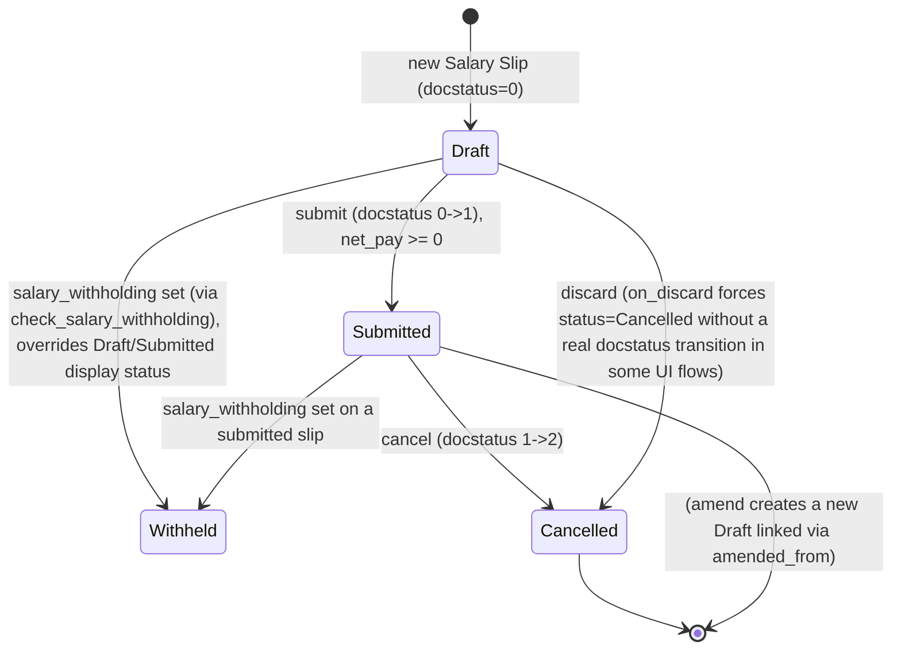

# Salary Slip

**Source:** `hrms/payroll/doctype/salary_slip/salary_slip.json`, `salary_slip.py`, `salary_slip.js`, `salary_slip_loan_utils.py`, `salary_slip_list.js`
**Submittable:** yes ([[Submittable Document Lifecycle]])   **Tree:** no   **Naming:** `Sal Slip/<employee>/.#####` (hash-series autoname via `make_autoname` on `default_series` property, [[Naming and Autoname Rules]]), unless a custom Property Setter overrides `autoname` for this site
**Module:** Payroll

The payroll module's central computed document: one payslip for one employee for one payroll period, generated from a `Salary Structure` (via `Salary Structure Assignment`), attendance/leave data, additional salary, employee benefits, tax slabs, and (optionally) loan repayments.

## Schema

Tab/Section/Column breaks are noted inline as group headers (no logic of their own) per spec convention.

**Tab: Details / Section: Employee Info**

| Field (fieldname) | Label | Type | Options/Link Target | Required | Default | Read-Only | Notes |
|---|---|---|---|---|---|---|---|
| employee | Employee | Link | [[Employee Core Model]] | Yes | — | No | `search_index`, `in_global_search` |
| employee_name | Employee Name | Read Only | — | Yes | — | Yes | `fetch_from: employee.employee_name` |
| company | Company | Link | Company | Yes | — | No | `fetch_from: employee.company` |
| department | Department | Link | Department | No | — | Yes | `fetch_from: employee.department` |
| designation | Designation | Link | Designation | No | — | Yes | `fetch_from: employee.designation`; `depends_on: eval:doc.designation` |
| branch | Branch | Link | Branch | No | — | Yes | `fetch_from: employee.branch` |
| posting_date | Posting Date | Date | — | Yes | Today | No | |
| letter_head | Letter Head | Link | Letter Head | No | — | No | `allow_on_submit`, `ignore_user_permissions` |
| status | Status | Select | Draft/Submitted/Cancelled/Withheld | No | — | Yes | set by `get_status()`, see State Machine |
| salary_withholding | Salary Withholding | Link | [[Salary Withholding]] | No | — | Yes | `no_copy`; set by `check_salary_withholding()` |
| salary_withholding_cycle | Salary Withholding Cycle | Data | — | No | — | Yes | `hidden`, `no_copy` |
| currency | Currency | Link | Currency | Yes | — | Yes | `fetch_from: salary_structure.currency`; `depends_on: eval:(doc.docstatus==1 \|\| doc.salary_structure)` |
| exchange_rate | Exchange Rate | Float | — | Yes | 1.0 | No | `hidden` |

**Section: Payroll Info**

| Field (fieldname) | Label | Type | Options/Link Target | Required | Default | Read-Only | Notes |
|---|---|---|---|---|---|---|---|
| payroll_frequency | Payroll Frequency | Select | (blank)/Monthly/Fortnightly/Bimonthly/Weekly/Daily | No | — | No | |
| start_date | Start Date | Date | — | No | — | No | `search_index` |
| end_date | Date | Date | — | No | — | No | `search_index` |
| salary_structure | Salary Structure | Link | [[Salary Structure]] | Yes | — | Yes | `search_index`, `in_standard_filter` |
| payroll_entry | Payroll Entry | Link | [[Payroll Entry]] | No | — | Yes | `search_index` |
| current_payroll_period | Current Payroll Period | Link | [[Payroll Period]] | No | — | Yes | `hidden`, `search_index` |
| mode_of_payment | Mode Of Payment | Select | (dynamic — Employee's salary mode options) | No | — | Yes | set from `Employee.salary_mode` in `pull_emp_details()` |
| salary_slip_based_on_timesheet | Salary Slip Based on Timesheet | Check | — | No | 0 | Yes | |
| deduct_tax_for_unsubmitted_tax_exemption_proof | Deduct Tax For Unsubmitted Tax Exemption Proof | Check | — | No | 0 | No | also force-set to 1 by `compute_taxable_earnings_for_year()` in the last period of a payroll period |

**Tab: Payment Days**

| Field (fieldname) | Label | Type | Options/Link Target | Required | Default | Read-Only | Notes |
|---|---|---|---|---|---|---|---|
| total_working_days | Working Days | Float | — | Yes | — | Yes | computed, see Business Logic |
| unmarked_days | Unmarked days | Float | — | No | — | No | `hidden` |
| leave_without_pay | Leave Without Pay | Float | — | No | — | No | computed but user-editable — client re-triggers `process_salary_based_on_working_days` on change |
| absent_days | Absent Days | Float | — | No | — | Yes | |
| payment_days | Payment Days | Float | — | Yes | — | Yes | computed, see Business Logic |
| payment_days_calculation_help | Payment Days Calculation Help | HTML | — | No | — | No | client-populated help text only, no server logic |

**Tab: Earnings & Deductions**

| Field (fieldname) | Label | Type | Options/Link Target | Required | Default | Read-Only | Notes |
|---|---|---|---|---|---|---|---|
| timesheets | Salary Slip Timesheet | Table | [[Salary Slip Timesheet]] | No | — | No | `depends_on: eval:doc.salary_slip_based_on_timesheet`; see `Salary Slip Timesheet.md` |
| total_working_hours | Total Working Hours | Float | — | No | — | No | `print_hide_if_no_value` |
| hour_rate | Hour Rate | Currency | currency | No | — | No | `print_hide_if_no_value` |
| base_hour_rate | Hour Rate (Company Currency) | Currency | Company default currency | No | — | No | `print_hide_if_no_value` |
| earnings | Earnings | Table | [[Salary Detail]] | No | — | No | see `Salary Detail.md` |
| deductions | Deductions | Table | [[Salary Detail]] | No | — | No | see `Salary Detail.md` |
| accrued_benefits | Accrued Benefits | Table | [[Employee Benefit Detail]] | No | — | Yes | `print_hide`; populated for `statistical_component`/`accrual_component` earning rows and flexible-benefit accruals |
| employer_contributions_section | (Section, collapsible) | — | — | — | — | — | `depends_on: eval:doc.employer_contributions && doc.employer_contributions.length` |
| employer_contributions | (no label) | Table | [[Salary Detail]] | No | — | No | `print_hide`; shown on slip but never included in gross/deduction/net pay |

**Section: Totals**

| Field (fieldname) | Label | Type | Options/Link Target | Required | Default | Read-Only | Notes |
|---|---|---|---|---|---|---|---|
| gross_pay | Gross Pay | Currency | currency | No | — | Yes | `= get_component_totals("earnings", depends_on_payment_days=1)` |
| base_gross_pay | Gross Pay (Company Currency) | Currency | Company default currency | No | — | Yes | `= gross_pay * exchange_rate` |
| gross_year_to_date | Gross Year To Date | Currency | currency | No | — | Yes | |
| base_gross_year_to_date | Gross Year To Date(Company Currency) | Currency | Company default currency | No | — | Yes | |
| total_deduction | Total Deduction | Currency | currency | No | — | Yes | |
| base_total_deduction | Total Deduction (Company Currency) | Currency | Company default currency | No | — | Yes | |

**Tab: Net Pay Info**

| Field (fieldname) | Label | Type | Options/Link Target | Required | Default | Read-Only | Notes |
|---|---|---|---|---|---|---|---|
| net_pay | Net Pay | Currency | currency | No | — | Yes | `= gross_pay - (total_deduction + total_loan_repayment)` |
| base_net_pay | Net Pay (Company Currency) | Currency | Company default currency | No | — | Yes | |
| rounded_total | Rounded Total | Currency | currency | No | — | Yes | bold; `= rounded(net_pay)` unless rounding disabled |
| base_rounded_total | Rounded Total (Company Currency) | Currency | Company default currency | No | — | Yes | bold |
| year_to_date | Year To Date | Currency | currency | No | — | Yes | description: "Total salary booked...from beginning of the year (payroll period or fiscal year) up to...end date" |
| base_year_to_date | Year To Date(Company Currency) | Currency | Company default currency | No | — | Yes | |
| month_to_date | Month To Date | Currency | currency | No | — | Yes | |
| base_month_to_date | Month To Date(Company Currency) | Currency | Company default currency | No | — | Yes | |
| total_in_words | Total in words | Data | — | No | — | Yes | `length: 240` |
| base_total_in_words | Total in words (Company Currency) | Data | — | No | — | Yes | `length: 240` |

**Tab: Income Tax Breakup** (`collapsible`, `depends_on: eval:doc.ctc`)

| Field (fieldname) | Label | Type | Options/Link Target | Required | Default | Read-Only | Notes |
|---|---|---|---|---|---|---|---|
| ctc | CTC | Currency | currency | No | — | Yes | |
| income_from_other_sources | Income from Other Sources | Currency | currency | No | — | Yes | |
| total_earnings | Total Earnings | Currency | currency | No | — | Yes | `= ctc + income_from_other_sources` |
| non_taxable_earnings | Non Taxable Earnings | Currency | currency | No | — | Yes | |
| standard_tax_exemption_amount | Standard Tax Exemption Amount | Currency | currency | No | — | Yes | |
| tax_exemption_declaration | Tax Exemption Declaration | Currency | currency | No | — | Yes | |
| deductions_before_tax_calculation | Deductions before tax calculation | Currency | currency | No | — | Yes | |
| annual_taxable_amount | Annual Taxable Amount | Currency | currency | No | — | Yes | |
| income_tax_deducted_till_date | Income Tax Deducted Till Date | Currency | currency | No | — | Yes | |
| current_month_income_tax | Current Month Income Tax | Currency | currency | No | — | Yes | |
| future_income_tax_deductions | Future Income Tax | Currency | currency | No | — | Yes | |
| total_income_tax | Total Income Tax | Currency | currency | No | — | Yes | `= income_tax_deducted_till_date + future_income_tax_deductions` |

**Tab: Bank Details**

| Field (fieldname) | Label | Type | Options/Link Target | Required | Default | Read-Only | Notes |
|---|---|---|---|---|---|---|---|
| journal_entry | Journal Entry | Link | Journal Entry | No | — | No | |
| amended_from | Amended From | Link | [[Salary Slip]] | No | — | Yes | `no_copy`, `ignore_user_permissions`, `print_hide` |
| bank_name | Bank Name | Data | — | No | — | No | set from `Employee.bank_name` |
| bank_account_no | Bank Account No | Data | — | No | — | No | set from `Employee.bank_ac_no` |

**Tab: Leaves**

| Field (fieldname) | Label | Type | Options/Link Target | Required | Default | Read-Only | Notes |
|---|---|---|---|---|---|---|---|
| leave_details | Leave Details | Table | [[Salary Slip Leave]] | No | — | Yes | see `Salary Slip Leave.md` |

**Undeclared fields referenced at runtime (not in `salary_slip.json`; injected by the external Lending app when installed):** `loans` (Table, [[Salary Slip Loan]]), `total_loan_repayment`, `total_interest_amount`, `total_principal_amount` (Currency). See `Salary Slip Loan.md` Port Notes.

## Child Tables

- `timesheets` -> [[Salary Slip Timesheet]] (see `Salary Slip Timesheet.md`)
- `earnings`, `deductions`, `employer_contributions` -> [[Salary Detail]] (see `Salary Detail.md`)
- `accrued_benefits` -> [[Employee Benefit Detail]] (owned by another doctype family — not in this agent's scope; referenced by name only)
- `leave_details` -> [[Salary Slip Leave]] (see `Salary Slip Leave.md`)
- `loans` (conditionally present) -> [[Salary Slip Loan]] (see `Salary Slip Loan.md`)

## State Machine



Plain list of (from_state, event, to_state, guard condition):

1. `(none) -> Draft`: new document created; `docstatus = 0`.
2. `Draft -> Submitted`: user submits. Guard: `on_submit()` throws `frappe.throw("Net Pay cannot be less than 0")` if `self.net_pay < 0` (blocks the submit). On success, `set_status()` -> `get_status()` returns `"Submitted"` (since `docstatus==1` and no `salary_withholding`).
3. `(any docstatus) -> Withheld`: **not a docstatus transition** — `status` is a display field computed by `get_status()`: IF `self.salary_withholding` is set (populated by `check_salary_withholding()` during every `validate()`, based on `get_salary_withholdings(start_date, end_date, employee)` from `Payroll Entry`) THEN status is forced to `"Withheld"` regardless of `docstatus` being 0 or 1.
4. `Submitted -> Cancelled`: user cancels. Guard: none blocking in `on_cancel()` itself (submits-and-cancels of loan repayment / benefit ledger entries happen but do not block). `docstatus 1 -> 2`; `get_status()` returns `"Cancelled"` whenever `docstatus == 2` (this check is first/highest-priority in `get_status()`, overriding even `Withheld`).
5. `Draft -> Cancelled` (via `on_discard`): `self.db_set("status", "Cancelled")` — Frappe's "discard draft" action sets status directly without necessarily flowing through the normal cancel docstatus path (framework-level behavior, not fully re-implemented in `on_cancel`).
6. `Submitted -> Draft (new, linked)`: standard Frappe amend-on-cancel pattern — a new document is created with `amended_from` set to the cancelled slip's name; naming keeps the base name with the framework's amendment suffixing.

`get_status()` exact logic (source: `get_status`):
```
IF docstatus == 2: return "Cancelled"
ELSE:
    IF salary_withholding: return "Withheld"
    ELIF docstatus == 0: return "Draft"
    ELIF docstatus == 1: return "Submitted"
```

## Validation Rules (exact, in execution order)

All inside `validate()`, called on every save (draft or pre-submit):

1. `check_salary_withholding()` runs first — sets/clears `self.salary_withholding`/`self.salary_withholding_cycle` from `get_salary_withholdings(start_date, end_date, employee)` (Payroll Entry module). Not itself a throw, but feeds rule 3's status derivation and the Withheld state.
2. `self.status = self.get_status()` — see State Machine.
3. `validate_active_employee(self.employee)` (from `hrms.hr.utils`, owned by another module — not re-derived here, but this call happens at this exact point in the sequence).
4. `validate_dates()` -> `validate_from_to_dates("start_date", "end_date")` (Frappe framework helper: `end_date` must not be before `start_date`).
5. `validate_dates()`, continued: IF `not self.joining_date` THEN `frappe.throw("Please set the Date Of Joining for employee {employee_name}")` (source: `validate_dates`).
6. `validate_dates()`, continued: IF `date_diff(self.end_date, self.joining_date) < 0` THEN `frappe.throw("Cannot create Salary Slip for Employee joining after Payroll Period")`.
7. `validate_dates()`, continued: IF `self.relieving_date` is set AND `date_diff(self.relieving_date, self.start_date) < 0` THEN `frappe.throw("Cannot create Salary Slip for Employee who has left before Payroll Period")`.
8. `check_existing()`: IF NOT `salary_slip_based_on_timesheet` THEN query for another non-cancelled Salary Slip with the same `employee`, `start_date`, `end_date` (and same `payroll_entry` if this slip has one); IF found THEN `frappe.throw("Salary Slip of employee {employee} already created for this period")`.
9. `check_existing()`, timesheet branch: IF `salary_slip_based_on_timesheet` THEN FOR each row in `self.timesheets`, IF the linked `Timesheet.status == "Payrolled"` THEN `frappe.throw("Salary Slip of employee {employee} already created for time sheet {time_sheet}")`.
10. IF `self.payroll_frequency` is set THEN `get_date_details()` -> IF `not self.end_date`, derive `start_date`/`end_date` from `get_start_end_dates(payroll_frequency, start_date or posting_date)` (Payroll Entry module).
11. IF earnings AND deductions are both empty (`not (len(earnings) or len(deductions))`) THEN `get_emp_and_working_day_details()` — full rebuild from the Salary Structure (see Business Logic); ELSE `get_working_days_details(lwp=self.leave_without_pay)` — recompute working-day figures only, keeping existing component rows.
12. `set_salary_structure_assignment()`: look up the `Salary Structure Assignment` for `(employee, salary_structure)` with `from_date <= actual_start_date` and `docstatus == 1`, most recent first. IF none found THEN `frappe.throw("Please assign a Salary Structure for Employee {employee_name} applicable from or before {actual_start_date} first")`.
13. `calculate_net_pay()` — see Business Logic (this itself contains further conditional throws, e.g. inside `set_loan_repayment`, `eval_condition_and_formula`, `get_income_tax_slabs`, described below).
14. `compute_year_to_date()`, `compute_month_to_date()`, `compute_component_wise_year_to_date()` — pure aggregation, no validation.
15. `add_leave_balances()` — pure population, no validation.
16. IF Payroll Settings `max_working_hours_against_timesheet` is set AND `salary_slip_based_on_timesheet` AND `total_working_hours > int(max_working_hours)` THEN `frappe.msgprint("Total working hours should not be greater than max working hours {max_working_hours}", alert=True)` — **non-blocking alert**.
17. IF `self.payroll_period` resolves AND `not self.current_payroll_period` THEN `self.current_payroll_period = self.payroll_period.name`.

Additional validations surfaced deep inside `calculate_net_pay()`'s call chain (numbered continuing the same execution-order sequence conceptually, but nested):

18. `get_payment_days()`: IF `self.relieving_date` is set AND `relieving_date < start_date` AND `Employee.status != "Left"` THEN `frappe.throw("Employee {employee} relieved on {relieving_date} must be set as 'Left'")`.
19. `get_working_days_details()`: IF `working_days < 0` after excluding holidays (i.e. more holidays than calendar days) THEN `frappe.throw("There are more holidays than working days this month.")`.
20. `get_working_days_details()`: IF Payroll Settings has no `payroll_based_on` configured THEN `frappe.throw("Please set Payroll based on in Payroll settings")`.
21. `get_working_days_details()`: IF an explicit `lwp` argument was passed AND it differs from the system-calculated `actual_lwp` THEN `frappe.msgprint("Leave Without Pay does not match with approved {payroll_based_on} records")` — **non-blocking**.
22. `get_working_days_details()`, `lwp_days_corrected` path: IF `lwp_days_corrected > 0`, `verify_lwp_days_corrected()` compares the passed value against the actual sum of `Payroll Correction.days_to_reverse` for matching submitted corrections; IF mismatched THEN `frappe.throw("LWP Days Reversed ({lwp_days_corrected}) does not match actual Payroll Corrections total ({actual_total}) for employee {employee} from {start_date} to {end_date}", title="Invalid LWP Days Reversed")`.
23. `eval_condition_and_formula()` (per Salary Detail row, during `add_structure_component`/`get_amount_from_formula`): on `NameError` -> `throw_error_message(..., title="Name error", description="This error can be due to missing or deleted field.")`; on `SyntaxError` -> `throw_error_message(..., title="Syntax error", description="This error can be due to invalid syntax.")`; on any other `Exception` -> `throw_error_message(..., title="Error in formula or condition", description="This error can be due to invalid formula or condition.")` (and re-raises).
24. `get_income_tax_slabs()`: IF the Salary Structure Assignment has no `income_tax_slab` THEN `frappe.throw("Income Tax Slab not set in Salary Structure Assignment: {name}", title="Missing Tax Slab")`.
25. `get_income_tax_slabs()`: IF the resolved `Income Tax Slab.disabled` THEN `frappe.throw("Income Tax Slab: {slab} is disabled")`.
26. `get_income_tax_slabs()`: IF `Income Tax Slab.effective_from > payroll_period.start_date` THEN `frappe.throw("Income Tax Slab must be effective on or before Payroll Period Start Date: {payroll_period.start_date}")`.
27. `set_loan_repayment()` (only if Lending app installed): IF a loan row's `total_payment` exceeds the live-recomputed `payable_amount` THEN `frappe.throw("Row {idx}: Paid amount {total_payment} is greater than pending accrued amount {payable_amount} against loan {loan}")`.

On submit (`on_submit()`, not `validate()`):

28. IF `self.net_pay < 0` THEN `frappe.throw("Net Pay cannot be less than 0")` — this is the one hard gate specific to submission (a Draft slip with negative net pay CAN be saved, just not submitted).

## Business Logic / Calculations

### A. Working days / payment days / LWP (proration base) — `get_working_days_details(lwp=None, for_preview=0, lwp_days_corrected=None)`

1. Load Payroll Settings: `payroll_based_on` (Attendance or Leave Application), `include_holidays_in_total_working_days`, `consider_marked_attendance_on_holidays`, `daily_wages_fraction_for_half_day` (default `0.5` if unset), `consider_unmarked_attendance_as` (default `"Present"` if unset).
2. `consider_marked_attendance_on_holidays = include_holidays_in_total_working_days AND consider_marked_attendance_on_holidays`.
3. `working_days = date_diff(end_date, start_date) + 1` (inclusive day count).
4. IF `for_preview`: set `total_working_days = payment_days = working_days` and return immediately (skips attendance/leave queries — fast preview path).
5. Fetch `holidays` for the employee's holiday list between `start_date`/`end_date` (cached per `holiday_list:start_date:end_date`).
6. Build `working_days_list` = every calendar date from `start_date` to `end_date`.
7. IF NOT `include_holidays_in_total_working_days`: remove holiday dates from `working_days_list`; `working_days -= len(holidays)`. IF `working_days < 0` THEN throw (rule 19 above).
8. IF `payroll_based_on` not set THEN throw (rule 20).
9. IF `payroll_based_on == "Attendance"`: `actual_lwp, absent = calculate_lwp_ppl_and_absent_days_based_on_attendance(...)`; `self.absent_days = absent`. ELSE: `actual_lwp = calculate_lwp_or_ppl_based_on_leave_application(...)`.
10. `lwp = lwp if lwp else actual_lwp`; IF an explicit `lwp` was passed and differs from `actual_lwp`, msgprint mismatch warning (rule 21).
11. `self.leave_without_pay = lwp`; `self.total_working_days = working_days`.
12. `payment_days = get_payment_days(include_holidays_in_total_working_days)` (step B below).
13. IF `payment_days > lwp`:
    a. `self.payment_days = payment_days - lwp`.
    b. IF `payroll_based_on == "Attendance"`: `self.payment_days -= absent`.
    c. IF `payroll_based_on == "Attendance"` AND `consider_unmarked_attendance_as == "Absent"`: compute `unmarked_days` (via `get_unmarked_days`), add to `absent_days`, subtract from `payment_days`.
    d. IF `payroll_based_on == "Attendance"`: compute `half_absent_days` (Attendance rows with `status=="Half Day"` and `half_day_status=="Absent"`, honoring the holiday-exclusion flag); `absent_days += half_absent_days * daily_wages_fraction_for_half_day`; `payment_days -= half_absent_days * daily_wages_fraction_for_half_day`.
14. ELSE (`payment_days <= lwp`): `self.payment_days = 0`.
15. IF `lwp_days_corrected` is truthy and `> 0` AND it passes `verify_lwp_days_corrected()` (rule 22): `self.payment_days += lwp_days_corrected` (adds back days reversed by an approved Payroll Correction).

### B. `get_payment_days(include_holidays_in_total_working_days)`

1. IF `joining_date > end_date` (joined after this payroll period): return `0`.
2. IF `relieving_date` is set AND `< start_date` AND `Employee.status != "Left"`: throw (rule 18).
3. `payment_days = date_diff(actual_end_date, actual_start_date) + 1` — note this uses `actual_start_date`/`actual_end_date` (clamped to `joining_date`/`relieving_date` when they fall inside the slip's period — the mid-period join/leave proration base described in section C).
4. IF NOT `include_holidays_in_total_working_days`: subtract the count of holidays between `actual_start_date` and `actual_end_date`.

### C. Mid-period joining / leaving proration

The properties `actual_start_date` and `actual_end_date` implement proration for employees who join or leave mid-period:

```
actual_start_date = start_date
IF joining_date is set AND start_date < joining_date <= end_date:
    actual_start_date = joining_date

actual_end_date = end_date
IF relieving_date is set AND start_date <= relieving_date < end_date:
    actual_end_date = relieving_date
```

These clamped dates feed `get_payment_days()` (section B) directly, so `payment_days` for a mid-period joiner/leaver is naturally shorter than the full period. They also feed `_get_days_outside_period()`, `_get_number_of_holidays()`, `_get_marked_attendance_days()`, `get_half_absent_days()` — all Attendance-based day counts are scoped to `[actual_start_date, actual_end_date]`, not the nominal `[start_date, end_date]`.

`_get_days_outside_period()` computes, separately, the number of days *before* joining or *after* relieving within the nominal period (used by `get_unmarked_days()` to correctly exclude those out-of-employment days from the "unmarked = should have been marked but wasn't" count):
```
days = 0
IF actual_start_date != start_date:
    days += count_of_days(start_date, joining_date - 1 day)   # days before joining
IF actual_end_date != end_date:
    days += count_of_days(relieving_date + 1 day, end_date)   # days after relieving
```
(each `count_of_days` call itself honors `include_holidays_in_total_working_days` the same way as elsewhere).

The prorated `amount` on every `Salary Detail` row (earnings/deductions with `depends_on_payment_days=1`) is subsequently scaled by `payment_days / total_working_days` (see section E, step 4) — this is the mechanism by which mid-period join/leave AND leave-without-pay both reduce pay via the exact same ratio.

### D. LWP calculation

**Leave-Application-based** (`calculate_lwp_or_ppl_based_on_leave_application`), used when Payroll Settings `payroll_based_on != "Attendance"`:
1. Fetch all submitted, approved `Leave Application`s overlapping `[start_date, end_date]` whose `Leave Type` has `is_lwp=1` or `is_ppl=1` (Partially Paid Leave) and not yet linked to a Salary Slip, keyed by each calendar date they cover.
2. FOR each date `d` in `working_days_list` (stopping early if `d > relieving_date` when set):
   a. Skip if no leave covers `d`.
   b. Skip if the leave's `Leave Type.include_holiday` is false AND `d` is a holiday.
   c. `is_half_day_leave = leave.half_day AND (leave.half_day_date == d OR leave.from_date == leave.to_date)`.
   d. `equivalent_lwp_count = (1 - daily_wages_fraction_for_half_day)` if half-day, else `1`.
   e. IF the leave type `is_ppl` (partially paid): `equivalent_lwp_count *= (1 - fraction_of_daily_salary_per_leave)` if that fraction is set, else `*= 1` (no reduction) — i.e., a PPL day only counts as a *partial* LWP day proportional to how much of the daily salary is NOT paid for that leave type.
   f. `lwp += equivalent_lwp_count`.
3. Return total `lwp`.

**Attendance-based** (`calculate_lwp_ppl_and_absent_days_based_on_attendance`), used when `payroll_based_on == "Attendance"`:
1. Fetch submitted `Attendance` records for `[start_date, actual_end_date]` with status in `Absent`, `Half Day`, `On Leave`.
2. FOR each record:
   a. Skip if status is `Half Day`/`On Leave` with a `leave_type` that is not in the LWP/PPL leave-type map (i.e., that leave type is fully paid).
   b. Skip counting entirely if `consider_marked_attendance_on_holidays` is false AND the date is a holiday AND (status is `Absent`/`Half Day`, OR the leave type doesn't include holidays).
   c. IF `status == "Half Day"` with an LWP/PPL leave type: `equivalent_lwp = (1 - daily_wages_fraction_for_half_day)`, multiplied by `fraction_of_daily_salary_per_leave` if the leave type `is_ppl`; add to `lwp`.
   d. ELIF `status == "On Leave"` with an LWP/PPL leave type: `equivalent_lwp = 1`, multiplied by `fraction_of_daily_salary_per_leave` if `is_ppl`; add to `lwp`.
   e. ELIF `status == "Absent"`: `absent += 1`.
3. Return `(lwp, absent)`.

### E. Component amount resolution (earnings/deductions/employer_contributions)

`calculate_net_pay()` orchestrates, in this exact order:
1. IF `self.payroll_period` exists: `remaining_sub_periods = get_period_factor(employee, start_date, end_date, payroll_frequency, payroll_period, joining_date, relieving_date)[1]` (from `hrms.payroll.doctype.payroll_period.payroll_period`; see that doctype's spec — owned by another agent — for the exact monthly-vs-daily period-factor formula; summarized: for Monthly frequency it's an exact month-count ratio between the slip's remaining span and the payroll period; for other frequencies it's `days_in_payroll_period / salary_days` ratios).
2. IF `salary_structure` set: `calculate_component_amounts("earnings")`.
3. `set_gross_pay_and_base_gross_pay()`: `gross_pay = get_component_totals("earnings", depends_on_payment_days=1)`; `base_gross_pay = flt(gross_pay * exchange_rate, precision)`.
4. IF `salary_structure` set: `calculate_component_amounts("deductions")`.
5. `set_loan_repayment(self)` — see `Salary Slip Loan.md` (no-op if Lending app absent).
6. `apply_regional_deductions()` — `@hrms.allow_regional` hook, currently a no-op `pass` in this codebase (see Port Notes — this is the exact injection point for country-specific statutory deductions such as India's PF/ESI/PT).
7. IF `salary_structure` set: `calculate_component_amounts("employer_contributions")` — computed and displayed but never included in gross pay/deduction/net pay totals or GL postings for the payslip itself (informational only).
8. `set_precision_for_component_amounts()` — rounds every row's `amount` to its currency-field precision.
9. `set_net_pay()` — see section F.
10. IF NOT `skip_tax_breakup_computation`: `compute_income_tax_breakup()` — see section G.

`calculate_component_amounts(component_type)`:
1. IF `component_type == "earnings"`: reset `self.accrued_benefits = []` and `self.benefit_ledger_components = []`.
2. IF `self._evaluated_components` not yet cached on this instance: `_set_evaluated_components()` — asks the resolved `Salary Structure Assignment` document (`_get_ssa_doc()`) for `get_evaluated_components()`, a **single, shared evaluation of every earning/deduction/employer-contribution row's condition+formula**, done once per slip so cross-component references (e.g. a deduction referencing an earning's abbr) resolve consistently across both the earnings pass and the deductions pass.
3. `add_structure_components(component_type)` — see below.
4. IF `component_type == "employer_contributions"`: return immediately (additional salary / tax / flexible benefits never apply to employer contributions).
5. `add_additional_salary_components(component_type)` — merges in `Additional Salary` records for the period (bonus, arrears, one-off deductions, etc; `get_additional_salaries()` is owned by the `Additional Salary` doctype, out of scope here but the merge mechanics are in `update_component_row()` below).
6. IF `component_type == "earnings"`: `add_employee_benefits()` (flexible-benefit payouts/accruals). ELSE: `add_tax_components()` (variable income-tax deduction — section G/H).

`add_structure_components(component_type)`:
1. `self.data, self.default_data = get_data_for_eval()` — builds the two evaluation contexts (see section E.1 below).
2. FOR each `struct_row` in `_evaluated_components[component_type]`: `add_structure_component(struct_row, component_type)`.

`add_structure_component(struct_row, component_type)`:
1. IF `salary_slip_based_on_timesheet` AND `struct_row.salary_component == self._timesheet_component`: **skip** (that component is added separately by `add_timesheet_earning_component`, avoiding double-counting).
2. `amount = eval_condition_and_formula(struct_row, self.data)` — evaluated against the **payment-days-prorated** context (`self.data`), so proration cascades through any dependent formula (e.g. `SA = BS * 0.5` inherits `BS`'s own proration automatically because `BS`'s prorated value is what's stored under its abbr in `self.data`).
3. IF `struct_row.statistical_component OR struct_row.accrual_component`:
   a. `self.default_data[struct_row.abbr] = flt(amount)` (unprorated reference value, for other formulas that want the "full" figure).
   b. IF `struct_row.depends_on_payment_days`: `amount = flt(amount) * payment_days / total_working_days` (or `0` if `total_working_days` is falsy); `self.data[struct_row.abbr] = flt(amount, struct_row.precision)`.
   c. The row itself is **never appended** to `earnings`/`deductions` — it exists only in the eval context.
   d. IF this is an accrual earning component AND `benefit_ledger_components` tracking is active: append to `self.accrued_benefits` (`salary_component`, `amount`) and to `self.benefit_ledger_components` with `transaction_type="Accrual"`.
4. ELSE (a normal, non-statistical, non-accrual row):
   a. Look up `Salary Component.remove_if_zero_valued`.
   b. `default_amount = 0`.
   c. IF `amount` is truthy, OR (`struct_row.amount_based_on_formula` AND `amount is not None`), OR (NOT `remove_if_zero_valued` AND `amount is not None` AND `not self.data[struct_row.abbr]`) THEN: `default_amount = flt(struct_row.default_amount)` (the SSA's period-independent full-cycle amount) and call `update_component_row(struct_row, amount, component_type, data=self.data, default_amount=default_amount, remove_if_zero_valued=remove_if_zero_valued)`.
   d. Otherwise the row is simply not added (e.g. a zero-valued, `remove_if_zero_valued` component whose condition evaluated the amount to 0/None).

**Note on `condition`/`formula` evaluation** — `eval_condition_and_formula(struct_row, data)`:
```
IF condition is set AND _safe_eval(condition, whitelisted_globals, data) is falsy:
    return None   # row is skipped entirely (condition not met)
IF amount_based_on_formula AND formula is set:
    amount = flt(_safe_eval(formula, whitelisted_globals, data), struct_row.precision)
IF amount is truthy:
    data[struct_row.abbr] = amount   # makes this component's resolved value visible to subsequent formulas
return amount
```
`_safe_eval` (in `hrms/payroll/utils.py`) is a denylist-based AST sandbox (blocks unsafe attributes, `NamedExpr`, `Lambda`) — explicitly documented as safe only for trusted, admin-authored expressions, not arbitrary/end-user input.

### E.1 The formula evaluation context (`get_data_for_eval`)

Exact construction order (later keys win on collision):
1. `data = get_component_eval_context(employee, salary_structure_assignment_as_dict)` (in `hrms/payroll/utils.py`):
   a. Seed with `get_component_abbr_map()` — every Salary Component's abbreviation mapped to `0` (so any abbr referenced anywhere always resolves, even if that component hasn't been evaluated yet).
   b. Overlay `SALARY_SLIP_EVAL_DEFAULTS` — zeroed defaults for `gross_pay`, `net_pay`, `total_deduction`, `rounded_total`, `total_working_hours`, `hour_rate`, `year_to_date`, `month_to_date`, `gross_year_to_date`, `ctc`, `total_earnings`, `income_from_other_sources`, `non_taxable_earnings`, `deductions_before_tax_calculation`, `tax_exemption_declaration`, `standard_tax_exemption_amount`, `annual_taxable_amount`, `income_tax_deducted_till_date`, `future_income_tax_deductions`, `current_month_income_tax`, `total_income_tax`.
   c. Overlay the Salary Structure Assignment's own field values as a dict (includes `base`, `variable`, `income_tax_slab`, etc.).
   d. Overlay the Employee document's full field set (`frappe.get_cached_doc("Employee", employee).as_dict()`) — this is how formulas can reference `employment_type`, `branch`, `date_of_joining`, etc.
2. Overlay the Salary Slip's own field values LAST (`slip_data = self.as_dict()`, with `ctc` popped out first since `ctc` is computed later by `compute_ctc()` and would otherwise overwrite the real value with a stale `0`) — so `payment_days`, `gross_pay`, `start_date`, `leave_without_pay`, etc. always win over any same-named Employee field (e.g. a saved payslip keeps its own snapshot of `department`/`branch`, not the employee's *current* value, once those fields exist on the slip itself).
3. `default_data = data.copy()` (shallow) — a **second, parallel context** representing full-cycle (unprorated) values, used for annualized tax computation.
4. FOR each of `earnings`, `deductions`, `employer_contributions` (already on the slip, e.g. on a re-open/re-save): `default_data[row.abbr] = row.default_amount or 0`; `data[row.abbr] = row.amount or 0` — seeds both contexts with already-resolved component values before evaluating new/changed rows.

### F. `set_net_pay()`

1. `total_deduction = get_component_totals("deductions")` (excludes rows flagged `do_not_include_in_total`; for each included row, if `depends_on_payment_days` requested, recompute via `get_amount_based_on_payment_days`, else use the stored `amount`).
2. `base_total_deduction = flt(total_deduction * exchange_rate, precision)`.
3. `net_pay = flt(gross_pay) - (flt(total_deduction) + flt(total_loan_repayment or 0))`.
4. `rounded_total = rounded(net_pay)` (standard round-half-up to nearest currency unit — unless Payroll Settings `disable_rounded_total` is set, in which case `set_net_total_in_words()` uses the unrounded `net_pay` instead, per `is_rounding_total_disabled()`).
5. `base_net_pay = flt(net_pay * exchange_rate, precision)`; `base_rounded_total = flt(rounded(base_net_pay), precision)`.
6. IF `hour_rate` is set: `base_hour_rate = flt(hour_rate * exchange_rate, precision)`.
7. `set_net_total_in_words()`: `total = net_pay if rounding disabled else rounded_total`; `total_in_words = money_in_words(total, currency)`; same for `base_total_in_words` with `base_total`/company currency.

### G. Income tax annualization and breakup (`compute_income_tax_breakup`, `compute_taxable_earnings_for_year`, `compute_current_and_future_taxable_earnings`)

This is the annualization algorithm — projecting one period's taxable pay to a full-year figure so the correct marginal tax slab applies, then dividing the resulting annual tax back across the remaining periods. Only runs when `self.payroll_period` resolves (a payroll period covering `start_date`/`end_date` must exist) and a tax component was detected (section H).

1. **Previous period** (`get_taxable_earnings_for_prev_period(payroll_period.start_date, self.start_date, allow_tax_exemption)`):
   a. `taxable_earnings = SUM(Salary Detail.amount)` across all submitted Salary Slips for this employee whose `start_date`/`end_date` fall within `[payroll_period.start_date, self.start_date)`, `parentfield="earnings"`, `is_tax_applicable=1`.
   b. IF `allow_tax_exemption` (tax slab allows exemptions): `exempted_amount = SUM(Salary Detail.amount)` similarly for `parentfield="deductions"`, `exempted_from_income_tax=1`.
   c. `opening_taxable_earning = get_opening_for("taxable_earnings_till_date", ...)` — nonzero ONLY if the employee's Salary Structure Assignment's `from_date >= payroll_period.start_date` (i.e., an opening balance carried in from before this system tracked payroll, entered on the SSA); otherwise `0`.
   d. `previous_taxable_earnings = (taxable_earnings + opening_taxable_earning) - exempted_amount`.
   e. `previous_taxable_earnings_before_exemption = previous_taxable_earnings + exempted_amount`.
2. **Current period, all days** (`get_taxable_earnings(allow_tax_exemption, based_on_payment_days=0)`):
   a. FOR each earning row with `is_tax_applicable`: if it has an `additional_amount`, use `(amount, additional_amount)` as-is; else use `(default_amount, additional_amount)` — i.e., the **unprorated, full-cycle default** is used here (payment-days proration is deliberately NOT applied for the "current period" annualization base — only for the "current period, actual payment days" pass below).
   b. `taxable_earnings += (amount - additional_amount)`; `additional_income += additional_amount` (additional-salary earnings are tracked separately since they're one-off, not annualized).
   c. IF the additional amount is recurring (`is_recurring_additional_salary`): also add `get_future_recurring_additional_amount()` (extrapolated future recurring months of that Additional Salary, up to `relieving_date` or the Additional Salary's own `to_date`, capped at the payroll period end) to `additional_income`.
   d. IF the earning's `deduct_full_tax_on_selected_payroll_date`: add its `additional_amount` to `additional_income_with_full_tax` (this additional income will be taxed in full in the current period rather than spread across the year — e.g. a bonus paid with full tax withheld immediately).
   e. IF `allow_tax_exemption`: for each deduction row with `exempted_from_income_tax`, SUBTRACT its `(amount - additional_amount)` from `taxable_earnings`, subtract `additional_amount` from `additional_income`, and add `(amount - additional_amount)` to `amount_exempted_from_income_tax`.
   f. Result -> `self.current_taxable_earnings`.
3. `future_structured_taxable_earnings = current_taxable_earnings.taxable_earnings * (round(remaining_sub_periods) - 1)` — the **annualization step**: the current period's taxable pay is assumed constant for every remaining sub-period of the payroll year (minus the current one), extrapolating a full-year total from a single period's figure.
4. `future_structured_taxable_earnings_before_exemption` — same extrapolation but on the pre-exemption current-period figure.
5. **Current period, actual payment days** (`get_taxable_earnings(allow_tax_exemption, based_on_payment_days=1)`): same algorithm as step 2 but amounts come from `get_amount_based_on_payment_days(row)` (i.e., LWP/mid-period-join proration IS applied here) -> `current_taxable_earnings_for_payment_days`. `current_structured_taxable_earnings` and `current_additional_earnings`(+`_with_full_tax`) are taken from this payment-days-prorated pass, so the *actual* period's real taxable pay (post-LWP) feeds the running annual total, while the *extrapolated future periods* (step 3) assume full, unprorated pay.
6. IF `payroll_period.end_date <= self.end_date` (this is the last period in the payroll year): force `self.deduct_tax_for_unsubmitted_tax_exemption_proof = 1` — any unsubmitted tax-exemption proof no longer gets provisional benefit; only submitted `Employee Tax Exemption Proof Submission` amounts count (see `get_total_exemption_amount` below).
7. `unclaimed_taxable_benefits = 0` (fixed at 0 in this version — see Port Notes, this looks like an intentionally-stubbed/incomplete feature).
8. `total_exemption_amount = get_total_exemption_amount()`:
   a. IF the tax slab `allow_tax_exemption`:
      - IF `deduct_tax_for_unsubmitted_tax_exemption_proof`: use the submitted `Employee Tax Exemption Proof Submission.exemption_amount` for this employee/payroll period (only counts actual submitted proof).
      - ELSE: use the submitted `Employee Tax Exemption Declaration.total_exemption_amount` (a self-declared, not-yet-proven amount, allowed earlier in the year).
   b. Add the tax slab's own `standard_tax_exemption_amount` (a flat exemption independent of declarations/proofs).
9. `other_incomes = get_income_form_other_sources()` = `SUM(Employee Other Income.amount)` for this employee/payroll period/company, submitted only.
10. `total_taxable_earnings = previous_taxable_earnings + current_structured_taxable_earnings + future_structured_taxable_earnings + current_additional_earnings + other_incomes + unclaimed_taxable_benefits - total_exemption_amount` — **this is the annual taxable income figure fed into the tax-slab calculation.**
11. `total_taxable_earnings_without_full_tax_addl_components = total_taxable_earnings - current_additional_earnings_with_full_tax` — the base used for the *structured* (spread-across-the-year) tax computation; the full-tax-now additional income is taxed separately (step H.4) and added back on top.

### H. Tax slab computation and period apportionment (`add_tax_components`, `calculate_variable_tax`)

1. `add_tax_components()`: partition `deductions` into `tax_components` (rows with `variable_based_on_taxable_salary=1` and no formula and no amount yet — i.e., components meant to be auto-computed) vs `other_deduction_components`.
2. IF no `tax_components` found among evaluated rows but a manually-added deduction row has `variable_based_on_taxable_salary`, use that instead.
3. IF still none AND this is a new slip (`self.is_new()`): fall back to `get_tax_components()` — the company's (or global default's) `Salary Component`s flagged `variable_based_on_taxable_salary=1` and not disabled (from `Salary Component`/`Salary Component Account` join, cached) — and `msgprint` "Added tax components from the Salary Component master as the salary structure didn't have any tax component." (non-blocking, informational).
4. IF an `Additional Salary` targets a tax component with `overwrite_salary_structure_amount` set (`handle_additional_salary_tax_component()`): skip the normal per-tax-component loop entirely and instead call `calculate_variable_tax(component, has_additional_salary_tax_component=True)` — the additional salary's flat amount becomes `current_structured_tax_amount` directly (used e.g. for a manually-specified one-off tax adjustment).
5. OTHERWISE, for each detected tax component, `calculate_variable_based_on_taxable_salary(tax_component)` -> `calculate_variable_tax(tax_component)`:
   a. `previous_total_paid_taxes = get_tax_paid_in_period(payroll_period.start_date, start_date, tax_component)` = `SUM(Salary Detail.amount)` for prior submitted slips this payroll period with this tax component, `variable_based_on_taxable_salary=1`, plus any SSA `tax_deducted_till_date` opening balance (same "opening balance only counts if SSA started this payroll period" rule as taxable earnings).
   b. `total_structured_tax_amount, _ = calculate_tax_by_tax_slab(total_taxable_earnings_without_full_tax_addl_components, tax_slab, whitelisted_globals, eval_locals)` — **slab-wise marginal tax on the annualized taxable income** (see `Income Tax Slab.md`, owned by another agent, for the exact per-slab marginal calculation, surcharge, and marginal-relief logic; summarized here only: `calculate_tax_by_tax_slab` returns `0` if annual income is at/below the slab's `tax_relief_limit`, otherwise sums `(min(income, slab.to_amount) - slab.from_amount + 1) * slab.percent_deduction / 100` per matching slab row, then applies marginal relief and surcharge/cess on top).
   c. IF `has_additional_salary_tax_component`: `current_structured_tax_amount = additional_salary_amount` (flat override).
      ELIF `remaining_sub_periods > 0`: `current_structured_tax_amount = (total_structured_tax_amount - previous_total_paid_taxes) / remaining_sub_periods` — **this is the "divide the total annual tax by remaining periods" step**: whatever annual tax liability remains after subtracting tax already paid this payroll year is spread evenly across the periods still to come (including this one).
      ELSE: `current_structured_tax_amount = 0.0`.
   d. `full_tax_on_additional_earnings = 0.0`; IF `current_additional_earnings_with_full_tax` is nonzero: recompute `total_tax_amount` on the FULL `total_taxable_earnings` (including the full-tax-now additional income) via the same slab function, and `full_tax_on_additional_earnings = total_tax_amount - total_structured_tax_amount` — the *incremental* tax purely attributable to the full-tax-now additional income, charged entirely in the current period rather than spread.
   e. `current_tax_amount = max(0, current_structured_tax_amount if has_additional_salary_tax_component else (current_structured_tax_amount + full_tax_on_additional_earnings))` — final floor at zero (never a negative tax deduction).
   f. Store all of the above in `self._component_based_variable_tax[tax_component]`.
   g. Back in `add_tax_components`: `tax_amount = current_tax_amount`; `update_component_row(tax_row, tax_amount, "deductions")` — writes the resolved tax amount as an actual `Salary Detail` deduction row.
6. `get_income_tax_deducted_till_date()`: `SUM` over all tracked tax components of `(previous_total_paid_taxes + current_tax_amount)` — feeds `income_tax_deducted_till_date` on the slip.
7. `future_income_tax_deductions = total_structured_tax_amount + full_tax_on_additional_earnings - income_tax_deducted_till_date`.
8. `current_month_income_tax = current_tax_amount` (from the last-processed tax component's stored values).
9. `total_income_tax = income_tax_deducted_till_date + future_income_tax_deductions`.

**Rounding rules applied throughout tax calculation:** every intermediate multiplication/division that produces a currency amount is passed through `flt(value, precision)` at the point it's assigned to a Salary Detail row (`struct_row.precision`, i.e. the currency field's configured decimal precision — Frappe site default is 2 unless overridden); `Salary Component.round_to_the_nearest_integer` additionally applies whole-number `rounded()` to `amount`/`additional_amount` for that specific component in `get_amount_based_on_payment_days()`; the final payslip totals (`rounded_total`, `base_rounded_total`) use `rounded()` (standard round-half-away-from-zero) unless Payroll Settings `disable_rounded_total` is checked.

### I. `get_amount_based_on_payment_days(row)` — the exact proration formula applied per component row

```
amount, additional_amount = row.amount, row.additional_amount
IF NOT row.additional_salary AND NOT row.default_amount:
    # amount/additional_amount unchanged (row has no base amount to prorate)
ELIF salary_structure is set
     AND row.depends_on_payment_days
     AND total_working_days
     AND NOT (row.additional_salary AND row.default_amount)   # excludes an overwritten Additional Salary row
     AND (row.salary_component != timesheet_component
          OR start_date < joining_date
          OR (relieving_date AND end_date > relieving_date)):
    additional_amount = flt(row.additional_amount * payment_days / total_working_days, precision)
    amount = flt(row.default_amount * payment_days / total_working_days, precision) + additional_amount
ELIF NOT payment_days AND row.salary_component != timesheet_component AND row.depends_on_payment_days:
    amount, additional_amount = 0, 0
ELIF NOT row.amount AND row.additional_amount:
    amount = flt(row.additional_amount)

IF Salary Component.round_to_the_nearest_integer:
    amount, additional_amount = rounded(amount or 0), rounded(additional_amount or 0)

return amount, additional_amount
```
This is the single formula that turns a component's full-cycle `default_amount` into the actual, LWP/mid-period-adjusted `amount` that appears on the slip and feeds `gross_pay`/`total_deduction` — i.e., **`payment_days / total_working_days` is the universal proration ratio** applied consistently whether the reduction in `payment_days` came from LWP, an unmarked-as-absent day, a half-day absence, or a mid-period join/leave (all of those ultimately reduce `payment_days` per section A, and this one ratio is what then reduces pay).

### J. Timesheet-based wages

`add_timesheet_earning_component(timesheet_config)`:
1. `hour_rate = flt(timesheet_config.hour_rate)`; `base_hour_rate = hour_rate * exchange_rate`.
2. `total_working_hours = SUM(timesheets[].working_hours) or 0.0`.
3. `wages_amount = hour_rate * total_working_hours`.
4. `add_earning_for_hourly_wages(self, timesheet_config.timesheet_component, wages_amount)`: if a row for that component already exists, set its `amount = wages_amount` directly; otherwise fetch the component's master data and call `update_component_row(wages_row, wages_amount, "earnings", default_amount=wages_amount)`.

### K. Loan repayment

See `Salary Slip Loan.md` for the full algorithm; summarized here at the exact point it fits into `calculate_net_pay()`: `set_loan_repayment(self)` runs immediately after deductions are computed (step E.5) and before `apply_regional_deductions()` (step E.6), and its resulting `total_loan_repayment` is subtracted from `net_pay` in `set_net_pay()` (section F.3) — loan repayment is **not** a `Salary Detail` deduction row; it is a separate additive term applied directly to net pay.

The gate is the `if_lending_app_installed` decorator in `salary_slip_loan_utils.py`: `IF "lending" in frappe.get_installed_apps(): run the real logic ELSE: no-op (function returns None immediately)`. Exact function names: `set_loan_repayment`, `process_loan_interest_accrual_and_demand`, `make_loan_repayment_entry`, `cancel_loan_repayment_entry` — all four are decorated and all four silently do nothing without the Lending app.

### L. Regional hook point (deductions)

`apply_regional_deductions(self)` is decorated `@hrms.allow_regional` (`hrms/__init__.py`'s `allow_regional` mirrors `erpnext.allow_regional`: it lets a regional app override this exact method per-country via `hooks.py`'s `regional_overrides` map). In this codebase's current state, the method body is a bare `pass` and **is not overridden anywhere in `hrms/regional/`** (confirmed by search — no `regional_overrides` entry maps to it, and no `hrms/regional/*/setup.py` defines `apply_regional_deductions`). It is called at the exact point noted in step E.6, i.e. after all deductions and loan repayment are computed but before employer contributions and totals are finalized. See Port Notes for what a re-implementation must provide here.

Separately, `apply_regional_ctc_components(rows_by_type, data)` is a **different** hook, decorated the same way, but it lives on `Salary Structure Assignment` (not Salary Slip — out of this agent's scope; documented here only because the task explicitly asked for it to be located and named). It is not called from `Salary Slip.py` directly; it affects the resolved component rows the Salary Structure Assignment hands to the slip via `get_evaluated_components()`.

## Lifecycle Hooks (exact)

| Event | What Runs | Side Effects on Other Doctypes |
|---|---|---|
| `autoname` | `make_autoname("Sal Slip/{employee}/.#####")` unless a custom naming Property Setter exists | none |
| `validate` | full sequence in Validation Rules above, ending in `calculate_net_pay()`, `compute_year_to_date()`, `compute_month_to_date()`, `compute_component_wise_year_to_date()`, `add_leave_balances()` | reads Attendance, Leave Application, Timesheet, Employee, Salary Structure Assignment, Additional Salary, Employee Benefit Application/Detail, Employee Tax Exemption Declaration/Proof Submission, Employee Other Income, Income Tax Slab, Payroll Period, Payroll Settings, Payroll Correction, Loan (no writes to other doctypes at this stage) |
| `on_update` | `publish_update()` — `frappe.publish_realtime("hrms:update_salary_slips", {employee}, user=employee_user)` | realtime UI event only |
| `on_submit` | guard `net_pay >= 0`; `set_status()`; `update_status(self.name)` (writes `Timesheet.salary_slip`/status for each linked timesheet); `make_loan_repayment_entry(self)`; conditionally `email_salary_slip()` (if not called from Payroll Entry / patch, and Payroll Settings `email_salary_slip_to_employee` is on); `update_payment_status_for_gratuity_and_leave_encashment()`; `create_benefits_ledger_entry()` | writes `Timesheet.salary_slip`+status; creates+submits `Loan Repayment`; sends email with PDF attachment (optionally password-protected); sets `Gratuity`/`Leave Encashment` `Additional Salary`-linked docs to `status="Paid"`; creates `Employee Benefit Ledger` entries |
| `on_cancel` | `set_status()`; `update_status()` (unlinks timesheets); `update_payment_status_for_gratuity_and_leave_encashment()` (sets `status="Unpaid"` on the linked Gratuity/Leave Encashment records); `delete_employee_benefit_ledger_entry("salary_slip", name)`; `cancel_loan_repayment_entry(self)`; `publish_update()` | unlinks Timesheets; flips Gratuity/Leave Encashment payment status; deletes Employee Benefit Ledger entries; cancels linked `Loan Repayment` |
| `on_trash` | IF no custom naming series: `revert_series_if_last(default_series, name)` (returns the naming counter); `delete_employee_benefit_ledger_entry("salary_slip", name)` | Employee Benefit Ledger cleanup |
| `on_discard` | `self.db_set("status", "Cancelled")` | none |

Module-level hook (not a Document method): `unlink_ref_doc_from_salary_slip(doc, method=None)` — when a `Journal Entry` is cancelled/deleted, finds all non-cancelled Salary Slips referencing it via `journal_entry` and clears that field via `frappe.db.set_value`. (This is wired via `hrms/hooks.py`'s [[Cross-Doctype Hooks (doc_events)]] for `Journal Entry`, not shown in `salary_slip.py` itself, but defined in this file.)

## Whitelisted / API Methods

| Method name | HTTP-equivalent purpose | Args | Returns | What it does |
|---|---|---|---|---|
| `get_emp_and_working_day_details` | POST (recalculate/rebuild) | none (instance method) | `None` (mutates `self`) | First-time / re-pull of all components from the Salary Structure: clears `earnings`/`deductions`/`employer_contributions`/`loans`; resolves date range; validates dates; recomputes working-days details; resolves the applicable Salary Structure (`check_sal_struct`); if timesheet-based, pulls timesheets and adds the hourly-wage earning; calls `make_salary_slip()` (Salary Structure module) to populate remaining components; runs loan interest accrual/demand processing |
| `process_salary_based_on_working_days` | POST (recalculate) | none | `None` | Re-runs `get_working_days_details(lwp=self.leave_without_pay)` then `calculate_net_pay()` — used by the client script whenever the user manually edits `leave_without_pay` |
| `set_totals` | POST (recalculate, lightweight) | none | `None` | Client-triggered lightweight total recompute used while editing amount/timesheet rows pre-save: sums `earnings`/`deductions` (or the timesheet-hours path) into `gross_pay`/`total_deduction`/`net_pay`, then `set_base_totals()` |
| `make_salary_slip_from_timesheet` (module-level function, whitelisted) | POST (create) | `source_name: str` (Timesheet name), `target_doc` | new unsaved `Salary Slip` Document | Creates a draft Salary Slip pre-populated from a Timesheet (`set_missing_values`) then runs `get_emp_and_working_day_details` |
| `enqueue_email_salary_slips` (module-level function, whitelisted) | POST (bulk action) | `names: list | str` (Salary Slip names, JSON-encoded if string) | `None` (msgprint only) | Permission-checks each slip for read access, then `frappe.enqueue`s `email_salary_slips(names)` as a background job |

Also referenced from the client script but defined as controller methods without independent whitelisting concerns already covered above: none additional.

## Permissions

| Role | Read | Write | Create | Delete | Submit | Cancel | Amend | Report | Export | Notes |
|---|---|---|---|---|---|---|---|---|---|---|
| HR User ([[Permission Model (RBAC)]]) | Yes | Yes | Yes | No | Yes | No | No | Yes | No | `email: 1`, `print: 1`, `share: 1` |
| HR Manager | Yes | Yes | Yes | Yes | Yes | Yes | Yes | Yes | No | `email: 1`, `print: 1`, `share: 1` |
| Employee | Yes | No | No | No | No | No | No | No | No | `print: 1` — an employee can view/print their own slip (row-level scoping to "own record" is enforced elsewhere, e.g. via a permission query condition, not visible in this JSON's `permissions` array) |

## Scheduled Jobs Touching This Doctype

No `scheduler_events` entries in `hrms/hooks.py` reference `Salary Slip` directly by name. (Bulk emailing is enqueued on-demand via `enqueue_email_salary_slips`, not on a recurring schedule.) Loan interest accrual (`process_loan_interest_accrual_and_demand`) runs synchronously as part of `get_emp_and_working_day_details`, not as a scheduled job, in this module — any recurring/scheduled loan-interest processing belongs to the external Lending app and is out of scope.

## Related Doctypes

- [[Salary Structure]] / [[Salary Structure Assignment]] — the template and per-employee assignment this slip's earning/deduction rows are generated from.
- [[Salary Detail]] — shared child-row shape for `earnings`, `deductions`, and `employer_contributions`.
- [[Salary Component]] / [[Salary Component Account]] — component master data and GL account resolution feeding component evaluation and tax-component detection.
- [[Salary Slip Leave]] / [[Salary Slip Timesheet]] / [[Salary Slip Loan]] — child tables for leave-balance snapshot, linked timesheets, and loan repayment lines respectively.
- [[Payroll Entry]] — the batch run that creates (and often submits) this slip; also resolves `payroll_payable_account` for loan repayment postings.
- [[Payroll Period]] — scopes tax annualization (`get_period_factor`, previous/future taxable earnings) via `current_payroll_period`.
- [[Payroll Settings]] — configures working-days basis, half-day fraction, rounding, email, and flexible-benefit gating consumed throughout calculation.
- [[Payroll Correction]] — its `days_to_reverse` totals are cross-checked against this slip's `lwp_days_corrected` argument.
- [[Salary Withholding]] / [[Salary Withholding Cycle]] — `check_salary_withholding()` sets `salary_withholding`/`salary_withholding_cycle` and forces the `Withheld` status.
- [[Additional Salary]] — merged into earnings/deductions via `add_additional_salary_components()`; also drives tax-component overrides and annualized additional-income handling.
- [[Employee Benefit Detail]] / [[Employee Benefit Application]] — flexible-benefit accrual/payout rows and mandatory-application gating.
- [[Income Tax Slab]] / [[Taxable Salary Slab]] — resolved via the Salary Structure Assignment and used by `calculate_tax_by_tax_slab()` for marginal tax computation.
- [[Employee Tax Exemption Declaration]] / [[Employee Tax Exemption Proof Submission]] — supply `total_exemption_amount`/`exemption_amount` consumed by `get_total_exemption_amount()`.
- [[Employee Other Income]] — summed into `other_incomes` for the annual taxable-income figure.
- [[Employee Core Model]] — the payslip's subject; many eval-context fields and employment-date-based validations are sourced from it.

## Port Notes

- **Regional hook points are the two explicit plugin/extension seams a port must design equivalents for**: (1) `Salary Slip.apply_regional_deductions()` — called after ordinary deductions + loan repayment are computed, before employer contributions/totals; currently a no-op in this codebase (not overridden by India or UAE regional setup in this version), but it is the intended seam for country-specific statutory deductions (e.g. India PF/ESI/PT, per the existing code comment: "Region-specific deductions... are injected here so they are reflected in both saved slips and the preview... before totals are finalised"). (2) `Salary Structure Assignment.apply_regional_ctc_components(rows_by_type, data)` — a **different** hook on a **different** doctype (owned by another agent), affecting how CTC-based components resolve before the slip even sees them. A faithful port needs an explicit plugin/strategy interface at both of these exact points (e.g. a `RegionalPayrollDeductionsProvider` service resolved by company/country, invoked at the exact step ordinals given in section E and in that other doctype's own calculation sequence) — do not collapse them into one hook, since they run at different stages against different data shapes.
- `unclaimed_taxable_benefits` is hardcoded to `0` in `compute_taxable_earnings_for_year()` with no code path that ever sets it otherwise — this looks like a vestigial or not-yet-implemented feature (the variable name and its use in `total_taxable_earnings`/`compute_ctc()` implies there should be a way to tax unclaimed flexible-benefit balances at year end). Flagging per Ground Rules rather than inventing behavior: **a port should replicate the effect (always contributes 0) unless product requirements call for actually implementing it.**
- The `loans`/`total_loan_repayment`/`total_interest_amount`/`total_principal_amount` fields exist only when the external "lending" Frappe app is installed (added via Custom Field, not in `salary_slip.json`) — see `Salary Slip Loan.md` Port Notes for the full implication.
- `_safe_eval`-based formula/condition evaluation (shared with `Salary Component`) is a meaningful subsystem to reproduce faithfully in a non-Python stack — treat as its own design task (an expression-language interpreter or an embedded sandboxed scripting engine), not a one-line port. The eval context construction order in section E.1 (component abbreviations -> slip-eval defaults -> SSA fields -> Employee fields -> Salary Slip's own fields, in that overlay order) must be reproduced exactly, since field-name collisions are resolved by overlay order and several existing formulas likely depend on it (e.g. a slip's own snapshot values overriding the live Employee record).
- Every currency computation in tax/component resolution passes through `flt(value, precision)` at the point of storage, where `precision` is the **field's configured decimal precision** (a Frappe per-site/per-field setting, defaulting to 2 but overridable per Currency/System Settings) rather than a hardcoded 2-decimal round. A port must make currency precision an explicit, queryable setting (per currency or per field) rather than hardcoding 2 decimals, to avoid silent rounding-behavior drift for currencies/companies configured with different precision.
- `frappe.copy_doc(self)` is used inside `get_future_period_non_taxable_earnings()` to run a full "what-if" recalculation of a cloned Salary Slip (`payment_days` forced to `total_working_days`, tax breakup skipped) purely to extract a non-taxable-earnings figure for extrapolation — this is a fairly expensive pattern (clones the whole document graph and re-runs the entire `calculate_net_pay()` pipeline). A port could implement this more cheaply as a pure function taking the same inputs without needing a full document clone/save-cycle simulation, as long as the same formula-evaluation context and component list are used.
- The exact "annualize this period's actual (unprorated, full-default) taxable earnings × remaining periods, but use the *actual, payment-days-prorated* current period figure for what's already earned" split (section G, steps 2 vs 5) is subtle and easy to get backwards in a port — the extrapolation for *future* periods assumes full pay (no LWP) will continue, while the *current* period correctly reflects actual LWP-adjusted pay. Any test suite for a ported tax engine must explicitly cover an employee with LWP in the current period but none assumed for future periods.
- `Payroll Settings`, `Income Tax Slab`, `Payroll Period`, `Salary Structure`, `Salary Structure Assignment`, `Employee Tax Exemption Declaration`, `Employee Tax Exemption Proof Submission`, `Employee Other Income`, `Additional Salary`, `Employee Benefit Application`/`Employee Benefit Detail`, `Payroll Correction`, `Payroll Entry`, `Attendance`, `Leave Application`, `Leave Type`, `Timesheet` are all read (and in a few cases written) by this controller but are owned by other doctype-spec files/agents — cross-reference by name; do not re-derive their own validation/logic here.
- Frappe framework behaviors relied on implicitly and needing explicit re-implementation in a port: automatic `creation`/`modified`/`modified_by`/`owner` timestamps on every save; `track_changes`-style version history (not declared `1` here, but `db_set()` calls throughout bypass normal version tracking — a port must decide whether direct-field updates should still be audited); Frappe's `frappe.cache()` (Redis-backed) memoization used pervasively (`HOLIDAYS_BETWEEN_DATES`, `LEAVE_TYPE_MAP`, `SALARY_COMPONENT_VALUES`, `TAX_COMPONENTS_BY_COMPANY`) — a port needs an equivalent cache layer with equivalent invalidation hooks (see `Salary Component.md` Port Notes) or correctness will silently degrade under load without an obvious error; Frappe `qb` (query builder) `.run()` calls throughout assume a relational engine with `Sum`/`Count` aggregate support and `BETWEEN`/`notin` operators — directly portable to standard SQL.
