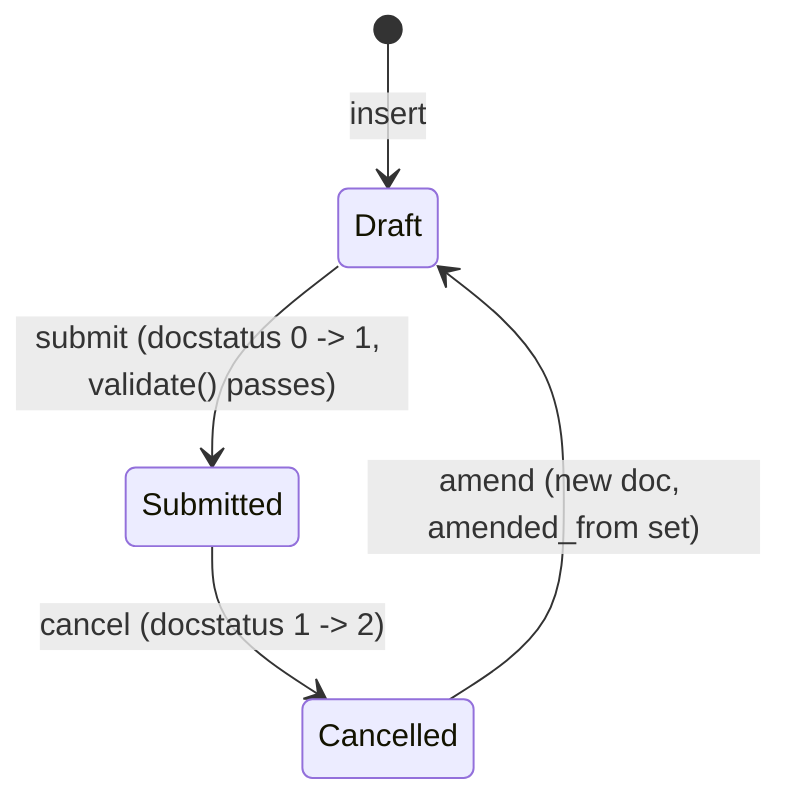

# Salary Structure Assignment

**Source:** `hrms/payroll/doctype/salary_structure_assignment/salary_structure_assignment.json`, `salary_structure_assignment.py`, `salary_structure_assignment.js`
**Submittable:** yes ([[Submittable Document Lifecycle]])   **Tree:** no   **Naming:** `autoname: "HR-SSA-.YY.-.MM.-.#####"` (naming_rule: "Expression", [[Naming and Autoname Rules]]) — a series-based auto-generated name, e.g. `HR-SSA-25-09-00001`, year/month/5-digit auto-increment counter.
**Module:** Payroll

## Schema

Full field list, JSON field order:

| Field (fieldname) | Label | Type | Options/Link Target | Required | Default | Read-Only | Notes |
|---|---|---|---|---|---|---|---|
| employee | Employee | Link | [[Employee Core Model]] | Yes | - | - | `in_list_view`, `in_standard_filter`, `search_index` |
| employee_name | Employee Name | Data | - | - | - | Yes | `fetch_from: employee.employee_name` |
| department | Department | Link | Department | - | - | Yes | `fetch_from: employee.department`, `in_standard_filter` |
| designation | Designation | Link | Designation | - | - | Yes | `fetch_from: employee.designation`, `in_standard_filter` |
| grade | Grade | Link | [[Employee Grade]] | - | - | Yes | `fetch_from: employee.grade` |
| *(column_break_6)* | - | Column Break | - | - | - | - | layout only |
| salary_structure | Salary Structure | Link | [[Salary Structure]] | Yes | - | - | `fetch_from: grade.default_salary_structure`, `fetch_if_empty: 1`, `in_list_view`, `in_standard_filter`, `search_index` |
| from_date | From Date | Date | - | Yes | - | - | see Validation Rules for constraints |
| company | Company | Link | Company | Yes | - | - | `fetch_from: employee.company` |
| *(section_break_7)* | Base, Variable & Leave Encashment | Section Break | - | - | - | - | groups pay fields |
| base | Base | Currency | currency | - | - | - | `fetch_from: grade.default_base_pay`, `fetch_if_empty: 1`, `non_negative: 1` |
| annual_gross_earning | Annual Gross Earning | Currency | currency | - | - | Yes | computed server-side, see Business Logic |
| ctc | Total Cost To Company (CTC) | Currency | - | - | - | Yes | `allow_on_submit: 1`; computed server-side, see Business Logic |
| *(column_break_9)* | - | Column Break | - | - | - | - | layout only |
| variable | Variable | Currency | currency | - | - | - | `non_negative: 1` |
| amended_from | Amended From | Link | [[Salary Structure Assignment]] | - | - | Yes | `no_copy`, `print_hide` |
| income_tax_slab | Income Tax Slab | Link | [[Income Tax Slab]] | conditionally (see Validation Rules) | - | - | `depends_on: salary_structure` |
| currency | Currency | Link | Currency | Yes | - | Yes | `fetch_from: salary_structure.currency`, `depends_on: eval:(doc.docstatus==1 \|\| doc.salary_structure)`, `print_hide` |
| payroll_payable_account | Payroll Payable Account | Link | Account | - | - | - | `depends_on: employee`; auto-set server-side if empty (see Validation Rules) |
| *(section_break_17)* | Payroll Cost Centers | Section Break | - | - | - | - | collapsible, `depends_on: employee` |
| payroll_cost_centers | Cost Centers | Table | [[Employee Cost Center]] | - | - | - | `allow_on_submit: 1`; see Child Tables |
| *(column_break_11)* | - | Column Break | - | - | - | - | layout only |
| tax_deducted_till_date | Tax Deducted Till Date | Currency | currency | - | - | - | `allow_on_submit: 1`, `non_negative: 1` |
| *(column_break_20)* | - | Column Break | - | - | - | - | layout only |
| taxable_earnings_till_date | Taxable Earnings Till Date | Currency | currency | - | - | - | `allow_on_submit: 1`, `non_negative: 1` |
| *(opening_balances_section)* | Opening Balances | Section Break | - | - | - | - | hidden by default in JSON, `collapsible_depends_on: eval:doc.taxable_earnings_till_date && doc.tax_deducted_till_date`; client JS toggles its visibility via `are_opening_entries_required()` (see Whitelisted Methods) |
| *(employee_benefits_section)* | Employee Benefits | Section Break | - | - | - | - | groups benefit fields |
| employee_benefits | Flexible Benefits | Table | [[Employee Benefit Detail]] | - | - | - | see Child Tables |
| max_benefits | Maximum Benefit Amount | Currency | currency | - | - | - | `fetch_from: salary_structure.max_benefits`, `fetch_if_empty: 1`, `non_negative: 1` |
| *(column_break_kjvm)* | - | Column Break | - | - | - | - | layout only |
| leave_encashment_amount_per_day | Leave Encashment Amount Per Day | Currency | currency | - | - | - | `fetch_from: salary_structure.leave_encashment_amount_per_day`, `fetch_if_empty: 1`, `non_negative: 1` |

Doctype-level flags: `editable_grid: 1`, `allow_import: 1`, `track_changes: 1`, `search_fields: "employee_name, salary_structure"`, `title_field: employee_name`, `sort_field: creation` / `sort_order: DESC`.

## Child Tables

- **payroll_cost_centers** — child doctype **[[Employee Cost Center]]** (out of this agent's scope; reference by name). Rows carry at least `cost_center` and `percentage` (used in `validate_cost_centers`, see below).
- **employee_benefits** — child doctype **[[Employee Benefit Detail]]** (out of scope; reference by name), same shape as on `Salary Structure`: `salary_component`, `amount`.

## State Machine

Standard Frappe submittable lifecycle; no custom `status` field.



Plain list:
- (Draft, submit, Submitted) — guard: `validate()` passes (see Validation Rules); several fields (`ctc`, `payroll_cost_centers`, `tax_deducted_till_date`, `taxable_earnings_till_date`) are `allow_on_submit: 1` and can change without amendment.
- (Submitted, cancel, Cancelled) — no `on_cancel` override defined in this controller.
- (Cancelled, amend, Draft) — standard Frappe amend.
- Edits after submit to an `allow_on_submit` field trigger `on_update_after_submit` -> `validate_cost_centers()` only (not the full `validate()` chain).

## Validation Rules (exact, in execution order)

All inside `validate()`, called on every save (Draft and Submit alike):

1. `validate_dates()`:
   a. Look up `joining_date, relieving_date = Employee[self.employee].date_of_joining, relieving_date`.
   b. IF `self.from_date` is set:
      i. IF `frappe.db.exists("Salary Structure Assignment", {"employee": self.employee, "from_date": self.from_date, "docstatus": 1})` THEN `frappe.throw(_("Salary Structure Assignment for Employee already exists"), DuplicateAssignment)` where `DuplicateAssignment` is a custom `frappe.ValidationError` subclass defined in this module. **This is the exact duplicate-assignment guard** — see Module-wide invariant note below for why it is NOT sufficient by itself to guarantee "only one active assignment as of a date."
      ii. IF `joining_date` is set AND `getdate(self.from_date) < joining_date` THEN `frappe.throw(_("From Date {0} cannot be before employee's joining Date {1}").format(self.from_date, joining_date))`.
      iii. IF `relieving_date` is set AND `getdate(self.from_date) > relieving_date` AND NOT `self.flags.old_employee` (an internal migration-patch flag, never set through normal UI/API flows) THEN `frappe.throw(_("From Date {0} cannot be after employee's relieving Date {1}").format(self.from_date, relieving_date))`.
   (source: `validate_dates`)
2. `validate_company()`: `salary_structure_company = Salary Structure[self.salary_structure].company` (cached lookup). IF `self.company != salary_structure_company` THEN `frappe.throw(_("Salary Structure {0} does not belong to company {1}").format(bold(self.salary_structure), bold(self.company)))`. (source: `validate_company`)
3. `validate_income_tax_slab()`:
   a. `tax_component = get_tax_component(self.salary_structure)` — see algorithm below.
   b. IF `tax_component` truthy AND `not self.income_tax_slab` THEN `frappe.throw(_("Income Tax Slab is mandatory since the Salary Structure {0} has a tax component {1}").format(link_to_form("Salary Structure", self.salary_structure), bold(tax_component)), exc=frappe.MandatoryError, title=_("Missing Mandatory Field"))`.
   c. IF `not self.income_tax_slab` THEN return (skip remaining sub-check).
   d. `income_tax_slab_currency = Income Tax Slab[self.income_tax_slab].currency`. IF `self.currency != income_tax_slab_currency` THEN `frappe.throw(_("Currency of selected Income Tax Slab should be {0} instead of {1}").format(self.currency, income_tax_slab_currency))`.
   (source: `validate_income_tax_slab`)
4. `set_payroll_payable_account()` (value-correction, no throw): IF `not self.payroll_payable_account` THEN look up `Company[self.company].default_payroll_payable_account`; IF still falsy, fall back to `frappe.db.get_value("Account", {"account_name": _("Payroll Payable"), "company": self.company, "account_currency": Company[self.company].default_currency, "is_group": 0})`; set `self.payroll_payable_account` to whichever resolves (may remain `None` if neither resolves — no error thrown here). (source: `set_payroll_payable_account`)
5. `validate_max_benefit_for_flexible_benefit(self.employee_benefits, self.max_benefits)` — identical shared function documented fully in `Salary Structure.md` (duplicate-component-in-benefits check, per-component max check, total-vs-max_benefits check).
6. IF `not self.get("payroll_cost_centers")` THEN `set_payroll_cost_centers()` (value-correction, whitelisted method — see below) — auto-populates a single 100%-allocation row from the employee's/department's default payroll cost center if one exists.
7. `validate_cost_centers()`:
   a. IF `not self.get("payroll_cost_centers")` THEN return (no-op).
   b. `total_percentage = 0`; for each `entry` in `payroll_cost_centers`: `company = Cost Center[entry.cost_center].company`; IF `company != self.company` THEN `frappe.throw(_("Row {0}: Cost Center {1} does not belong to Company {2}").format(entry.idx, bold(entry.cost_center), bold(self.company)), title=_("Invalid Cost Center"))`; accumulate `total_percentage += flt(entry.percentage)`.
   c. After loop: IF `total_percentage != 100` THEN `frappe.throw(_("Total percentage against cost centers should be 100"))`.
   (source: `validate_cost_centers`; also re-run standalone on `on_update_after_submit`)
8. `warn_about_missing_opening_entries()`: IF `self.are_opening_entries_required()` (see Whitelisted Methods) is true AND `not self.taxable_earnings_till_date` AND `not self.tax_deducted_till_date` THEN `frappe.msgprint(...)` (non-blocking warning) with message `"Please specify {0} and {1} (if any), for the correct tax calculation in future salary slips."` (`{0}`=bold "Taxable Earnings Till Date", `{1}`=bold "Tax Deducted Till Date"), `indicator="orange"`, `title=_("Missing Opening Entries")`. (source: `warn_about_missing_opening_entries`)
9. `calculate_ctc_and_gross()` — computes and sets `self.annual_gross_earning` and `self.ctc` (value-correction, no throw; full algorithm in Business Logic below, but formula evaluation inside it CAN throw `NameError`/`SyntaxError`/generic exceptions surfaced via `throw_error_message` if a component's `condition`/`formula` is malformed or references an unknown name — see below).

`on_update_after_submit()` re-runs only `validate_cost_centers()` (step 7 above), not the full chain — so a post-submit edit to `payroll_cost_centers` (an `allow_on_submit` field) re-validates the 100% total and company match, but does not re-check dates/company/tax-slab/benefits/CTC.

### `get_tax_component(salary_structure)` algorithm (module function)

1. Load `salary_structure = frappe.get_cached_doc("Salary Structure", salary_structure)`.
2. For each `d` in `salary_structure.deductions`: IF `cint(d.variable_based_on_taxable_salary)` truthy AND `not d.formula` AND `not flt(d.amount)` THEN return `d.salary_component` (first match, stops iterating).
3. If no row matches, return `None`.

## Business Logic / Calculations

### `calculate_ctc_and_gross()` — exact steps

1. IF `not self.base` OR `not self.salary_structure` THEN set `self.annual_gross_earning = 0`, `self.ctc = 0`, and return (short-circuit — no evaluation performed).
2. `salary_structure = frappe.get_cached_doc("Salary Structure", self.salary_structure)`.
3. `periods = PERIODS_PER_YEAR.get(salary_structure.payroll_frequency, 12)` where `PERIODS_PER_YEAR = {"Monthly": 12, "Fortnightly": 26, "Bimonthly": 24, "Weekly": 52, "Daily": 365}` (defaults to 12/Monthly if `payroll_frequency` is unset or unrecognized).
4. `data, rows_by_type = self._evaluate_all_components()` (full shared-context evaluation pass, described next).
5. `gross_per_period = flt(data.get("gross_pay"))` — this is the payable-earnings-only per-period gross computed inside `_evaluate_all_components` (excludes statistical components and `do_not_include_in_total` earnings), matching what a Salary Slip would call `gross_pay`.
6. `non_payable_earnings_per_period = sum(flt(r.default_amount) for r in rows_by_type["earnings"] if not r.statistical_component and r.do_not_include_in_total)` — earnings that ARE part of CTC but are NOT part of payable gross (e.g. employer-side notional earnings shown on the slip but excluded from totals).
7. `employer_per_period = sum(flt(r.default_amount) for r in rows_by_type["employer_contributions"] if not r.statistical_component)`.
8. `self.annual_gross_earning = flt(gross_per_period * periods, precision("annual_gross_earning"))`.
9. `self.ctc = flt((gross_per_period + non_payable_earnings_per_period + employer_per_period) * periods, precision("ctc"))`.

### `_evaluate_all_components()` — shared-context evaluation pass, exact order

1. `salary_structure = frappe.get_cached_doc("Salary Structure", self.salary_structure)`.
2. `data = self._get_component_eval_context()` (see below — builds the formula namespace).
3. Evaluate `earnings` table first: `rows_by_type["earnings"] = self._evaluate_component_table(salary_structure.earnings, data)` (this call also mutates `data` in place, injecting each processed row's `abbr -> default_amount`, so later tables can reference earlier-evaluated earnings by abbreviation).
4. Compute and inject `data["gross_pay"] = sum(flt(r.default_amount) for r in earnings_rows if not r.statistical_component and not r.do_not_include_in_total)` — available to deduction/employer-contribution formulas (e.g. PF/ESI calculated off gross), mirroring how the real Salary Slip exposes `gross_pay` between earnings and deductions phases.
5. Evaluate `deductions` table: `rows_by_type["deductions"] = self._evaluate_component_table(salary_structure.deductions, data)`.
6. Evaluate `employer_contributions` table: `rows_by_type["employer_contributions"] = self._evaluate_component_table(salary_structure.employer_contributions, data)`.
7. Call the regional hook `self.apply_regional_ctc_components(rows_by_type, data)` (decorated `@hrms.allow_regional` — a country-specific override point; base implementation is a no-op `pass`). This runs LAST so a country-specific plugin can read every `abbr` resolved by steps 3–6 and inject statutory employer-side rows (e.g. India PF employer share) via `upsert_employer_contribution` (documented below) without mutating `self` or the cached Salary Structure doc (both are shared/cached across a Payroll Entry run — mutation would corrupt other employees' evaluations).
8. Return `(data, rows_by_type)`.

### `_get_component_eval_context()` — exact steps (builds the formula namespace for an assignment with no salary slip yet)

1. `data = get_component_eval_context(self.employee, self.as_dict())` (shared utility in `hrms/payroll/utils.py`) — this merges, in order: (a) `get_component_abbr_map()` — every Salary Component's abbreviation defaulted to `0`; (b) `SALARY_SLIP_EVAL_DEFAULTS` — a fixed dict of slip-level names defaulted to `0` (`gross_pay, net_pay, total_deduction, rounded_total, total_working_hours, hour_rate, year_to_date, month_to_date, gross_year_to_date, ctc, total_earnings, income_from_other_sources, non_taxable_earnings, deductions_before_tax_calculation, tax_exemption_declaration, standard_tax_exemption_amount, annual_taxable_amount, income_tax_deducted_till_date, future_income_tax_deductions, current_month_income_tax, total_income_tax`); (c) all fields of `self.as_dict()` (i.e. every Salary Structure Assignment field — `base`, `variable`, etc. become directly referenceable formula names); (d) all fields of the linked `Employee` document (cached).
2. Because there is no Salary Slip yet, formulas that reference slip-period fields (e.g. `start_date`) would otherwise raise `NameError`. To prevent this, a synthetic "full pay cycle, no leave" context is seeded on top:
   a. `frequency = Salary Structure[self.salary_structure].payroll_frequency` (cached).
   b. `dates = get_start_end_dates(frequency, self.from_date, self.company)` (from `hrms.payroll.doctype.payroll_entry.payroll_entry`) — computes the start/end of the payroll period containing `from_date` for the given frequency.
   c. `period_days = date_diff(dates.end_date, dates.start_date) + 1`.
   d. Set `data.start_date = dates.start_date`, `data.end_date = dates.end_date`, `data.payment_days = period_days`, `data.total_working_days = period_days` (i.e. payment_days == total_working_days, ratio 1 — full cycle, no proration), `data.leave_without_pay = 0`, `data.absent_days = 0`, `data.unmarked_days = 0`.
3. Return `data`.

**Note:** this evaluation is explicitly period-independent/full-cycle — it exists to compute a representative annualized CTC/gross figure at assignment time, NOT the actual per-slip amount (which the real Salary Slip re-evaluates against its own prorated context).

### `_evaluate_component_table(rows, data)` — exact per-row algorithm (shared context, mutates `data`)

For each `struct_row` in `rows` (in table row order):
1. `condition = sanitize_expression(struct_row.condition)`; `formula = sanitize_expression(struct_row.formula)`; `amount = flt(struct_row.amount)`.
2. Try:
   a. IF `condition` truthy AND `not _safe_eval(condition, COMPONENT_EVAL_GLOBALS.copy(), data)` THEN `continue` (skip this row entirely — it contributes nothing to `evaluated_components` and its abbr is NOT injected into `data`).
   b. IF `struct_row.amount_based_on_formula` truthy AND `formula` truthy THEN `default_amount = flt(_safe_eval(formula, COMPONENT_EVAL_GLOBALS.copy(), data), struct_row.precision("amount"))`.
   c. ELSE `default_amount = amount` (the static configured amount).
3. Exception handling around step 2:
   - `NameError` -> `throw_error_message(struct_row, ne, title=_("Name error"), description=_("This error can be due to missing or deleted field."))` — this call itself raises (via `frappe.throw`) a formatted error naming the doctype/row/doclink.
   - `SyntaxError` -> `throw_error_message(struct_row, se, title=_("Syntax error"), description=_("This error can be due to invalid syntax."))`.
   - any other `Exception` -> `throw_error_message(struct_row, exc, title=_("Error in formula or condition"), description=_("This error can be due to invalid formula or condition."))`, then explicit `raise` (re-raises after throwing, ensuring propagation even if `throw_error_message`'s own `frappe.throw` were ever suppressed).
   - `throw_error_message` message template: `"Error while evaluating the {doctype} {doclink} at row {row_id}. <br><br> <b>Error:</b> {error} <br><br> <b>Hint:</b> {description}"`.
4. `data[struct_row.abbr] = default_amount` — makes this component's resolved amount available to subsequent rows/tables by its abbreviation.
5. Build `evaluated_component_row = frappe._dict(default_amount, amount, condition, formula, precision=struct_row.precision("amount"))` plus every field named in `SALARY_COMPONENT_FLAGS` copied from `struct_row`: `salary_component, abbr, amount_based_on_formula, statistical_component, accrual_component, depends_on_payment_days, do_not_include_in_total, do_not_include_in_accounts, is_tax_applicable, is_flexible_benefit, variable_based_on_taxable_salary, exempted_from_income_tax, deduct_full_tax_on_selected_payroll_date`.
6. Append to `evaluated_components`.
Return `evaluated_components`.

### `upsert_employer_contribution(rows_by_type, data, salary_component, amount)` — used by regional hooks

1. `fields = [SALARY_COMPONENT_FLAGS minus "abbr"] + ["salary_component_abbr"]`; `component = Salary Component[salary_component]` fetched with those fields.
2. IF `not component` THEN return `None`.
3. `rows = rows_by_type["employer_contributions"]`; find existing `row` where `row.salary_component == salary_component` (or `None`).
4. IF no existing row: IF `not flt(amount)` THEN return `None` (a zero amount never creates a new row). ELSE build a new row dict with `condition=None, formula=None, precision=frappe.get_precision("Salary Detail","amount")`, copy every `SALARY_COMPONENT_FLAGS` field from `component`, set `salary_component`, set `abbr = component.salary_component_abbr`, append to `rows`.
5. IF an existing row was found: clear `row.condition = None`, `row.formula = None`, `row.amount_based_on_formula = 0` (a regional override replaces, not adds to, any formula-based value).
6. `value = flt(amount, row.precision)`; set `row.default_amount = value`, `row.amount = value`. IF `row.abbr` truthy THEN `data[row.abbr] = value` (keeps the eval context in sync).
7. Return the row.
(A zero-amount call against an existing row DOES clear/replace it to zero rather than removing it — "a zero amount clears an existing row but never adds one" per source docstring.)

### `get_evaluated_components()` (whitelisted-adjacent, used by external callers e.g. Payroll Entry preview/reporting)

Calls `self._evaluate_all_components()` and returns `frappe._dict(earnings=rows_by_type["earnings"], deductions=rows_by_type["deductions"], employer_contributions=rows_by_type["employer_contributions"])` — i.e. the full evaluated component set without CTC math.

### `get_timesheet_config()`

Reads the linked Salary Structure's `salary_slip_based_on_timesheet`, `hour_rate`, `salary_component` (cached) and returns them as `frappe._dict(based_on_timesheet=cint(...), hour_rate=flt(...), timesheet_component=...)` — a lightweight read used by the Salary Slip before full component evaluation runs.

### `get_assigned_salary_structure(employee, on_date)` (module function — THE query that resolves "which structure applies to this employee on this date")

1. IF `not employee` OR `not on_date` THEN return `None`.
2. Query: `SELECT salary_structure FROM Salary Structure Assignment WHERE employee = <employee> AND docstatus = 1 AND <on_date> >= from_date ORDER BY from_date DESC LIMIT 1`.
3. Return the single `salary_structure` value, or `None` if no row matches.

This is the authoritative "latest assignment effective on or before `on_date`" resolution query used elsewhere in payroll (e.g. by the Salary Slip / Payroll Entry, out of scope here) — **note it does NOT filter by company**, only by employee + docstatus + from_date ordering.

## Lifecycle Hooks (exact)

| Event | What Runs | Side Effects on Other Doctypes |
|---|---|---|
| validate | `validate_dates()` → `validate_company()` → `validate_income_tax_slab()` → `set_payroll_payable_account()` → `validate_max_benefit_for_flexible_benefit(...)` → (conditionally) `set_payroll_cost_centers()` → `validate_cost_centers()` → `warn_about_missing_opening_entries()` → `calculate_ctc_and_gross()` (exact order, see Validation Rules) | reads `Employee`, `Salary Structure`, `Income Tax Slab`, `Company`, `Account`, `Cost Center`, `Salary Component` (no writes to other doctypes) |
| on_update_after_submit | `validate_cost_centers()` only | none |
| on_submit | *(not overridden)* | — |
| on_cancel | *(not overridden)* | — |
| on_trash | *(not overridden)* | — |

## Whitelisted / API Methods

| Method name | HTTP-equivalent purpose | Args | Returns | What it does |
|---|---|---|---|---|
| `set_payroll_cost_centers` (instance, `@frappe.whitelist()`) | POST — reset cost-center allocation to the employee/department default | none | `None` | Clears `self.payroll_cost_centers = []`; calls `get_payroll_cost_center()` — `Employee.payroll_cost_center`, falling back to `Department[self.department].payroll_cost_center` if the employee has none — and IF a default resolves THEN appends one row `{cost_center: default, percentage: 100}`. |
| `are_opening_entries_required` (instance, `@frappe.whitelist()`) | GET — whether the "Opening Balances" section should be shown/required | none | `bool` | IF `not get_tax_component(self.salary_structure)` THEN return `False`. ELSE `payroll_period = get_payroll_period(self.from_date, self.from_date, self.company)` (from `hrms.payroll.doctype.payroll_period.payroll_period`); IF `payroll_period` exists AND `getdate(self.from_date) <= getdate(payroll_period.start_date)` THEN return `False` (assignment starts exactly at/before the period start, so there's no "prior employer" partial-period tax to account for). ELSE return `True`. |
| `get_employee_currency` (module, `@frappe.whitelist()`) | GET — an employee's currently assigned currency | `employee: str` | `str` | `frappe.has_permission("Employee","read",employee,throw=True)`. `employee_currency = frappe.db.get_value("Salary Structure Assignment", {"employee": employee}, "currency")` (first match, no ordering/date filter — **note this is NOT restricted to `docstatus=1` or the latest assignment**, unlike `get_assigned_salary_structure`). IF falsy THEN `frappe.throw(_("There is no Salary Structure assigned to {0}. First assign a Salary Structure.").format(employee))`. Returns the currency string. |

`get_tax_component` and `get_assigned_salary_structure` are module functions but **not** decorated `@frappe.whitelist()` — internal-only, not directly callable from a client/API.

## Permissions

| Role | Read | Write | Create | Delete | Submit | Cancel | Amend | Report | Export | Import | Notes |
|---|---|---|---|---|---|---|---|---|---|---|---|
| System Manager ([[Permission Model (RBAC)]]) | 1 | 1 | 1 | 1 | - | - | - | 1 | 1 | - | no submit/cancel/amend rights |
| HR Manager | 1 | 1 | 1 | 1 | 1 | 1 | 1 | 1 | 1 | - | full rights except import |
| HR User | 1 | 1 | 1 | - | 1 | - | - | 1 | 1 | - | can create+submit but not delete/cancel/amend |
| Employee | 1 | - | - | - | - | - | - | - | - | - | read + `select` only (no write/create) |

No `if_owner` or `permlevel` restrictions defined.

## Module-Wide Invariant: "one active assignment as of a date"

**Exact enforcement in source (`validate_dates`, step 1.b.i above):**
```
frappe.db.exists("Salary Structure Assignment", {
    "employee": self.employee,
    "from_date": self.from_date,
    "docstatus": 1,
})
```
This ONLY blocks a second **submitted** assignment with the **exact same `from_date`** for the **same employee**. It does **not**:
- Prevent two submitted assignments for the same employee with *different* `from_date` values that overlap in effective period (there is no `to_date` field at all on this doctype — an assignment is open-ended until superseded by a later `from_date`).
- Prevent a Draft (docstatus=0) duplicate from being saved (only blocks at `docstatus: 1`, i.e. checked against submitted rows only, but the check itself runs during `validate()` on every save including drafts — so a second **submit** attempt with the same `from_date` would raise `DuplicateAssignment`, while multiple Drafts with the same `from_date` can coexist unsubmitted).
- Constrain by `company` in the exists-check (only `employee` + `from_date` + `docstatus`).

**"Effective structure as of a date" is resolved, not "constrained," by a separate query** (`get_assigned_salary_structure`, documented above): take the submitted assignment with the greatest `from_date <= on_date` for that employee. Because `from_date` values need not be unique-but-non-overlapping by construction (only exact-duplicate `from_date` is blocked), a re-implementer porting this to a relational DB constraint should model it as:

- **Recommended DB-level invariant to reproduce the intended behavior** (source does not build a stronger one — flagged as a gap): a partial unique index on `(employee, from_date) WHERE docstatus = 1` reproduces the exact source guard. If the new stack wants true "no two submitted assignments effective on overlapping date ranges," that is a stronger invariant than what Frappe HRMS actually enforces — port notes should call this out rather than silently strengthening behavior beyond source.
- The practical semantics the rest of the app relies on: for any `employee` + `on_date`, "the assignment" is defined as `MAX(from_date)` among submitted assignments with `from_date <= on_date`. If two submitted assignments coincidentally share `from_date` (blocked) that's fine; if they don't share it, the later `from_date` always wins with no explicit "no gap/overlap" validation.

## Scheduled Jobs Touching This Doctype

None found in `hrms/hooks.py` `scheduler_events` referencing `Salary Structure Assignment` directly.

## Related Doctypes

- [[Salary Structure]] — the assigned pay template; its `earnings`/`deductions`/`employer_contributions` rows drive `calculate_ctc_and_gross()` via `_evaluate_all_components()`.
- [[Employee Grade]] — `fetch_from` source for `salary_structure`/`base` defaults.
- [[Employee Cost Center]] — `payroll_cost_centers` child table, the per-employee cost-center split percentage used in Payroll Entry's accrual JV.
- [[Employee Benefit Detail]] — `employee_benefits` child table, capped by `max_benefits`.
- [[Income Tax Slab]] — mandatory when the assigned structure has a tax component; its currency must match this assignment's.
- [[Payroll Period]] — resolved via `get_payroll_period()` to decide whether "Opening Balances" (tax deducted/taxable earnings till date) are required.
- [[Payroll Entry]] — `get_start_end_dates()` (from Payroll Entry's module) is used to build a synthetic full-cycle formula-evaluation window at assignment save time.
- [[Salary Slip]] — resolves "the" applicable assignment for a slip via `get_assigned_salary_structure()`/direct lookup by `(employee, salary_structure)`.
- [[Employee Core Model]] — the assignee; joining/relieving dates constrain `from_date`.

## Port Notes

- `DuplicateAssignment` is a custom exception subclassing `frappe.ValidationError` — purely a typed-error marker for callers to catch specifically; a port can model this as a distinct error code/class (e.g. `DUPLICATE_ASSIGNMENT`).
- `get_employee_currency` (whitelisted) reads currency from **any** Salary Structure Assignment row for the employee (`frappe.db.get_value` returns an arbitrary/first match with no explicit order_by), which is inconsistent with `get_assigned_salary_structure`'s "latest submitted, `from_date <= on_date`" resolution used elsewhere — this inconsistency exists in source and should be flagged rather than silently unified in a port unless product intent is confirmed.
- `_get_component_eval_context` depends on `hrms.payroll.doctype.payroll_entry.payroll_entry.get_start_end_dates` (Payroll Entry module, out of this agent's scope) to determine a "full pay cycle" window purely to make formula evaluation succeed at assignment-save time; a port needs at least a minimal version of period-boundary calculation for the relevant `payroll_frequency` even if it doesn't otherwise implement Payroll Entry yet.
- `calculate_ctc_and_gross` and `_evaluate_all_components` use `frappe.get_cached_doc`/`frappe.get_cached_value` for `Salary Structure` — meaning within one request/job, edits to the linked Salary Structure won't be reflected if already cached; this is a Frappe-framework caching behavior with no special invalidation logic in this controller (relies on Frappe's generic cache-clear-on-save for the Salary Structure doctype).
- The regional-hook seam `apply_regional_ctc_components` / `upsert_employer_contribution` is the extension point for country-specific statutory contributions (e.g. India employer PF) that cannot be expressed as a pure per-row formula (e.g. capped/tiered rules needing knowledge of amounts resolved across multiple components). A port needs an equivalent post-evaluation hook if it intends to support such country modules; none of that region-specific logic itself is in scope for this file.
- `income_tax_slab` currency-match validation (step 3.d) compares `self.currency` (fetched from `salary_structure.currency`) against the tax slab's own `currency` field — both must be populated and equal; no support for cross-currency tax slabs.
- Precision: `annual_gross_earning` and `ctc` are rounded using `self.precision("annual_gross_earning")` / `self.precision("ctc")` — standard Frappe per-field precision resolution (falls back to system default, typically 2, since no explicit `precision` override is set in the JSON for either field). A port must pick and hardcode an explicit decimal precision for these two fields plus every other Currency field in the Schema table.
