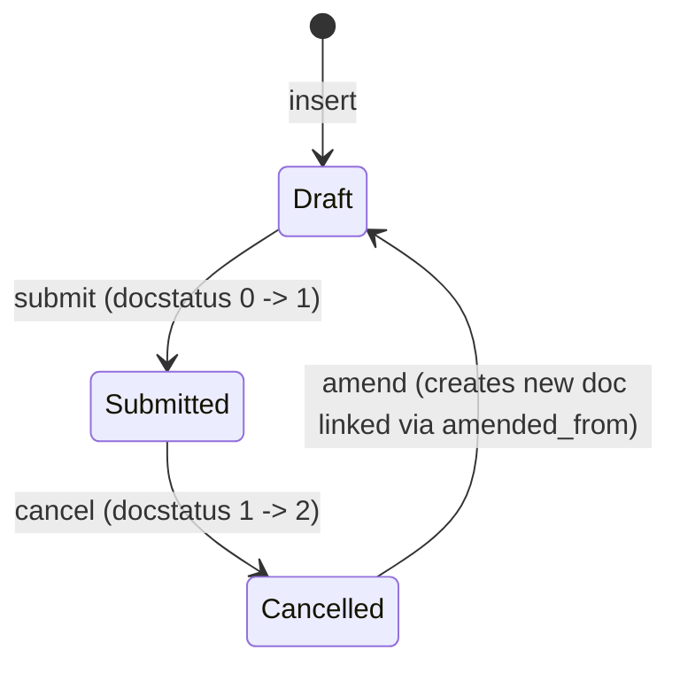

# Salary Structure

**Source:** `hrms/payroll/doctype/salary_structure/salary_structure.json`, `salary_structure.py`, `salary_structure.js`
**Submittable:** yes ([[Submittable Document Lifecycle]])   **Tree:** no   **Naming:** `autoname: "Prompt"` ([[Naming and Autoname Rules]]) — the user types the document name directly on creation (no series/expression), `allow_rename: 1`.
**Module:** Payroll

## Schema

Full field list, JSON field order:

| Field (fieldname) | Label | Type | Options/Link Target | Required | Default | Read-Only | Notes |
|---|---|---|---|---|---|---|---|
| company | Company | Link | Company | Yes | - | - | `remember_last_selected_value`, `search_index` |
| letter_head | Letter Head | Link | Letter Head | - | - | - | `fetch_from: company.default_letter_head`, `fetch_if_empty: 1`, `allow_on_submit: 1` |
| *(column_break1)* | - | Column Break | - | - | - | - | layout only |
| is_active | Is Active | Select | `\nYes\nNo` | Yes | `Yes` | - | `allow_on_submit: 1`, `in_list_view`, `in_standard_filter` |
| payroll_frequency | Payroll Frequency | Select | `\nMonthly\nFortnightly\nBimonthly\nWeekly\nDaily` | conditionally | `Monthly` | - | `depends_on: eval:doc.salary_slip_based_on_timesheet == 0`; required client-side (toggle_reqd) when not timesheet-based — **no matching server-side `reqd` flag or validation**; `search_index` |
| is_default | Is Default | Select | `Yes\nNo` | - | `No` | Yes | hidden, `no_copy`, `print_hide` — appears unused by any controller logic in this file (see Port Notes) |
| *(time_sheet_earning_detail)* | — | Section Break | - | - | - | - | groups timesheet fields |
| salary_slip_based_on_timesheet | Salary Slip Based on Timesheet | Check | - | - | `0` | - | `search_index` |
| *(column_break_17)* | - | Column Break | - | - | - | - | layout only |
| salary_component | Salary Component | Link | [[Salary Component]] | conditionally (client-side reqd when timesheet-based) | - | - | "Salary Component for timesheet based payroll." |
| hour_rate | Hour Rate | Currency | currency (options field = `currency`) | conditionally (client-side reqd when timesheet-based) | - | - | `non_negative: 1` |
| leave_encashment_amount_per_day | Leave Encashment Amount Per Day | Currency | currency | - | - | - | `allow_on_submit: 1`, `non_negative: 1` |
| max_benefits | Max Benefits (Amount) | Currency | currency | - | - | - | `non_negative: 1` |
| *(earning_deduction)* | Earnings & Deductions | Tab Break | - | - | - | - | tab container |
| earnings | Earnings | Table | [[Salary Detail]] | - | - | - | see Child Tables |
| deductions | Deductions | Table | [[Salary Detail]] | - | - | - | see Child Tables |
| employer_contributions | Employer Contributions | Table | [[Salary Detail]] | - | - | - | see Child Tables |
| *(net_pay_detail)* | - | Section Break (options: "Simple") | - | - | - | - | layout only |
| *(column_break2)* | - | Column Break | - | - | - | - | layout only |
| total_earning | Total Earning | Currency | currency | - | - | Yes | hidden; computed client-side only (see Business Logic) |
| total_deduction | Total Deduction | Currency | currency | - | - | Yes | hidden; computed client-side only |
| net_pay | Net Pay | Currency | currency | - | - | Yes | hidden; computed client-side only |
| *(account)* | Account | Tab Break | - | - | - | - | tab container |
| mode_of_payment | Mode of Payment | Link | Mode of Payment | - | - | - | client script fetches `payment_account` from ERPNext POS payment-mode-account helper on change |
| *(column_break_28)* | - | Column Break | - | - | - | - | layout only |
| payment_account | Payment Account | Link | Account | - | - | - | client-side query restricts to `account_type in [Bank, Cash]`, `is_group=0`, `company=doc.company` |
| amended_from | Amended From | Link | [[Salary Structure]] | - | - | Yes | standard amendment-chain field, `no_copy`, `print_hide` |
| conditions_and_formula_variable_and_example | Conditions and Formula variable and example | HTML | - | - | - | - | pure UI helper button/dialog, no logic |
| currency | Currency | Link | Currency | Yes | - | - | `search_index` |
| employee_benefits | Flexible Benefits | Table | [[Employee Benefit Detail]] | - | - | - | "Enter yearly benefit amounts"; see Child Tables |
| *(column_break_besp)* | - | Column Break | - | - | - | - | layout only |

Doctype-level flags: `track_changes: 1`, `allow_import: 1`, `allow_rename: 1`, `sort_field: creation` / `sort_order: DESC`, `show_name_in_global_search: 1`.

## Child Tables

- **earnings**, **deductions**, **employer_contributions** — all three are `Table` fields of child doctype **[[Salary Detail]]** (see `Salary Detail.md`, documented by another agent). Salary Structure treats these three tables uniformly through the constant `COMPONENT_PARENTFIELDS = ("earnings", "deductions", "employer_contributions")` defined in `hrms/payroll/utils.py`. Every row carries at minimum: `salary_component`, `abbr`, `amount`, `formula`, `condition`, `amount_based_on_formula`, `depends_on_payment_days`, `statistical_component`, `do_not_include_in_total`, `do_not_include_in_accounts`, `is_tax_applicable`, `is_flexible_benefit`, `variable_based_on_taxable_salary` (full field list is in `Salary Detail.md`).
- **employee_benefits** — child doctype **[[Employee Benefit Detail]]** (not in this agent's scope; reference by name). Rows carry `salary_component` and `amount` (yearly benefit amount) based on usage in this controller.

## State Machine

Standard Frappe submittable lifecycle only — no custom `status`/`workflow_state` field exists on this doctype.

Plain list:
- (Draft, submit, Submitted) — guard: standard Frappe submit permission + `validate()` passes (see Validation Rules).
- (Submitted, cancel, Cancelled) — guard: standard Frappe cancel permission; no controller-level `on_cancel` override exists (not defined in `salary_structure.py`).
- (Cancelled, amend, Draft) — guard: standard Frappe amend flow (creates new doc, `amended_from` set to cancelled doc's name).

Note: several fields are `allow_on_submit: 1` (`letter_head`, `is_active`, `leave_encashment_amount_per_day`) and can be edited after submission without amendment; when edited after submit, `on_update_after_submit` fires (see Lifecycle Hooks) which re-runs `sanitize_condition_and_formula_fields` and `reset_condition_and_formula_fields`.

## Validation Rules (exact, in execution order)

Frappe's document save calls `before_validate()` first, then `validate()`. Order below reflects true execution order for a **new/updated Draft doc**:

1. `before_validate()` calls `sanitize_condition_and_formula_fields()` — for every row in `earnings`, `deductions`, `employer_contributions`: strip whitespace from `condition`/`formula` (empty becomes `""`), stash the pre-sanitized value in transient `row._condition`/`row._formula`, then overwrite `row.condition`/`row.formula` with `sanitize_expression(...)` (collapses a multi-line expression into a single line by joining stripped lines with a space). No error thrown here — this is a value-correction step. (source: `before_validate`, `sanitize_condition_and_formula_fields`)
2. `validate()` step 1 — `set_missing_values()`: for every row in the 3 component tables, look up the linked `Salary Component`'s `depends_on_payment_days`, `variable_based_on_taxable_salary`, `is_tax_applicable`, `is_flexible_benefit` and overwrite the row's copies unconditionally if they differ from the Salary Component master. If the row has neither `amount` nor `formula` set, additionally copy `amount_based_on_formula`, `formula`, `amount` from the Salary Component master. Value-correction step, no error. (source: `set_missing_values`)
3. `validate()` step 2 — `validate_amount()`: IF `flt(self.net_pay) < 0` AND `self.salary_slip_based_on_timesheet` is truthy THEN `frappe.throw(_("Net pay cannot be negative"))`. (source: `validate_amount`) — **Port note:** `net_pay` is a hidden, `read_only` field never set by server-side Python in this controller (only by client JS `calculate_totals`); on a pure back-end/API save this check is effectively unreachable unless `net_pay` was set by the client payload.
4. `validate()` step 3 — `validate_component_based_on_tax_slab()`: for every row in `deductions`, IF `row.variable_based_on_taxable_salary` is truthy AND (`row.amount` OR `row.formula` is set) THEN `frappe.throw(_("Row #{0}: Cannot set amount or formula for Salary Component {1} with Variable Based On Taxable Salary").format(row.idx, row.salary_component))`. (source: `validate_component_based_on_tax_slab`)
5. `validate()` step 4 — `validate_payment_days_based_dependent_component()`: build list of abbreviations `abbreviations = [row.abbr for table in COMPONENT_PARENTFIELDS for row in self.get(table) if row.depends_on_payment_days]`. Then for every row in every component table, IF `row.formula` is set AND `row.depends_on_payment_days` is truthy AND the formula string contains a whole-word match (`\b<abbr>\b` regex) of ANY collected abbreviation THEN `frappe.throw(message, title=_("Payment Days Dependency"))` where message is:
   `"Row #{0}: The {1} Component has the options {2} and {3} enabled.  Disable {4} for the {5} component, to prevent the amount from being deducted twice, as its formula already uses a payment-days-based component."`
   with `{0}=row.idx`, `{1}=bold(row.salary_component)`, `{2}=bold("Amount based on formula")`, `{3}=bold("Depends On Payment Days")`, `{4}=bold("Depends On Payment Days")`, `{5}=bold(row.salary_component)`.
   (source: `validate_payment_days_based_dependent_component`, `get_component_abbreviations`)
6. `validate()` step 5 — `validate_timesheet_component()`: IF `self.salary_slip_based_on_timesheet` is falsy THEN return (no-op). ELSE for every row in `earnings`, IF `row.salary_component == self.salary_component` THEN `frappe.msgprint(...)` (warning only, not a throw) with message `"Row #{0}: Timesheet amount will overwrite the Earning component amount for the Salary Component {1}"` (`{0}` is actually `self.idx`, not the row's idx — a source quirk) and break after first match. This is a **warning, not a blocking validation**. (source: `validate_timesheet_component`)
7. `validate()` step 6 — `validate_formula_setup()`: for every row in every component table, IF `not row.amount_based_on_formula` AND `row.formula` is truthy THEN `frappe.msgprint(...)` (warning only) with message `"{0} Row #{1}: Formula is set but {2} is disabled for the Salary Component {3}."` where `{0}=table.capitalize()`, `{1}=row.idx`, `{2}=bold("Amount Based on Formula")`, `{3}=bold(row.salary_component)`. Non-blocking warning. (source: `validate_formula_setup`)
8. `validate()` step 7 — `validate_max_benefit_for_flexible_benefit(self.employee_benefits, self.max_benefits)` (module-level function, shared with `Salary Structure Assignment`):
   a. IF `not employee_benefits` THEN return (no-op).
   b. For each `benefit` row in order: IF `benefit.salary_component` already appears in the running `benefit_components` list (i.e. duplicate component across rows) THEN `frappe.throw(_("Salary Component {0} cannot be selected more than once in Employee Benefits").format(benefit.salary_component))`.
   c. Accumulate `benefit_total += benefit.amount`.
   d. Look up `max_of_component = Salary Component.max_benefit_amount` for `benefit.salary_component`. IF `max_of_component` truthy AND `max_of_component > 0` AND `benefit.amount > max_of_component` THEN `frappe.throw(_("Benefit amount {0} for Salary Component {1} should not be greater than maximum benefit amount {2} set in {3}").format(benefit.amount, benefit.salary_component, max_of_component, link_to_form("Salary Component", benefit.salary_component)))`.
   e. Append `benefit.salary_component` to `benefit_components` (after the checks above, so step (b)'s duplicate check happens against components seen in **previous** iterations only).
   f. After the loop: IF `max_benefits` truthy AND `benefit_total > max_benefits` THEN `frappe.throw(_("Total of all employee benefits cannot be greater that Max Benefits Amount {0}").format(max_benefits), title=_("Invalid Benefit Amounts"))`.
   (source: `validate_max_benefit_for_flexible_benefit`, module-level in `salary_structure.py`)

No explicit uniqueness/duplicate-salary-component check across `earnings`/`deductions`/`employer_contributions` rows themselves is present in this controller — only the employee-benefits duplicate check above. **Port Notes callout:** if a re-implementer expects "same component cannot appear twice in Earnings", that check does not exist in source; do not add it.

## Business Logic / Calculations

### Client-side totals (JS only — `salary_structure.js`, function `calculate_totals`)

No server-side equivalent exists; **a port must implement this same calculation server-side** since it currently only runs in the browser form:

1. `total_earn = sum(flt(row.amount) for row in doc.earnings)`
2. `total_ded = sum(flt(row.amount) for row in doc.deductions)`
3. `doc.total_earning = total_earn`
4. `doc.total_deduction = total_ded`
5. `doc.net_pay = 0.0` initially
6. IF `doc.salary_slip_based_on_timesheet == 0` THEN `doc.net_pay = flt(total_earn) - flt(total_ded)` (else stays 0, because timesheet-based net pay is computed later by the Salary Slip from timesheet hours, not from static earning rows here)
7. Triggered on: form `onload`/`validate` (client-side `cur_frm.cscript.validate`), on any `amount` field change in `earnings`/`deductions` rows, and on row removal (`earnings_remove`, `deductions_remove`).

**Port Note:** because `amount`, `total_earning`, `total_deduction`, `net_pay` are computed purely client-side (Currency fields with no `formula`/reqd server recompute), any API-driven or bulk-import creation of a Salary Structure will NOT get these totals populated unless the new stack explicitly re-implements steps 1–6 server-side.

### Formula/condition semantics (evaluated later, not here)

The `condition` and `formula` strings on each `Salary Detail` row of `earnings`/`deductions`/`employer_contributions` are NOT evaluated by `Salary Structure` itself — they are opaque strings at this level, only sanitized (trimmed/single-lined) by `sanitize_condition_and_formula_fields`. Full evaluation logic (the actual formula/condition interpreter) lives on `Salary Structure Assignment._evaluate_component_table` (see that file) and on the Salary Slip (out of this agent's scope) — both reuse `hrms.payroll.utils.sanitize_expression`, `hrms.payroll.utils._safe_eval`, and `hrms.payroll.utils.COMPONENT_EVAL_GLOBALS`.

### Condition/formula sanitization algorithm — `sanitize_expression(string)` (in `hrms/payroll/utils.py`, shared utility)

1. IF `string` is falsy (None/empty) THEN return `None`.
2. `parts = string.strip().splitlines()`
3. `string = " ".join(parts)` — joins all lines (each already implicitly right-trimmed by `splitlines`) with a single space, collapsing multi-line formulas typed in the textarea UI into one evaluable line.
4. Return the joined string.

### Formula/condition sandboxing — `_safe_eval` / `_check_attributes` (shared utility, used at evaluation time by `Salary Structure Assignment`, not by `Salary Structure` itself, but the allowed-globals list is relevant context for anyone building the formula field UI)

`COMPONENT_EVAL_GLOBALS` allowed in every formula/condition: `int, float, long(=int), round, rounded, date, getdate, get_first_day, get_last_day, ceil, floor, min, max`. `_check_attributes` additionally denies any `UNSAFE_ATTRIBUTES` string token (from Frappe's `safe_exec` denylist) plus the literal substring `"__"` (except the word `"format"` is explicitly permitted), and parses the code as an `ast.Expression`, rejecting `ast.NamedExpr` (walrus `:=`) and `ast.Lambda` nodes, and rejecting any `ast.Attribute` access whose attribute name is in `UNSAFE_ATTRIBUTES`.

### CTC / base usage

`Salary Structure` itself does not compute CTC — CTC (`ctc`) and `annual_gross_earning` are fields on `Salary Structure Assignment`, computed from the linked Salary Structure's component rows plus the assignment's `base`/`variable` (full algorithm documented in `Salary Structure Assignment.md`, method `calculate_ctc_and_gross`). `Salary Structure.payroll_frequency` drives the periods-per-year divisor used there (`PERIODS_PER_YEAR = {Monthly:12, Fortnightly:26, Bimonthly:24, Weekly:52, Daily:365}`, default 12 if frequency unset).

### Currency & precision

- `currency` (reqd Link to Currency) is the structure's stated currency; all `Currency`-type fields (`hour_rate`, `leave_encashment_amount_per_day`, `max_benefits`, `total_earning`, `total_deduction`, `net_pay`) declare `"options": "currency"`, meaning their display/formatting rounds according to the `currency` field's value (standard Frappe currency-field behavior — precision derived from the referenced Currency doctype's decimal settings, or system default precision if unset). No explicit non-default `precision` integer override is set on any of these fields in the JSON (the `precision: "2"` on the `earning_deduction` Tab Break field is a leftover from the old Section Break definition and has no numeric-rounding effect on a Tab Break).
- `non_negative: 1` is set on `hour_rate`, `leave_encashment_amount_per_day`, `max_benefits` — this is a client + server (via Frappe core `Document._validate_non_negative`) generic Frappe field constraint that throws `frappe.exceptions.NonNegativeError` if a negative value is saved; not custom code in this controller but must be reproduced in a port (block negative values on these fields at the DB/API boundary).

## Lifecycle Hooks (exact)

| Event | What Runs | Side Effects on Other Doctypes |
|---|---|---|
| before_validate | `sanitize_condition_and_formula_fields()` | none (in-doc only) |
| validate | `set_missing_values()` → `validate_amount()` → `validate_component_based_on_tax_slab()` → `validate_payment_days_based_dependent_component()` → `validate_timesheet_component()` → `validate_formula_setup()` → `validate_max_benefit_for_flexible_benefit(...)` (exact order, see Validation Rules) | reads `Salary Component` master data (no writes) |
| on_update | `reset_condition_and_formula_fields()` — restores `row.condition`/`row.formula` to the pre-sanitized `row._condition`/`row._formula` values (so multi-line formatting is preserved for display in the form) then calls `self.db_update_all()` to persist child rows with the restored (unsanitized/multi-line) text | writes back to this doc's own child tables only |
| before_update_after_submit | `sanitize_condition_and_formula_fields()` (same as before_validate, for allow-on-submit edits) | none |
| on_update_after_submit | `reset_condition_and_formula_fields()` (same as on_update) | none |
| on_submit | *(not overridden — no custom code runs beyond standard Frappe submit)* | — |
| on_cancel | *(not overridden)* | — |
| on_trash | *(not overridden)* | — |

**Port Note:** the sanitize→reset dance means the DB-persisted `condition`/`formula` text is actually the *original* (possibly multi-line) trimmed text, while the *in-memory validated* value during `validate()` is the single-line sanitized version used only for the payment-days-dependency regex check (step 5 above) and warning checks. A port must replicate: validate against the single-line-joined form, but persist the original multi-line form.

## Whitelisted / API Methods

| Method name | HTTP-equivalent purpose | Args | Returns | What it does |
|---|---|---|---|---|
| `get_employees` (instance method, not whitelisted itself — internal helper) | n/a | `**kwargs` (company, grade, department, designation, name, branch) | `list[str]` employee names | Builds a `frappe.qb` query over `Employee` filtered to `status == "Active"` plus any non-empty kwarg equality filter; used internally by `assign_salary_structure`. **Not decorated `@frappe.whitelist()`** — not directly callable from a client. |
| `assign_salary_structure` (instance, `@frappe.whitelist()`) | POST — bulk-assign this structure to matching employees | `branch, grade, department, designation, employee, payroll_payable_account, from_date, base, variable, income_tax_slab` (all optional strings/floats) | `None` | Calls `self.get_employees(company=self.company, grade, department, designation, name=employee, branch)`. IF no employees found THEN `frappe.msgprint(_("No Employee Found"))`. ELSE IF `len(employees) > 20` THEN `frappe.enqueue(assign_salary_structure_for_employees, timeout=3000, employees=employees, salary_structure=self, ...)` (background job). ELSE run `assign_salary_structure_for_employees(...)` synchronously. |
| `assign_salary_structure_for_employees` (module function, not whitelisted — invoked only via `assign_salary_structure` or enqueued) | n/a | `employees, salary_structure, payroll_payable_account=None, from_date=None, base=None, variable=None, income_tax_slab=None` | `None` | See Business Logic / Bulk-assignment algorithm below. |
| `create_salary_structure_assignment` (module function, not whitelisted — shared helper also imported by `Bulk Salary Structure Assignment`) | n/a | `employee, salary_structure, company, currency, from_date, payroll_payable_account=None, base=None, variable=None, income_tax_slab=None` | `str` — new Salary Structure Assignment name | Creates, validates, saves (`ignore_permissions=True`) and submits one `Salary Structure Assignment`. See algorithm below. |
| `get_existing_assignments` (module function, not whitelisted) | n/a | `employees, salary_structure, from_date` | `list[str]` employee names | Query: `SELECT DISTINCT employee FROM Salary Structure Assignment WHERE salary_structure=<name> AND employee IN <employees> AND from_date=<from_date> AND company=<company> AND docstatus=1`. If any found, `frappe.msgprint` listing them as skipped. |
| `make_salary_slip` (module, `@frappe.whitelist()`) | GET/POST — create/preview a Salary Slip from this structure | `source_name, target_doc=None, employee=None, posting_date=None, as_print=False, print_format=None, for_preview=0, lwp_days_corrected=None` | `str` (rendered print HTML) if `as_print` truthy, else a `Salary Slip` Document | IF `employee` given, checks `frappe.has_permission("Employee","read",employee,throw=True)`. Delegates to `_make_salary_slip`, which uses `get_mapped_doc` mapping `Salary Structure -> Salary Slip` with `field_map: {total_earning->gross_pay, name->salary_structure, currency->currency}`, `ignore_child_tables=True`, `cached=True`; postprocess sets `target.employee`/`target.posting_date` (if given) then calls `target.run_method("process_salary_structure", for_preview=for_preview, lwp_days_corrected=lwp_days_corrected)` (Salary Slip logic, out of scope here). If `as_print`, sets `doc.name = f"Preview for {employee}"` and returns `frappe.get_print(...)` HTML. |
| `get_employees` (module-level, `@frappe.whitelist()`, distinct from the instance method of the same name above) | GET — list employees for the Preview Salary Slip dialog | `salary_structure: str` | `list[str]` (deduplicated) | `frappe.get_list("Salary Structure Assignment", filters={salary_structure, docstatus:1}, pluck="employee")`. IF empty THEN `frappe.throw(_("There's no Employee with Salary Structure: {0}. Assign {1} to an Employee to preview Salary Slip").format(...))`. |
| `get_salary_component` (module, `@frappe.whitelist()`) | GET — Link-field query/autocomplete source for the `salary_component` field in earnings/deductions/employer_contributions grids | `doctype, txt, searchfield, start, page_len, filters` (dict with `component_type` and `company`) | `list[tuple]` of `(name, account, company)` | Query joins `Salary Component` to `Salary Component Account` on `sca.parent == sc.name`, filtered by `sc.type == filters.component_type`, `sc.disabled == 0`, and a `LIKE` search on `searchfield`/`name`. Then in Python: for each result, if the component has NO company-specific account row (`component.company` falsy) include it; else only include it if `component.company == filters['company']`. This lets company-agnostic components always show, while company-scoped account rows are filtered to the current company. |

### Bulk-assignment algorithm (`assign_salary_structure_for_employees`, exact steps)

1. `existing_assignments_for = get_existing_assignments(employees, salary_structure, from_date)` (see query above) — set of employees to SKIP.
2. `count = 0`; `savepoint = "before_assignment_submission"`.
3. For each `employee` in `employees` (order as returned by `get_employees` Employee query):
   a. `frappe.db.savepoint(savepoint)`.
   b. IF `employee in existing_assignments_for` THEN `continue` (skip, no error, no log).
   c. `count += 1`.
   d. Call `create_salary_structure_assignment(employee, salary_structure.name, salary_structure.company, salary_structure.currency, from_date, payroll_payable_account, base, variable, income_tax_slab)`. Append the returned name to `assignments`.
   e. `frappe.publish_progress(count * 100 / len(set(employees) - set(existing_assignments_for)), title=_("Assigning Structures..."))` — realtime progress bar update.
   f. IF an exception is raised anywhere in (d) THEN `frappe.db.rollback(save_point=savepoint)` and `frappe.log_error(f"Salary Structure Assignment failed for employee {employee}", reference_doctype="Salary Structure Assignment")` — the loop continues to the next employee (failure isolated per-employee via savepoint, not aborting the whole batch).
4. IF `assignments` non-empty THEN `frappe.msgprint(_("Structures have been assigned successfully"))`.

### Single-assignment creation algorithm (`create_salary_structure_assignment`, exact steps)

1. `assignment = frappe.new_doc("Salary Structure Assignment")`.
2. IF `payroll_payable_account` not given: look up `Company.default_payroll_payable_account`; IF still falsy THEN `frappe.throw(_('Please set "Default Payroll Payable Account" in Company Defaults'))`.
3. `payroll_payable_account_currency = Account.account_currency` for the resolved account. `company_currency = erpnext.get_company_currency(company)`. IF `payroll_payable_account_currency != currency` AND `payroll_payable_account_currency != company_currency` THEN `frappe.throw(_("Invalid Payroll Payable Account. The account currency must be {0} or {1}").format(currency, company_currency))`.
4. Set `assignment.employee, salary_structure, company, currency, payroll_payable_account, from_date, base, variable, income_tax_slab` from args.
5. `assignment.save(ignore_permissions=True)` then `assignment.submit()` — this triggers the full `Salary Structure Assignment` validation chain (see that file) and any error there propagates up (caught by the per-employee savepoint/rollback in the bulk loop, or surfaces directly for a single foreground call).
6. Return `assignment.name`.

This same helper (`create_salary_structure_assignment`) is reused verbatim by `Bulk Salary Structure Assignment._bulk_assign_structure`.

## Permissions

| Role | Read | Write | Create | Delete | Submit | Cancel | Amend | Report | Export | Import | Notes |
|---|---|---|---|---|---|---|---|---|---|---|---|
| HR User | 1 | 1 | 1 | 1 | 1 | 1 | 1 | 1 | - | - | share, email, print all 1 |
| HR Manager | 1 | 1 | 1 | 1 | 1 | 1 | 1 | 1 | 1 | 1 | share, email, print all 1; only role with export/import rights |

No `if_owner` or `permlevel` restrictions defined.

## Scheduled Jobs Touching This Doctype

None found in `hrms/hooks.py` `scheduler_events` referencing `Salary Structure` directly.

## Related Doctypes

- [[Salary Detail]] — the child-row shape shared by `earnings`, `deductions`, `employer_contributions`.
- [[Salary Component]] — the `salary_component` field (timesheet earning target) and the component master consulted by `set_missing_values()`/`get_salary_component()`.
- [[Salary Component Account]] — joined in `get_salary_component()` to filter the component picker by company-scoped account availability.
- [[Salary Structure Assignment]] — created (singly or in bulk) by `create_salary_structure_assignment()`/`assign_salary_structure()`; computes CTC/gross from this structure's component rows.
- [[Employee Benefit Detail]] — `employee_benefits` child table, capped per-component and in total by `max_benefits`.
- [[Salary Slip]] — `make_salary_slip()` maps a Salary Structure into a new/preview Salary Slip.
- [[Bulk Salary Structure Assignment]] — reuses `create_salary_structure_assignment()` for its own bulk-assign flow.

## Port Notes

- `is_default` field exists in schema (hidden, Select Yes/No, default "No") but no code in `salary_structure.py` reads or writes it — appears vestigial/unused by current controller logic. Do not invent behavior for it; flag it as dead schema in a port unless another module (out of scope) sets it.
- `payroll_frequency` is only conditionally required via client-side `depends_on`/`toggle_reqd`; there is no equivalent server-side `frappe.throw` if it's missing on a non-timesheet structure saved via API — a re-implementer should decide whether to add a real server-side required check to close this gap, but per Ground Rules this is flagged rather than silently added.
- `total_earning`, `total_deduction`, `net_pay` are computed **only in the browser** (`salary_structure.js` `calculate_totals`); nothing in `salary_structure.py` recomputes them. A server-authoritative port must re-implement this arithmetic itself (see Business Logic) to avoid relying on client-submitted values for a value used elsewhere (e.g. `make_salary_slip`'s `field_map` maps `total_earning -> gross_pay` on the new Salary Slip).
- The `condition`/`formula` sanitize-then-restore round trip (`before_validate`/`before_update_after_submit` sanitize, `on_update`/`on_update_after_submit` reset via `db_update_all()`) is a Frappe-specific trick to validate a normalized single-line string while storing the original (possibly pretty-printed multi-line) string for editor display. A port on a different stack should just decide once whether to store normalized or raw text — but if formula display formatting matters to users, replicate both the stored raw text and a normalized version used only for validation-time regex/eval.
- `validate_timesheet_component` and `validate_formula_setup` are **non-blocking warnings** (`frappe.msgprint`), not hard validation failures — do not turn these into blocking errors in a port.
- Currency rounding relies on Frappe's implicit per-field `options: "currency"` precision resolution (falls back to system-wide float precision, typically 2–6 decimals depending on site config) — a port must pick and enforce an explicit fixed precision (commonly 2) for all Currency fields listed above, since "read precision from a linked Currency doctype at render time" is a Frappe-framework-specific mechanic with no built-in equivalent elsewhere.
- `non_negative: 1` field-level constraint (on `hour_rate`, `leave_encashment_amount_per_day`, `max_benefits`) is enforced by the Frappe framework itself (not custom Python here) — must be reproduced explicitly as a CHECK constraint or app-layer validation in a new stack.
- `track_changes: 1` means Frappe auto-logs every field change to a Version doctype for audit history — a port needs an explicit audit-log/version table if this behavior is required.
- The whitelisted `get_employees` (module-level) and the non-whitelisted instance method `get_employees` share the same name but different signatures/behavior — documented separately above to avoid confusion; a port should give these distinct names.
