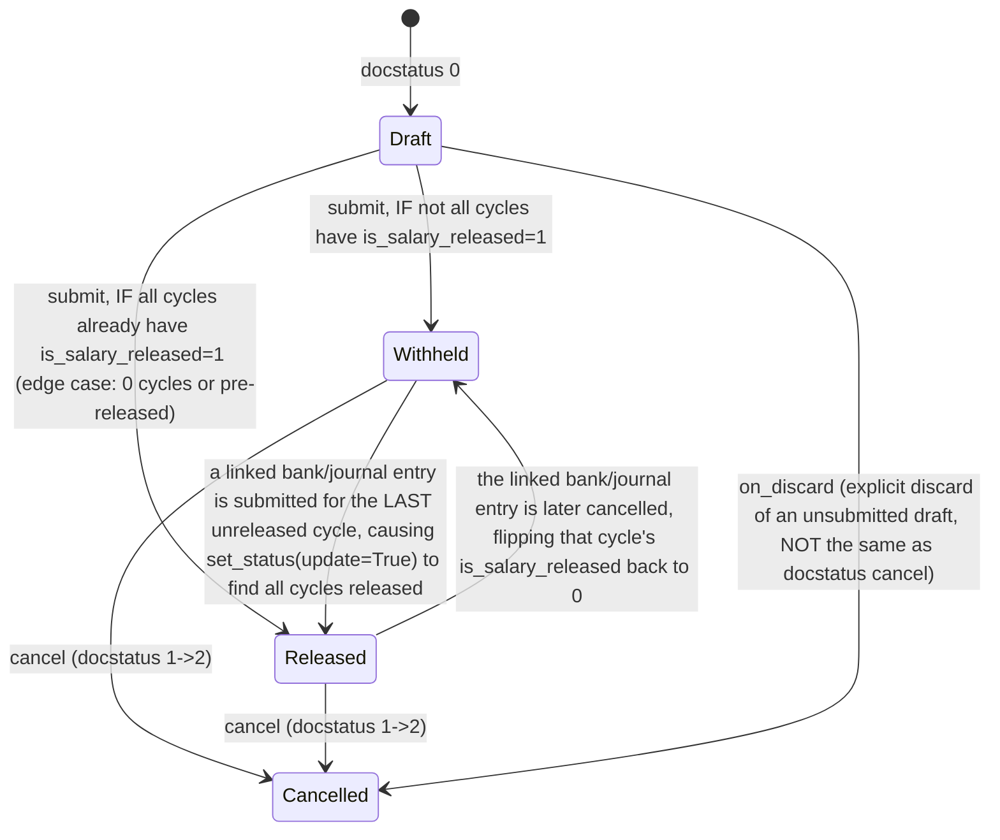

# Salary Withholding

**Source:** `hrms/payroll/doctype/salary_withholding/salary_withholding.json`, `salary_withholding.py`, `salary_withholding.js`
**Submittable:** yes ([[Submittable Document Lifecycle]])   **Tree:** no   **Naming:** `format:SAL-WTH-{#####}` (expression naming rule, [[Naming and Autoname Rules]])
**Module:** Payroll

Withholds an employee's salary for a specified number of upcoming payroll cycles (e.g. pending exit formalities/clearance), splitting the withholding window into discrete "cycles" matching the employee's payroll frequency, and tracks per-cycle release status once each cycle's salary is eventually paid out via a bank/journal entry.

## Schema

| Field (fieldname) | Label | Type | Options/Link Target | Required | Default | Read-Only | Notes |
|---|---|---|---|---|---|---|---|
| employee | Employee | Link | [[Employee Core Model]] | yes | | no | `search_index: 1` |
| employee_name | Employee Name | Data | | no | | yes | fetch_from `employee.employee_name` |
| company | Company | Link | Company | no | | yes | fetch_from `employee.company` |
| payroll_frequency | Payroll Frequency | Select | ``, `Monthly`, `Fortnightly`, `Bimonthly`, `Weekly`, `Daily` | no | | yes | auto-derived server-side from the employee's Salary Structure if not already set |
| number_of_withholding_cycles | Number of Withholding Cycles | Int | | yes | | no | `non_negative: 1`; drives `to_date` and cycle generation |
| posting_date | Posting Date | Date | | yes | Today | no | |
| from_date | From Date | Date | | yes | | no | start of the withholding window |
| to_date | To Date | Date | | yes | | yes | server-computed from `from_date` + `number_of_withholding_cycles` cycles of `payroll_frequency` |
| date_of_joining | Date of Joining | Date | | no | | yes | fetch_from `employee.date_of_joining` |
| relieving_date | Relieving Date | Date | | no | | yes | fetch_from `employee.relieving_date` |
| reason_for_withholding_salary (collapsible section: Reason) | Reason for Withholding Salary | Small Text | | no | | no | |
| cycles | Cycles | Table | [[Salary Withholding Cycle]] | no | | yes | server-generated breakdown of the withholding window into payroll-frequency-sized chunks |
| amended_from | Amended From | Link | [[Salary Withholding]] | no | | yes | `search_index: 1` |
| status | Status | Select | ``, `Draft`, `Withheld`, `Released`, `Cancelled` | no | Draft | yes | server-computed in `set_status()`; not directly user-editable |

Layout-only fields skipped: section_break_fwuv, column_break_hbju, column_break_rhlv, exit_details_section, column_break_qlwx, section_break_xeyl.

`states` array in JSON (UI color-coding only, not a workflow engine): Draft=Red, Withheld=Yellow, Released=Green, Cancelled=Red.

## Child Tables

### [[Salary Withholding Cycle]] (`cycles`)
See `Salary Withholding Cycle.md`.

| Field | Label | Type | Options | Required | Default | Read-Only | Notes |
|---|---|---|---|---|---|---|---|
| from_date | From Date | Date | | yes | | no | column width 2 |
| to_date | To Date | Date | | yes | | no | column width 2 |
| is_salary_released | Is Salary Released | Check | | no | 0 | yes | `no_copy: 1`; set via `db_set` from `update_salary_withholding_payment_status` |
| journal_entry | Journal Entry | Link | Journal Entry | no | | yes | set via `db_set` when the linked bank entry is submitted |

## State Machine

Plain list (exact, derived from `set_status`):
- (docstatus 0, always, status="Draft")
- (docstatus 1 AND all(cycle.is_salary_released for cycle in cycles), always, status="Released") — note: `all()` on an empty list is `True` in Python, so a Salary Withholding with ZERO cycles would resolve to "Released" immediately upon submit; flagged as an edge case, not separately guarded in source.
- (docstatus 1 AND NOT all cycles released, always, status="Withheld")
- (docstatus 2, always, status="Cancelled")
- (any docstatus, `on_discard` event — discarding a draft before submission — forces status="Cancelled" via direct `db_set`, bypassing the `set_status()` logic entirely) — this is Frappe's "discard" action on an unsaved/draft document, distinct from submit+cancel.

`status` is recomputed by `set_status()` called from `validate()` (every save, `update=False`, sets `self.status` in memory) AND externally from `_update_salary_withholdings()` (called from `update_salary_withholding_payment_status`, `update=True`, uses `db_set` to persist immediately) whenever a linked bank/journal entry's submission or cancellation toggles a cycle's `is_salary_released`.

## Validation Rules (exact, in execution order)

`validate()`:
1. IF NOT `self.payroll_frequency` THEN `self.payroll_frequency = get_payroll_frequency(self.employee, self.from_date)` (see Business Logic — throws if no Salary Structure Assignment found).
2. `set_withholding_cycles_and_to_date()` — recomputes `to_date` and rebuilds the entire `cycles` table from scratch on every save (see Business Logic). No throw in this step itself.
3. `validate_duplicate_record()`: query other `Salary Withholding` docs where `employee == self.employee`, `docstatus != 2` (i.e. not cancelled — so both Draft and Submitted count), `name != self.name`, AND date-range overlap: `to_date >= self.from_date` AND `from_date <= self.to_date`. IF any found THEN throw (title `"Duplicate Salary Withholding"`): `"Salary Withholding {0} already exists for employee {1} for the selected period"` (link to the duplicate, bolded "`employee_id`: `employee_name`").
4. `set_status()` (update=False) — sets `self.status` in memory per the state rules above.

## Business Logic / Calculations

### `get_payroll_frequency(employee, posting_date)` (whitelisted, module-level)
1. Check read permission on `Employee`.
2. Look up the latest `Salary Structure Assignment` for `employee` with `from_date <= posting_date`, `docstatus == 1`, ordered `from_date desc` — get its `salary_structure`.
3. IF none found THEN throw (title `"Error"`): `"No Salary Structure Assignment found for employee {0} on or before {1}"` (employee, posting_date).
4. Return `Salary Structure.payroll_frequency` for that structure.

### `set_withholding_cycles_and_to_date()` (whitelisted) — the withholding-cycle generation algorithm
1. `self.to_date = get_to_date()`:
   a. `kwargs = get_frequency_kwargs(self.number_of_withholding_cycles)` — maps `payroll_frequency` + a cycle count into a `relativedelta`-style kwargs dict: `Monthly -> {months: 1*cycles}`, `Bimonthly -> {months: 2*cycles}`, `Fortnightly -> {days: 14*cycles}`, `Weekly -> {days: 7*cycles}`, `Daily -> {days: 1*cycles}`. `cycles = cint(number_of_withholding_cycles) or 1` (defaults to 1 cycle if falsy/zero).
   b. `to_date = add_to_date(from_date, **kwargs) - relativedelta(days=1)` — i.e. `from_date` plus N cycles of the frequency, minus one day (so a 1-month Monthly withholding starting Jan 1 ends Jan 31, not Feb 1).
2. Reset `self.cycles = []`.
3. Loop generating individual cycle rows: `cycle_from_date = cycle_to_date = from_date` initially. WHILE `cycle_to_date < to_date`:
   a. `cycle_to_date = add_to_date(cycle_from_date, **get_frequency_kwargs()) - relativedelta(days=1)` — note: called with NO argument here, so `get_frequency_kwargs(0)` -> `cint(0) or 1` -> `cycles=1`, i.e. each loop iteration always advances by exactly ONE payroll-frequency period (not scaled by `number_of_withholding_cycles`), regardless of the total window size.
   b. Append a `cycles` row: `{from_date: cycle_from_date, to_date: cycle_to_date, is_salary_released: 0}`.
   c. `cycle_from_date = add_days(cycle_to_date, 1)` (next cycle starts the day after this one ends).
   d. Loop continues while `cycle_to_date < to_date` — so the FINAL cycle's `to_date` may land exactly on (or, given the loop condition checks `<`, could in principle exceed if a frequency period doesn't evenly divide the window, though in practice frequency-consistent math keeps it aligned) the overall `to_date`.

Net effect: for `number_of_withholding_cycles = N` cycles of a given `payroll_frequency`, this produces exactly N rows in the `cycles` table, each spanning one payroll-frequency period, collectively covering `[from_date, to_date]` with no gaps or overlaps (by construction, since `to_date` itself is defined as N periods after `from_date` minus one day, and the loop advances one period at a time until reaching that same boundary).

### `set_status(update=False)`
See State Machine section — computes Draft/Withheld/Released/Cancelled from `docstatus` and `all(cycle.is_salary_released for cycle in self.cycles)`. IF `update=True`, persists via `self.db_set("status", status)` (direct DB write, bypassing normal save/validate); ELSE just sets `self.status` in memory (used during the normal `validate()` flow before an actual save commits it).

### `on_discard()`
`self.db_set("status", "Cancelled")` — when a draft (never-submitted) document is discarded via Frappe's discard action, force status to Cancelled directly, independent of the normal `set_status()` docstatus-driven logic.

## Lifecycle Hooks (exact)

| Event | What Runs | Side Effects on Other Doctypes |
|---|---|---|
| validate | payroll_frequency auto-derivation, `set_withholding_cycles_and_to_date` (rebuild cycles/to_date every save), `validate_duplicate_record`, `set_status` | Reads Salary Structure Assignment, Salary Structure (no writes) |
| on_discard | Force `status = "Cancelled"` via `db_set` | none |

No `on_submit`/`on_cancel` overrides on this controller itself — the actual withholding EFFECT on Salary Slips happens elsewhere: `Salary Slip.check_salary_withholding()` (owned by another agent) calls `get_salary_withholdings(start_date, end_date, employee)` from the `Payroll Entry` module to detect an active withholding covering the slip's period and sets `salary_slip.salary_withholding`/`salary_withholding_cycle` accordingly, driving the slip's own status to "Withheld". This doctype does not itself reach into Salary Slip.

## Whitelisted / API Methods

| Method name | HTTP-equivalent purpose | Args | Returns | What it does |
|---|---|---|---|---|
| `set_withholding_cycles_and_to_date` (instance method) | POST (form doc method, client-driven) | none (uses self.from_date/to_date/payroll_frequency/number_of_withholding_cycles) | None (mutates doc) | Recomputes `to_date` and regenerates the `cycles` table, per algorithm above |
| `get_payroll_frequency` (module function) | POST (client callback on employee change) | `employee, posting_date` | Select value (payroll frequency string) | Resolves the employee's payroll frequency from their active Salary Structure Assignment/Salary Structure, throws if none found |

### Release mechanism (module-level functions, NOT `@frappe.whitelist()` — these are internal doc-event hook callbacks, not directly client-callable)
The assignment note asks specifically about "the release logic" — the actual release-from-withholding flow is implemented as plain (non-whitelisted) functions triggered by hooks on a DIFFERENT doctype's lifecycle (a bank-payment/Journal Entry submission), not as a whitelisted method exposed for direct client invocation:

| Function | Trigger | What it does |
|---|---|---|
| `link_bank_entry_in_salary_withholdings(salary_slips, bank_entry)` | Called from Payroll Entry's bank-entry-creation flow (owned by another module) | Bulk-updates `Salary Withholding Cycle.journal_entry = bank_entry` for every cycle referenced by the given salary slips' `salary_withholding_cycle` field |
| `update_salary_withholding_payment_status(doc, method=None)` | Registered as a doc_event hook (e.g. in `hrms/hooks.py`, on a Journal Entry / bank entry doctype's `on_submit`/`on_cancel` — exact hook registration lives outside this file, in `hooks.py`, owned by cross-cutting concerns) | Entry point: finds all `Salary Withholding Cycle` rows whose `journal_entry == doc.name` and `docstatus == 1`, joined to their parent `Salary Withholding` for `employee`. IF none found, no-op. Otherwise `cancel = (method == "on_cancel")`, then calls the two helpers below. |
| `_update_payment_status_in_payroll(withholdings, cancel=False)` | Called by the above | Sets `Salary Slip.status = "Withheld" if cancel else "Submitted"` for every slip whose `salary_withholding_cycle` is in the released set; sets `Payroll Employee Detail.is_salary_withheld = 1 if cancel else 0` for the affected employees. |
| `_update_salary_withholdings(withholdings, cancel=False)` | Called by the above | For each withholding: loads the `Salary Withholding` doc, finds the matching `cycle` row by name, `db_set("is_salary_released", 0 if cancel else 1)`, and IF cancelling also `db_set("journal_entry", None)`. Then calls `withholding_doc.set_status(update=True)` to recompute and persist the parent's overall `status` (this is what flips Withheld<->Released as described in the State Machine). |

This confirms the release flow: releasing withheld salary is NOT a direct action on Salary Withholding itself — it happens as a side effect of submitting a Journal Entry / bank payment entry elsewhere in Payroll Entry processing, which this doctype's hook-triggered functions listen for and reflect back onto the relevant cycle rows and parent status.

## Permissions

| Role | Read | Write | Create | Delete | Submit | Cancel | Amend | Report | Export | Notes |
|---|---|---|---|---|---|---|---|---|---|---|
| System Manager | yes | yes | yes | yes | yes | n/a (cancel not listed) | n/a | yes | yes | share/email/print also 1 |
| HR Manager | yes | yes | yes | yes | yes | yes | n/a (amend not listed) | yes | yes | share/email/print also 1 |
| Employee | yes | no | no | no | no | no | no | yes | yes | share/email/print also 1; read-only, self-service visibility only |

## Scheduled Jobs Touching This Doctype

None found in `hrms/hooks.py` directly. (The release mechanism is doc-event-driven off a Journal Entry / bank-entry submission, not a scheduled/cron job.)

## Related Doctypes

- [[Salary Withholding Cycle]] — child table of per-frequency cycle rows generated and tracked by this doctype.
- [[Salary Structure Assignment]] / [[Salary Structure]] — `get_payroll_frequency()` derives the withholding cycle frequency from the employee's active assignment/structure.
- [[Salary Slip]] — `check_salary_withholding()` (owned by that doctype) detects an active withholding covering the slip's period and marks the slip `Withheld`.
- [[Payroll Employee Detail]] — `is_salary_withheld` flag toggled alongside a cycle's release status.
- [[Employee Core Model]] — the employee whose pay is withheld.

## Port Notes

- `set_withholding_cycles_and_to_date`'s inner loop calls `get_frequency_kwargs()` with NO argument, meaning `withholding_cycles` defaults to falsy -> `cint(0) or 1` -> always exactly one payroll-frequency period per loop iteration, REGARDLESS of `self.number_of_withholding_cycles`. Only the outer `to_date` computation (`get_to_date()`) actually uses `number_of_withholding_cycles` to scale the total window. This two-step design (compute total window scaled by N, then walk it one period at a time) must be reproduced exactly — do not "simplify" to a single multiplication, since the loop's per-period boundaries are what populate the `cycles` table rows.
- `all(cycle.is_salary_released for cycle in self.cycles)` returns `True` vacuously when `cycles` is empty (e.g. `number_of_withholding_cycles = 0`, or `from_date == to_date` degenerate case) — such a document would be marked "Released" immediately on submit despite having withheld nothing. This is a real edge-case gap in source, not a deliberate design choice explained anywhere in code; flagged rather than patched.
- The actual "withholding takes effect" mechanism lives entirely in `Salary Slip.check_salary_withholding()` (owned by another module) via `get_salary_withholdings()` (owned by `Payroll Entry`, another module) — this doctype only defines the withholding schedule/cycles and reacts to release events; it does not itself reach into Salary Slip. A port must ensure Salary Slip generation queries this doctype (by employee + date range) to decide whether to suppress payment.
- The release mechanism depends on a `Journal Entry` doctype field `salary_withholding_cycle` (referenced from `Salary Slip`) and doc-event hooks external to this file (presumably registered in `hrms/hooks.py`, which — per the search performed — does NOT contain literal string matches for "Salary Withholding" as scanned; the hook registration point for `update_salary_withholding_payment_status` was not directly located in this pass and should be confirmed against the accounting/payroll-entry integration hooks by whichever agent documents `hrms/hooks.py` or `Payroll Entry` — flagged as an unresolved cross-module wiring detail, not invented).
- `status` field is `read_only: 1` in the schema yet is mutated via `db_set` (bypassing normal validate/save) from both `set_status(update=True)` and `on_discard()` — a port must allow its equivalent status field to be system-writable even though it's not directly user-editable via any UI/API surface.
- `Payroll Employee Detail` (referenced in `_update_payment_status_in_payroll`) is a doctype outside this agent's assigned list — cross-reference by name only; confirm its owner among other module agents (likely `Payroll Entry`/core payroll processing).
