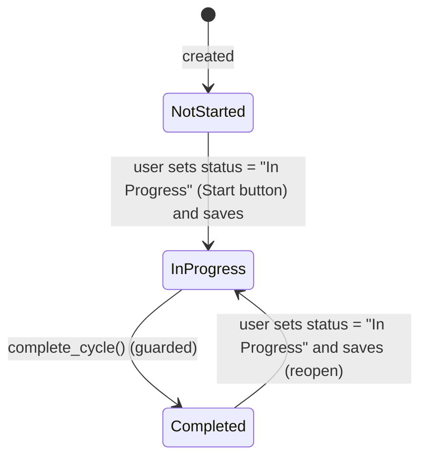

# Appraisal Cycle

**Source:** `hrms/hr/doctype/appraisal_cycle/appraisal_cycle.json`, `appraisal_cycle.py`, `appraisal_cycle.js`
**Submittable:** no   **Tree:** no   **Naming:** `field:cycle_name` ([[Naming and Autoname Rules]]) — the document's name IS the value typed into `cycle_name` (must be unique, `allow_rename: 1`)
**Module:** HR

## Schema

| Field (fieldname) | Label | Type | Options/Link Target | Required | Default | Read-Only | Notes |
|---|---|---|---|---|---|---|---|
| *(Tab: Overview)* | | | | | | | |
| cycle_name | Cycle Name | Data | — | yes | — | — | unique; in_list_view; this is also the document name |
| company | Company | Link | Company | yes | — | — | in_list_view, in_standard_filter |
| status | Status | Select | `Not Started`\|`In Progress`\|`Completed` | no | `Not Started` | yes (only set via code/buttons, not directly editable) | in_list_view, in_standard_filter |
| start_date | Start Date | Date | — | yes | — | — | in_list_view, in_standard_filter |
| end_date | End Date | Date | — | yes | — | — | in_list_view, in_standard_filter |
| description | (no label) | Text Editor | — | no | — | — | inside collapsible "Description" section |
| *(Section: Settings)* | | | | | | | |
| kra_evaluation_method | KRA Evaluation Method | Select | `Automated Based on Goal Progress`\|`Manual Rating` | no | `Automated Based on Goal Progress` | no | Determines whether new Appraisals under this cycle default to `rate_goals_manually` |
| calculate_final_score_based_on_formula | Calculate Final Score based on Formula | Check | — | no | 0 | no | "By default, the Final Score is calculated as the average of Goal Score, Feedback Score, and Self Appraisal Score. Enable this to set a different formula" |
| final_score_formula | Final Score Formula | Code (PythonExpression) | — | conditionally | — | no | `depends_on` + `mandatory_depends_on: calculate_final_score_based_on_formula` — required only when that checkbox is enabled |
| *(Tab: Applicable For)* | | | | | | | |
| branch | Branch | Link | Branch | no | — | no | optional filter for `Get Employees` |
| department | Department | Link | Department | no | — | no | optional filter; UI further scopes the Department link-query to `company` |
| designation | Designation | Link | Designation | no | — | no | optional filter |
| get_employees | Get Employees | Button | — | — | — | — | triggers `set_employees()` |
| appraisees | (no label) | Table (Appraisee) | Appraisee | no | — | no | populated by `set_employees`; owned by another module's doctype (`Appraisee` — out of this port's assigned scope, reference only; no matching file found in `01-Modules`) |

## Child Tables

- `appraisees` → **Appraisee** doctype — NOT in this agent's assigned scope; reference by name only (owned elsewhere). Known fields used by this controller: `employee`, `employee_name`, `branch`, `designation`, `department`, `appraisal_template`.

## State Machine

`status` is a plain Select field (not a submittable workflow) with 3 values and explicit color-coded states declared in the JSON `states` array: Not Started (Gray), In Progress (Orange), Completed (Green).



Plain list:
- (Not Started, save with status="In Progress") -> In Progress — no server guard; purely a field write from the UI "Start" button (`frm.set_value("status","In Progress"); frm.save()`).
- (In Progress, `complete_cycle()`) -> Completed — guarded: fails if any linked, non-cancelled Appraisal is still Draft.
- (Completed, save with status="In Progress") -> In Progress — no server guard on this reopen transition either (UI-only "Mark as In Progress" button).
- Changing `kra_evaluation_method` on an existing cycle is blocked once any non-cancelled Appraisal exists for it (see Validation Rules #2) — this is the cycle's real invariant, not the status field.

## Validation Rules (exact, in execution order)

Runs inside `validate()`:

1. `validate_from_to_dates("start_date", "end_date")` (Frappe framework built-in on `Document`): IF `end_date < start_date` THEN throw the framework's standard "{end_date_label} cannot be before {start_date_label}" error.
2. `validate_evaluation_method_change()`: IF `self.is_new()` THEN skip (no check on creation). ELSE IF `self.has_value_changed("kra_evaluation_method")` AND `check_if_appraisals_exist()` (any Appraisal with this `appraisal_cycle` and `docstatus != 2`) THEN throw `"Evaluation Method cannot be changed as there are existing appraisals created for this cycle"` — title "Not Allowed".

Additional guard enforced by a separate whitelisted method, not part of `validate()`:
- `complete_cycle()`: IF `count(Appraisal where appraisal_cycle=self.name and docstatus=0) > 0` THEN throw a two-part message: `"{0} Appraisal(s) are not submitted yet"` (0 = bolded draft count) plus `"Please submit the {0} before marking the cycle as Completed"` (0 = a link labeled "documents" to the filtered Appraisal list) — title "Unsubmitted Appraisals". Only if this passes does it set `status = "Completed"` and `save()`.
- `create_appraisals()`: IF `not self.appraisees` THEN throw `"Please select employees to create appraisals for"` — title "No Employees Selected". IF any appraisee row lacks `appraisal_template` THEN call `show_missing_template_message(raise_exception=True)` which throws (see below).
- `show_missing_template_message(raise_exception)`: builds message `"Appraisal Template not found for some designations."` + a line directing the user to set the template on the relevant Designations (with a link to the Designation list) or to select it directly in the Employees table; if `raise_exception` is true this call itself raises (via `frappe.msgprint(..., raise_exception=True)`), otherwise it's a non-fatal warning message.

## Business Logic / Calculations

No numeric score calculations live on this doctype; it aggregates counts for a dashboard summary instead.

### `get_appraisal_cycle_summary(cycle_name)` (whitelisted, module-level)
```
REQUIRE read permission on Appraisal Cycle cycle_name (else throw)
appraisees        = COUNT(Appraisal WHERE appraisal_cycle = cycle_name AND docstatus != 2)
self_appraisal_pending = COUNT(Appraisal WHERE appraisal_cycle = cycle_name AND docstatus = 0 AND self_score = 0)
goals_missing     = get_employees_without_goals(cycle_name)
feedback_missing  = get_employees_without_feedback(cycle_name)
RETURN {appraisees, self_appraisal_pending, goals_missing, feedback_missing}
```

### `get_employees_without_goals(cycle_name)`
```
employees_with_goals = DISTINCT Goal.employee
    WHERE Goal.appraisal_cycle = cycle_name AND Goal.status != "Archived"
RETURN COUNT(Appraisal
    WHERE appraisal_cycle = cycle_name
      AND docstatus != 2
      AND employee NOT IN employees_with_goals)
```

### `get_employees_without_feedback(cycle_name=None)`
```
IF cycle_name is not given:
    cycle_name = the most recent (by start_date desc) Appraisal Cycle with status = "In Progress"
REQUIRE read permission on Appraisal Cycle cycle_name (else throw)
employees_with_feedback = DISTINCT Employee Performance Feedback.employee
    WHERE appraisal_cycle = cycle_name AND docstatus = 1
RETURN COUNT(Appraisal
    WHERE appraisal_cycle = cycle_name
      AND docstatus != 2
      AND employee NOT IN employees_with_feedback)
```

### Employee selection for "Get Employees" — `get_employees_for_appraisal()`
```
filters = {status: "Active", company: self.company}
IF self.department: filters.department = self.department
IF self.branch: filters.branch = self.branch
IF self.designation: filters.designation = self.designation
RETURN [[Employee Core Model]] list (name, employee_name, branch, designation, department) matching filters
```

### Template resolution — `get_appraisal_template_map()`
```
RETURN a map of {Designation.name: Designation.appraisal_template} for every Designation
```
(`Designation.appraisal_template` is a field owned by another doctype outside this agent's scope — referenced here only as the source of the per-designation default template.)

### `set_employees()` (whitelisted)
```
CHECK write permission
employees = get_employees_for_appraisal()
appraisal_templates = get_appraisal_template_map()
IF employees:
    CLEAR appraisees table
    template_missing = False
    FOR each employee in employees:
        IF appraisal_templates[employee.designation] is falsy: template_missing = True
        APPEND appraisees row {employee: name, employee_name, branch, designation, department,
                                appraisal_template: appraisal_templates[designation]}
    IF template_missing: show_missing_template_message()   # non-fatal warning
ELSE:
    CLEAR appraisees table
    MSGPRINT "No employees found for the selected criteria"
RETURN self
```

### `create_appraisals()` / `create_appraisals_for_cycle()` (whitelisted)
```
CHECK write permission
IF appraisees is empty: THROW "Please select employees to create appraisals for"
IF any appraisee missing appraisal_template: show_missing_template_message(raise_exception=True)  # throws

IF len(appraisees) > 30:
    ENQUEUE create_appraisals_for_cycle as a background job (queue "long", timeout 600s)
    MSGPRINT (alert) "Appraisal creation is queued. It may take a few minutes."
ELSE:
    RUN create_appraisals_for_cycle(self, publish_progress=True) synchronously
    RELOAD self

# create_appraisals_for_cycle(appraisal_cycle, publish_progress=False):
count = 0
FOR each employee in appraisal_cycle.appraisees:
    TRY:
        BUILD new Appraisal {company: appraisal_cycle.company,
                              appraisal_template: employee.appraisal_template,
                              employee: employee.employee,
                              appraisal_cycle: appraisal_cycle.name}
        appraisal.rate_goals_manually = 1 IF kra_evaluation_method == "Manual Rating" ELSE 0
        appraisal.set_kras_and_rating_criteria()
        appraisal.insert()
        IF publish_progress:
            count += 1
            PUBLISH PROGRESS count*100/len(appraisees), title "Creating Appraisals..."
    CATCH DuplicateEntryError:
        SKIP (an Appraisal already exists for this employee/cycle/overlap — see `Appraisal`'s `validate_duplicate`)
```

### `validate_active_appraisal_cycle(appraisal_cycle)` (module-level utility, used by Appraisal, Goal, Employee Performance Feedback)
```
IF AppraisalCycle.status == "Completed":
    THROW "Cannot create or change transactions against an Appraisal Cycle with status {Completed}." +
          "Set the status to {In Progress} if required."   (title "Not Allowed")
```

## Lifecycle Hooks (exact) ([[Cross-Doctype Hooks (doc_events)]])

| Event | What Runs | Side Effects on Other Doctypes |
|---|---|---|
| onload | `set_onload("appraisals_created", check_if_appraisals_exist())` | none (just primes client-side state so the UI knows whether to show "Create Appraisals" vs "Start"/"Mark as Completed" as the primary action) |
| validate | date-range check + evaluation-method-change guard (see above) | reads `Appraisal` (count) |
| after_insert | *(telemetry only — `hrms.telemetry.on_milestone_insert`, out of scope)* | — |

## Whitelisted / API Methods

| Method name | HTTP-equivalent purpose | Args | Returns | What it does |
|---|---|---|---|---|
| `set_employees` (instance) | Populate `appraisees` from filters | none | `self` | See Business Logic above |
| `create_appraisals` (instance) | Bulk-create Appraisal records | none | none (enqueues or runs synchronously; reloads self on the sync path) | See Business Logic above |
| `complete_cycle` (instance) | Close out the cycle | none | none (saves `self` with `status="Completed"`) | Guards on unsubmitted appraisals, then sets status and saves |
| `get_appraisal_cycle_summary(cycle_name)` (module-level) | Dashboard summary counts | `cycle_name: str` | dict (see Business Logic) | Requires read permission |
| `get_employees_without_feedback(cycle_name=None)` (module-level) | Count of employees still missing feedback | `cycle_name: str \| None` | int | Defaults to the current "In Progress" cycle if none given; requires read permission |

## Permissions ([[Permission Model (RBAC)]])

| Role | Read | Write | Create | Delete | Submit | Cancel | Amend | Report | Export | Notes |
|---|---|---|---|---|---|---|---|---|---|---|
| System Manager | 1 | 1 | 1 | 1 | — | — | — | 1 | 1 | print, email, share also 1 (not submittable, so submit/cancel/amend n/a) |
| HR Manager | 1 | 1 | 1 | 1 | — | — | — | 1 | 1 | print, email, share also 1 |
| HR User | 1 | 1 | 1 | 0 | — | — | — | 1 | 1 | print, email, share also 1 |
| Employee | 1 | 0 | 0 | 0 | — | — | — | 1 | 1 | `select: 1` (can be referenced in Link fields / list-view select but no CRUD); print, email, share also 1 |

## Scheduled Jobs Touching This Doctype

None found in `hrms/hooks.py` `scheduler_events`.

## Related Doctypes

- [[Employee Core Model]] — source of the employee population selected via `get_employees_for_appraisal`/`set_employees` (not a schema Link field on this doctype).
- [[Appraisal]] — one Appraisal is created per appraisee (`create_appraisals_for_cycle`); this doctype's `status`/`kra_evaluation_method` gate Appraisal creation and edits.
- [[Goal]] — read (not a schema link) by `get_employees_without_goals` to compute the dashboard summary.
- [[Employee Performance Feedback]] — read (not a schema link) by `get_employees_without_feedback` to compute the dashboard summary.

## Port Notes

- **Naming = `field:cycle_name`**: the primary key/document name is literally whatever the user types as `cycle_name`, and it must be globally unique. In an RDBMS port, either make `cycle_name` the primary key directly (natural key) or keep a surrogate PK plus a unique constraint on `cycle_name`, matching however other doctypes reference "Appraisal Cycle" by name (they store the cycle's name/PK as a string, e.g. `Appraisal.appraisal_cycle`).
- **`status` is read-only in the form but freely settable via `frm.set_value` + save from custom buttons** — i.e. there is no dedicated whitelisted "start"/"complete" transition method for Not Started -> In Progress or Completed -> In Progress; those two transitions are just a plain field save from client script (`appraisal_cycle.js`). Only Not-Started/In-Progress -> Completed goes through the guarded `complete_cycle()` method. A port should decide whether to also guard the other transitions server-side (the source code does not) or intentionally replicate the same "ungated" behavior.
- **`final_score_formula`** is a raw Python expression string (Code field, `options: PythonExpression`) — see `Appraisal.md` Business Logic for how it's consumed; the autocompletion metadata in `appraisal_cycle.js` (`set_autocompletions_for_final_score_formula`) is UI-only sugar (lists available field names from Employee/Appraisal Cycle/Appraisal plus the three computed score names) and carries no server-side meaning.
- **`Designation.appraisal_template`** and the whole `Appraisee` child doctype are defined in another doctype's ownership (outside this agent's Performance-module assignment) — the relational design (per-designation default templates, and the cycle's own per-appraisee override) must be captured wherever that doctype is ported; noted here as a cross-module dependency.
- **`track_changes: 1`** ([[Implicit Framework Behaviors]]): same as `Appraisal` — full field-level audit history is automatic in Frappe and must be built explicitly in a new stack if required.
- **Background job for >30 appraisees**: `create_appraisals` enqueues on a "long" queue (600s timeout) when more than 30 appraisee rows exist; a port needs an equivalent async job/worker mechanism (and a progress-publishing channel, e.g. websockets, to replicate the `frappe.publish_progress` progress bar) for parity, though this is a UX/perf concern rather than a correctness one — a synchronous loop also works correctness-wise for smaller batches.
