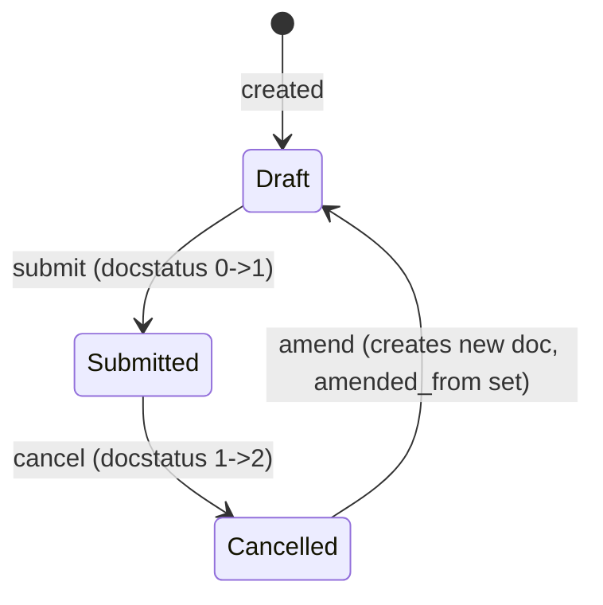

# Appraisal

**Source:** `hrms/hr/doctype/appraisal/appraisal.json`, `appraisal.py`, `appraisal.js`
**Submittable:** yes ([[Submittable Document Lifecycle]])   **Tree:** no   **Naming:** `naming_series:` ([[Naming and Autoname Rules]]) — series `HR-APR-.YYYY.-` (e.g. `HR-APR-2026-00001`)
**Module:** HR

## Schema

Tabs/Sections are noted as comments; layout-only fields (Column Break/Section Break/Tab Break) are otherwise omitted from the table.

| Field (fieldname) | Label | Type | Options/Link Target | Required | Default | Read-Only | Notes |
|---|---|---|---|---|---|---|---|
| *(Tab: Overview)* | | | | | | | |
| naming_series | Series | Select | `HR-APR-.YYYY.-` | yes | — | — | `set_only_once` |
| employee | Employee | Link | [[Employee Core Model]] | yes | — | — | in_global_search, in_standard_filter, search_index |
| employee_name | Employee Name | Data | — | no | — | yes | fetch_from `employee.employee_name` |
| department | Department | Link | Department | no | — | yes | fetch_from `employee.department` |
| company | Company | Link | Company | yes | — | — | remember_last_selected_value |
| designation | Designation | Link | Designation | no | — | yes | fetch_from `employee.designation` |
| appraisal_cycle | Appraisal Cycle | Link | [[Appraisal Cycle]] | yes | — | — | in_list_view, in_standard_filter |
| start_date | Start Date | Date | — | no | — | yes | not fetched via `fetch_from` in JSON; set programmatically (see Port Notes) |
| end_date | End Date | Date | — | no | — | yes | same as above |
| employee_image | Employee Image | Attach Image | — | no | — | — | hidden, fetch_from `employee.image`, `allow_on_submit` |
| *(Tab: KRAs)* | | | | | | | |
| appraisal_template | Appraisal Template | Link | [[Appraisal Template]] | conditionally | — | — | `mandatory_depends_on: eval:!doc.__islocal` (required once the doc has been saved once); in_standard_filter |
| rate_goals_manually | Rate Goals Manually | Check | — | no | 0 | yes (UI read-only; set only by server logic) | Governs whether `appraisal_kra` (auto) or `goals` (manual) table is used |
| appraisal_kra | KRA vs Goals | Table (Appraisal KRA) | [[Appraisal KRA]] | no | — | — | `depends_on: eval: !doc.rate_goals_manually` |
| goal_score_percentage | Goal Score (%) | Float | — | no | — | yes | `depends_on: eval: !doc.rate_goals_manually`; sum of all `appraisal_kra.goal_score` |
| goals | Goals | Table (Appraisal Goal) | [[Appraisal Goal]] | no | — | — | `depends_on: rate_goals_manually` |
| remarks | Remarks | Text | — | no | — | — | `depends_on: rate_goals_manually`; free text notes |
| total_score | Total Goal Score | Float | — | no | — | yes | in_list_view, no_copy; computed |
| *(Tab: Feedback)* | | | | | | | |
| feedback_html | Feedback HTML | HTML | — | no | — | — | client-rendered feedback history widget (see Port Notes) |
| avg_feedback_score | Average Feedback Score | Float | — | no | — | yes | hidden; computed average of submitted `Employee Performance Feedback.total_score` |
| *(Tab: Self Appraisal)* | | | | | | | |
| self_ratings | (no label) | Table (Employee Feedback Rating) | [[Employee Feedback Rating]] | no | — | — | rating criteria + self rating |
| self_score | Total Self Score | Float | — | no | — | yes | computed |
| reflections | (no label) | Text Editor | — | no | — | — | free-form self-reflection notes |
| final_score | Final Score | Float | — | no | — | yes | `depends_on: appraisal_cycle`; in_list_view; "Average of Goal Score, Feedback Score, and Self Appraisal Score" (or custom formula) |
| amended_from | Amended From | Link | [[Appraisal]] | no | — | yes | no_copy, print_hide — standard Frappe amendment link |

## Child Tables

- `appraisal_kra` → **Appraisal KRA** — see below (full schema documented in this file per spec instructions since it's simple/module-scoped).
- `goals` → **Appraisal Goal** — see below.
- `self_ratings` → **Employee Feedback Rating** — see below.

### Appraisal KRA (child of Appraisal.appraisal_kra)

**Source:** `hrms/hr/doctype/appraisal_kra/appraisal_kra.json`, `appraisal_kra.py`
**Naming:** `hash` (random). **Permissions:** empty array — governed by parent (Appraisal).

| Field (fieldname) | Label | Type | Options | Required | Default | Read-Only | Notes |
|---|---|---|---|---|---|---|---|
| kra | KRA | Link | KRA | yes | — | — | Key Result Area; columns=2, width 200px |
| per_weightage | Weightage (%) | Percent | — | yes | — | — | non_negative |
| goal_completion | Goal Completion (%) | Percent | — | no | — | yes | precision 2; average `Goal.progress` for goals tagged to this KRA |
| goal_score | Goal Score (weighted) | Float | — | no | — | yes | precision 2; `goal_completion * per_weightage / 100` |

Controller (`AppraisalKRA(Document)`) has no methods beyond the auto-generated type stub — `pass`.

### Appraisal Goal (child of Appraisal.goals — "manual rating" mode)

**Source:** `hrms/hr/doctype/appraisal_goal/appraisal_goal.json`, `appraisal_goal.py`
**Naming:** `hash` (random). **Permissions:** empty array — governed by parent (Appraisal).

| Field (fieldname) | Label | Type | Options | Required | Default | Read-Only | Notes |
|---|---|---|---|---|---|---|---|
| kra | Goal | Small Text | — | yes | — | — | label is "Goal" though fieldname/description say "Key Responsibility Area"; width 240px |
| per_weightage | Weightage (%) | Float | — | yes | — | — | non_negative |
| score | Score | Float | — | no | — | — | non_negative, no_copy; client caps entry at 5 stars (see Port Notes — client-only cap of 5, server caps against `number_of_stars` from the `score` field's rating options, see Business Logic) |
| score_earned | Score Earned | Float | — | no | — | yes | no_copy; `score * per_weightage / 100` |

Controller has no methods beyond the type stub — `pass`.

**Client-side logic (appraisal.js) — must be replicated server-side too:**
- On `score` change: if `score > 5`, `frappe.msgprint` a warning and reset `score` to 0 (client-only guard — a UI nicety, not authoritative; the real cap in the server controller is `number_of_stars`, see below).
- On `score` or `per_weightage` change (or on row removal): recompute `score_earned = score * per_weightage / 100` and re-sum `total_score` across all `goals` rows on the client (a client-side preview mirrored by the server `calculate_total_score` method, run again authoritatively on save).

### Employee Feedback Rating (child of Appraisal.self_ratings)

See `Employee Feedback Rating.md` for full schema (shared with `Employee Performance Feedback.feedback_ratings` and `Appraisal Template.rating_criteria`). Summary: `criteria` (Link, Employee Feedback Criteria, reqd), `per_weightage` (Percent, reqd), `rating` (Rating; hidden via `depends_on: eval: doc.parenttype != "Appraisal Template"` — the Rating field is not shown/used when this child row belongs to a template, since a template only defines criteria+weightage, not an actual rating value).

## State Machine



Plain list:
- (none, Draft) -> `insert` -> Draft (docstatus=0)
- (Draft, `submit`) -> Submitted (docstatus=1). No custom `before_submit`/`on_submit` hook is defined on Appraisal itself (all business logic runs in `validate`, which fires on every save including submit).
- (Submitted, `cancel`) -> Cancelled (docstatus=2). No custom `on_cancel` hook defined.
- (Cancelled, `amend`) -> new Draft document with `amended_from` set to the cancelled doc's name (standard Frappe amendment).

There is no explicit `status`/`workflow_state` field on Appraisal — state is purely the standard Frappe `docstatus` (0/1/2), reflected as Draft/Submitted/Cancelled in the UI.

## Validation Rules (exact, in execution order)

All rules run inside `validate()`, in this order:

1. `set_kra_evaluation_method()`: IF `self.is_new()` AND `appraisal_cycle` is set AND `Appraisal Cycle.kra_evaluation_method == "Manual Rating"` THEN set `rate_goals_manually = 1`. (No error — a default assignment, only on new/unsaved docs.)
2. `validate_active_employee(self.employee)`: IF the linked Employee's `status == "Inactive"` THEN throw `"Transactions cannot be created for an Inactive Employee {0}."` (formatted with a link to the Employee) — raises `InactiveEmployeeStatusError` (source: `hrms/hr/utils.py:validate_active_employee`).
3. `validate_active_appraisal_cycle(self.appraisal_cycle)`: IF `Appraisal Cycle.status == "Completed"` THEN throw `"Cannot create or change transactions against an Appraisal Cycle with status {0}."` (with "Completed" bolded) plus a second line `"Set the status to {0} if required."` (with "In Progress" bolded) — title "Not Allowed" (source: `appraisal_cycle.py:validate_active_appraisal_cycle`).
4. `validate_duplicate()`: query all non-cancelled (`docstatus != 2`) Appraisal rows for the same `employee`, excluding this doc, where EITHER `appraisal_cycle` matches OR the date ranges overlap (any of: this doc's `[start_date, end_date]` overlapping the other doc's `start_date`/`end_date`, computed via SQL `BETWEEN` both ways). IF any such row exists THEN throw `"Appraisal {0} already exists for Employee {1} for this Appraisal Cycle or overlapping period"` (0 = link to the duplicate Appraisal, 1 = bolded employee_name) — `exc=frappe.DuplicateEntryError`, title "Duplicate Entry".
5. `validate_total_weightage("appraisal_kra", "KRAs")` (from `AppraisalMixin`): IF the `appraisal_kra` table is non-empty AND `sum(per_weightage)` rounded to 2 decimals `!= 100.0` THEN throw `"Total weightage for all {0} must add up to 100. Currently, it is {1}%"` (0 = bolded "KRAs", 1 = the actual total) — title "Incorrect Weightage Allocation". (Skipped entirely if the table is empty — no forced non-empty check here.)
6. `validate_total_weightage("self_ratings", "Self Ratings")`: same rule as #5, applied to `self_ratings`, label "Self Ratings".
7. `set_goal_score()` → for each row in `appraisal_kra`: recompute `goal_completion` (avg progress of matching `Goal` records) and `goal_score` (`goal_completion * per_weightage / 100`), then calls `calculate_total_score()`:
   - IF `rate_goals_manually`: for each row in `goals`, IF `flt(score) > number_of_stars` (the max option value of the `Appraisal Goal.score` Select/Rating options, default 5) THEN throw `"Row {0}: Goal Score cannot be greater than {1}"` (0 = row idx, 1 = number_of_stars). Otherwise accumulate `score_earned` and `total_weightage`.
   - ELSE (automated KRA mode): accumulate `goal_score_percentage` and `total_weightage` from `appraisal_kra` rows; `total = goal_score_percentage / 20` (converts a 0–100% scale to a 0–5 scale).
   - IF `total_weightage` is truthy (non-zero) AND `flt(total_weightage, 2) != 100.0` THEN throw `"Total weightage for all {0} must add up to 100. Currently, it is {1}%"` (0 = "Goals" or "KRAs" depending on mode) — title "Incorrect Weightage Allocation". (This duplicates rule #5's intent but is evaluated again here against whichever table is active, and is NOT skipped when the table is empty in this second pass — actually `total_weightage` would be falsy (0) when empty, so the check only fires when there is at least one row and the sum isn't 100.)
   - Sets `self.total_score = flt(total, precision)`.
8. `calculate_self_appraisal_score()`: for each row in `self_ratings`, accumulate `rating * number_of_stars * (per_weightage / 100)` where `number_of_stars` = max option of `Employee Feedback Rating.rating` field (default 5). Sets `self.self_score`.
9. `calculate_avg_feedback_score()`: recomputes `avg_feedback_score` as the SQL average of `total_score` across all submitted (`docstatus=1`) `Employee Performance Feedback` rows where `employee = self.employee` and `appraisal = self.name`.
10. `calculate_final_score()`: see Business Logic below. No error thrown here — always computes and sets `final_score`.

## Business Logic / Calculations

### Total (Goal) Score — `calculate_total_score()`
```
total_weightage = 0
total = 0
goal_score_percentage = 0
number_of_stars = max option of "Appraisal Goal.score" field (default 5)

IF rate_goals_manually:
    FOR each row in goals:
        IF flt(row.score) > number_of_stars:
            THROW "Row {idx}: Goal Score cannot be greater than {number_of_stars}"
        row.score_earned = flt(row.score) * flt(row.per_weightage) / 100
        total += row.score_earned
        total_weightage += row.per_weightage
    table_label = "Goals"
ELSE:
    FOR each row in appraisal_kra:
        goal_score_percentage += row.goal_score
        total_weightage += row.per_weightage
    self.goal_score_percentage = round(goal_score_percentage, precision("goal_score_percentage"))
    total = goal_score_percentage / 20   # normalizes 0-100 percentage to a 0-5 scale
    table_label = "KRAs"

IF total_weightage != 0 AND round(total_weightage, 2) != 100.0:
    THROW "Total weightage for all {table_label} must add up to 100. Currently, it is {total_weightage}%"

self.total_score = round(total, precision("total_score"))
```

### Self Appraisal Score — `calculate_self_appraisal_score()`
```
total = 0
number_of_stars = max option of "Employee Feedback Rating.rating" field (default 5)
FOR each row in self_ratings:
    score = flt(row.rating) * number_of_stars * (row.per_weightage / 100)
    total += score
self.self_score = round(total, precision("self_score"))
```
Note: `row.rating` is itself already on a 0–number_of_stars scale (Rating fieldtype stores a fraction 0..1 internally in Frappe, exposed as stars); multiplying by `number_of_stars` again converts it back to a "stars earned"-style score before weighting. Reproduce the exact same order of operations: `rating * stars * (weightage/100)`.

### Average Feedback Score — `calculate_avg_feedback_score(update=False)`
```
avg_feedback_score = SQL AVG(total_score) FROM `Employee Performance Feedback`
                      WHERE employee = self.employee AND appraisal = self.name AND docstatus = 1
self.avg_feedback_score = round(avg_feedback_score, precision("avg_feedback_score"))
IF update:
    calculate_final_score()
    db_update()   # direct DB write, bypasses full save/validate cycle
```
This method is called both from `validate()` (recompute on every save) and externally with `update=True` by `Employee Performance Feedback.on_submit`/`on_cancel` (see Lifecycle Hooks), in which case it also recalculates the final score and persists via `db_update()` (a lower-level write that skips `validate`/triggers).

### Final Score — `calculate_final_score()`
```
appraisal_cycle_doc = get "Appraisal Cycle" doc for self.appraisal_cycle
formula = appraisal_cycle_doc.final_score_formula
based_on_formula = appraisal_cycle_doc.calculate_final_score_based_on_formula

IF based_on_formula:
    employee_doc = get "Employee" doc for self.employee
    data = {
        goal_score: flt(self.total_score),
        average_feedback_score: flt(self.avg_feedback_score),
        self_appraisal_score: flt(self.self_score),
    }
    data.update(appraisal_cycle_doc fields)
    data.update(employee_doc fields)
    data.update(self fields)              # self (Appraisal) fields override same-named keys above
    sanitized_formula = sanitize_expression(formula)   # strips leading/trailing whitespace, joins multi-line into one line
    final_score = safe_eval(sanitized_formula, data)   # sandboxed expression evaluator, not full Python eval
ELSE:
    final_score = (flt(self.total_score) + flt(self.avg_feedback_score) + flt(self.self_score)) / 3

self.final_score = round(final_score, precision("final_score"))
```
Port notes for the formula path: the formula is an arbitrary Python-like boolean/arithmetic expression string (field `Appraisal Cycle.final_score_formula`, type Code/PythonExpression) evaluated against a merged namespace of: the three computed scores (`goal_score`, `average_feedback_score`, `self_appraisal_score`), all Appraisal Cycle fields, all Employee fields, then all Appraisal fields (in that override order — Appraisal fields win on name clashes). `sanitize_expression` only strips whitespace/newlines; it does not validate the expression is safe — `frappe.safe_eval` is Frappe's restricted evaluator (no imports, no builtins beyond an allowlist). A ported implementation needs an equivalent sandboxed expression evaluator or must restrict this feature to a fixed set of supported operations.

### Goal Score propagation — `set_goal_score(update=False)`
```
FOR each row in appraisal_kra:
    avg_goal_completion = SQL AVG(Goal.progress)
        WHERE Goal.kra = row.kra
          AND Goal.employee = self.employee
          AND Goal.status != "Archived"
          AND (Goal.parent_goal = "" OR Goal.parent_goal IS NULL)   # only top-level (non-child) goals count
          AND Goal.appraisal_cycle = self.appraisal_cycle
    row.goal_completion = round(avg_goal_completion, precision)
    row.goal_score = round(row.goal_completion * row.per_weightage / 100, precision)
    IF update: row.db_update()     # persist this child row directly

calculate_total_score()
IF update:
    calculate_final_score()
    db_update()
RETURN self
```
Called from `validate()` (without `update`) and externally by `Goal.update_goal_progress_in_appraisal()` and `Employee Performance Feedback` flows with `update=True` to push a live recalculation into an already-saved Appraisal whenever a related Goal's progress changes.

## Lifecycle Hooks (exact)

| Event | What Runs | Side Effects on Other Doctypes |
|---|---|---|
| validate | See Validation Rules above (steps 1–10) | Reads `Employee`, `Appraisal Cycle`, `Goal`; writes nothing to other doctypes here (goal_score computed in-memory unless `update=True` path is used) |
| on_submit | *(none defined — `hrms/hooks.py` wires a separate telemetry hook `hrms.telemetry.on_appraisal_submit`, analytics-only, out of scope for the port — see Port Notes)* | telemetry only |
| on_cancel | *(none defined on this doctype)* | — |

Cross-doctype triggers into Appraisal ([[Cross-Doctype Hooks (doc_events)]], defined on the *other* doctype, but affecting Appraisal state):
- `Goal.on_update` / `Goal.after_delete` → `update_goal_progress_in_appraisal()` → looks up the matching Appraisal by `(employee, appraisal_cycle)` and calls `appraisal.set_goal_score(update=True)`.
- `Employee Performance Feedback.on_submit` / `on_cancel` → `update_avg_feedback_score_in_appraisal()` → `appraisal.calculate_avg_feedback_score(update=True)`.

## Whitelisted / API Methods

| Method name | HTTP-equivalent purpose | Args | Returns | What it does |
|---|---|---|---|---|
| `set_appraisal_template` (instance method) | Populate template from cycle's Appraisee row | none (uses `self`) | none (mutates & returns nothing explicit) | Looks up `Appraisee.appraisal_template` for `(employee=self.employee, parent=self.appraisal_cycle)`; if found, sets `self.appraisal_template` and calls `set_kras_and_rating_criteria()`. |
| `set_kras_and_rating_criteria` (instance method) | Load KRA/goal/rating rows from the chosen template | none | `self` (the doc, with tables populated) | Clears `appraisal_kra`, `self_ratings`, `goals`. Loads `Appraisal Template` doc named by `self.appraisal_template`. For each `template.goals` row: appends to `goals` (if `rate_goals_manually`) or `appraisal_kra` (otherwise) with `kra=entry.key_result_area, per_weightage=entry.per_weightage`. For each `template.rating_criteria` row: appends to `self_ratings` with `criteria=entry.criteria, per_weightage=entry.per_weightage`. No-op if `appraisal_template` is not set. |
| `add_feedback` (instance method) | Programmatically create+submit a performance feedback for this appraisal | `feedback: str`, `feedback_ratings: list[{criteria, rating, per_weightage}]` | the submitted `Employee Performance Feedback` Document | Builds a new `Employee Performance Feedback` doc (`appraisal=self.name`, `employee=self.employee`, `added_on=now()`, `reviewer` = the Employee record for the current session user), appends each rating row, then calls `.submit()` on it (which triggers that doctype's own validate/on_submit, including updating this Appraisal's `avg_feedback_score`). |
| `get_feedback_history(employee, appraisal)` (module-level) | Fetch feedback list + rating-distribution stats for the feedback-history widget | `employee: str`, `appraisal: str` | `{feedback_history: [...], reviews_per_rating: [pct,...] (5 buckets, ratings 1..5), avg_feedback_score: float}` | Requires read permission on the target Appraisal (`frappe.has_permission(..., throw=True)`). Lists submitted feedback docs (fields: feedback, reviewer, user, owner, reviewer_name, reviewer_designation, added_on, employee, total_score, name), ordered by `added_on desc`. Computes, for each rating bucket 1..5, `round(count_in_bucket / total_count * 100, 0)` where a bucket is `total_score BETWEEN i AND i+0.99`; 0 for all buckets if `feedback_count` is 0 (division-by-zero guard). Also returns the Appraisal's stored `avg_feedback_score`. |
| `get_kras_for_employee(doctype, txt, searchfield, start, page_len, filters)` (module-level, `@frappe.validate_and_sanitize_search_inputs`) | Link-field query (autocomplete) source for the `Goal.kra` field | standard Frappe search-query args; `filters: {appraisal_cycle, employee}` | list of `(kra,)` tuples | Finds the Appraisal for `(appraisal_cycle, employee)`, then returns distinct `Appraisal KRA.kra` values (LIKE `txt%`) whose `parent` is that Appraisal — i.e. an employee can only select a KRA on their Goal that's already part of their own Appraisal's KRA table. |

## Permissions ([[Permission Model (RBAC)]])

| Role | Read | Write | Create | Delete | Submit | Cancel | Amend | Report | Export | Notes |
|---|---|---|---|---|---|---|---|---|---|---|
| Employee | 1 | 1 | 1 | 0 | 0 | 0 | 0 | 1 | 0 | print, email, share also 1 |
| System Manager | 1 | 1 | 1 | 1 | 1 | 1 | 1 | 1 | 0 | print, email, share also 1 |
| HR User | 1 | 1 | 1 | 1 | 1 | 1 | 1 | 1 | 0 | print, email, share also 1 |
| HR Manager | 1 | 1 | 1 | 1 | 1 | 0 (not listed) | 0 (not listed) | 1 | 1 | print, email, share also 1; note: `amend`/`cancel` keys absent from this row in the JSON (only `submit` present) — HR Manager can submit but the JSON does not grant explicit cancel/amend (verify against target framework's default submit-implies-cancel/amend behavior; flagged in Port Notes) |

No `if_owner` or `permlevel` restrictions defined.

## Scheduled Jobs Touching This Doctype

None found in `hrms/hooks.py` `scheduler_events` referencing Appraisal directly.

## Related Doctypes

- [[Employee Core Model]] — `employee` link; the employee being appraised (also validated for Active status).
- [[Appraisal Cycle]] — `appraisal_cycle` link; the time-boxed cycle this Appraisal belongs to (also governs weightage-method immutability and the Completed-cycle guard).
- [[Appraisal Template]] — `appraisal_template` link; source of the KRA/goal and rating-criteria rows copied in via `set_kras_and_rating_criteria`.
- [[Appraisal KRA]] — `appraisal_kra` child table; auto-computed KRA scores (used in "Automated" mode).
- [[Appraisal Goal]] — `goals` child table; manually-rated goal/score lines (used in "Manual Rating" mode).
- [[Employee Feedback Rating]] — `self_ratings` child table; the employee's self-appraisal ratings against template criteria.
- [[Employee Feedback Criteria]] — indirectly, via each `self_ratings` row's `criteria` link.
- [[Appraisal]] — `amended_from` self-link; standard Frappe amendment chain.
- [[Goal]] — read (not a schema link) by `set_goal_score`/`get_kras_for_employee` to roll up goal progress into KRA scores.
- [[Employee Performance Feedback]] — read (not a schema link) by `calculate_avg_feedback_score`/`add_feedback`/`get_feedback_history`; peer feedback that feeds `avg_feedback_score`.

## Port Notes

- **Naming series**: `HR-APR-.YYYY.-` — Frappe auto-increments a per-year counter and formats as `HR-APR-<YYYY>-<n>`; a new stack must implement equivalent per-year sequence generation (e.g. a Postgres sequence keyed by year, or a counters table).
- **`track_changes: 1`** ([[Implicit Framework Behaviors]]): Frappe automatically keeps a version/audit history of every field change. A port must build an explicit audit-log table if this behavior is required.
- **`start_date`/`end_date`**: read-only, no `fetch_from` set in the JSON despite mirroring the Appraisal Cycle's dates — in practice these are populated at appraisal-creation time from the Appraisal Cycle (see `AppraisalCycle.create_appraisals_for_cycle`, which does not explicitly set them either — actual population of `start_date`/`end_date` on Appraisal was not found in the read source, only `appraisal_cycle.start_date/end_date` exist on the Cycle; **flagging as a gap**: no explicit code path sets `Appraisal.start_date`/`end_date` in the files reviewed. A re-implementer should treat these as either legacy fields, populated by a client-side script not covered here, or should default them from the linked cycle explicitly.).
- **`employee_image`**: `fetch_from: employee.image`, `allow_on_submit: 1` — Frappe auto-copies the Employee's image field whenever Employee is set/changed, and (unusually) allows this one field to still update after submission. The controller has UI code (`appraisal.js refresh`) that hides the "remove image" sidebar action so it can't be cleared by the user, but the field can still be refreshed by Employee data changing.
- **`feedback_html`**: pure UI. The client script loads a bundled `performance.bundle.js` widget (`hrms.PerformanceFeedback`) into this field's wrapper to render feedback history and a form to add new feedback (backed by `get_feedback_history` and `add_feedback` whitelisted methods). A port's UI must reproduce this as a normal component/panel — no server schema implication beyond the two API methods above.
- **Dashboard chart** (`appraisal.js setup_chart`): renders a bar chart of `appraisal_kra` per_weightage vs goal_score — a UI nicety only, not required data.
- **`calculate_total` client trigger** (appraisal.js on `Appraisal Goal` child rows): mirrors `calculate_total_score()` for immediate UI feedback; the authoritative computation still happens server-side in `validate()`.
- **Telemetry hooks** (`hrms/hooks.py`): `"Appraisal": {"on_submit": "hrms.telemetry.on_appraisal_submit"}` and `"Appraisal Cycle": {"after_insert": "hrms.telemetry.on_milestone_insert"}` exist purely for internal Frappe/HRMS product analytics — explicitly out of scope for behavioral porting per the assignment; noted here only for completeness.
- **`frappe.safe_eval`** used in `calculate_final_score`: a restricted expression evaluator (no arbitrary Python). A port must not use a raw `eval`/`exec` equivalent for `final_score_formula` — implement an equivalent sandboxed expression parser (e.g. an arithmetic/boolean expression grammar) to avoid remote code execution via a user-editable formula field.
- **`db_update()` calls** (in `calculate_avg_feedback_score(update=True)` and `set_goal_score(update=True)`): these bypass the full validate/save controller cycle and write directly to the row/table — a lower-level equivalent (e.g. a raw `UPDATE` statement scoped to specific columns) should be used in the port for the same call sites, rather than re-running full validation, to match behavior (and avoid infinite validation recursion between Appraisal and Goal).
- Precision for Float/Percent fields follows the target framework/site's configured default decimal precision unless a field explicitly sets `"precision"` (only `Appraisal KRA.goal_completion`/`goal_score` set `precision: "2"` explicitly in this doctype's related child tables). A port should pick and document one fixed precision (this codebase's site-wide default is commonly 2 or 3 decimal places for Float/Currency) for all other unspecified fields.
