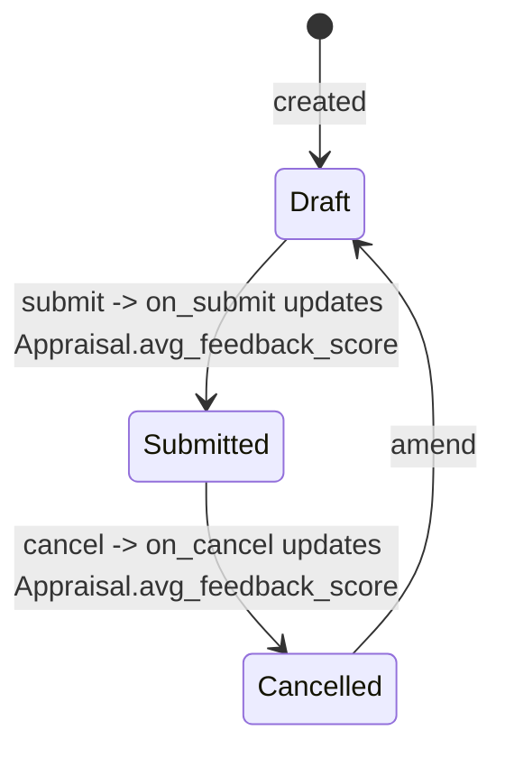

# Employee Performance Feedback

**Source:** `hrms/hr/doctype/employee_performance_feedback/employee_performance_feedback.json`, `employee_performance_feedback.py`, `employee_performance_feedback.js`
**Submittable:** yes ([[Submittable Document Lifecycle]])   **Tree:** no   **Naming:** `format:HR-PF-{YYYY}-{#####}` ([[Naming and Autoname Rules]]) (e.g. `HR-PF-2026-00001`)
**Module:** HR

A single reviewer's feedback on an employee for a specific Appraisal, rated against the Appraisal's template criteria. Submitting one contributes to the target Appraisal's `avg_feedback_score`.

## Schema

| Field (fieldname) | Label | Type | Options/Link Target | Required | Default | Read-Only | Notes |
|---|---|---|---|---|---|---|---|
| *(Tab: Employee Details)* | | | | | | | |
| employee | For Employee | Link | [[Employee Core Model]] | yes | — | — | in_list_view, in_standard_filter — the employee being reviewed |
| employee_name | Employee Name | Data | — | no | — | yes | fetch_from `employee.employee_name` |
| department | Department | Link | Department | no | — | yes | fetch_from `employee.department` |
| designation | Designation | Link | Designation | no | — | yes | fetch_from `employee.designation` |
| company | Company | Link | Company | yes | — | yes | fetch_from `employee.company` |
| reviewer | Reviewer | Link | [[Employee Core Model]] | yes | — | — | `ignore_user_permissions: 1`; in_standard_filter — the employee giving feedback |
| reviewer_name | Reviewer Name | Data | — | no | — | yes | fetch_from `reviewer.employee_name`; in_list_view |
| reviewer_designation | Designation | Link | Designation | no | — | yes | fetch_from `reviewer.designation` |
| user | User | Link | User | no | — | yes | fetch_from `reviewer.user_id` |
| added_on | Added On | Datetime | — | yes | `Now` | — | timestamp of when feedback was given |
| appraisal_cycle | Appraisal Cycle | Link | [[Appraisal Cycle]] | no | — | yes | fetch_from `appraisal.appraisal_cycle`; in_list_view, in_standard_filter |
| appraisal | Appraisal | Link | [[Appraisal]] | yes | — | — | the target Appraisal being reviewed |
| feedback_ratings | Feedback Ratings | Table (Employee Feedback Rating) | [[Employee Feedback Rating]] | no | — | — | |
| total_score | Total Score | Float | — | no | — | yes | in_list_view; computed |
| *(Tab: Feedback)* | | | | | | | |
| feedback | (no label) | Text Editor | — | yes | — | — | free-form written feedback |
| amended_from | Amended From | Link | [[Employee Performance Feedback]] | no | — | yes | no_copy, print_hide |

## Child Tables

- `feedback_ratings` → **Employee Feedback Rating** — see `Employee Feedback Rating.md` (this agent's scope); same shared child doctype as `Appraisal.self_ratings` and `Appraisal Template.rating_criteria`. Here, `rating` is populated (its `depends_on` only hides it when the parent is an `Appraisal Template`).

## State Machine



Plain list:
- (none, insert) -> Draft (docstatus 0).
- (Draft, submit) -> Submitted (docstatus 1); triggers `on_submit` → `update_avg_feedback_score_in_appraisal()`.
- (Submitted, cancel) -> Cancelled (docstatus 2); triggers `on_cancel` → `update_avg_feedback_score_in_appraisal()` (same recompute — since the Appraisal's average query filters `docstatus=1`, cancelling this feedback naturally removes it from the average once recomputed).
- (Cancelled, amend) -> new Draft with `amended_from` set.

No custom `status` field — plain `docstatus`-driven states.

## Validation Rules (exact, in execution order)

Runs inside `validate()`:

1. `validate_active_appraisal_cycle(self.appraisal_cycle)`: IF the linked cycle's `status == "Completed"` THEN throw `"Cannot create or change transactions against an Appraisal Cycle with status {0}."` (0 = bolded "Completed") + `"Set the status to {0} if required."` (0 = bolded "In Progress") — title "Not Allowed". (Note: since `appraisal_cycle` is itself a read-only `fetch_from` field sourced from `appraisal.appraisal_cycle`, this check is effectively gated by whichever Appraisal is chosen.)
2. `validate_employee()`:
   a. IF `self.employee == self.reviewer` THEN throw `"Employees cannot give feedback to themselves. Use {0} instead: {1}"` (0 = bolded "Self Appraisal", 1 = a link to the target Appraisal document).
   b. `validate_active_employee(self.employee)`: IF Employee status is Inactive THEN throw `"Transactions cannot be created for an Inactive Employee {0}."`.
   c. `validate_active_employee(self.reviewer)`: same check applied to the reviewer.
3. `validate_appraisal()`: look up the target Appraisal's `employee`. IF it does not equal `self.employee` THEN throw `"Appraisal {0} does not belong to Employee {1}"` (0 = appraisal name, 1 = employee).
4. `validate_total_weightage("feedback_ratings", "Feedback Ratings")` (from `AppraisalMixin`): IF `feedback_ratings` is non-empty AND `sum(per_weightage)` rounded to 2 decimals `!= 100.0` THEN throw `"Total weightage for all {0} must add up to 100. Currently, it is {1}%"` (0 = bolded "Feedback Ratings", 1 = actual total) — title "Incorrect Weightage Allocation".
5. `set_total_score()`: computes `self.total_score` (see Business Logic). No error thrown.

## Business Logic / Calculations

### Total Score — `set_total_score()`
```
total = 0
FOR each row in feedback_ratings:
    score = flt(row.rating) * 5 * (row.per_weightage / 100)
    total += score
self.total_score = round(total, precision("total_score"))
```
Note: unlike `Appraisal.calculate_self_appraisal_score()` (which looks up `number_of_stars` dynamically from the `Employee Feedback Rating.rating` field's max option), this method hardcodes the multiplier `5` rather than reading it from field metadata. Reproduce this literal `5`, not a dynamically-derived star count, for exact parity — this is a latent inconsistency in the source worth flagging (see Port Notes) but the port should match current behavior exactly.

### Appraisal sync — `update_avg_feedback_score_in_appraisal()`
```
IF not self.appraisal: RETURN
LOAD appraisal = Appraisal(self.appraisal)
appraisal.calculate_avg_feedback_score(update=True)
```
Called from both `on_submit` and `on_cancel` — see `Appraisal.md` → `calculate_avg_feedback_score` for the averaging formula (SQL `AVG(total_score)` over all `docstatus=1` feedback rows for that employee+appraisal, followed by `calculate_final_score()` and a direct `db_update()`).

## Lifecycle Hooks (exact) ([[Cross-Doctype Hooks (doc_events)]])

| Event | What Runs | Side Effects on Other Doctypes |
|---|---|---|
| validate | see Validation Rules 1–5 | reads `Appraisal Cycle`, `Employee` (x2), `Appraisal` |
| on_submit | `update_avg_feedback_score_in_appraisal()` | writes `Appraisal.avg_feedback_score` and `Appraisal.final_score` (via `db_update`) |
| on_cancel | `update_avg_feedback_score_in_appraisal()` | same as on_submit — recomputes the average now excluding this cancelled record |

## Whitelisted / API Methods

| Method name | HTTP-equivalent purpose | Args | Returns | What it does |
|---|---|---|---|---|
| `set_feedback_criteria` (instance) | Load rating criteria from the target Appraisal's template | none | `self` | No-op if `self.appraisal` is unset. Otherwise looks up `Appraisal.appraisal_template` for `self.appraisal`, loads that `Appraisal Template` doc, clears `feedback_ratings`, and appends one row per `template.rating_criteria` entry with `criteria` and `per_weightage` (rating left blank for the reviewer to fill in). |

(Also, `Appraisal.add_feedback()` and `Appraisal.get_feedback_history()` — documented in `Appraisal.md` — construct/query this doctype from the Appraisal side.)

## Permissions ([[Permission Model (RBAC)]])

| Role | Read | Write | Create | Delete | Submit | Cancel | Amend | Report | Export | Notes |
|---|---|---|---|---|---|---|---|---|---|---|
| System Manager | 1 | 1 | 1 | 1 | 1 | 1 | 1 | 1 | 1 | print, email, share also 1 |
| Employee | 1 | 1 | 1 | 0 | 1 | 1 | 0 (not listed) | 1 | 1 | print, email, share also 1; can create/submit/cancel/write but not delete or amend |
| HR Manager | 1 | 1 | 1 | 0 | 1 | 1 | 0 (not listed) | 1 | 1 | print, email, share also 1 |
| HR User | 1 | 0 | 0 | 0 | 0 | 0 | 0 | 1 | 1 | read-only; print, email, share also 1 |

## Scheduled Jobs Touching This Doctype

None found in `hrms/hooks.py` `scheduler_events`.

## Related Doctypes

- [[Employee Core Model]] — `employee` (the reviewee) and `reviewer` links (also validated for Active status).
- [[Appraisal Cycle]] — `appraisal_cycle` fetched link; also governs the Completed-cycle guard.
- [[Appraisal]] — `appraisal` link; the target being reviewed. Submitting/cancelling this doc recomputes that Appraisal's `avg_feedback_score`/`final_score`.
- [[Employee Feedback Rating]] — `feedback_ratings` child table.
- [[Employee Performance Feedback]] — `amended_from` self-link; standard Frappe amendment chain.

## Port Notes

- **`added_on` default `"Now"`**: Frappe's `default: "Now"` sentinel auto-populates the current datetime at document creation if left blank — a port should apply the same "if not provided, default to current server timestamp" rule at the application/DB layer.
- **`ignore_user_permissions: 1`** on `reviewer` ([[Implicit Framework Behaviors]]): bypasses Frappe's row-level "User Permission" restriction feature specifically for this field (so a reviewer restricted from seeing certain Employee records via a User Permission rule can still be selected here). If the target stack has an equivalent row-level access feature on the Employee-like entity, replicate this bypass for the reviewer-selection field specifically.
- **Hardcoded `5` multiplier in `set_total_score`** vs. the dynamic `number_of_stars` lookup used in `Appraisal.calculate_self_appraisal_score()` for the conceptually identical calculation: this is an inconsistency already present in the source (if the `Employee Feedback Rating.rating` field's max-star option were ever changed from 5, this doctype's math would silently diverge from the Appraisal's self-score math). Port both call sites exactly as they exist today (do not "fix" the inconsistency) unless the user explicitly asks for a corrected/unified formula.
- **Naming = `format:HR-PF-{YYYY}-{#####}`**: same per-year auto-incrementing sequence concern as `Appraisal`'s naming series — needs an equivalent generator in the target stack.
- **`track_changes` is NOT set** on this doctype (absent from the JSON, unlike `Appraisal`/`Appraisal Cycle`/`Goal`) — no automatic audit trail is expected here; a port need not add field-level history logging for this table specifically.
