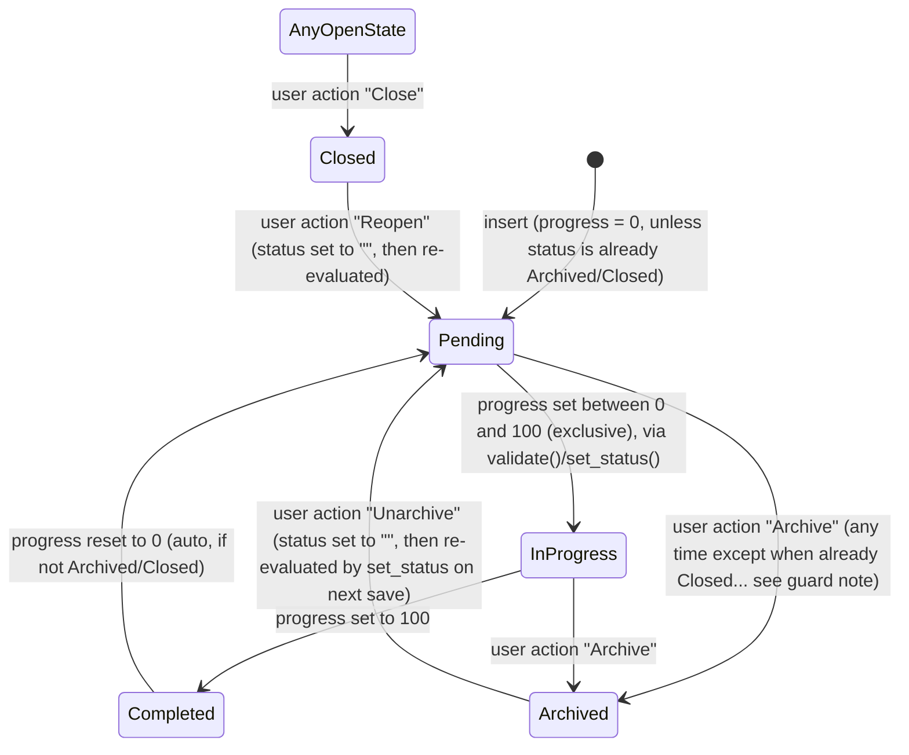

# Goal

**Source:** `hrms/hr/doctype/goal/goal.json`, `goal.py`, `goal.js`, `goal_tree.js`, `goal_list.js`
**Submittable:** no   **Tree:** yes (nested set / adjacency via `parent_goal`, `lft`/`rgt`)   **Naming:** `format:HR-GOAL-{YYYY}-{####}` ([[Naming and Autoname Rules]]) (e.g. `HR-GOAL-2026-0001`)
**Module:** HR

An employee's individual goal, optionally nested under a parent "group" goal, optionally tagged to an `Appraisal Cycle` + `KRA` to feed the automated KRA scoring in `Appraisal`.

## Schema

| Field (fieldname) | Label | Type | Options/Link Target | Required | Default | Read-Only | Notes |
|---|---|---|---|---|---|---|---|
| goal_name | Goal | Data | — | yes | — | — | in_list_view |
| is_group | Is Group | Check | — | no | 0 | — | `set_only_once`; in_list_view; marks this Goal as a parent/container for child goals |
| parent_goal | Parent Goal | Link | [[Goal]] | no | — | — | `depends_on: employee`; nested-set parent field (`nsm_parent_field`) |
| progress | Progress | Percent | — | no | — | conditionally | `read_only_depends_on: eval:doc.is_group || doc.status=='Closed'` — a group goal's progress is always auto-computed from children; a Closed goal can no longer have its progress edited |
| status | Status | Select | ``\|`Pending`\|`In Progress`\|`Completed`\|`Archived`\|`Closed` | no | `Pending` | yes | in_list_view, in_standard_filter; set only via code (`set_status()` or the explicit archive/close/reopen/unarchive actions), not directly editable in the form |
| employee | Employee | Link | [[Employee Core Model]] | yes | — | — | `set_only_once`; in_preview, in_standard_filter |
| employee_name | Employee Name | Data | — | no | — | yes | fetch_from `employee.employee_name`; in_list_view, in_preview |
| company | Company | Link | Company | no | — | yes | fetch_from `employee.company` |
| user | User | Data | — | no | — | yes | fetch_from `employee.user_id` |
| start_date | Start Date | Date | — | yes | — | — | `depends_on: employee`; fetch_from `appraisal_cycle.start_date`, `fetch_if_empty: 1` (only auto-fills if blank, doesn't overwrite a manually-set value); in_standard_filter |
| end_date | End Date | Date | — | no | — | — | `depends_on: employee`; fetch_from `appraisal_cycle.end_date`, `fetch_if_empty: 1`; in_list_view, in_standard_filter |
| appraisal_cycle | Appraisal Cycle | Link | [[Appraisal Cycle]] | no | — | conditionally | `depends_on: employee`; fetch_from `parent_goal.appraisal_cycle`; `set_only_once`; `read_only_depends_on: eval: doc.parent_goal` (locked to the parent's cycle once a parent is chosen); in_standard_filter |
| kra | KRA | Link | KRA | conditionally | — | conditionally | `depends_on: employee`; fetch_from `parent_goal.kra`; `mandatory_depends_on: eval: !doc.parent_goal && doc.appraisal_cycle` (required for a top-level goal that has an appraisal cycle, optional otherwise); `read_only_depends_on: eval: doc.parent_goal` |
| description | Description | Text Editor | — | no | — | — | inside collapsible "Description" section |
| lft | Left | Int | — | no | — | yes | hidden; nested-set left boundary, no_copy |
| rgt | Right | Int | — | no | — | yes | hidden; nested-set right boundary, no_copy |
| old_parent | Old Parent | Link | [[Goal]] | no | — | — | hidden; used internally by the nested-set library during re-parenting |

## Child Tables

None.

## State Machine

`status` values: `""` (blank/unset — only ever transient), `Pending`, `In Progress`, `Completed`, `Archived`, `Closed`.



Plain list (guard conditions from `set_status()`):
- (any, `validate()` runs on every save) -> IF `status` is already `Archived` or `Closed` THEN **no automatic status recalculation occurs** — these are terminal/manual states that survive progress changes.
- (not Archived/Closed, progress == 0) -> `Pending`
- (not Archived/Closed, progress == 100) -> `Completed`
- (not Archived/Closed, 0 < progress < 100) -> `In Progress`
- (`before_insert`) -> IF `is_group` THEN force `progress = 0` (overrides any submitted progress value for group goals at creation time only).
- UI-only transitions (client script buttons in `goal.js`/`goal_list.js`, calling `frm.set_value("status", X); frm.save()` or the `update_status` whitelisted method): Archive -> sets status "Archived" directly (bypasses `set_status()`'s normal recompute since it's set after validate would have run... actually since it's a plain field set + save, `validate()` runs again and `set_status()` sees status already "Archived" and returns without altering it — the guard clause makes this stick). Similarly Close -> "Closed". Unarchive/Reopen -> sets status back to `""`, so the next `validate()` recomputes it from `progress` per the rules above.
- List-view bulk status update (`goal_list.js` + `Goal.update_status` whitelisted method) restricts which current statuses are eligible targets for each new status:
  - -> Completed: only from Pending or In Progress (also forces `progress = 100` in the same call)
  - -> Archived: only from Pending, In Progress, or Closed
  - -> Closed: only from Pending, In Progress, or Archived
  - -> Unarchived (i.e. `status=""`): only from Archived
  - -> Reopened (i.e. `status=""`): only from Closed
  - Group goals (`is_group`) are always excluded from bulk status updates (client-side filter; not enforced again server-side in `update_status` itself — see Port Notes).

## Validation Rules (exact, in execution order)

Runs inside `validate()`:

1. IF `appraisal_cycle` is set THEN `validate_active_appraisal_cycle(appraisal_cycle)`: IF the cycle's `status == "Completed"` THEN throw `"Cannot create or change transactions against an Appraisal Cycle with status {0}."` (0 = bolded "Completed") + `"Set the status to {0} if required."` (0 = bolded "In Progress") — title "Not Allowed".
2. `validate_active_employee(self.employee)`: IF the Employee's `status == "Inactive"` THEN throw `"Transactions cannot be created for an Inactive Employee {0}."` — `InactiveEmployeeStatusError`.
3. `validate_parent_fields()`: IF `parent_goal` is not set THEN skip. ELSE fetch the parent Goal's `employee`, `kra`, `appraisal_cycle`. IF parent doesn't exist (rare/race condition) THEN skip. ELSE:
   a. IF `self.employee != parent.employee` THEN throw `"Goal should be owned by the same employee as its parent goal."` — title "Not Allowed".
   b. IF `self.kra != parent.kra` THEN throw `"Goal should be aligned with the same KRA as its parent goal."` — title "Not Allowed".
   c. IF `self.appraisal_cycle != parent.appraisal_cycle` THEN throw `"Goal should belong to the same Appraisal Cycle as its parent goal."` — title "Not Allowed".
4. `validate_from_to_dates(self.start_date, self.end_date)` (Frappe framework built-in): IF `end_date < start_date` THEN throw the framework's standard date-order error.
5. `validate_progress()`: IF `flt(self.progress) > 100` THEN throw `"Goal progress percentage cannot be more than 100."`.
6. `set_status()`: see State Machine above (no error thrown; sets `self.status`).

`before_insert()` (separate hook, runs before `validate()` on insert): IF `is_group` THEN force `self.progress = 0`.

## Business Logic / Calculations

### Status derivation — `set_status()`
```
IF self.status in ["Archived", "Closed"]:
    RETURN   # terminal states are sticky; not recomputed from progress
IF flt(progress) == 0: status = "Pending"
ELIF flt(progress) == 100: status = "Completed"
ELIF flt(progress) < 100: status = "In Progress"   # i.e. any 0 < progress < 100
```

### Parent progress rollup — `update_parent_progress(old_parent=None)`
Runs from `on_update()` (after every save) and from `after_delete()`.
```
parent_goal = old_parent OR self.parent_goal
IF not parent_goal: RETURN

avg_goal_completion = AVG(Goal.progress)
    WHERE Goal.parent_goal = parent_goal
      AND Goal.employee = self.employee
      AND Goal.status != "Archived"

LOAD parent_goal_doc
parent_goal_doc.progress = round(avg_goal_completion, precision)
SAVE parent_goal_doc with ignore_permissions=True, ignore_mandatory=True
```
Note: saving the parent re-triggers the parent's own `validate()`/`on_update()` (including its own `update_parent_progress` if it too has a parent — recursive rollup up a goal tree) and its own `update_goal_progress_in_appraisal()`.

### KRA propagation to children — `update_kra_in_child_goals(doc_before_save)`
Runs from `on_update()`, only when there IS a `doc_before_save` (i.e. not on first insert).
```
IF doc_before_save.kra != self.kra AND self.is_group:
    UPDATE all Goal rows WHERE parent_goal = self.name SET kra = self.kra   # direct bulk SQL update, no per-row validate
    MSGPRINT (alert) "KRA updated for all child goals."
```

### Re-parenting progress fixup
`on_update()`: IF `doc_before_save.parent_goal != self.parent_goal` (the goal was moved to a different parent, or removed from one) THEN call `update_parent_progress(doc_before_save.parent_goal)` FIRST (recomputes the OLD parent's rollup now that this child has left it), THEN unconditionally call `update_parent_progress()` again with no arg (recomputes the NEW/current parent's rollup, a no-op if there is no current parent).

### Appraisal sync — `update_goal_progress_in_appraisal()`
Runs from `on_update()` and `after_delete()`.
```
IF not self.appraisal_cycle: RETURN
appraisal = find Appraisal WHERE employee = self.employee AND appraisal_cycle = self.appraisal_cycle
IF appraisal exists:
    LOAD appraisal
    appraisal.set_goal_score(update=True)   # see Appraisal.md — recomputes appraisal_kra rows + total_score + final_score, persisted via db_update()
```

### `get_children` tree-view query (whitelisted)
```
filters = [status != "Archived"]
IF filters.employee: add employee filter
IF filters.appraisal_cycle: add appraisal_cycle filter
IF filters.goal: add parent_goal = filters.goal   (explicit node expansion)
ELIF parent given and not is_root: add parent_goal = parent
ELSE: add parent_goal IN ("", NULL)   (root level)
IF filters.date_range given (from_date, to_date):
    add start_date BETWEEN from_date AND to_date
    OR-filter: end_date IS NULL OR end_date BETWEEN from_date AND to_date
RETURN Goal rows (value=name, title=goal_name, expandable=is_group, status, employee, employee_name,
                  appraisal_cycle, progress, kra), ordered by employee, kra
THEN for each expandable (group) row: attach a "X of Y Completed" completion_count string
     (Y = total children count, X = count of children with status="Completed")
```

## Lifecycle Hooks (exact) ([[Cross-Doctype Hooks (doc_events)]])

| Event | What Runs | Side Effects on Other Doctypes |
|---|---|---|
| before_insert | force `progress = 0` if `is_group` | none |
| validate | see Validation Rules 1–6 | reads `Appraisal Cycle`, `Employee`, parent `Goal` |
| on_update | `NestedSet.on_update` (framework: maintains `lft`/`rgt`), then: `update_kra_in_child_goals` (if kra changed & is_group), `update_parent_progress(old_parent)` (if parent_goal changed), `update_parent_progress()` (always), `update_goal_progress_in_appraisal()` | writes to other `Goal` rows (bulk KRA update, parent progress save) and to `Appraisal` (goal score recompute) |
| on_trash | `NestedSet.on_trash(allow_root_deletion=True)` (framework: re-parents/removes subtree bookkeeping; root deletion permitted) | none directly |
| after_delete | `update_parent_progress()`, `update_goal_progress_in_appraisal()` | same side effects as on_update's tail, re-run after the row is actually gone so aggregates reflect its removal |

## Whitelisted / API Methods

| Method name | HTTP-equivalent purpose | Args | Returns | What it does |
|---|---|---|---|---|
| `get_children(doctype, parent, is_root=False, **filters)` | Tree-view lazy-load node children | `doctype`, `parent`, `is_root`, filters: `employee`, `appraisal_cycle`, `goal`, `date_range` | list of goal-node dicts (see Business Logic) | Powers the "Goal" Tree view (`goal_tree.js`) |
| `update_progress(progress, goal)` | Quick single-goal progress update (used by the tree view's toolbar action and the "Update Progress"/"Mark as Completed" tree actions) | `progress: float`, `goal: str` | the saved Goal doc | Loads the Goal, sets `progress`, saves with `ignore_mandatory=True` (so a goal missing e.g. `kra` can still have its progress bumped) — this re-triggers full `validate()`/`on_update()`, so all the cascades above (status recompute, parent rollup, appraisal sync) still apply |
| `update_status(status, goals)` | Bulk status change from the list view | `status: str`, `goals: str (JSON array) \| list` | the list of goal names processed | For each goal: load it, set `status`; IF `status == "Completed"` also force `progress = 100`; save with `ignore_mandatory=True`. (Does NOT re-validate that the *previous* status was an allowed source state — that eligibility filter is enforced only client-side in `goal_list.js`, see Port Notes.) |
| `add_tree_node()` | Create-node handler for the tree view's "+" action | standard Frappe tree `form_dict` args | none (inserts a doc) | Normalizes `parent_goal` (treats the synthetic root label "All Goals" or a non-existent parent as no parent), then inserts a new Goal from the submitted args |

## Permissions ([[Permission Model (RBAC)]])

| Role | Read | Write | Create | Delete | Submit | Cancel | Amend | Report | Export | Notes |
|---|---|---|---|---|---|---|---|---|---|---|
| System Manager | 1 | 1 | 1 | 1 | — | — | — | 1 | 1 | print, email, share also 1 (not submittable) |
| HR User | 1 | 1 | 1 | 1 | — | — | — | 1 | 1 | print, email, share also 1 |
| HR Manager | 1 | 1 | 1 | 1 | — | — | — | 1 | 1 | print, email, share also 1 |
| Employee | 1 | 1 | 1 | 1 | — | — | — | 1 | 1 | print, email, share also 1 (an Employee can manage their own goals; there is no `if_owner` restriction in the JSON, so this is a broad grant — see Port Notes) |

## Scheduled Jobs Touching This Doctype

None found in `hrms/hooks.py` `scheduler_events`.

## Related Doctypes

- [[Employee Core Model]] — `employee` link; the goal's owner (also validated for Active status).
- [[Appraisal Cycle]] — `appraisal_cycle` link; ties the goal to a scoring cycle (also governs the Completed-cycle guard).
- [[Goal]] — `parent_goal`/`old_parent` self-links; nested-set parent for grouped goals.
- [[Appraisal]] — updated (not a schema link) by `update_goal_progress_in_appraisal()` whenever a tagged Goal's progress changes or is deleted.

## Port Notes

- **Nested set (`is_tree: 1`, `nsm_parent_field: parent_goal`, `lft`/`rgt`)** ([[Implicit Framework Behaviors]]): Frappe's `NestedSet` base class maintains `lft`/`rgt` boundaries automatically on insert/update/trash/re-parent for fast subtree queries. A port has two reasonable choices: (a) replicate the nested-set (modified preorder tree traversal) bookkeeping for the same query performance characteristics, or (b) use plain adjacency list (`parent_goal` FK, self-referencing) with recursive CTEs for subtree queries — simpler to implement correctly, at some query-cost tradeoff. Either way, the *business logic* above (parent progress rollup, KRA propagation, status rules) is independent of which tree strategy is chosen and must be preserved.
- **`Employee` permission is broad** (full CRUD, no `if_owner`): confirm with product/business intent before the port — in the current source, any user with the Employee role can read/write/delete ANY Goal record, not just their own. This is likely intended to be scoped by a role-permission-level restriction or a separate "user permission" (Frappe's row-level restriction feature, defined outside the doctype JSON, typically on `Employee` linking to `User`) applied at the site level — not visible in this file. Flag for the target system's own row-level access design; do not assume this table is safe to expose to end-users without additional row scoping.
- **`update_status` gap**: the whitelisted server method does not itself re-validate that a goal's current status is an allowed source for the requested transition — that guard exists only in `goal_list.js` (client). A port MUST add the equivalent server-side state-transition guard (the "applicable current statuses" table in the State Machine section above) since client-only checks are not sufficient for a real API surface.
- **`fetch_if_empty`** on `start_date`/`end_date`/(effectively) other fetch-from fields: Frappe's fetch-from only auto-populates a field when it is currently blank, on load or when the source field's link changes — it will NOT silently overwrite a value the user has manually typed. A port's equivalent "populate from related record" logic must check "is this field already set?" before copying, not blindly assign the source value.
- **`set_only_once`** (`employee`, `is_group`, `appraisal_cycle`): Frappe enforces that once one of these fields has any non-empty value saved, it can never be changed again on that document (an update attempt to change it is silently rejected/reverted or throws, depending on framework version — treat as immutable-after-first-set). A port should implement an explicit "immutable after first save" check on these three columns.
- **`track_changes: 1`**: automatic field-level audit trail, same caveat as other doctypes in this module — must be built explicitly in the target stack if required.
- Recursive save cascade caution: `update_parent_progress` calls `.save()` on the parent Goal, which re-triggers that parent's own `on_update` (and possibly ITS parent's rollup, and so on up the tree). A port implementing this in application code (rather than a DB trigger/materialized aggregate) must guard against pathological performance on deep trees, and must NOT accidentally create infinite loops if a cycle were ever introduced into the parent chain (the source code does not appear to guard against a `parent_goal` cycle — a data-integrity constraint the port should consider adding, e.g. rejecting a `parent_goal` value that is a descendant of `self`).
