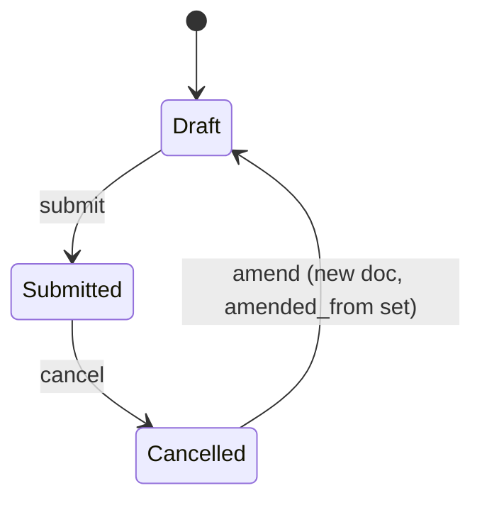

# Interview Feedback

**Source:** `hrms/hr/doctype/interview_feedback/interview_feedback.json`, `interview_feedback.py`, `interview_feedback.js`
**Submittable:** yes   **Tree:** no   **Naming:** Expression — `autoname: "HR-INT-FEED-.####"` (naming-series style: `HR-INT-FEED-<4-digit-incrementing-counter>`, e.g. `HR-INT-FEED-0001`; no year token, unlike `Interview`).
**Module:** HR

## Schema

| Field (fieldname) | Label | Type | Options/Link Target | Required | Default | Read-Only | Notes |
|---|---|---|---|---|---|---|---|
| *(details_section)* | Details | Section Break | — | — | — | — | |
| interview | Interview | Link | [[Interview]] | yes (`reqd`) | — | no | in list view + standard filter; `allow_in_quick_entry: 1` |
| interview_type | Interview Type | Link | [[Interview Type]] | yes (`reqd`) | — | yes (read_only) | `fetch_from: interview.interview_type`; `allow_in_quick_entry: 1`; in list view + standard filter |
| job_applicant | Job Applicant | Link | [[Job Applicant]] | no | — | yes (read_only) | `fetch_from: interview.job_applicant`; in list view + standard filter |
| *(column_break_3)* | — | Column Break | — | — | — | — | |
| interviewer | Interviewer | Link | User | yes (`reqd`) | — | no | in list view + standard filter; `allow_in_quick_entry: 1`; also the doctype's `title_field` |
| result | Result | Select | (blank) / Cleared / Rejected | yes (`reqd`) | — | no | in list view + standard filter |
| *(section_break_4)* | Skill Assessment | Section Break | — | — | — | — | |
| skill_assessment | (unlabeled, inherits section label "Skill Assessment") | Table | [[Skill Assessment]] (child) | yes (`reqd`) | — | no | `allow_in_quick_entry: 1`; see Child Tables |
| average_rating | Average Rating | Rating | — | no | — | yes (read_only) | in list view; computed — see Business Logic |
| *(section_break_7)* | Feedback | Section Break | — | — | — | — | |
| feedback | (unlabeled, inherits section label "Feedback") | Text | — | no | — | no | `allow_in_quick_entry: 1` |
| amended_from | Amended From | Link | Interview Feedback | no | — | yes (read_only) | `no_copy: 1`, `print_hide: 1` |

Doctype-level flags: `editable_grid: 1`, `index_web_pages_for_search: 1`, `quick_entry: 1` (supports the fast "Quick Entry" creation dialog, which is why several fields carry `allow_in_quick_entry: 1`), `sort_field: creation` / `sort_order: DESC`, `title_field: interviewer`, `track_changes: 1`.

## Child Tables

- `skill_assessment` -> **Skill Assessment** child doctype. Not separately assigned in this port batch; inlined here since it is simple and module-scoped:

  | Field (fieldname) | Label | Type | Options/Link Target | Required | Default | Read-Only | Notes |
  |---|---|---|---|---|---|---|---|
  | skill | Skill | Link | [[Skill]] | yes (`reqd: 1`) | — | yes (read_only) | in_list_view |
  | rating | Rating | Rating | — | yes (`reqd: 1`) | — | no | in_list_view; the per-skill score the interviewer assigns |

  Rows are typically seeded from `Interview Type.expected_skill_set` (via `Interview.get_expected_skill_set`, called from `interview_feedback.js`'s `interview_type` handler) and then each row's `rating` is filled in by the interviewer.

## State Machine

Plain list of (from_state, event, to_state, guard condition):

| From (docstatus) | Event | To (docstatus) | Guard |
|---|---|---|---|
| 0 (Draft) | `validate` (runs on every save, draft or submit) | 0 (unchanged) | See Validation Rules 1–4 below; any failing check aborts the save with `frappe.throw` |
| 0 (Draft) | `submit` | 1 (Submitted) | `validate_interview_date` additionally enforced with `self.docstatus == 1` context (see Rule 2) — no separate `on_submit`/`before_submit` guard beyond `validate` re-running |
| 1 (Submitted) | `cancel` | 2 (Cancelled) | none beyond standard Frappe cancel permission checks |
| 2 (Cancelled) | `amend` | 0 (Draft, new doc) | standard Frappe amend flow |

See [[Submittable Document Lifecycle]] for the general draft/submit/cancel/amend mechanics this doctype follows.

No explicit `status`/`workflow_state` field on this doctype — its `result` field (Cleared/Rejected) is a business-outcome field, not a workflow state, and docstatus is the only state machine.

## Validation Rules (exact, in execution order)

`validate()` calls, in order:
1. `validate_interviewer()`: compute `applicable_interviewers = get_applicable_interviewers(self.interview)` (= `frappe.get_all("Interview Detail", filters={"parent": interview}, pluck="interviewer")`, i.e. exactly the interviewers assigned on the parent Interview's `interview_details` table). IF `self.interviewer` is not in that list -> `frappe.throw(_("{0} is not allowed to submit Interview Feedback for the Interview: {1}").format(frappe.bold(self.interviewer), frappe.bold(self.interview)))`.
2. `validate_interview_date()`: read the parent Interview's `scheduled_on` (`scheduled_date`). IF `getdate() < getdate(scheduled_date)` (today is before the interview's scheduled date) AND `self.docstatus == 1` (i.e. this check only actually blocks at **submit** time, not at draft-save time, since `docstatus` is only `1` during/after the submit transaction) -> `frappe.throw(_("Submission of {0} before {1} is not allowed").format(frappe.bold(_("Interview Feedback")), frappe.bold(_("Interview Scheduled Date"))))`.
3. `validate_duplicate()`: `frappe.db.exists("Interview Feedback", {"interviewer": self.interviewer, "interview": self.interview, "docstatus": 1})`. IF a submitted feedback from the same interviewer for the same interview already exists -> `frappe.throw(_("Feedback already submitted for the Interview {0}. Please cancel the previous Interview Feedback {1} to continue.").format(self.interview, get_link_to_form("Interview Feedback", duplicate_feedback)))`.
4. `calculate_average_rating()`: see Business Logic below — always runs last in `validate`, unconditionally recomputing `average_rating` from the current `skill_assessment` rows.

`on_submit()`:
5. `update_interview_average_rating()` — recomputes and writes the parent Interview's `average_rating` (see Business Logic / Lifecycle Hooks).

`on_cancel()`:
6. `update_interview_average_rating()` — same recomputation, run again after cancellation so a cancelled feedback's rating is excluded from the parent Interview's average (the underlying query already filters `docstatus == 1`, so a cancelled row naturally drops out of the AVG once its docstatus becomes 2).

## Business Logic / Calculations

### `calculate_average_rating()` (runs in `validate`, every save)
1. `total_rating = 0`.
2. For each row `d` in `self.skill_assessment`: IF `d.rating` is truthy, `total_rating += flt(d.rating)`.
3. `self.average_rating = flt(total_rating / len(self.skill_assessment)) if len(self.skill_assessment) else 0` — i.e. arithmetic mean of all skill ratings (rows with a falsy/zero rating still count toward the denominator via `len(self.skill_assessment)`, they just contribute 0 to the numerator — this is a straight mean over ALL rows, not just rated ones). Divide-by-zero guarded: if there are no skill_assessment rows at all, `average_rating = 0`.

### `update_interview_average_rating()` (runs on `on_submit` and `on_cancel`)
1. Query: `SELECT AVG(average_rating) AS average FROM tabInterviewFeedback WHERE interview = <self.interview> AND docstatus = 1` (via `frappe.qb`).
2. Load the parent `Interview` document, `interview.db_set("average_rating", average_rating)` (direct write, bypasses Interview's `validate`), then `interview.notify_update()` (realtime push only, no further DB write).

## Lifecycle Hooks (exact)

| Event | What Runs | Side Effects on Other Doctypes |
|---|---|---|
| validate | interviewer eligibility check, interview-date guard, duplicate-feedback guard, average-rating calculation (Rules 1–4) | reads `Interview Detail` (via parent Interview) and `Interview.scheduled_on`; no writes |
| on_submit | `update_interview_average_rating` (Rule 5) | writes `Interview.average_rating` via `db_set` + `notify_update()` |
| on_cancel | `update_interview_average_rating` (Rule 6) | same write, now excluding the cancelled row from the AVG |

### Scheduled Job: `send_daily_feedback_reminder`

**Source:** the function itself lives in `hrms/hr/doctype/interview/interview.py` (not in `interview_feedback.py` — cross-referenced here per the assignment's routing since it is conceptually about interview-feedback compliance nagging; see [[Interview]] for the sibling `send_interview_reminder` job which lives in the same source file). Registered in `hrms/hooks.py` under `scheduler_events["daily"]` (see [[Background Jobs (Scheduler Events)]]) — runs **once per day** (Frappe's default daily cron time, typically midnight site time unless reconfigured).

Exact logic, in order:
1. Read HR Settings singleton fields: `send_interview_feedback_reminder`, `feedback_reminder_notification_template`, `hiring_sender_email`.
2. IF `send_interview_feedback_reminder` is falsy (`cint(...)` == 0) -> return immediately (feature toggle).
3. Load the Email Template named by `HR Settings.feedback_reminder_notification_template` (see `interview_feedback_reminder_template.html` for the default seeded template's structure — subject/body content is admin-configurable, not hardcoded).
4. **Exact query** for candidate interviews: `frappe.get_all("Interview", filters={"status": "Under Review", "docstatus": ["!=", 2], "scheduled_on": ["<=", getdate()], "to_time": ["<=", nowtime()]}, pluck="name")`. In plain terms: every non-cancelled Interview whose `status` is `"Under Review"`, whose `scheduled_on` date is today-or-earlier, AND whose `to_time` is now-or-earlier (i.e. the interview's scheduled end time has already passed as of "now", compared purely against `nowtime()` with no regard to which day `scheduled_on` actually falls on — same caveat as `send_interview_reminder`: a Date field is compared loosely against a plain time-of-day, so this is technically comparing the interview's end-clock-time against the current clock-time regardless of date, mitigated only in practice by the separate `scheduled_on <= today` condition).
5. For each matching Interview name:
   a. `recipients = get_recipients(interview, for_feedback=1)` (see `Interview.md`'s `get_recipients` helper — this returns only the assigned interviewers who do NOT yet have a submitted `Interview Feedback` for that Interview; the Job Applicant is NOT included in these recipients, unlike the non-feedback branch).
   b. Load the full Interview doc, build a Jinja context = `doc.as_dict()`, render the feedback-reminder template's `response` against that context.
   c. IF `len(recipients)` > 0 -> `frappe.sendmail(sender=hiring_sender_email, recipients=recipients, subject=interview_feedback_template.subject, message=message, reference_doctype="Interview", reference_name=interview)`. IF there are zero eligible recipients (e.g. everyone already submitted feedback), no email is sent for that interview — silently skipped, no `reminded`-style flag is set or needed here since the underlying "already submitted feedback" condition is itself idempotent (an interviewer who has submitted naturally drops out of future runs).

No "already reminded today" flag exists for this job (contrast with `send_interview_reminder`'s `reminded` Check field) — because the daily job re-derives its recipient list fresh from "who hasn't submitted feedback yet" every run, so it will keep nagging remaining non-responders every day until they submit feedback or the Interview's status changes away from "Under Review".

## Whitelisted / API Methods

| Method name | HTTP-equivalent purpose | Args | Returns | What it does |
|---|---|---|---|---|
| `get_applicable_interviewers` | GET — list of Users allowed to submit feedback for a given Interview (used by `interview_feedback.js` to constrain the `interviewer` Link-field's query, and internally by `validate_interviewer`) | `interview: str` | `list[str]` (User names) | `frappe.has_permission("Interview", "read", interview, throw=True)`. `frappe.get_all("Interview Detail", filters={"parent": interview}, pluck="interviewer")`. |

(`create_interview_feedback`, the endpoint that actually creates+saves+submits an Interview Feedback from the "Submit Feedback" dialog, is documented in `Interview.md`'s API table since it lives in `interview.py`, not `interview_feedback.py`.)

## Permissions

| Role | Read | Write | Create | Delete | Submit | Cancel | Amend | Report | Export | Notes (if_owner, permlevel, etc) |
|---|---|---|---|---|---|---|---|---|---|---|
| HR Manager | yes | — | — | — | — | — | — | yes | yes | also `email`, `share`, `print` — **read-only**: no write/create/delete/submit/cancel |
| Interviewer | yes | yes | yes | yes | yes | yes | — | yes | yes | also `email`, `share`, `print` — full CRUD+submit+cancel at the doctype-permission level (same caveat as `Interview.md`: no server-side `if_owner`/"only their own feedback" restriction is declared in the permissions table itself; `validate_interviewer` is the actual mechanism preventing an Interviewer from submitting feedback they weren't assigned to — but nothing in the permission table stops an Interviewer role user from reading/deleting/cancelling *other* interviewers' feedback records) |
| HR User | yes | — | — | — | — | — | — | yes | yes | also `email`, `share`, `print` — **read-only**, same as HR Manager |

No `permlevel` restrictions declared. Not submittable? — it IS submittable (`is_submittable: 1`); Submit/Cancel columns above reflect the JSON (`submit: 1`, `cancel: 1` only for Interviewer).

## Scheduled Jobs Touching This Doctype

`send_daily_feedback_reminder` (daily, see above) reads this doctype indirectly (via `Interview Detail` and via the "already submitted feedback" exclusion inside `get_recipients(..., for_feedback=1)`, which queries `Interview Feedback` directly: `frappe.get_all("Interview Feedback", filters={"interview": name, "docstatus": 1}, pluck="interviewer")`). No scheduled job writes to Interview Feedback directly.

## Port Notes

- `average_rating` here (per-feedback mean of that one interviewer's skill ratings) and `Interview.average_rating` (cross-feedback mean across all interviewers) are two distinct, similarly-named fields computed by two different formulas at two different levels — keep them as separate stored columns in the port and do not conflate the aggregation levels.
- `calculate_average_rating`'s mean includes zero/falsy-rated rows in the denominator (Business Logic step 3) — this is a real, exploitable-by-omission behavior (an interviewer who leaves a skill's rating blank silently drags the average down as if they'd rated it 0) rather than excluding ungraded skills from the average. Preserve this exact behavior; do not silently "improve" it to skip ungraded rows unless asked.
- The interview-date guard (`validate_interview_date`) only blocks **submission** (`docstatus == 1`), not saving as a Draft before the interview date — a port must gate this at the submit transition specifically, not at generic save/update time.
- `validate_duplicate` only considers `docstatus == 1` (submitted) duplicates — multiple Draft Interview Feedback rows for the same interviewer/interview pair are NOT blocked by this check; only one can ultimately be submitted, but nothing stops creating several drafts. Preserve this narrower-than-it-sounds guard exactly.
- Because `average_rating` on the parent `Interview` is written via `db_set` from this doctype's `on_submit`/`on_cancel`, a port implementing Interview Feedback submission/cancellation must trigger the equivalent recompute-and-write against the Interview record as part of the same transaction (or an immediately-following one) to avoid the parent's displayed average going stale.
- `track_changes: 1` — same audit-trail caveat as other doctypes in this module.
- `quick_entry: 1` plus several `allow_in_quick_entry: 1` fields describe a specific fast-creation dialog affordance in Frappe Desk; functionally this doesn't change the data model, only which fields a "quick create" form surfaces — no separate backend behavior to reproduce beyond the schema itself.

## Related Doctypes

- [[Interview]] — parent interview this feedback is scored against; this doctype writes back `Interview.average_rating` on submit/cancel.
- [[Interview Type]] — fetched (`interview_type`) from the parent Interview; supplies the expected skill set.
- [[Job Applicant]] — fetched (`job_applicant`) from the parent Interview, for display/filtering.
- [[Skill Assessment]] — child table (`skill_assessment`) holding the per-skill ratings.
- [[Permission Model (RBAC)]] — role-based access (HR Manager/Interviewer/HR User) as detailed in Permissions above.
