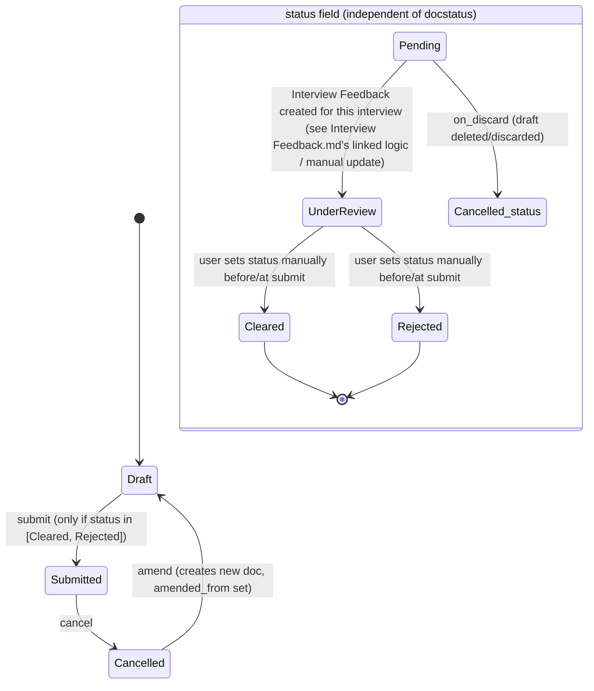

# Interview

**Source:** `hrms/hr/doctype/interview/interview.json`, `interview.py`, `interview.js`, `interview_calendar.js`, `interview_list.js`, `interview_reminder_notification_template.html`, `interview_feedback_reminder_template.html`
**Submittable:** yes   **Tree:** no   **Naming:** Expression — `autoname: "HR-INT-.YYYY.-.####"` (Frappe naming-series style: `HR-INT-<4-digit-year>-<4-digit-incrementing-counter>`, e.g. `HR-INT-2026-0001`).
**Module:** HR

## Schema

| Field (fieldname) | Label | Type | Options/Link Target | Required | Default | Read-Only | Notes |
|---|---|---|---|---|---|---|---|
| *(interview_details_section)* | Details | Section Break | — | — | — | — | |
| interview_type | Interview Type | Link | [[Interview Type]] | yes (`reqd`) | — | no | in list view + standard filter |
| job_applicant | Job Applicant | Link | [[Job Applicant]] | yes (`reqd`) | — | no | in list view + standard filter; also the doctype's `title_field` |
| job_opening | Job Opening | Link | [[Job Opening]] | no | — | yes (read_only) | `fetch_from: job_applicant.job_title` |
| designation | Designation | Link | Designation | no | — | yes (read_only) | `fetch_from: interview_type.designation`; in list view + standard filter |
| resume_link | Resume link | Data | — | no | — | no | `fetch_from: job_applicant.resume_link`, `fetch_if_empty: 1` |
| *(column_break_4)* | — | Column Break | — | — | — | — | |
| status | Status | Select | Pending / Under Review / Cleared / Rejected / Cancelled | yes (`reqd`) | `Pending` | no | in list view + standard filter |
| scheduled_on | Scheduled On | Date | — | yes (`reqd`) | — | no | `set_only_once: 1`; in list view + standard filter |
| from_time | From Time | Time | — | yes (`reqd`) | — | no | `set_only_once: 1`; in list view |
| to_time | To Time | Time | — | yes (`reqd`) | — | no | `set_only_once: 1`; in list view |
| *(section_break_hqvh)* | — | Section Break | — | — | — | — | |
| interview_details | Interviewers | Table | [[Interview Detail]] (child) | no | — | no | `allow_on_submit: 1` — see `Interview Detail.md` |
| *(ratings_section)* | Ratings | Section Break | — | — | — | — | |
| expected_average_rating | Expected Average Rating | Rating | — | no | — | yes (read_only) | `fetch_from: interview_type.expected_average_rating` |
| *(column_break_12)* | — | Column Break | — | — | — | — | |
| average_rating | Obtained Average Rating | Rating | — | no | — | yes (read_only) | `allow_on_submit: 1`; in list view; set via `db_set` from `Interview Feedback.update_interview_average_rating` — see Lifecycle Hooks |
| *(section_break_13)* | Interview Summary | Section Break | — | — | — | — | collapsible |
| interview_summary | (Interview Summary, unlabeled field, inherits section label) | Text | — | no | — | no | `allow_on_submit: 1` |
| reminded | Reminded | Check | — | no | `0` | no | hidden; internal flag set by `send_interview_reminder` to avoid duplicate reminders |
| amended_from | Amended From | Link | Interview (self) | no | — | yes (read_only) | `no_copy: 1`, `print_hide: 1`; standard Frappe amend-chain pointer, see [[Submittable Document Lifecycle]] |
| *(feedback_tab)* | Feedback | Tab Break | — | — | — | — | |
| feedback_html | Feedback HTML | HTML | — | no | — | no | client-rendered feedback summary (ratings breakdown, per-skill averages, feedback list) — no server-stored value |

Doctype-level flags: `editable_grid: 1`, `index_web_pages_for_search: 1`, `track_changes: 1` (see [[Implicit Framework Behaviors]]), `sort_field: creation` / `sort_order: DESC`, `title_field: job_applicant`. Links section declares [[Interview Feedback]] as a linked child-list (`link_fieldname: interview`) shown on the Interview form's connections/related-docs panel.

## Child Tables

- `interview_details` -> **Interview Detail** — see [[Interview Detail]] for full schema (single field: `interviewer` Link to User).

## State Machine

Plain list of (from_state, event, to_state, guard condition):

| From (docstatus) | Event | To (docstatus) | Guard |
|---|---|---|---|
| 0 (Draft) | `submit` | 1 (Submitted) | `on_submit`: `frappe.throw(_("Only Interviews with Cleared or Rejected status can be submitted."), title=_("Not Allowed"))` unless `status` is already `"Cleared"` or `"Rejected"` |
| 1 (Submitted) | `cancel` | 2 (Cancelled) | none beyond standard Frappe cancel permission checks |
| 2 (Cancelled) | `amend` | 0 (Draft, new doc with `amended_from` set) | standard Frappe amend flow |
| 0 (Draft) | `on_discard` (user deletes/discards an unsaved-but-persisted-as-draft doc through the desk "discard" action) | n/a (docstatus stays 0) | forces `status` to `"Cancelled"` via `self.db_set("status", "Cancelled")` — note this is a **status-field** change, not a docstatus change |

`status` field transitions (independent Select, not itself docstatus-gated except at submit time):
- Default `"Pending"` on creation.
- No controller code transitions `Pending -> Under Review` automatically — this is expected to happen via manual user edit (the JSON offers it as a Select option) before/when feedback review begins; the codebase does not show an automatic trigger tying Interview Feedback creation to flipping Interview `status` to "Under Review" (worth flagging — see Port Notes).
- `on_submit` requires `status` to already be `"Cleared"` or `"Rejected"` — this is enforced but not auto-set by the submit action itself; the user (or `create_interview_feedback` flow with `result` field on Interview Feedback) is expected to have set it beforehand.
- `on_discard` forces `status = "Cancelled"` (only reachable pre-submit, since discard applies to drafts).

## Validation Rules (exact, in execution order)

`validate()` calls, in order:
1. `validate_duplicate_interview()`: Query `frappe.db.exists("Interview", {"job_applicant": self.job_applicant, "interview_type": self.interview_type, "docstatus": 1})`. IF a submitted Interview already exists for the same `(job_applicant, interview_type)` pair -> `frappe.throw(_("Job Applicants are not allowed to appear twice for the same Interview Type. Interview {0} already scheduled for Job Applicant {1}").format(frappe.bold(get_link_to_form("Interview", duplicate_interview)), frappe.bold(self.job_applicant)))`.
2. `validate_designation()`: Look up the Job Applicant's `designation` (`applicant_designation`). IF `self.designation` is already set: IF it differs from `applicant_designation` -> `frappe.throw(_("Interview Type {0} is only for Designation {1}. Job Applicant has applied for the role {2}").format(self.interview_type, frappe.bold(self.designation), applicant_designation), exc=DuplicateInterviewRoundError)` (custom exception class `DuplicateInterviewRoundError(frappe.ValidationError)` defined in this file — despite the name referencing the old "Interview Round" concept, it's raised for a designation mismatch, not a duplicate round). ELSE (designation not yet set on the Interview) -> set `self.designation = applicant_designation`.

`on_submit()`:
3. IF `self.status` not in `["Cleared", "Rejected"]` -> `frappe.throw(_("Only Interviews with Cleared or Rejected status can be submitted."), title=_("Not Allowed"))`.
4. `show_job_applicant_update_dialog()`: maps `status` "Cleared" -> "Accepted" / "Rejected" -> "Rejected" (`get_job_applicant_status`); if a mapped status exists, shows a `frappe.msgprint` prompt asking the user to confirm updating the linked Job Applicant's status, wired to call the whitelisted `update_job_applicant_status` server action if confirmed (client-driven confirmation — the actual Job Applicant status change only happens if the user clicks through, it is NOT automatic on Interview submit).

`on_discard()`:
5. `self.db_set("status", "Cancelled")` — direct DB write, bypasses `validate`.

## Business Logic / Calculations

No numeric formula lives on Interview itself; `average_rating` is written externally by `Interview Feedback.update_interview_average_rating` (documented in `Interview Feedback.md`) as the DB-level average of all submitted Interview Feedback rows' `average_rating` for this Interview:
1. `SELECT AVG(average_rating) FROM tabInterviewFeedback WHERE interview = <this interview> AND docstatus = 1`.
2. `interview.db_set("average_rating", average_rating)` (direct write, no revalidation) then `interview.notify_update()` (realtime UI push, no DB effect).

## Lifecycle Hooks (exact)

| Event | What Runs | Side Effects on Other Doctypes |
|---|---|---|
| validate | `validate_duplicate_interview`, `validate_designation` (Validation Rules 1–2) | reads Job Applicant only |
| on_submit | status guard (Rule 3), `show_job_applicant_update_dialog` (Rule 4) | conditionally, via user-confirmed follow-up call to `update_job_applicant_status`, writes `Job Applicant.status` (goes through Job Applicant's own `save()`/`validate`, unlike the Employee-driven update in `Job Applicant.md` which uses `db_set`) |
| on_discard | forces `status = "Cancelled"` (Rule 5) | none |
| (whitelisted instance method) `reschedule_interview` | see API table below | sends email to interviewers + applicant |

### Scheduled Job: `send_interview_reminder`

**Source:** `hrms/hr/doctype/interview/interview.py`, function `send_interview_reminder()`. Registered in `hrms/hooks.py` under `scheduler_events["all"]` (see [[Background Jobs (Scheduler Events)]]) — Frappe's `"all"` bucket runs on every scheduler tick, by default **every 4 minutes** (`scheduler_interval`/`all` cron, unless the site overrides it).

Exact logic, in order:
1. Read HR Settings singleton fields: `send_interview_reminder`, `interview_reminder_template`, `hiring_sender_email` (`frappe.db.get_value("HR Settings", "HR Settings", [...], as_dict=True)`).
2. IF `send_interview_reminder` is falsy (`cint(...)` == 0) -> return immediately (feature toggle, no reminders sent).
3. Compute the reminder lead time: read `HR Settings.remind_before` (a Duration-as-string field), default to `"01:00:00"` if unset. Parse with `datetime.datetime.strptime(remind_before, "%H:%M:%S")`.
4. Compute `reminder_date_time = now() + timedelta(hours=remind_before.hour, minutes=remind_before.minute, seconds=remind_before.second)` — i.e. "now, plus the configured lead time" (default: one hour from now).
5. **Exact query** for candidate interviews: `frappe.get_all("Interview", filters=[["scheduled_on", "between", [datetime.datetime.now(), reminder_date_time]], ["status", "=", "Pending"], ["reminded", "=", 0], ["docstatus", "!=", 2]])`. In plain terms: all non-cancelled, still-Pending Interviews whose `scheduled_on` falls between right now and (now + lead time), that have not already been reminded. **Note:** `scheduled_on` is a Date field but is compared against full datetimes here — the comparison operates on the date's midnight-implicit value, meaning the "between now and +1h" window in practice only meaningfully filters by day-boundary, not by the Interview's actual `from_time`/`to_time` — flagged explicitly since a literal same-behavior port must replicate comparing `scheduled_on` (date) against a datetime range exactly as-is, not "fix" it to use `from_time`.
6. Load the Email Template named by `HR Settings.interview_reminder_template` (a required, admin-configured `Email Template` document — see `interview_reminder_notification_template.html` for the default seeded template content/structure, not reproduced verbatim here since Email Template body/subject are themselves editable configuration, not hardcoded logic).
7. For each matching Interview: reload the full Interview document, build a Jinja render context = `doc.as_dict()`, render the template's `response` body against that context (`frappe.render_template`), compute `recipients = get_recipients(doc.name)` (all `interview_details.interviewer` values PLUS the Job Applicant's `email_id` — see `get_recipients` below), and send an email via `frappe.sendmail(sender=hiring_sender_email, recipients=recipients, subject=interview_template.subject, message=message, reference_doctype="Interview", reference_name=doc.name)`.
8. After sending, `doc.db_set("reminded", 1)` — direct write, marks the Interview so it is not reminded again on subsequent runs (idempotency guard for the "all" cron frequency).

Frequency: every scheduler tick under the `"all"` bucket (out-of-the-box Frappe default cadence: every 4 minutes; site-configurable). This is a fire-and-check job — it re-evaluates the candidate window on every run rather than being a one-shot scheduled send per interview.

### `get_recipients(name, for_feedback=0)` helper (used by both reminder jobs and the reschedule flow)

1. Load the Interview document; collect `interviewers = [d.interviewer for d in interview.interview_details]`.
2. IF `for_feedback` is truthy: query `frappe.get_all("Interview Feedback", filters={"interview": name, "docstatus": 1}, pluck="interviewer")` to get interviewers who have already submitted feedback, then `recipients = [d for d in interviewers if d not in feedback_given_interviewers]` — i.e. only interviewers who have NOT yet given feedback.
3. ELSE: `recipients = interviewers` (all assigned interviewers) with the Job Applicant's `email_id` appended (`recipients.append(frappe.db.get_value("Job Applicant", interview.job_applicant, "email_id"))`).
4. Return `recipients`.

### `send_daily_feedback_reminder` — fully documented in `Interview Feedback.md` (its logic lives in `interview.py` alongside `send_interview_reminder`, but per the assignment's routing instructions its detailed writeup is placed in the Interview Feedback file since it is conceptually about feedback compliance). Summary cross-reference: registered under `scheduler_events["daily"]` in `hrms/hooks.py`, queries Interviews with `status = "Under Review"`, `docstatus != 2`, `scheduled_on <= today`, `to_time <= now`, and emails each interview's not-yet-submitted interviewers via `get_recipients(interview, for_feedback=1)` using the `HR Settings.feedback_reminder_notification_template` Email Template — see `Interview Feedback.md` for the exact step-by-step.

## Whitelisted / API Methods

| Method name | HTTP-equivalent purpose | Args | Returns | What it does |
|---|---|---|---|---|
| `reschedule_interview` (instance method) | POST — change an Interview's schedule after creation | `scheduled_on: date`, `from_time: time`, `to_time: time` | `None` | IF all three values are unchanged from current -> `frappe.msgprint(_("No changes found in timings."), indicator="orange", title=_("Interview Not Rescheduled"))` and return (no-op). ELSE: capture `original_date/from_time/to_time`, then `self.db_set({"scheduled_on": ..., "from_time": ..., "to_time": ...})` (direct write, no revalidation despite `scheduled_on`/`from_time`/`to_time` being `set_only_once` fields — `db_set` bypasses that constraint), `self.notify_update()`. Compute `recipients = get_recipients(self.name)`. Attempt `frappe.sendmail(recipients=recipients, subject=_("Interview: {0} Rescheduled").format(self.name), message=_("Your Interview session is rescheduled from {0} {1} - {2} to {3} {4} - {5}").format(original_date, original_from_time, original_to_time, self.scheduled_on, self.from_time, self.to_time), reference_doctype=self.doctype, reference_name=self.name)`; on any exception, swallow it and show `frappe.msgprint(_("Failed to send the Interview Reschedule notification. Please configure your email account."))` instead of raising. Finally `frappe.msgprint(_("Interview Rescheduled successfully"), indicator="green")` unconditionally (shown even if the email failed). |
| `get_interviewers` | GET — list interviewers configured on an Interview Type | `interview_type: str` | `list[dict]` (`{"interviewer": <user>}` rows) | `frappe.has_permission("Interview Type", "read", interview_type, throw=True)`; `frappe.get_all("Interviewer", filters={"parent": interview_type}, fields=["user as interviewer"])`. |
| `get_feedback` | GET — feedback list for an Interview's detail/summary panel | `interview: str` | `list[dict]` | `frappe.has_permission("Interview Feedback", "read", throw=True)` (note: checked at doctype level, not against the specific interview). Query joins `Interview Feedback` (docstatus=1, matching `interview`) to [[Employee Core Model|Employee]] (`ON interview_feedback.interviewer == employee.user_id`), selecting `name`, `modified as added_on`, `interviewer as user`, `feedback`, `average_rating * 5 as total_score`, `employee.employee_name as reviewer_name`, `employee.designation as reviewer_designation`; ordered by `interview_feedback.creation`. |
| `get_skill_wise_average_rating` | GET — per-skill average rating chart data | `interview: str` | `list[dict]` (`{skill, rating}`) | `frappe.has_permission("Interview", "read", interview, throw=True)`. Joins `Skill Assessment` (child of `Interview Feedback`) to `Interview Feedback` on `skill_assessment.parent == interview_feedback.name`, filters `interview_feedback.interview == interview AND docstatus == 1`, groups by `skill_assessment.skill`, averages `skill_assessment.rating`, orders by `skill_assessment.idx`. |
| `update_job_applicant_status` | POST — apply the Interview-submit confirmation dialog's chosen outcome | `status: str`, `job_applicant: str` | `None` (side-effecting) | Wrapped in try/except: IF `job_applicant` falsy -> `frappe.throw(_("Please specify the job applicant to be updated."))`. Else loads the Job Applicant, sets `status`, calls `doc.save()` (full validate cycle, unlike the Employee-driven `db_set` path), then `frappe.msgprint(_("Updated the Job Applicant status to {0}").format(doc.status), alert=True, indicator="green")`. On any exception: `frappe.log_error("Failed to update Job Applicant status")` and `frappe.msgprint(_("Failed to update the Job Applicant status"), alert=True, indicator="red")` — errors are swallowed from the caller's perspective (no exception propagates, only a red toast + server error log entry). |
| `get_expected_skill_set` | GET — skills to assess for a given Interview Type | `interview_type: str` | `list[dict]` (`{skill}` rows, ordered) | `frappe.has_permission("Interview Type", "read", interview_type, throw=True)`. `frappe.get_all("Expected Skill Set", filters={"parent": interview_type}, fields=["skill"], order_by="idx")`. |
| `create_interview_feedback` | POST — submit a completed feedback form from the Interview's "Submit Feedback" dialog | `data: str \| dict` (JSON containing `skill_set: list`, `feedback: str`, `result: str`), `interview_name: str`, `interviewer: str`, `job_applicant: str` | `None` (side-effecting; msgprint on success) | IF `data` is a string, `json.loads` it into a dict. IF `frappe.session.user != interviewer` -> `frappe.throw(_("Only Interviewer Are allowed to submit Interview Feedback"))` (note: exact source string has the grammatically odd capitalization "Only Interviewer Are allowed..." — quote verbatim). Builds a new `Interview Feedback` doc: `interview = interview_name`, `interviewer = interviewer`, `job_applicant = job_applicant`; appends each entry of `data.skill_set` as a `skill_assessment` child row; sets `feedback = data.feedback`, `result = data.result`. Calls `.save()` then `.submit()` (both lifecycle stages run — i.e. Interview Feedback's own `validate` and `on_submit` fire, see `Interview Feedback.md`). On success: `frappe.msgprint(_("Interview Feedback {0} submitted successfully").format(get_link_to_form("Interview Feedback", interview_feedback.name)))`. |
| `get_interviewer_list` | GET — search/autocomplete endpoint for the "Interviewer" Link-field query (decorated with `@frappe.validate_and_sanitize_search_inputs`) | `doctype, txt, searchfield, start, page_len, filters` (standard Frappe Link-field search signature) | `list` (list of `[user]` rows) | Builds filters against the `Has Role` doctype: `parent like %txt%`, `role = "interviewer"`, `parenttype = "User"`; if an incoming `filters` list was also passed, it is (bugged) self-extended (`filters.extend(filters)`, duplicating itself rather than merging caller-supplied filters — flag as a likely no-op/bug: any filters passed in by the caller are effectively appended to themselves, not merged with the base filter list, since the local `filters` variable is reassigned before this line). Returns `frappe.get_all("Has Role", limit_start=start, limit_page_length=page_len, filters=filters, fields=["parent"], as_list=1)` — i.e. Users who have been granted the `"interviewer"` role (note: role name lowercase `"interviewer"` here vs. the Role literally named `"Interviewer"` elsewhere in permissions — verify exact role-name casing/match in the target auth system, since Frappe role-name matching is normally case-sensitive and this could be an existing latent bug worth flagging, not silently "fixing" in the port unless intentional). |
| `get_events` | GET — Calendar/Gantt view data source (used by `interview_calendar.js`) | `start: str`, `end: str`, `filters: str \| None` (JSON) | `list[dict]` (calendar event objects: `from`, `to`, `name`, `subject`, `color`) | Builds a raw SQL query (marked `# nosemgrep`) selecting `name, job_applicant, interview_type, scheduled_on, status, from_time, to_time` from `tabInterview` where `scheduled_on BETWEEN %(start)s AND %(end)s AND docstatus != 2`, plus any additional conditions from `get_event_conditions("Interview", filters)` (Frappe's generic calendar-filter-to-SQL helper). For each row, builds `from`/`to` datetimes by concatenating `scheduled_on` with `from_time`/`to_time` (defaulting missing times to `"00:00:00"`), `subject` = newline-joined non-empty values of `name, job_applicant, interview_type`, and `color` from a fixed status-color map: `Pending -> #fff4f0`, `Under Review -> #d3e8fc`, `Cleared -> #eaf5ed`, `Rejected -> #fce7e7`, with fallback `#89bcde` for any other/unmapped status (e.g. `Cancelled`). |

## Permissions

| Role | Read | Write | Create | Delete | Submit | Cancel | Amend | Report | Export | Notes (if_owner, permlevel, etc) |
|---|---|---|---|---|---|---|---|---|---|---|
| System Manager | yes | yes | yes | yes | yes | yes | — | yes | yes | also `email`, `print`, `share` |
| HR Manager | yes | yes | yes | yes | yes | yes | — | yes | yes | also `email`, `print`, `share` |
| Interviewer | yes | yes | yes | yes | yes | yes | — | yes | yes | also `email`, `print`, `share` — note Interviewers have full CRUD+submit+cancel on ALL Interview records at the DocType-permission level (no `if_owner` restriction limiting them to interviews they are assigned to; the "am I an interviewer on this record" restriction is only enforced ad hoc in specific whitelisted methods/client buttons, e.g. the feedback-submission button being disabled client-side — this is NOT a server-side permission boundary) |
| HR User | yes | yes | yes | yes | yes | yes | — | yes | yes | also `email`, `print`, `share` |

No explicit "Amend" column truthy for any role in the JSON (all blank) despite the doctype being submittable — Frappe's default amend behavior for a submittable doctype typically still applies via the `write`+`create`+`cancel` combination unless separately restricted; no `permlevel` restrictions declared.

## Scheduled Jobs Touching This Doctype

| Job | Frequency (per `hrms/hooks.py`) | Function |
|---|---|---|
| `send_interview_reminder` | `scheduler_events["all"]` — every scheduler tick (default every 4 minutes) | `hrms.hr.doctype.interview.interview.send_interview_reminder` — full detail above |
| `send_daily_feedback_reminder` | `scheduler_events["daily"]` — once per day | `hrms.hr.doctype.interview.interview.send_daily_feedback_reminder` — full detail in [[Interview Feedback]] |

See [[Background Jobs (Scheduler Events)]] for the general scheduler mechanics.

## Port Notes

- `scheduled_on`, `from_time`, `to_time` are all `set_only_once: 1` at the schema level (meaning Frappe Desk normally locks them after first save) yet `reschedule_interview` deliberately bypasses that via `db_set`. A port must implement "immutable via normal edit, but mutable via a dedicated reschedule operation" rather than a blanket immutable/mutable column.
- `average_rating` and `expected_average_rating` are Frappe `Rating` fields, internally stored as a 0–1 fraction (`options` on the field controls the number of stars, default 5) and only multiplied out to a 0–5 (or N-star) display scale in specific read paths (`get_feedback`'s `average_rating * 5`, `get_interview_details`'s `average_rating * number_of_stars`, `interview.js`'s `flt(frm.doc.average_rating * 5, 2)`). A port must decide a single canonical storage scale (recommend storing 0–5 directly and adjusting all these call sites, or storing 0–1 and applying the same multiplication consistently) — do not mix the two without an explicit, single conversion boundary.
- `interview_summary` field has no label of its own in the JSON — it inherits the enclosing `section_break_13` section's label "Interview Summary" as its effective display label in Frappe Desk; a port's admin UI should give it an explicit "Interview Summary" label.
- The Interview-submit "update Job Applicant" flow is advisory/opt-in (a confirmation dialog), not automatic — a literal port must not auto-update Job Applicant status on Interview submit; it must replicate the confirm-then-call pattern (or an equivalent explicit user action) if faithfulness to current behavior is required. Contrast this with the fully-automatic Employee-driven update in `Job Applicant.md`.
- No code found that automatically flips `status` from `Pending` to `Under Review` when the first Interview Feedback is created — worth flagging explicitly as a possible missing check per spec ground rules: the "Under Review" status appears entirely user/manually driven, with `send_daily_feedback_reminder` relying on this manual status transition having already happened to identify interviews needing feedback nagging. If the source stack expects an automatic transition and none exists in code, do not invent one in the port without confirming with product intent.
- `frappe.sendmail`'s failure-swallowing pattern (`reschedule_interview`) and try/except-with-log pattern (`update_job_applicant_status`) both intentionally hide errors from the immediate caller in favor of a generic toast; replicate this UX (don't let a transient email failure block the primary state change) but ensure the equivalent of `frappe.log_error` (a durable server-side error log) exists so failures are still discoverable.
- `track_changes: 1` — same audit-trail caveat as other doctypes in this module: build an explicit version/history mechanism.
- Standard Frappe amend-chain (`amended_from`) must be modeled explicitly: cancelling then amending a submitted Interview creates a new Draft document copying the cancelled one's data and linking back via `amended_from`.

## Related Doctypes

- [[Interview Type]] — the reusable round definition this Interview is scheduled against; supplies `designation`/`expected_average_rating`.
- [[Job Applicant]] — the candidate being interviewed; required link, also the source of `resume_link`.
- [[Job Opening]] — fetched from the Job Applicant; the vacancy this interview relates to.
- [[Interview Detail]] — child table of assigned interviewers for this specific instance.
- [[Interview Feedback]] — one per interviewer per Interview; writes back `average_rating` on this doctype.
- [[Employee Core Model]] — joined in `get_feedback` to resolve interviewer name/designation.
- [[Permission Model (RBAC)]] — role-based access as detailed in Permissions above.
