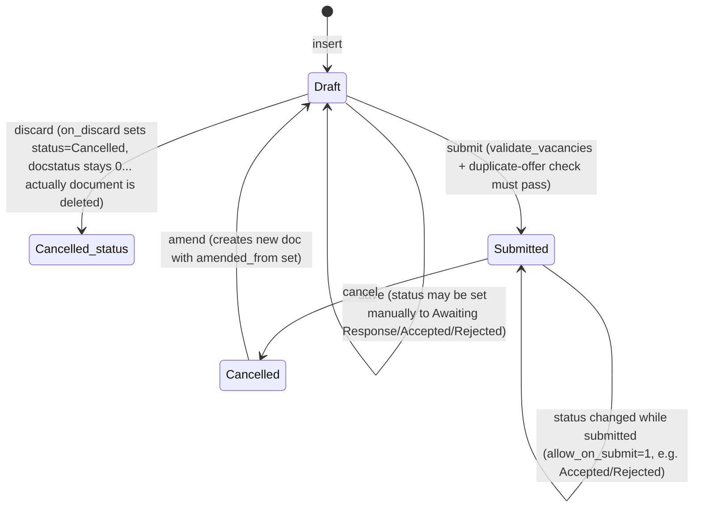

# Job Offer

**Source:** `hrms/hr/doctype/job_offer/job_offer.json`, `job_offer.py`, `job_offer.js`, `job_offer_list.js`
**Submittable:** yes   **Tree:** no   **Naming:** `autoname: "HR-OFF-.YYYY.-.#####"` (naming series expression — prefix `HR-OFF-`, current 4-digit year, then a 5-digit auto-incrementing counter reset is NOT automatic per year in this format unless the series row is separately reset; the `.YYYY.` token expands to the current year and `.#####.` is a running counter tied to that literal prefix string)
**Module:** HR (Recruitment)

## Schema

| Field (fieldname) | Label | Type | Options/Link Target | Required | Default | Read-Only | Notes |
|---|---|---|---|---|---|---|---|
| job_applicant | Job Applicant | Link | [[Job Applicant]] | Yes | — | No | `link_filters`: only Job Applicants with `status != "Rejected"` are selectable in the UI picker (client-side filter only; not enforced server-side) |
| applicant_name | Applicant Name | Data | — | Yes | — | Yes | `fetch_from: job_applicant.applicant_name`; in list view; in global search |
| applicant_email | Applicant Email Address | Data (Email) | — | No | — | Yes | `fetch_from: job_applicant.email_id`; in global search |
| column_break_3 | — | Column Break | — | — | — | — | layout only |
| status | Status | Select | `Awaiting Response`, `Accepted`, `Rejected`, `Cancelled` | No | — (blank until set) | No | `allow_on_submit: 1` (can change after submit); `no_copy: 1`; in standard filter; `print_hide: 1` |
| offer_date | Offer Date | Date | — | Yes | — | No | |
| designation | Designation | Link | Designation | Yes | — | No | `fetch_from: job_applicant.designation`, `fetch_if_empty: 1` (only pulled in if the field is currently empty); in list view |
| company | Company | Link | Company | Yes | — | No | `remember_last_selected_value: 1`; `print_hide: 1`; in list view |
| section_break_4 | — | Section Break | — | — | — | — | layout only |
| job_offer_term_template | Job Offer Term Template | Link | [[Job Offer Term Template]] | No | — | No | client script copies the template's `offer_terms` rows into this doc's `offer_terms` table when changed (see Port Notes — client-only logic) |
| offer_terms | Job Offer Terms | Table | [[Job Offer Term]] | No | — | No | see Child Tables |
| section_break_14 | — | Section Break | — | — | — | — | layout only |
| select_terms | Select Terms and Conditions | Link | Terms and Conditions | No | — | No | `print_hide: 1`; client script fetches the standard Terms and Conditions template text into `terms` when changed (server-independent convenience, not a stored relationship of business significance) |
| terms | Terms and Conditions | Text Editor | — | No | — | No | free text, may be auto-populated from `select_terms` client-side |
| printing_details | Printing Details | Section Break | — | — | — | — | `collapsible: 1`; groups the two fields below |
| letter_head | Letter Head | Link | Letter Head | No | — | No | `fetch_from: company.default_letter_head`; `allow_on_submit: 1`; `print_hide: 1` |
| column_break_16 | — | Column Break | — | — | — | — | layout only, `width: 50%` |
| select_print_heading | Print Heading | Link | Print Heading | No | — | No | `allow_on_submit: 1`; `print_hide: 1`; `report_hide: 1` |
| amended_from | Amended From | Link | Job Offer (self) | No | — | Yes | standard Frappe amend-chain pointer, see [[Submittable Document Lifecycle]]; `no_copy: 1`; `print_hide: 1` |

Field order per JSON `field_order`: job_applicant, applicant_name, applicant_email, column_break_3, status, offer_date, designation, company, section_break_4, job_offer_term_template, offer_terms, section_break_14, select_terms, terms, printing_details, letter_head, column_break_16, select_print_heading, amended_from.

Note: `job_offer_term_template` appears last in the raw `fields` array in the JSON but its position in `field_order` (used for actual form layout) is right after `section_break_4`, before `offer_terms` — the table above reflects `field_order`.

## Child Tables

- `offer_terms` (Table, options `Job Offer Term`) — see [[Job Offer Term]] for full schema. Rows are owned by the parent Job Offer (or by [[Job Offer Term Template]] when used as a template); no independent lifecycle.

## State Machine

Standard Frappe submittable lifecycle (`docstatus`: 0 = Draft, 1 = Submitted, 2 = Cancelled) combined with an independent `status` Select field that is NOT auto-derived from `docstatus` by the framework — it is set explicitly by application code.

Plain transition list:

| From (docstatus) | Event | To (docstatus) | Guard / Side effect |
|---|---|---|---|
| — (new) | insert/save | 0 (Draft) | `validate()` runs: vacancy check + duplicate-offer-per-applicant check |
| 0 (Draft) | submit | 1 (Submitted) | Same `validate()` checks re-run; `on_change` fires → `update_job_applicant`; status field itself is untouched by submit unless the user set it |
| 1 (Submitted) | status changed to Accepted/Rejected (save, `allow_on_submit`) | 1 (Submitted, status changes) | `on_change` fires → `update_job_applicant(status, job_applicant)` sets linked Job Applicant's `status` to the same value |
| 1 (Submitted) | cancel | 2 (Cancelled/docstatus) | standard cancel; no explicit `on_cancel` override found in this controller (Port Notes: no custom on_cancel logic exists — cancellation does not revert Job Applicant status) |
| 2 | amend | new Draft (docstatus 0) with `amended_from` = old name | standard Frappe amend |
| 0 (Draft, unsaved-to-committed record being discarded) | discard | document row deleted, but `on_discard` first runs `self.db_set("status", "Cancelled")` | Sets the `status` field value to `"Cancelled"` directly in the database before/around discard (per Frappe's discard mechanism for draft docs) |

## Validation Rules (exact, in execution order)

`validate()` calls, in order:

1. `validate_vacancies()` is called first:
   1.1. Look up the active [[Staffing Plan Detail]] covering `designation` + `company` + `offer_date` via `get_staffing_plan_detail()` (see Business Logic section for the query).
   1.2. Read `HR Settings.check_vacancies` (a single-value checkbox).
   1.3. IF a matching staffing plan detail was found AND `check_vacancies` is truthy THEN:
       - Count existing submitted Job Offers (`get_job_offer`) for the same `designation` + `company` whose `offer_date` falls between the staffing plan's `from_date` and `to_date` (docstatus = 1 only).
       - IF `staffing_plan.vacancies` is falsy (0/None) OR `(vacancies_total - count_of_existing_offers) <= 0` THEN → `frappe.throw(_("There are no vacancies under staffing plan {0}").format(error_variable))` where `error_variable` is `"for " + frappe.bold(self.designation)` normally, or `frappe.bold(get_link_to_form("Staffing Plan", staffing_plan.parent))` if the staffing plan detail row has a `parent` value (it always will since it's a child row — so in practice the link-to-Staffing-Plan-form variant is used).
2. Duplicate offer check: `job_offer = frappe.db.exists("Job Offer", {"job_applicant": self.job_applicant, "docstatus": ["!=", 2]})`.
   - IF a Job Offer exists for this `job_applicant` (excluding cancelled ones) AND that found name is not this document's own name THEN → `frappe.throw(_("Job Offer: {0} is already for Job Applicant: {1}").format(frappe.bold(job_offer), frappe.bold(self.job_applicant)))`.

No other server-side validations exist on this doctype's controller.

## Business Logic / Calculations

### `get_staffing_plan_detail(designation, company, offer_date)`

Not a numeric calculation but a lookup query — reproduce exactly:

1. Join [[Staffing Plan Detail]] (child, alias `spd`) to [[Staffing Plan]] (parent, alias `sp`) ON `spd.parent == sp.name`.
2. SELECT (grouped/aggregated, DISTINCT): `spd.parent`, `sp.from_date AS from_date`, `sp.to_date AS to_date`, `sp.name`, `SUM(spd.vacancies) AS vacancies`, `spd.designation`.
3. WHERE: `sp.docstatus == 1` AND `spd.designation == designation` AND `sp.company == company` AND `sp.from_date <= offer_date` AND `offer_date <= sp.to_date`.
4. GROUP BY `spd.parent, sp.from_date, sp.to_date, sp.name, spd.designation`.
5. Return the first result row as a dict if any row exists AND that row's `parent` is truthy; otherwise return `None`.
   - Edge case: if multiple Staffing Plans overlap the same designation/company/date window, only the first row returned by the DB (no explicit ORDER BY) is used — this is a source-code ambiguity, port as "first matching row, order undefined unless the target DB defines one."

### `get_job_offer(self, from_date, to_date)` (instance method)

Returns `frappe.get_all("Job Offer", filters={"offer_date": ["between", (from_date, to_date)], "designation": self.designation, "company": self.company, "docstatus": 1}, fields=["name"])` — i.e., count of already-submitted Job Offers for the same designation/company within the staffing plan's date window (used to decrement available vacancies in step 1.3 above). Note this counts ALL matching submitted offers including this document itself if it was previously submitted (irrelevant in normal flow since validate runs pre-submit on drafts, but relevant for revalidation-on-save-after-submit scenarios where `allow_on_submit` status changes trigger `validate()` again — the current doc's own name is not excluded from this count).

### `get_offer_acceptance_rate(company=None, department=None)` (whitelisted, module-level, no `self`)

1. Requires read permission on Job Offer (`frappe.has_permission("Job Offer", throw=True)`).
2. Build `filters = {"docstatus": 1}`; add `company` and/or `department` filters if passed (note: `department` is NOT a field on Job Offer — this filter has no matching column and would raise a DB error or simply be ignored/error out if department is ever passed; flag as a latent bug in source, reproduce filter-building logic as-is but note the missing field in Port Notes).
3. `total_offers = frappe.db.count("Job Offer", filters=filters)`.
4. Add `filters["status"] = "Accepted"`.
5. `total_accepted = frappe.db.count("Job Offer", filters=filters)`.
6. Return `{"value": (total_accepted / total_offers * 100) if total_offers else 0, "fieldtype": "Percent"}`. Division-by-zero guard: if `total_offers` is 0, return value 0 instead of dividing.

## Lifecycle Hooks (exact)

| Event | What Runs | Side Effects on Other Doctypes |
|---|---|---|
| `onload` | Looks up `frappe.db.get_value("Employee", {"job_applicant": self.job_applicant}, "name")`; sets client-side onload value `employee` to that name or `""` | Read-only lookup against [[Employee Core Model\|Employee]]; powers the "Show Employee" / "Create Employee" buttons in the client script |
| `validate` | Runs `validate_vacancies()` then the duplicate-Job-Offer-per-applicant check (see Validation Rules) | Reads Staffing Plan / Staffing Plan Detail; reads other Job Offer rows |
| `on_change` | Calls module function `update_job_applicant(self.status, self.job_applicant)` | IF `status` is `"Accepted"` or `"Rejected"` THEN `frappe.set_value("Job Applicant", job_applicant, "status", status)` — directly updates the linked Job Applicant's `status` field to match. Fires on every save/submit/status-change where the in-memory status differs, since `on_change` runs on every document change/save event in Frappe (not just field-specific changes) |
| `on_discard` | `self.db_set("status", "Cancelled")` | Sets this doc's own `status` field to `"Cancelled"` directly via DB set (bypassing full save cycle) when a draft document is discarded |
| (no `on_submit` override) | — | none beyond the base `validate()` re-run and the `on_change` call that submit triggers |
| (no `on_cancel` override) | — | none — cancelling a Job Offer does NOT revert the Job Applicant's status; flagged as a Port Note below since it may be an implicit gap in the original system |

### Employee-side hook affecting Job Offer: `update_job_applicant_and_offer`

**Source:** `hrms/overrides/employee_master.py`, function `update_job_applicant_and_offer(doc, method=None)`, registered in `hrms/hooks.py` under `doc_events["Employee"]["after_insert"]` (see [[Cross-Doctype Hooks (doc_events)]]; alongside `hrms.telemetry.on_milestone_insert`). This function fires automatically every time a new [[Employee Core Model|Employee]] record is inserted.

Full logic (read in full for context; documenting the Job-Offer-facing half in detail — the Job Applicant half is covered in `Job Applicant.md`):

1. IF the new Employee's `job_applicant` field is empty → return immediately (no-op for employees not linked to a Job Applicant/recruitment pipeline).
2. Read the Job Applicant's current `status` (`applicant_status_before_change`). IF it is not already `"Accepted"`:
   - Set Job Applicant `status` = `"Accepted"` via `frappe.db.set_value` (direct DB write, no controller validation run).
   - `frappe.msgprint`: `"Updated the status of linked Job Applicant {0} to {1}"` (0 = link to the Job Applicant form, 1 = bolded "Accepted").
3. **Job-Offer-facing logic:**
   - Look up `offer_status_before_change = frappe.db.get_value("Job Offer", {"job_applicant": doc.job_applicant, "docstatus": ["!=", 2]}, "status")` — the status of the applicant's non-cancelled Job Offer, if one exists.
   - IF a Job Offer was found (truthy) AND its status is not already `"Accepted"` THEN:
     a. Fetch the actual document: `job_offer = frappe.get_last_doc("Job Offer", filters={"job_applicant": doc.job_applicant})` (note: this re-query does NOT re-apply the `docstatus != 2` filter used in the lookup above — if multiple Job Offers exist for the applicant including a cancelled most-recent one, `get_last_doc` could return a different/cancelled record than the one whose status was checked; flag as a latent edge case).
     b. Set `job_offer.status = "Accepted"`.
     c. Set flags `ignore_mandatory = True` and `ignore_permissions = True` on the in-memory doc.
     d. Call `job_offer.save()` — this runs the full `validate()` (vacancy check + duplicate check) and `on_change` (which in turn sets the Job Applicant's status to Accepted again, redundantly) hooks on Job Offer, but skips mandatory-field enforcement and permission checks. NOTE: because `ignore_mandatory=True` but validate() still runs, `validate_vacancies()` and the duplicate-offer check STILL execute and CAN raise `frappe.throw` even from this automated flow — i.e., creating an Employee for an applicant whose Job Offer would fail vacancy validation can raise an error during Employee creation's `after_insert` hook.
     e. Build a message: `"Updated the status of Job Offer {0} for the linked Job Applicant {1} to {2}"` (0 = link to Job Offer form, 1 = bolded job_applicant id, 2 = bolded "Accepted").
     f. IF the job offer's `docstatus` is still 0 (Draft) after the save (i.e., it was never submitted) THEN append: `" " + "You may add additional details, if any, and submit the offer."` to the message.
     g. `frappe.msgprint(msg)`.
   - IF no non-cancelled Job Offer exists for the applicant, or its status is already `"Accepted"`, this block is skipped silently — no error, no message.

## Whitelisted / API Methods

| Method name | HTTP-equivalent purpose | Args | Returns | What it does |
|---|---|---|---|---|
| `hrms.hr.doctype.job_offer.job_offer.make_employee` | POST — "convert this Job Offer into a new Employee record" (mapped-doc style, used by the "Create Employee" button) | `source_name: str` (Job Offer name), `target_doc: str \| Document \| None` (optional pre-built target doc, e.g. from client `frappe.model.open_mapped_doc`) | A new (unsaved) [[Employee Core Model\|Employee]] document object, mapped from the Job Offer, ready for the client to render/edit/save | Uses Frappe's `get_mapped_doc` with field_map `{"applicant_name": "employee_name", "offer_date": "scheduled_confirmation_date"}` (all other Employee fields not explicitly mapped are left to Frappe's default same-fieldname copy behavior where applicable). Also runs `set_missing_values(source, target)`, which sets `target.personal_email` and `target.first_name` from `frappe.db.get_value("Job Applicant", source.job_applicant, ["email_id", "applicant_name"])` — i.e. `first_name` is set to the Job Applicant's full `applicant_name` (not split into first/last), and `personal_email` to the applicant's `email_id`. Does NOT save the Employee — the caller (client script) still needs to submit/save it. |
| `hrms.hr.doctype.job_offer.job_offer.get_offer_acceptance_rate` | GET — recruitment KPI/number-card data source | `company: str \| None`, `department: str \| None` (query params) | `{"value": <float percent>, "fieldtype": "Percent"}` | See Business Logic section above. |

## Permissions

| Role | Read | Write | Create | Delete | Submit | Cancel | Amend | Report | Export | Notes |
|---|---|---|---|---|---|---|---|---|---|---|
| System Manager | Yes | Yes | Yes | Yes | Yes | Yes | Yes | Yes | No (export not set) | share=1, email=1, print=1 |
| HR User | Yes | Yes | Yes | No | Yes | No | No | Yes | No | share=1, email=1, print=1; no delete/cancel/amend rights |
| HR Manager | Yes | Yes | Yes | Yes | Yes | Yes | Yes | Yes | Yes | share=1, email=1, print=1, export=1 |

No `if_owner` or `permlevel` restrictions present in the JSON.

## Scheduled Jobs Touching This Doctype

None found in `hrms/hooks.py` `scheduler_events` that reference Job Offer directly. (The only non-lifecycle hook is `doc_events["Job Offer"]["on_submit"] = "hrms.telemetry.on_job_offer_submit"`, a telemetry/analytics side effect, not a scheduled job — documented here for completeness since it fires `on_submit`.)

| Event | What Runs | Side Effects |
|---|---|---|
| `on_submit` | `hrms.telemetry.on_job_offer_submit` | Sends anonymized product-telemetry event; no business-data side effects. Port as a no-op unless the target stack has its own telemetry pipeline. |

## Port Notes

- **Naming series**: `HR-OFF-.YYYY.-.#####` relies on Frappe's built-in naming-series counter, which auto-increments per unique literal prefix (here the prefix effectively becomes `HR-OFF-<year>-` once `.YYYY.` is expanded) and persists this counter across restarts in a dedicated series table. This must be implemented explicitly in a new stack (e.g., a `naming_series_counters` table keyed by prefix, incremented atomically per insert).
- **`track_changes`**: not explicitly set to 1 in this JSON (absent from JSON, defaults to Frappe's global default, typically off unless enabled at site level) — do not assume automatic field-level audit trail unless the target framework is told to add one.
- **`allow_on_submit` fields** (`status`, `letter_head`, `select_print_heading`): these three fields can be edited via a normal "Save" even after the parent document is submitted, without needing an amendment. A new stack must special-case these fields to allow post-submit mutation while keeping all other fields locked once `docstatus = 1`.
- **`amended_from`**: standard Frappe amend-chain behavior — cancelling a submitted Job Offer and clicking "Amend" creates a brand-new document (new name from the same naming series) with `amended_from` pointing back to the cancelled original, and copies over all field values except naming/status metadata. This chain-of-custody linkage must be built explicitly.
- **`link_filters` on `job_applicant`** (`status != "Rejected"`) is a UI-only convenience filter in the JSON metadata, not a server-side validation — the controller places NO server-side check preventing a Job Offer from being created against a Rejected Job Applicant. Port the filter as a UI hint only, and add explicit server validation only if the new system requires it (not required by source parity).
- **Fetch fields** (`applicant_name`, `applicant_email`, `designation` [conditionally], `letter_head`): Frappe auto-populates these from the linked document whenever the source Link field changes and the fetch runs; `designation` specifically only auto-fills if currently empty (`fetch_if_empty: 1`) so a manually-overridden designation is never clobbered by re-fetching. A new stack must implement this fetch-and-optionally-preserve-override behavior explicitly (e.g., in application code triggered on `job_applicant` field change, or a client-side pre-save enrichment step) — it is not automatic in a generic ORM.
- **No explicit `on_cancel` handler**: cancelling a Job Offer does not revert the linked Job Applicant's status back from Accepted/Rejected. This appears to be a genuine behavioral gap in the source (not documented as intentional) — port literally (no reversion) unless product requirements say otherwise; call this out to the developer as a possible product decision point.
- **`get_offer_acceptance_rate`'s `department` filter**: Job Offer has no `department` field in its schema. Passing a `department` argument to this API will attempt to filter `frappe.db.count` by a non-existent column. Reproduce the same call signature for interface parity, but flag this as a likely latent bug in the source needing a decision (ignore the param, or add the field) rather than silently "fixing" it.
- **Cross-doctype flow — Job Offer to Employee**: There is NO automatic Employee or Employee Onboarding creation when a Job Offer's status becomes `Accepted` or when it is submitted. Employee creation is a manual, user-triggered action: the client script (`job_offer.js`) shows a "Create Employee" button (visible only when `status == "Accepted"` AND `docstatus == 1` AND no Employee is already linked via `onload.employee`) that calls the whitelisted `make_employee` mapped-doc endpoint to pre-fill a new Employee form, which the user must still review and save themselves. There is no reverse enforcement preventing an Employee from being created against a Job Offer that isn't Accepted/Submitted — `make_employee` has no server-side guard checking the source Job Offer's status/docstatus at all.
- **Reverse flow — Employee to Job Offer**: When an Employee IS created (regardless of how — manually or via the mapped-doc flow above) and it has a `job_applicant` set, the `after_insert` hook `update_job_applicant_and_offer` (documented in full above) automatically flips the linked Job Applicant to `Accepted` and, if a non-cancelled Job Offer exists for that applicant and isn't already Accepted, force-updates that Job Offer's `status` to `Accepted` and saves it (bypassing mandatory-field and permission checks, but NOT bypassing `validate()` business rules, which can still throw and abort the Employee's `after_insert` hook processing). This is the one automated Job-Offer state transition triggered from outside the Job Offer doctype itself.
- **Employee Onboarding linkage**: [[Employee Onboarding]] has a `job_applicant` field (see `hrms/overrides/employee_master.py::validate_onboarding_process`, hooked on Employee's `validate` event) but has NO direct link field to Job Offer at all — the connection from Job Offer to Employee Onboarding is only transitive, via the shared `job_applicant`. No code path was found that auto-creates an Employee Onboarding record from a Job Offer's acceptance; Employee Onboarding creation is out of scope for this doctype and is presumably a separate manual step (see [[Employee Onboarding]] for its own doctype spec).
- **Client-only logic requiring a server-side equivalent** (from `job_offer.js`):
  - `select_terms` field change: fetches the linked Terms and Conditions template body via `erpnext.utils.get_terms` and copies it into the `terms` Text Editor field. This is purely a convenience auto-fill; if the target stack wants parity it needs a server (or client) routine that, given a `select_terms` id, loads that template's content field and copies it into `terms` — this is NOT present as a server-side function in this Frappe app and there is no controller-side enforcement that `terms` must match `select_terms`.
  - `job_offer_term_template` field change: clears the `offer_terms` child table and repopulates it by copying every row of the selected `Job Offer Term Template`'s `offer_terms` table into this document's `offer_terms` table. This is client-only; there is no server-side validate step that keeps `offer_terms` synced with `job_offer_term_template` after the initial copy — a user can freely edit `offer_terms` afterward without it re-syncing, and the two fields are otherwise fully independent from the server's point of view. A port only needs a one-time copy-on-select client behavior (or equivalent form UX) — no server enforcement.
  - `select_terms` field's `frm.set_query` filters the link picker to Terms and Conditions rows with `hr: 1` — UI-only filtering, not enforced server-side.
- **`onload` employee lookup**: exposes whether an Employee already exists for this Job Offer's applicant so the client can toggle between "Create Employee" and "Show Employee" buttons. Pure read; no side effects. A port should expose an equivalent "linked employee id, if any" field/endpoint for the UI, but it carries no validation weight.

## Related Doctypes

- [[Job Applicant]] — the candidate this offer is extended to; this doctype writes back the applicant's `status` on change.
- [[Job Offer Term]] — child table (`offer_terms`) of the actual offer's terms.
- [[Job Offer Term Template]] — optional reusable source the terms are copied from client-side.
- [[Staffing Plan]] / [[Staffing Plan Detail]] — vacancy source checked by `validate_vacancies` before allowing submission.
- [[Employee Core Model]] — accepting an offer (via Employee creation) feeds back into this doctype's `status` through the `update_job_applicant_and_offer` hook; `make_employee` maps this offer into a new Employee.
- [[Employee Onboarding]] — shares the same `job_applicant` as this offer, though has no direct link field to Job Offer.
- [[Cross-Doctype Hooks (doc_events)]] — documents the general `doc_events` mechanism used by `update_job_applicant_and_offer`.
