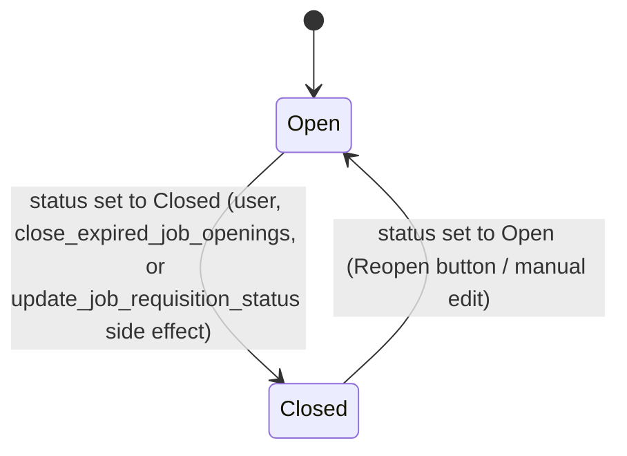

# Job Opening

**Source:** `hrms/hr/doctype/job_opening/job_opening.json`, `job_opening.py`, `job_opening.js`, `job_opening_dashboard.py`; public endpoint `hrms/www/jobs/index.py` (+`index.html`, `index.js`, `index.css`)
**Submittable:** no   **Tree:** no   **Naming:** Expression — `autoname: "HR-OPN-.YYYY.-.####"` (prefix `HR-OPN-`, current 4-digit year, then a 4-digit auto-increment counter reset per pattern, e.g. `HR-OPN-2026-0001`)
**Module:** HR

This doctype is a **Website Generator** (`WebsiteGenerator` base class, not plain `Document`) — it has a public web page rendered from `templates/generators/job_opening.html` whenever `publish = 1`, and it participates in the site's URL routing via its `route` field. `has_web_view: 1`, `allow_guest_to_view: 1`, `is_published_field: "publish"`.

## Schema

| Field (fieldname) | Label | Type | Options/Link Target | Required | Default | Read-Only | Notes |
|---|---|---|---|---|---|---|---|
| *(job_details_section)* | | Section Break | | | | | group heading |
| job_opening_template | Job Opening Template | Link | [[Job Opening Template]] | no | — | no | on change (client), copies template fields into this doc (see Port Notes) |
| job_title | Job Title | Data | — | yes | — | no | `in_list_view`; title field; client auto-fills from `designation` when designation changes |
| designation | Designation | Link | Designation | yes | — | no | `in_list_view`, `in_standard_filter` |
| *(column_break_5)* | | Column Break | | | | | layout only |
| status | Status | Select | `Open`, `Closed` | no | — | no | hidden (not shown on form directly — toggled via custom button); `in_list_view`, `in_standard_filter`; also declared in `states` metadata (Open=Green, Closed=Gray) |
| posted_on | Posted On | Datetime | — | no | `Now` | no | — |
| closes_on | Date | Date | — | no | — | no | `depends_on: eval:doc.status == 'Open'`; "If set, the job opening will be closed automatically after this date" |
| closed_on | Closed On | Date | — | no | — | no | `depends_on: eval:doc.status == 'Closed'` |
| *(section_break_nngy "Company Details")* | | Section Break | | | | | group heading |
| company | Company | Link | Company | yes | — | no | `in_list_view`, `in_standard_filter` |
| department | Department | Link | Department | no | — | no | `in_list_view`, `in_standard_filter`; client restricts department query to `company` |
| *(column_break_dxpv)* | | Column Break | | | | | layout only |
| employment_type | Employment Type | Link | [[Employment Type]] | no | — | no | `in_list_view`, `in_standard_filter` |
| location | Location | Link | Branch | no | — | no | — |
| *(references_section "References", collapsible)* | | Section Break | | | | | group heading |
| staffing_plan | Staffing Plan | Link | [[Staffing Plan]] | no | — | yes | auto-derived, see Business Logic |
| planned_vacancies | Planned number of Positions | Int | — | no | — | yes | `depends_on: staffing_plan`; auto-derived |
| job_requisition | Job Requisition | Link | [[Job Requisition]] | no | — | yes | set via `associate_job_opening` or `make_job_opening` mapped-doc flow |
| vacancies | Vacancies | Int | — | no | — | yes | `depends_on: job_requisition`; fetch_from `job_requisition.no_of_positions` |
| *(section_break_6)* | | Section Break | | | | | group heading |
| publish | Publish on website | Check | — | no | `0` | no | `in_list_view`, `in_standard_filter`; drives `is_published_field` for the website generator |
| prevent_duplicate_applicant | Prevent Duplicate Applications | Check | — | no | `0` | no | `depends_on: publish`; "If enabled, candidates who have already applied with the same email address will not be allowed to apply again" (enforced in `Job Applicant.before_insert`, not in this doctype) |
| route | Route | Data | — | no | — | no | `depends_on: publish`; `unique: 1`; auto-generated if empty (see Validation Rules) |
| publish_applications_received | Publish Applications Received | Check | — | no | `1` | no | `depends_on: publish`; "If enabled, the total no. of applications received for this opening will be displayed on the website" |
| *(column_break_12)* | | Column Break | | | | | layout only |
| job_application_route | Application Web Form Route | Data | — | no | — | no | `depends_on: publish`; "Route to the custom Job Application Webform" |
| *(section_break_14)* | | Section Break | | | | | group heading |
| description | Job Description | Text Editor | — | no | — | no | "Job profile, qualifications required etc."; `in_list_view` |
| *(pay_details_tab "Pay Details")* | | Tab Break | | | | | tab heading |
| currency | Currency | Link | Currency | no | — | no | — |
| lower_range | Lower Range | Currency | options `currency` | no | — | no | `non_negative`; `precision: 0` |
| upper_range | Upper Range | Currency | options `currency` | no | — | no | `non_negative`; `precision: 0` |
| *(column_break_pfir)* | | Column Break | | | | | layout only |
| salary_per | Salary Paid Per | Select | `Month`, `Year` | no | `Month` | no | — |
| publish_salary_range | Publish Salary Range | Check | — | no | `0` | no | — |

## Child Tables

None — Job Opening has no Table fields.

## State Machine

Not submittable. Status is the two-value Select `status` (`Open` / `Closed`), declared in JSON `states` (Open=Green, Closed=Gray).

Plain list:

| From | Event | To | Guard |
|---|---|---|---|
| (new doc) | insert | Open or Closed | whatever the user/API sets `status` to on creation (no default enforced in JSON; UI custom button implies Open is the normal starting state) |
| Open | user sets `status = Closed` (form save, "Close Job Opening" button, or programmatic) | Closed | On save: `update_closing_date()` clears `closes_on`, sets `closed_on = today()` if not already set; `validate_dates()` checks `posted_on <= closed_on`; client `get_close_warning` may prompt a confirmation if a Staffing Plan is linked |
| Closed | user sets `status = Open` (form save, "Reopen Job Opening" button) | Open | `update_closing_date()` clears `closed_on` |
| Open | `closes_on` date has passed (scheduled job) | Closed | `close_expired_job_openings()` — see Scheduled Jobs section |

## Validation Rules (exact, in execution order)

`validate()` runs, in order:

1. IF `route` is falsy THEN set `route = f"jobs/{scrub(company)}/{scrub(job_title).replace('_','-')}"` (`frappe.scrub` lower-cases and replaces spaces/special chars with underscores; the job_title's underscores are then converted to hyphens). No error thrown — this is a default-fill, not a validation. (source: `validate`)
2. `update_closing_date()`: compare `self.get_doc_before_save()` (previous DB state) to current:
   a. IF old `status == "Open"` AND new `status == "Closed"` THEN `closes_on = None`; IF `closed_on` not already set THEN `closed_on = today()`.
   b. ELSE IF old `status == "Closed"` AND new `status == "Open"` THEN `closed_on = None`.
   c. IF this is a new document (`get_doc_before_save()` returns nothing) THEN skip entirely — no adjustment on insert.
3. `validate_dates()`:
   a. IF `status == "Open"` THEN call Frappe's standard `validate_from_to_dates("posted_on", "closes_on")` — throws the framework-standard error if `closes_on` is set and is earlier than `posted_on` (Frappe core message pattern: `"{0} must be after {1}"`, exact wording comes from `frappe/model/document.py`'s `validate_from_to_dates`, not this doctype's own message — not reproduced verbatim here since it is framework-level, not doctype-level).
   b. IF `status == "Closed"` THEN call `validate_from_to_dates("posted_on", "closed_on")` (same framework check against `closed_on` instead).
4. `validate_current_vacancies()`:
   a. IF `status == "Closed"` THEN return immediately (no vacancy check for closed openings).
   b. IF `staffing_plan` is not set: look up `get_active_staffing_plan_details(company, designation)`; IF found, set `staffing_plan = result[0].name` and `planned_vacancies = result[0].vacancies`.
   c. ELSE IF `staffing_plan` is set but `planned_vacancies` is falsy: set `planned_vacancies = frappe.db.get_value("Staffing Plan Detail", {"parent": staffing_plan, "designation": designation}, "vacancies")`.
   d. IF both `staffing_plan` and `planned_vacancies` are truthy:
      - Compute `designation_counts = get_designation_counts(designation, company, self.name)` → `current_count = designation_counts.employee_count + designation_counts.job_openings`.
      - Look up `number_of_positions = frappe.db.get_value("Staffing Plan Detail", {"parent": staffing_plan, "designation": designation}, "number_of_positions")`.
      - IF `number_of_positions <= current_count` THEN `frappe.throw(_("Job Openings for the designation {0} are already open or the hiring is complete as per the Staffing Plan {1}"), title=_("Vacancies fulfilled"))` (designation bolded, Staffing Plan rendered as a link).

(`get_active_staffing_plan_details` and `get_designation_counts` live in `hrms/hr/doctype/staffing_plan/staffing_plan.py` — Staffing Plan is outside this agent's assigned doctypes; treat as an external dependency to be documented by whichever module owns Staffing Plan.)

Whitelisted validation-adjacent method (not part of `validate()`, called from client before save when closing):

5. `get_close_warning()`: IF `is_opening_being_closed()` is false (i.e. this is a new doc, or `status != "Closed"`, or the DB's *previous* status was not `"Open"`) THEN return nothing (no warning). IF `staffing_plan` is not set THEN return nothing. ELSE return the message `"Closing this Job Opening for {1} may not be according to the Staffing Plan {0}.  Do you want to close this Job Opening?"` (Staffing Plan bolded+linked, designation bolded) — this is a **soft confirmation, not a hard block**; the client shows a `frappe.confirm` and proceeds regardless of the user's choice being "yes."

## Business Logic / Calculations

**Route auto-generation** (`validate`, step 1 above): `route = "jobs/" + scrub(company) + "/" + scrub(job_title).replace("_", "-")`. Client-side (`job_opening.js`, `set_route`) computes the same route independently as `jobs/${scrub(company)}/${scrub(job_title)}` (note: the client version does NOT replace underscores with hyphens — this is a **discrepancy between client and server route generation**; the server-computed value is authoritative since it runs on every save, but a port should decide whether to replicate the hyphen replacement, since Frappe's server `validate` always overwrites `route` when it's empty, and the client-set route only affects what's shown before the real save round-trip. Flagged for port.)

**Staffing Plan auto-association** (`validate_current_vacancies`, steps 4b–4d above): pulls the applicable Staffing Plan and its planned vacancy count for the (company, designation) pair, then throws if hiring already meets or exceeds `number_of_positions` from the Staffing Plan Detail child row, counting existing Employees of that designation plus other open Job Openings for the same designation (via `get_designation_counts`, excluding the current Job Opening record itself via the `self.name` exclusion argument).

**Job Requisition status sync** (`on_update` → `update_job_requisition_status`):
1. IF `status == "Closed"` AND `job_requisition` is set:
   a. Load the linked [[Job Requisition]] document.
   b. Set its `status = "Filled"`, `completed_on = today()`.
   c. Save with `flags.ignore_permissions = True` and `flags.ignore_mandatory = True` (bypasses the Job Requisition's own mandatory-field/permission checks, including the "`completed_on` mandatory when Filled" rule — trivially satisfied here anyway since it's being set to today, but also bypasses permission checks entirely).

## Lifecycle Hooks (exact)

| Event | What Runs | Side Effects on Other Doctypes |
|---|---|---|
| autoname | `set_name_from_naming_options(meta.autoname, self)` — resolves the `HR-OPN-.YYYY.-.####` expression | none |
| validate | route default-fill → `update_closing_date()` → `validate_dates()` → `validate_current_vacancies()` (exact order) | none directly (reads Staffing Plan / Staffing Plan Detail) |
| on_update | `update_job_requisition_status()` | Writes `status`/`completed_on` on linked `Job Requisition` (permission- and mandatory-check bypassed) |
| get_context (web view only, not a DB hook) | Sets `context.no_of_applications = count(Job Applicant where job_title = this.name)`, `context.parents`, `context.posted_on = pretty_date(posted_on)` | Reads `Job Applicant` (count only) |

## Whitelisted / API Methods

| Method name | HTTP-equivalent purpose | Args | Returns | What it does |
|---|---|---|---|---|
| `get_close_warning` (instance method) | Pre-close confirmation text | none | `str` message or `None` | See Validation Rules #5 above. |

(`make_job_opening` and `associate_job_opening`, which also create/modify Job Opening records, are defined on [[Job Requisition]]. `create_job_opening_from_template` is defined on [[Job Opening Template]].)

## Permissions

| Role | Read | Write | Create | Delete | Submit | Cancel | Amend | Report | Export | Notes |
|---|---|---|---|---|---|---|---|---|---|---|
| System Manager | yes | yes | yes | yes | n/a | n/a | n/a | yes | yes | email, print, share also granted |
| HR User | yes | yes | yes | no | n/a | n/a | n/a | yes | no | email, print, share also granted; no delete |
| HR Manager | yes | yes | yes | yes | n/a | n/a | n/a | yes | yes | email, print, share also granted |

`allow_guest_to_view: 1` at the doctype level additionally lets unauthenticated ("Guest") users view the **public web page** for a Job Opening when `publish = 1` — this is separate from the standard role-based permission table above and is enforced by the Website Generator / `is_published_field` mechanism, not by a `permissions` row. `allow_import: 1` also permits bulk import for roles with create rights.

## Public Job Board (hrms/www/jobs/index.py)

This module renders the public `/jobs` listing page (`get_context`, called by Frappe's web routing when a Guest or logged-in user visits `/jobs`). No authentication is required to view it (standard Frappe web-page guest access); `context.no_cache = 1` (page is never cached).

**Query used to list openings** (`get_job_openings`):
- Base query: `Job Opening` LEFT JOIN `Job Applicant` ON `Job Applicant.job_title == Job Opening.name` (Job Applicant's `job_title` field actually stores the linked Job Opening's name — a naming quirk carried over from source, not a real "title").
- Selected columns: `name, status, job_title, description, publish_applications_received, publish_salary_range, lower_range, upper_range, currency, job_application_route, salary_per, route, location, department, employment_type, company, posted_on, closes_on`, plus `COUNT(Job Applicant.job_title) AS no_of_applications` (aggregated per Job Opening via `GROUP BY Job Opening.name`).
- WHERE base condition: `status == "Open"` AND `publish == 1` (mandatory — only open, publish-enabled openings are ever listed).
- Additional WHERE clauses, one per active filter key (see "Filter/search params" below): `field IN (values)`.
- IF a search text (`txt`) is present: `WHERE job_title LIKE '%txt%' OR description LIKE '%txt%'` (SQL `LIKE`, so this is a naive substring match, not a full-text/ranked search).
- `ORDER BY posted_on ASC` if `sort == "asc"`, else `ORDER BY posted_on DESC` (default is descending/newest-first whenever `sort` isn't exactly `"asc"`).
- `LIMIT 20 OFFSET <page offset>` — page size is a hardcoded constant `page_len = 20`.
- Post-processing: `posted_on` is converted to a human-readable relative string via `pretty_date()` before being returned to the template.

**Pagination count** (`get_no_of_pages`): identical WHERE-clause construction (status Open + publish 1 + same filters + same text search) but selects `COUNT(*)`, then `no_of_pages = ceil(count / 20)`.

**Filter/search params accepted** (`get_filters_txt_sort_offset`, reading `frappe.request.args` — i.e. GET query-string parameters):
- `company`, `department`, `employment_type`, `location` — these are the only 4 allowlisted filter keys (`allowed_filters`); any of these repeated as multi-value query params become an `IN (...)` filter. Any other query-string key is silently ignored (not an error).
- `query` — free-text search string (first value only), matched against `job_title`/`description` via `LIKE`.
- `sort` — `"asc"` or anything else (effectively any other value, including absent, means descending by `posted_on`).
- `page` — 1-based page number; converted to `offset = (page - 1) * 20`. No bounds-checking is done on the raw `page` param when computing the offset (an out-of-range page simply yields zero results — the HTML template separately clamps `page` display to `1..no_of_pages` when rendering the pager, but the *query offset itself is not clamped*, this is a **Port Note-worthy gap**: passing an arbitrarily large `page` value returns an empty result set rather than erroring or clamping server-side).

**Facet/filter option list** (`get_all_filters`, used to render the sidebar/drawer facets):
- Loads ALL currently `publish=1, status="Open"` Job Openings' `company, department, employment_type, location` values (unfiltered by the current search text or other applied filters, except see next point).
- For `company`: always shows the full distinct set of companies across all open+published openings.
- For every other facet type (`department`, `employment_type`, `location`): only includes values belonging to openings whose `company` is in the currently-selected `company` filter (if any `company` filter is active); if no `company` filter is active, all values are shown.
- Result: `{facet_name: sorted list of distinct non-empty values}`.

**Fields returned/rendered on the public page** (per `index.html` template, using the query's selected columns): `job_title`, `company`, `posted_on` (relative date string), `employment_type` (rendered as a colored badge: "Full-time", "Part-time", or a generic "other" style for any other value), `location`, `department`, salary block (only if `publish_salary_range` is true: formatted `lower_range`–`upper_range` in `currency`, plus `salary_per` lowercased, e.g. "/ month"), `no_of_applications` (only shown if `publish_applications_received` is true), `closes_on` (formatted `d MMM, YYYY`, shown only if set), and `route` (used as the card's DOM id / link target for navigating to the individual job's detail page). `description` is selected by the query but not directly echoed on the list page (used implicitly by the LIKE search only) — the full description is rendered on the individual Job Opening's own detail page (`templates/generators/job_opening.html`, driven by `get_context` on the doctype controller), not on `/jobs`.

**Access control:** Guest-readable by design (`context.no_cache=1`, no permission check in `get_context`/`get_job_openings`/`get_no_of_pages`/`get_all_filters` — these run as whatever the requesting session is, but since the query is hardcoded to `status="Open" AND publish=1`, published+open Job Openings are effectively public data regardless of session; no explicit `frappe.has_permission` check appears anywhere in this file). The page's breadcrumb differs only cosmetically by session state (`"Home"` for Guest vs `"My Account"` for a logged-in user) — this has no bearing on what data is queryable.

## Scheduled Jobs Touching This Doctype

| Frequency (hooks.py key) | Function | What it does |
|---|---|---|
| `daily` | `hrms.hr.doctype.job_opening.job_opening.close_expired_job_openings` | Queries all `Job Opening` rows where `status == "Open"` AND `closes_on` is not null AND `closes_on < today()`. For each match: loads the full document, sets `status = "Closed"`, saves with `flags.ignore_permissions = True` and `flags.ignore_mandatory = True`. This triggers the normal `validate`/`on_update` chain (so `closed_on` gets auto-set to today via `update_closing_date()`, and if a `job_requisition` is linked, `update_job_requisition_status()` marks that Job Requisition `Filled` as a cascading side effect). |

(Registered in `hrms/hooks.py` under `scheduler_events["daily"]`, exact entry: `"hrms.hr.doctype.job_opening.job_opening.close_expired_job_openings"`.)

## Cross-Doctype Logic (Job Applicant / Job Offer / Employee)

- `hrms/hr/doctype/job_applicant/job_applicant.py`, `before_insert`: IF the new [[Job Applicant]]'s `job_title` (which actually stores a Job Opening name) resolves to a Job Opening THEN:
  - IF that Job Opening's `status == "Closed"` → `frappe.throw(_("Cannot create a Job Applicant against a closed Job Opening"), title=_("Not Allowed"))`.
  - IF that Job Opening's `prevent_duplicate_applicant` is truthy AND the new applicant has an `email_id` → duplicate-email check against existing Job Applicants (full detail belongs in the Job Applicant spec file, owned by another agent — flagged here only because it reads Job Opening fields).
  - Elsewhere in `job_applicant.py`, a Job Opening's `company`, `department`, `employment_type` are fetched (via `frappe.db.get_value`) to populate/default the new Job Applicant's corresponding fields.
- No references to Job Opening or Job Requisition were found in `hrms/overrides/` or `hrms/controllers/`.
- No references to Job Opening/Job Requisition were found in `Job Offer` or `Employee Referral` doctype source.
- These are documented here for completeness per the assignment; the authoritative Job Applicant/Job Offer field-level specs are owned by another agent.

## Port Notes

- `HR-OPN-.YYYY.-.####` naming: reproduce as `HR-OPN-<4-digit-year>-<4-digit-incrementing-counter>`; Frappe resets/keys the counter per literal expanded prefix (i.e., effectively per year here, since `.YYYY.` expands before the counter is applied) — verify against live data if exact reset semantics matter for the port.
- `WebsiteGenerator` base class behavior is significant and easy to under-port: it automatically (a) exposes a public detail page at `route` whenever `publish` is truthy, (b) enforces `route` uniqueness (`unique: 1` on the field, plus underlying route-collision handling in core Frappe), and (c) calls `get_context()` on that public page to inject `no_of_applications`, `parents` breadcrumb, and a `pretty_date`-formatted `posted_on`. A port needs an explicit "published content" routing layer to replicate this, not just a boolean flag.
- Client script auto-fill: selecting a `job_opening_template` copies `designation, department, employment_type, location, description, currency, upper_range, lower_range, salary_per, publish_salary_range` from the template into the Job Opening — this is **client-only**, no server-side equivalent exists in `job_opening.py`. Flagged: if the target stack allows creating Job Openings via API without going through the form, these fields will NOT be auto-populated from the template unless the port adds an explicit server-side "apply template" step.
- Client script also auto-fills `job_title = designation` when `designation` changes, and resets `designation` to blank whenever `company` changes — both client-only, no server equivalent.
- The route-generation discrepancy between client (`job_opening.js: set_route`) and server (`job_opening.py: validate`) noted in Business Logic (hyphen vs. underscore handling) should be resolved one way in the port; server behavior is authoritative since it always runs on save.
- Frappe automatic behaviors relied on implicitly: `creation`/`modified`/`modified_by`/`owner` audit columns; `sort_field`/`sort_order` = `creation ASC` (note: ascending, opposite of most other doctypes in this module) for default list ordering; `title_field = job_title`; `show_title_field_in_link: 1` (link fields referencing Job Opening display `job_title` instead of the raw `name`); Currency field auto-rounding — `lower_range`/`upper_range` have explicit `precision: 0` (whole-number currency, no decimals) which overrides the site-wide default currency precision and must be explicitly enforced in the port's persistence/formatting layer.
- `close_expired_job_openings` and `update_job_requisition_status` both save with `ignore_permissions=True, ignore_mandatory=True` — a port's equivalent "system/background job" write path must be able to bypass normal validation/authorization the same way, or the cascading Job Requisition update will silently fail once ported to a stack with strict ORM-level validation.

## Related Doctypes

- [[Job Opening Template]] — optional source of default field values, copied client-side on selection.
- [[Job Requisition]] — optional internal request this opening fulfills; closing this opening cascades to mark the requisition Filled.
- [[Staffing Plan]] — auto-associated vacancy source used to cap how many openings can be created for a designation.
- [[Employment Type]] — the employment type offered for this opening.
- [[Job Applicant]] — candidates apply against this opening; a closed opening blocks new applications.
- [[Background Jobs (Scheduler Events)]] — documents the general scheduler mechanism used by `close_expired_job_openings` (daily).
