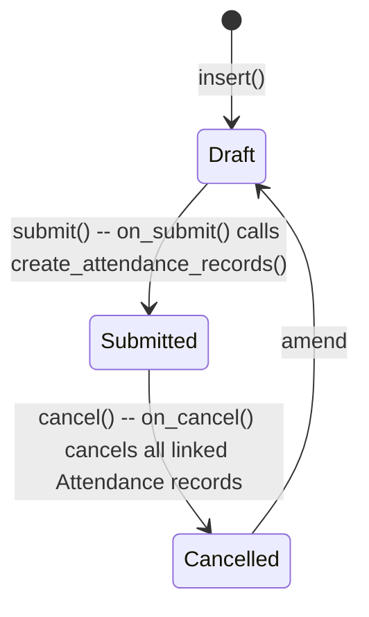

# Attendance Request

**Source:** `hrms/hr/doctype/attendance_request/attendance_request.json`, `attendance_request.py`, `attendance_request.js`
**Submittable:** yes   **Tree:** no   **Naming:** `autoname: "HR-ARQ-.YY.-.MM.-.#####"` (naming_rule: Expression)
**Module:** HR

## Schema

| Field (fieldname) | Label | Type | Options/Link Target | Required | Default | Read-Only | Notes |
|---|---|---|---|---|---|---|---|
| employee | Employee | Link | [[Employee Core Model]] | yes | — | no | in_list_view |
| employee_name | Employee Name | Data | — | no | — | yes | fetch_from `employee.employee_name` |
| department | Department | Link | Department | no | — | yes | fetch_from `employee.department` |
| company | Company | Link | Company | yes | — | no | fetch_from `employee.company`; `remember_last_selected_value` |
| column_break_5 | (Column) | Column Break | — | — | — | — | |
| from_date | From Date | Date | — | yes | — | no | in_list_view |
| to_date | To Date | Date | — | yes | — | no | in_list_view |
| half_day | Half Day | Check | — | no | 0 | no | |
| half_day_date | Half Day Date | Date | — | conditionally (`mandatory_depends_on: half_day`) | — | no | `depends_on: half_day` |
| include_holidays | Include Holidays | Check | — | no | 0 | no | "Select if any of the days selected for request are holidays" |
| shift | Shift | Link | [[Shift Type]] | no | — | no | description: "Note: Shift will not be overwritten in existing attendance records" |
| reason_section | Reason | Section Break | — | — | — | — | |
| reason | Reason | Select | Work From Home / On Duty | yes | — | no | in_list_view |
| column_break_4 | (Column) | Column Break | — | — | — | — | |
| explanation | Explanation | Small Text | — | no | — | no | |
| amended_from | Amended From | Link | Attendance Request | no | — | yes | no_copy |

## Child Tables

None.

## State Machine

Plain list:
- (Draft, submit, Submitted, guard: none in controller beyond field validations) -> `on_submit` creates/updates one Attendance per covered day.
- (Submitted, cancel, Cancelled, guard: none explicit) -> `on_cancel` cancels every submitted Attendance whose `attendance_request == self.name`.
- (Draft, discard, "Cancelled" data value) -> `on_discard` sets `self.db_set("status", "Cancelled")` — **Port Note:** there is no `status` field defined in this doctype's JSON schema; this `db_set` call targets a non-existent field in the shown schema (see Port Notes).

## Validation Rules (exact, in execution order)

`validate()`:
1. `validate_active_employee(self.employee)` -> throws `InactiveEmployeeStatusError` if Employee Inactive.
2. `validate_dates(self, from_date, to_date, restrict_future_dates=False)` (source: `hrms.hr.utils.validate_dates`):
   a. IF `from_date > to_date` THEN `frappe.throw(_("To date can not be less than from date"))`.
   b. ELIF `from_date > today` AND `restrict_future_dates` -> (skipped here since `restrict_future_dates=False` is passed).
   c. ELIF Employee has `date_of_joining` AND `from_date < date_of_joining` THEN `frappe.throw(_("From date can not be less than employee's joining date"))`.
   d. ELIF Employee has `relieving_date` AND `to_date > relieving_date` THEN `frappe.throw(_("To date can not greater than employee's relieving date"))`.
3. `validate_shifts()`:
   - `shifts = get_active_shifts()` — distinct `shift_type` values from submitted Shift Assignments for this employee where `start_date <= from_date AND end_date >= to_date` (comment notes expired assignments — auto-marked Inactive — are still considered here since the docstatus/submitted filter alone is used, not `status="Active"`).
   - IF shifts found AND `self.shift` not set: IF exactly one shift found THEN auto-set `self.shift = shifts[0]`; ELSE (multiple) `frappe.throw(_("There are multiple shifts assigned to the employee for the same period. Please mention the shift"))`.
4. `validate_half_day()`: IF `self.half_day` THEN IF NOT (`from_date <= half_day_date <= to_date`) THEN `frappe.throw(_("Half day date should be in between from date and to date"))`.
5. `validate_request_overlap()`:
   - Query other Attendance Requests for the same employee, `docstatus < 2`, `name != self.name`, where date ranges overlap (`self.to_date >= other.from_date AND self.from_date <= other.to_date`); if `self.shift` set, additionally filter `other.shift == self.shift`.
   - IF any overlap found THEN `throw_overlap_error(name)`: `frappe.throw(_("Employee {0} already has an Attendance Request {1} that overlaps with this period").format(...))`, `title=_("Overlapping Attendance Request")`, `exc=OverlappingAttendanceRequestError`.
6. `validate_no_attendance_to_create()`:
   - `attendance_warnings = get_attendance_warnings()` (see Whitelisted Methods).
   - `attendance_request_days = date_diff(to_date, from_date) + 1`.
   - IF `len(attendance_warnings) == attendance_request_days` (every single day in the request produced a warning, i.e. nothing would actually change) AND none of the warnings has `action == "Overwrite"` THEN `frappe.msgprint(title=_("No attendance records to create due to following reasons"), msg=<table of Date/Reason/Action>, as_table=True, raise_exception=True)` — this raises (blocks submission).

## Business Logic / Calculations

### `create_attendance_records()` (called from `on_submit`)

1. `request_days = date_diff(to_date, from_date) + 1`.
2. FOR EACH `day` in `range(request_days)`: `attendance_date = from_date + day`. IF `should_mark_attendance(attendance_date)` (see below) THEN `create_or_update_attendance(attendance_date)`.

### `should_mark_attendance(attendance_date)`

1. IF NOT `include_holidays` AND `is_holiday(employee, attendance_date)` THEN msgprint "Attendance not submitted for {date} as it is a Holiday." and return `False`.
2. ELIF `has_leave_record(attendance_date)` (approved, submitted Leave Application covering the date; if `half_day_date == attendance_date` additionally require `half_day = 0` on that leave application) THEN msgprint "Attendance not submitted for {date} as {employee} is on leave." and return `False`.
3. ELSE return `True`.

### `get_attendance_status(attendance_date)`

1. IF `self.half_day` AND `date_diff(half_day_date, attendance_date) == 0` THEN return `"Half Day"`.
2. ELIF `self.reason == "Work From Home"` THEN return `"Work From Home"`.
3. ELSE return `"Present"`.

### `create_or_update_attendance(date)`

1. `doc = get_attendance_doc(date)` — existing non-cancelled [[Attendance]] for this employee+date+`self.shift` (exact match including shift, even if `None`).
2. `status = get_attendance_status(date)`.
3. IF `doc` exists:
   a. `old_status = doc.status`.
   b. IF `old_status != status`:
      - `doc.db_set({"status": status, "attendance_request": self.name})`.
      - IF `status == "Half Day"` THEN additionally `doc.db_set("half_day_status", "Absent")` and comment text mentions both status and half-day-status change; ELSE comment text mentions only the status change.
      - `doc.add_comment(comment_type="Info", text=<the constructed message>)`.
      - `frappe.msgprint` informing the user of the update, linking to the Attendance.
   c. ELIF `status == "Half Day"` AND `doc.half_day_status == "Absent"` AND `self.half_day` (i.e. status unchanged but this request explicitly wants the half-day resolved to Present):
      - `doc.db_set({"half_day_status": "Present", "attendance_request": self.name})`.
      - Add an Info comment and msgprint about the Status-for-Other-Half change.
   d. ELSE (status unchanged and no half-day resolution applicable) — no-op, nothing written for this date.
4. ELSE (no existing attendance doc): create a new `Attendance` (`employee, attendance_date=date, shift=self.shift, company=self.company, attendance_request=self.name, status, half_day_status="Absent" if status=="Half Day" else None`), `insert(ignore_permissions=True)`, `submit()`.

### `get_attendance_warnings()` — whitelisted (see below); used both by validation and by the client dashboard

1. FOR EACH `attendance_date` in the request's day range:
   - IF holiday and not `include_holidays` THEN warning `{date, reason:"Holiday", action:"Skip"}`.
   - ELIF `has_leave_record(attendance_date)` THEN warning `{date, reason:"On Leave", action:"Skip"}`.
   - ELIF `status_unchanged(attendance_date)` (existing attendance already has the target status, AND it's not a Half Day record whose half_day_status is still "Absent" while this request's `half_day` flag would resolve it) THEN warning `{date, reason:"Attendance status unchanged", action:"Skip"}`.
   - ELSE IF an existing Attendance doc is found for the date THEN warning `{date, reason:"Attendance already marked", record:name, action:"Overwrite"}`.
   - ELSE (no warning) — day will produce a fresh Attendance record.

## Lifecycle Hooks (exact)

| Event | What Runs | Side Effects on Other Doctypes |
|---|---|---|
| validate | See Validation Rules | reads Employee, Shift Assignment, Attendance Request, Leave Application |
| on_submit | `create_attendance_records()` | creates/updates+submits `Attendance` records |
| on_cancel | Cancels every submitted `Attendance` where `employee=self.employee, attendance_request=self.name, docstatus=1` | cancels linked `Attendance` records |
| on_discard | `self.db_set("status", "Cancelled")` | targets a `status` field not present in this doctype's schema — see Port Notes |
| on_update | `publish_update()` — refetches realtime resources `hrms:my_attendance_requests` (for the employee's user) and `hrms:team_attendance_requests` | frontend realtime cache only |
| after_delete | `publish_update()` (same as above) | none |
| doc_events (hooks.py) | `on_submit`: `hrms.telemetry.on_attendance_request_submit` | telemetry only |

## Whitelisted / API Methods

| Method name | HTTP-equivalent purpose | Args | Returns | What it does |
|---|---|---|---|---|
| `get_attendance_warnings` (instance) | Preview which dates in the request will be skipped/overwritten before submit | none | `list[dict]` (date, reason, action, optional record) | See Business Logic above; also rendered in the form's dashboard headline via the `attendance_warnings.html` template |

## Permissions

| Role | Read | Write | Create | Delete | Submit | Cancel | Amend | Report | Export | Notes |
|---|---|---|---|---|---|---|---|---|---|---|
| System Manager | yes | yes | yes | yes | yes | yes | yes | yes | yes | |
| HR Manager | yes | yes | yes | yes | yes | yes | yes | yes | yes | |
| HR User | yes | yes | yes | yes | yes | yes | yes | yes | yes | |
| Employee | yes | yes | yes | yes | no | no | no | yes | yes | can create/edit own drafts but not submit/cancel |

## Scheduled Jobs Touching This Doctype

None found in `hrms/hooks.py` scheduler_events.

## Port Notes

- **`on_discard` calls `self.db_set("status", "Cancelled")` but the doctype's JSON `fields` array has no `status` field** (unlike `Shift Request`, which does have one). This looks like dead/stale code carried over, or relies on a field that exists in a base class/mixin not shown here. Flag explicitly: **do not silently add a `status` field to "fix" this** — reproduce the same absence and note the anomaly, or confirm with the product owner whether `status` should exist on this doctype before porting.
- **`get_attendance_doc` matches on exact `shift` equality**, including when `self.shift` is `None`/unset — meaning a request with no shift will only match/update an existing Attendance that also has no shift, not any Attendance regardless of shift. Reproduce this literally (do not treat `shift=None` as a wildcard).
- **`create_or_update_attendance` uses `doc.db_set(...)` for updates** (direct DB write bypassing `validate()`) but `frappe.new_doc(...).insert()` + `.submit()` for creates (full validation pipeline) — this asymmetry must be preserved: updates to existing Attendance via this path do NOT re-run Attendance's own validation rules (duplicate/overlap/leave checks).
- **`half_day` resolution to "Present" only happens when the Attendance's current `half_day_status` is exactly `"Absent"`** (see `create_or_update_attendance` step 3c) — a Half Day attendance that's already "Present" for the other half is left untouched even if this Attendance Request also targets Half Day.
- **`validate_no_attendance_to_create` can block submission entirely** via `raise_exception=True` inside `frappe.msgprint` — this is an unusual Frappe pattern (msgprint-as-exception) that a port needs to translate into a standard validation error with the same tabular message content (Date/Reason/Action).

## Related Doctypes

- [[Employee Core Model]] — the request is filed for this employee.
- [[Attendance]] — this doctype creates, updates, and cancels Attendance records for each day covered by the request.
- [[Shift Type]] — `shift` optionally scopes the request/attendance to a specific shift; also used to resolve overlapping shift assignments.
