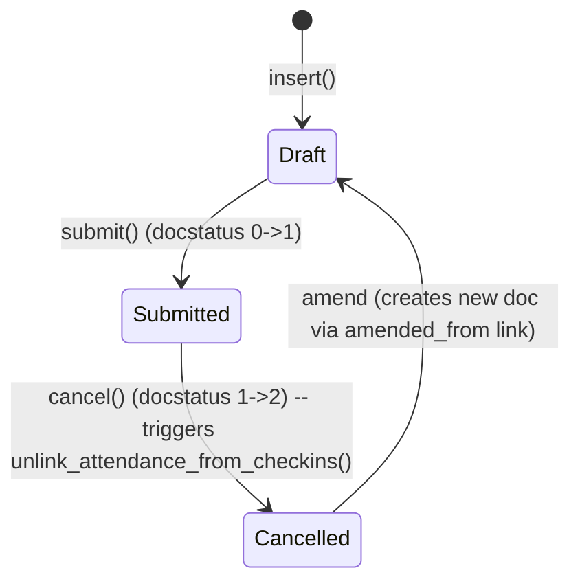

# Attendance

**Source:** `hrms/hr/doctype/attendance/attendance.json`, `attendance.py`, `attendance.js`
**Submittable:** yes   **Tree:** no   **Naming:** `naming_series:` field, series pattern `HR-ATT-.YYYY.-`
**Module:** HR

## Schema

| Field (fieldname) | Label | Type | Options/Link Target | Required | Default | Read-Only | Notes |
|---|---|---|---|---|---|---|---|
| attendance_details | (Section) | Section Break | — | — | — | — | layout only |
| naming_series | Series | Select | `HR-ATT-.YYYY.-` | yes | — | no | `set_only_once` |
| employee | Employee | Link | [[Employee Core Model]] | yes | — | no | search_index |
| employee_name | Employee Name | Data | — | no | — | yes | fetch_from `employee.employee_name` |
| working_hours | Working Hours | Float | — | no | — | yes | precision 2; `depends_on: working_hours` |
| status | Status | Select | (blank)/Present/Absent/On Leave/Half Day/Work From Home | yes | Present | no | search_index |
| leave_type | Leave Type | Link | [[Leave Type]] | conditionally | — | no | `depends_on`/`mandatory_depends_on: eval:in_list(["On Leave","Half Day"], doc.status)` |
| leave_application | Leave Application | Link | [[Leave Application]] | no | — | yes | |
| column_break0 | (Column) | Column Break | — | — | — | — | |
| attendance_date | Attendance Date | Date | — | yes | — | no | search_index; in_list_view |
| company | Company | Link | Company | yes | — | yes | fetch_from `employee.company` |
| department | Department | Link | Department | no | — | yes | fetch_from `employee.department` |
| shift | Shift | Link | [[Shift Type]] | no | — | no | |
| attendance_request | Attendance Request | Link | [[Attendance Request]] | no | — | yes | no_copy |
| amended_from | Amended From | Link | Attendance | no | — | yes | no_copy; standard amend-chain field |
| late_entry | Late Entry | Check | — | no | 0 | no | |
| early_exit | Early Exit | Check | — | no | 0 | no | |
| details_section | Details | Section Break | — | — | — | — | |
| in_time | In Time | Datetime | — | no | — | yes | `depends_on: shift` |
| out_time | Out Time | Datetime | — | no | — | yes | `depends_on: shift` |
| column_break_18 | (Column) | Column Break | — | — | — | — | |
| half_day_status | Status for Other Half | Select | (blank)/Present/Absent | no | — | no | no_copy; `depends_on: eval:doc.status=="Half Day"` |
| modify_half_day_status | modify_half_day_status | Check | — | no | 0 | no | hidden internal flag |
| overtime_section | Overtime | Section Break | — | — | — | — | `depends_on: overtime_type` |
| overtime_type | Overtime Type | Link | Overtime Type | no | — | yes | |
| column_break_idku | (Column) | Column Break | — | — | — | — | |
| standard_working_hours | Standard Working Hours | Float | — | no | — | yes | |
| actual_overtime_duration | Actual Overtime Duration | Float | — | no | — | yes | |

## Child Tables

None.

## State Machine

Plain list:
- (Draft, submit, Submitted) — no controller-level guard beyond standard Frappe submit permission checks.
- (Submitted, cancel, Cancelled) — guard: none in controller `validate`/`before_cancel`; `on_cancel` unconditionally unlinks Employee Checkins pointing at this Attendance (`unlink_attendance_from_checkins`).
- (Cancelled, amend, Draft-new) — standard Frappe amend flow; new doc gets `amended_from` set to the cancelled doc's name.

`status` field values (Present/Absent/On Leave/Half Day/Work From Home) are set by many code paths — see Business Logic / Validation sections. `half_day_status` (Present/Absent for the "other half" of a Half Day record) is set by `check_leave_record` (defaults to "Absent" when no leave record backs a Half Day/On Leave status), by `Shift Type.mark_absent_for_half_day_dates` (always "Absent"), and by `create_or_update_attendance` in `employee_checkin.py` ("Present" or "Absent" depending on checkin-derived status).

## Validation Rules (exact, in execution order)

Executed in `validate()`:

1. `validate_status(self.status, ["Present","Absent","On Leave","Half Day","Work From Home"])` (ERPNext utility) -> throws if status is not one of these exact values (source: `validate`).
2. `validate_active_employee(self.employee)` -> IF Employee.status == "Inactive" THEN `frappe.throw(_("Transactions cannot be created for an Inactive Employee {0}.").format(...))`, `exc=InactiveEmployeeStatusError` (source: `hrms.hr.utils.validate_active_employee`).
3. `validate_attendance_date`: fetch Employee's `date_of_joining`; IF set AND `attendance_date < date_of_joining` THEN `frappe.throw(_("Attendance date {0} can not be less than employee {1}'s joining date: {2}").format(attendance_date, employee, date_of_joining))` (source: `validate_attendance_date`).
4. `validate_duplicate_record` -> `get_duplicate_attendance_record()`: query existing Attendance where `employee = self.employee AND docstatus < 2 AND attendance_date = self.attendance_date AND name != self.name AND (half_day_status IS NULL OR half_day_status = '' OR modify_half_day_status = 0)`; additionally if `self.shift` is set, restrict to rows where shift is unset OR shift equals `self.shift`. IF a match exists THEN `frappe.throw(_("Attendance for employee {0} is already marked for the date {1}: {2}").format(employee, attendance_date, link))`, `title=_("Duplicate Attendance")`, `exc=DuplicateAttendanceError` (source: `validate_duplicate_record`/`get_duplicate_attendance_record`).
5. `validate_overlapping_shift_attendance` -> `get_overlapping_shift_attendance()`: for other non-cancelled Attendance rows on the same employee+date with a different shift, check `has_overlapping_timings(self.shift, other.shift)` (see [[Shift Assignment]]); IF True for any THEN `frappe.throw(_("Attendance for employee {0} is already marked for an overlapping shift {1}: {2}").format(...))`, `title=_("Overlapping Shift Attendance")`, `exc=OverlappingShiftAttendanceError` (source: `validate_overlapping_shift_attendance`/`get_overlapping_shift_attendance`). Only runs if `self.shift` is set.
6. `validate_employee_status`: IF Employee.status == "Inactive" THEN `frappe.throw(_("Cannot mark attendance for an Inactive employee {0}").format(self.employee))` (source: `validate_employee_status`) — NOTE: this duplicates check #2's intent via a slightly different query/message; both run.
7. `check_leave_record`:
   a. Query approved, submitted Leave Applications for this employee covering `attendance_date` (`from_date <= attendance_date <= to_date`, `status="Approved"`, `docstatus=1`).
   b. FOR EACH matching leave record: set `self.leave_type = d.leave_type`, `self.leave_application = d.name`; IF `d.half_day_date == attendance_date` THEN `self.status = "Half Day"` and `frappe.msgprint(_("Employee {0} on Half day on {1}"))`; ELSE `self.status = "On Leave"` and `frappe.msgprint(_("Employee {0} is on Leave on {1}"))`.
   c. IF final `self.status` in `("On Leave", "Half Day")` AND no leave record was found THEN `self.modify_half_day_status = 0`, `self.half_day_status = "Absent"`, and `frappe.msgprint(_("No leave record found for employee {0} on {1}"), alert=1)`.
   d. ELSE IF `self.leave_type` is set (leftover from a prior state, but status is not On Leave/Half Day) THEN clear it: `self.leave_type = None`, `self.leave_application = None`.
   (source: `check_leave_record`)

`before_insert()`: IF `self.half_day_status == ""` THEN set it to `None` (normalizes empty-string to null) — runs before `validate`.

## Business Logic / Calculations

Attendance itself does not compute working hours/status — that logic lives in `Shift Type.get_attendance` and `Employee Checkin.calculate_working_hours` (see [[Shift Type]] and [[Employee Checkin]]), which then call into this doctype's creation/update helpers described below.

### `mark_attendance(employee, attendance_date, status, shift=None, leave_type=None, late_entry=False, early_exit=False, half_day_status=None)` — module-level helper, savepoint-safe insert+submit

1. Create savepoint `"attendance_creation"`.
2. Build a new `Attendance` doc with the given fields and `insert()` then `submit()`.
3. IF `DuplicateAttendanceError` or `OverlappingShiftAttendanceError` is raised THEN rollback to the savepoint and return `None` (silently — no exception propagates to caller).
4. ELSE return the new Attendance's `name`.

Used by `Shift Type.mark_absent_for_dates_with_no_attendance` (see `Shift Type.md`).

### `mark_bulk_attendance(data)` — whitelisted, and `process_bulk_attendance_in_batches(data, chunk_size=20)`

1. `mark_bulk_attendance`: parse `data` (JSON or dict) with `unmarked_days` (list of dates), `employee`, `status`, `shift`.
2. IF `not data.unmarked_days` THEN `frappe.throw(_("Please select a date."))`.
3. IF `len(unmarked_days) > 10` OR `frappe.flags.test_bg_job` THEN enqueue `process_bulk_attendance_in_batches` as a deduplicated background job (`job_id = f"process_bulk_attendance_for_employee_{employee}"`, `timeout=600`); message links to the RQ Job (or, if a job with that id is already running, informs the user of the in-progress job).
4. ELSE run `process_bulk_attendance_in_batches(data)` synchronously and `frappe.msgprint(_("Attendance marked successfully."), alert=True)`.
5. `process_bulk_attendance_in_batches`: for each batch of `chunk_size` (20) dates: for each date, create-and-submit an Attendance (`half_day_status = "Absent" if status == "Half Day" else None`) inside a savepoint; on any Exception (including Duplicate/Overlap errors) rollback to savepoint and continue to next date (unless `frappe.flags.in_test`, in which case no rollback/commit happens per-batch). Commit after each batch (unless in test).

### `get_unmarked_days(employee, from_date, to_date, exclude_holidays=0)` — whitelisted

1. Permission check: `frappe.has_permission("Employee", "read", employee, throw=True)`.
2. Clamp `from_date` to `max(from_date, date_of_joining)`, `to_date` to `min(to_date, relieving_date)`.
3. Fetch all `attendance_date` values for this employee in range where `docstatus != 2`.
4. IF `exclude_holidays` THEN also add all holiday dates in range (via `get_holiday_dates_between_range`) to the "marked" set.
5. Walk every date from `from_date` to `to_date`; any date not in the marked set is added to `unmarked_days`. Return that list.

### `get_employee_shift(employee, for_date=None)` — whitelisted (Attendance-doctype-local helper, distinct from the same-named function in `shift_assignment.py`)

1. Permission checks: employee read permission and Shift Assignment read permission; if either denied, return `None`.
2. Default `for_date` to today if not given.
3. Find the most recent Active, submitted Shift Assignment for the employee with `start_date <= for_date`, ordered by `start_date desc`, limit 1; if found return its `shift_type`.
4. ELSE fall back to the Employee's `default_shift` field if set.
5. ELSE return `None`.

## Lifecycle Hooks (exact)

| Event | What Runs | Side Effects on Other Doctypes |
|---|---|---|
| before_insert | Normalize `half_day_status` empty string to `None` | none |
| validate | See Validation Rules above | reads Leave Application, Employee |
| on_cancel | `unlink_attendance_from_checkins()` — finds all `Employee Checkin` rows with `attendance = self.name` and bulk-sets their `attendance` field to `""`; `frappe.msgprint` listing unlinked checkins | writes `Employee Checkin.attendance = ""` for all linked rows |
| on_update | `publish_update()` — refetches realtime resource `hrms:attendance_calendar_events` for the employee's user | none (frontend realtime cache only) |
| after_delete | `publish_update()` (same as above) | none |

## Whitelisted / API Methods

| Method name | HTTP-equivalent purpose | Args | Returns | What it does |
|---|---|---|---|---|
| `get_events` | Calendar feed for logged-in user's own attendance | `start, end, filters, order_by` | `list[dict]` | Resolves current user's Employee, filters Attendance by date range, appends Holiday pseudo-events via `add_holidays` |
| `mark_bulk_attendance` | Bulk-mark attendance for many dates for one employee | `data` (JSON: employee, status, shift, unmarked_days[]) | none (msgprint) | See Business Logic above |
| `get_unmarked_days` | List dates with no attendance record for an employee in a range | `employee, from_date, to_date, exclude_holidays` | `list[date]` | See Business Logic above |
| `get_employee_shift` | Resolve the shift to default into a new/edited Attendance record client-side | `employee, for_date` | `str \| None` (Shift Type name) | See Business Logic above |

## Permissions

| Role | Read | Write | Create | Delete | Submit | Cancel | Amend | Report | Export | Notes |
|---|---|---|---|---|---|---|---|---|---|---|
| System Manager | yes | yes | yes | yes | yes | yes | n/a (amend not in JSON row but implied by submit+cancel) | yes | n/a | share, email, print |
| HR User | yes | yes | yes | yes | yes | yes | n/a | yes | yes | import also |
| HR Manager | yes | yes | yes | yes | yes | yes | n/a | yes | n/a | |
| Employee | yes | no | no | no | no | no | no | yes | yes | `select: 1` (can select in link fields but not full read list necessarily); share, email, print |

(Note: the raw JSON permission rows for System Manager/HR Manager do not include an explicit `amend: 1` key, but submit+cancel rights are present; treat amend as following standard Frappe convention of being implied for submit-capable roles unless a port framework requires it explicit.)

## Scheduled Jobs Touching This Doctype

Indirectly touched by the `hourly_long` jobs documented fully in [[Shift Type]]:
- `hrms.hr.doctype.shift_type.shift_type.process_auto_attendance_for_all_shifts` creates/updates Attendance records via `Employee Checkin.mark_attendance_and_link_log` / `create_or_update_attendance` (see [[Employee Checkin]]) and via `Shift Type.mark_absent_for_dates_with_no_attendance` / `mark_absent_for_half_day_dates` (see `Shift Type.md`).

No scheduler job reads/writes Attendance directly by name in `hrms/hooks.py` outside of that chain.

## Port Notes

- **Two employee-active-status checks exist in `validate()`** (`validate_active_employee` and `validate_employee_status`) with near-identical intent but different error messages/exception types. This is not a bug per se but redundant; a port should decide whether to keep both distinct messages or consolidate — note this explicitly rather than silently dropping one.
- **`get_duplicate_attendance_record`'s shift-based OR logic is unusual**: when `self.shift` is set, the query allows a duplicate to match if the existing row's shift is unset OR equals self.shift — meaning a shift-less Attendance and a shift-tagged Attendance for the same employee+date can conflict. Reproduce this exactly; do not "simplify" the OR condition.
- **`naming_series` uses Frappe's automatic year-based series counter** (`HR-ATT-.YYYY.-`) — a port needs an explicit auto-increment-per-year counter table/sequence since this is not a database default.
- **`track_changes: 1`** — full version/audit history is automatic in Frappe; must be built explicitly in the target stack if required.
- **`amended_from` / amend workflow** is a Frappe-standard pattern (cancel a submitted doc, then "amend" clones it into a new Draft linked via `amended_from`) — this needs to be an explicit workflow/state feature in the port, not just a nullable FK.
- **Currency/float precision**: `working_hours` has explicit `precision: 2`; other float fields (`standard_working_hours`, `actual_overtime_duration`) have no explicit precision override (falls back to site-wide default, typically 3 in Frappe) — a port should pick and document an explicit precision for these rather than relying on an implicit framework default.

## Related Doctypes

- [[Employee Core Model]] — the attendance record is filed against this employee.
- [[Shift Type]] — resolves the shift this attendance falls under; auto-attendance pipeline reads/writes Attendance records via this doctype.
- [[Attendance Request]] — parent request that can create/update Attendance rows for a date range and link back via `attendance_request`.
- [[Employee Checkin]] — auto-attendance processing links Checkin rows back to the Attendance record via `Employee Checkin.attendance`.
- [[Leave Type]] / [[Leave Application]] — `check_leave_record` sets these from an approved Leave Application covering the attendance date.
- [[Shift Assignment]] — overlap validation consults shift-timing overlap logic defined there.
- Overtime Type — referenced by `overtime_type`, but no matching doctype file exists in this repo to wikilink.
