# Shift Assignment

**Source:** `hrms/hr/doctype/shift_assignment/shift_assignment.json`, `shift_assignment.py`, `shift_assignment.js`
**Submittable:** yes   **Tree:** no   **Naming:** `autoname: "HR-SHA-.YY.-.MM.-.#####"` (expression, old style)
**Module:** HR

## Schema

| Field (fieldname) | Label | Type | Options/Link Target | Required | Default | Read-Only | Notes |
|---|---|---|---|---|---|---|---|
| employee_details_section | Employee Details | Section Break | — | — | — | — | |
| employee | Employee | Link | [[Employee Core Model]] | yes | — | no | in_standard_filter, search_index |
| employee_name | Employee Name | Data | — | no | — | yes | fetch_from `employee.employee_name` |
| column_break_3 | (Column) | Column Break | — | — | — | — | |
| company | Company | Link | Company | yes | — | no | fetch_from `employee.company` |
| department | Department | Link | Department | no | — | yes | fetch_from `employee.department` |
| shift_details_section | Shift Details | Section Break | — | — | — | — | |
| shift_type | Shift Type | Link | [[Shift Type]] | yes | — | no | in_list_view, in_standard_filter, search_index |
| shift_location | Shift Location | Link | [[Shift Location]] | no | — | no | |
| status | Status | Select | Active/Inactive | no | Active | no | `allow_on_submit` |
| overtime_type | Overtime Type | Link | Overtime Type | no | — | no | fetch_from `shift_type.overtime_type`, `fetch_if_empty: 1` |
| column_break_brkq | (Column) | Column Break | — | — | — | — | |
| start_date | Start Date | Date | — | yes | — | no | in_list_view |
| end_date | End Date | Date | — | no | — | no | `allow_on_submit` |
| shift_request | Shift Request | Link | [[Shift Request]] | no | — | yes | set when created via Shift Request approval |
| shift_schedule_assignment | Shift Schedule Assignment | Link | [[Shift Schedule Assignment]] | no | — | yes | set when created via auto shift-schedule creation |
| amended_from | Amended From | Link | Shift Assignment | no | — | yes | no_copy |

## Child Tables

None.

## State Machine

```mermaid
stateDiagram-v2
    [*] --> Draft: insert()
    Draft --> Submitted: submit()
    Submitted --> Cancelled: cancel() -- validate_employee_checkin, validate_attendance guards; then status forced to Inactive
    Cancelled --> Draft: amend
    Submitted --> Submitted: on_update_after_submit (status/end_date can change while submitted, re-validates overlap)
```

Plain list (status field, distinct from docstatus):
- (any, set on create, default "Active") — controlled by user/caller (`create_shift_assignment` helper defaults it from caller-provided `status` arg).
- (Active, on_cancel, Inactive) — `on_cancel` unconditionally sets `status = "Inactive"` via `db_set` (no re-validation, `update_modified=False`).
- (Active/Inactive, updated after submit, Active/Inactive) — `on_update_after_submit` re-runs date and overlap validation whenever `end_date`/`status` etc. change on an already-submitted doc (submit-time-editable fields: `status`, `end_date`).
- Also mutated by the daily scheduled job `mark_expired_shift_assignments_as_inactive` (see Scheduled Jobs) — sets `status = "Inactive"` directly via `frappe.db.set_value` for any submitted, Active assignment whose `end_date < yesterday`.

## Validation Rules (exact, in execution order)

`validate()`:
1. `validate_active_employee(self.employee)` -> throws `InactiveEmployeeStatusError` if Employee is Inactive.
2. IF `self.end_date` THEN `self.validate_from_to_dates("start_date", "end_date")` (Frappe framework helper: throws if `end_date < start_date`).
3. `validate_overlapping_shifts()`:
   a. IF `self.status == "Inactive"` THEN skip entirely (no overlap check for inactive assignments).
   b. `overlapping_dates = get_overlapping_dates()` — other submitted, Active Shift Assignments for the same employee whose `end_date >= self.start_date` (or unset) AND (if `self.end_date` set) `start_date <= self.end_date`.
   c. IF any overlapping_dates found: `validate_same_date_multiple_shifts(overlapping_dates)`:
      - IF `HR Settings.allow_multiple_shift_assignments` is truthy: IF this doc is not yet submitted (`docstatus == 0`) THEN just `frappe.msgprint` a warning (non-blocking) about the existing overlapping assignment; no throw.
      - ELSE (multiple shifts not allowed): `frappe.throw` — "{employee} already has an active Shift Assignment {other} for some/all of these dates." plus a hint to enable the HR Settings toggle; `title=_("Multiple Shift Assignments")`, `exc=MultipleShiftError`.
   d. THEN, regardless, for each overlapping date-row: IF `has_overlapping_timings(self.shift_type, other.shift_type)` (see below) THEN `throw_overlap_error(other)`:
      - IF `other.docstatus == 1 AND other.status == "Active"` THEN `frappe.throw(_("Employee {0} already has an active Shift {1}: {2} that overlaps within this period.").format(...))`, `title=_("Overlapping Shifts")`, `exc=OverlappingShiftError`.

`on_update_after_submit()`: repeats steps 2-3 above (date + overlap validation) whenever a submitted doc's submittable-on-submit fields change.

## Business Logic / Calculations

This doctype hosts the **core shift-window resolution engine** used throughout the module (by [[Employee Checkin]]`.fetch_shift`, `Shift Type` absence sweeps, calendar views, etc.). Full algorithms:

### `has_overlapping_timings(shift_1, shift_2)` — module-level

1. Fetch `start_time, end_time` for both Shift Types.
2. FOR EACH of the two: IF `end_time <= start_time` THEN `end_time += 1 day` (normalize overnight shifts onto a 48h timeline for comparison).
3. Return `s1.end_time > s2.start_time AND s1.start_time < s2.end_time` (standard interval-overlap test).

### `get_shift_details(shift_type_name, for_timestamp=None)` — resolves one shift occurrence's timing window for a given timestamp

1. IF `shift_type_name` falsy THEN return `{}`.
2. Default `for_timestamp` to now if not given.
3. `shift_type = get_shift_type(shift_type_name)` (cached fetch of `start_time, end_time, begin_check_in_before_shift_start_time, allow_check_out_after_shift_end_time, allow_overtime, overtime_type`).
4. `start_datetime, end_datetime = get_shift_timings(shift_type, for_timestamp)` (see below — resolves which calendar day(s) the shift occurrence spans, accounting for overnight shifts and the check-in/check-out margins).
5. `actual_start = start_datetime - begin_check_in_before_shift_start_time minutes`.
6. `actual_end = end_datetime + allow_check_out_after_shift_end_time minutes`.
7. Return `{shift_type, start_datetime, end_datetime, actual_start, actual_end, allow_overtime, overtime_type}`.

### `get_shift_timings(shift_type, for_timestamp)` — determines the exact calendar start/end datetimes of the shift occurrence containing `for_timestamp`

1. Compute `shift_actual_start` / `shift_actual_end` as time-of-day values: `start_time - begin_check_in_before_shift_start_time minutes` and `end_time + allow_check_out_after_shift_end_time minutes` respectively, both combined onto `for_timestamp`'s date then reduced back to a `time`.
2. `for_time = for_timestamp.time()`.
3. Branch on shift shape:
   - IF `start_time > end_time` (shift spans midnight, e.g. 22:00-06:00):
     - IF `for_time >= shift_actual_start` THEN the occurrence starts on `for_timestamp`'s date and ends the next day: `start_datetime = date(for_timestamp)+start_time`, `end_datetime = date(for_timestamp+1)+end_time`.
     - ELSE (`for_time < shift_actual_start`) the occurrence started the previous day: `end_datetime = date(for_timestamp)+end_time`, `start_datetime = date(for_timestamp-1)+start_time`.
   - ELSE IF `shift_actual_start > shift_actual_end` (margins alone push the *margin window* past midnight even though the shift's own start<end) AND `for_time < shift_actual_start` AND `end_time > shift_actual_end`: `for_timestamp` falls in the pre-midnight margin of the *previous* day's occurrence: shift both dates back one day, `start_datetime`/`end_datetime` computed on `for_timestamp - 1 day`.
   - ELSE IF `shift_actual_start > shift_actual_end` AND `for_time > shift_actual_end` AND `start_time < shift_actual_start`: `for_timestamp` falls in the post-midnight margin of the *next* day's occurrence: shift both dates forward one day.
   - ELSE (normal same-day shift, no midnight-margin edge case): `start_datetime = date(for_timestamp)+start_time`, `end_datetime = date(for_timestamp)+end_time`.
4. Return `(start_datetime, end_datetime)`.

### `get_shift_for_time(shifts, for_timestamp)` — picks the correct shift among possibly multiple assignments/timings

1. FOR EACH `assignment` in `shifts`: compute `shift_details = get_shift_details(assignment.shift_type, for_timestamp)`; attach `overtime_type` from the assignment (assignment-level override wins).
2. Discard (skip) any `shift_details` outside the assignment's own start/end date bounds — see `_is_shift_outside_assignment_period` (handles midnight-shift edge cases where the shift's actual start/end date legitimately falls one day before/after the assignment's nominal start/end date).
3. Keep only shifts where `for_timestamp` falls within `[actual_start, actual_end]` (`_is_timestamp_within_shift`).
4. Sort remaining candidates by `actual_start`.
5. `_adjust_overlapping_shifts`: for each consecutive pair of candidate shifts, if their margin windows overlap (`next.actual_start < curr.end_datetime`), clip `next.actual_start` up to `curr.end_datetime` and clip `curr.actual_end` down to `next.actual_start` — i.e. two back-to-back shifts' checkin/checkout margins are truncated at the midpoint (actual boundary) so a single checkin timestamp is never ambiguously "within" two shifts' margins simultaneously.
6. `get_exact_shift(valid_shifts, for_timestamp)`: return the first (only, after step 5) shift whose `[actual_start, actual_end]` contains `for_timestamp`, else `{}`.

### `_is_shift_outside_assignment_period(shift_details, assignment)`

Returns True (shift is invalid for this assignment) if:
- `_is_shift_start_before_assignment`: `shift_details.actual_start.date() < assignment.start_date`, UNLESS it's a midnight shift (`actual_start.time() > actual_end.time()`) AND the actual_start date is exactly `assignment.start_date - 1 day` AND `actual_start.date() != start_datetime.date()` (i.e. the margin genuinely bleeds into the day before the assignment start, which is allowed only for the immediately preceding day of a midnight shift).
- OR (if `assignment.end_date` set) `_is_shift_end_after_assignment`: `shift_details.actual_start.date() > assignment.end_date` is always invalid; OR `actual_end.date() > assignment.end_date` UNLESS it's a midnight shift AND NOT (`actual_end.date() == end_datetime.date()` AND `start_datetime.date() == end_datetime.date()`) AND `actual_end.date() == assignment.end_date + 1 day`.

### `get_shifts_for_date(employee, for_timestamp)` — candidate assignment fetch

Query submitted, Active `Shift Assignment` rows for the employee where `start_date <= for_timestamp.date()+1` AND (`end_date` unset OR `end_date >= for_timestamp.date()-1`) — the +/-1 day widening exists specifically to catch midnight-shift assignments whose actual checkin window bleeds into the adjacent calendar day.

### `get_employee_shift(employee, for_timestamp=None, consider_default_shift=False, next_shift_direction=None)`

1. Default `for_timestamp` to now.
2. `shift_details = get_shift_for_timestamp(employee, for_timestamp)` = `get_shift_for_time(get_shifts_for_date(...), for_timestamp)`.
3. IF nothing found AND `consider_default_shift` THEN fall back to `get_shift_details(Employee.default_shift, for_timestamp)` — note: this bypasses the assignment-period bounds entirely (no Shift Assignment context), only shift-type timing applies.
4. IF still nothing found AND `next_shift_direction` given (`"forward"`/`"reverse"`) THEN `get_prev_or_next_shift(...)` — walks day-by-day (max 366 days) in the given direction looking for the nearest date that resolves to a shift (via default shift if `consider_default_shift`, else by scanning actual Shift Assignment date ranges in that direction).
5. Return the resolved shift details dict, or `{}`.

### `get_employee_shift_timings(employee, for_timestamp=None, consider_default_shift=False)`

Resolves `(prev_shift, curr_shift, next_shift)` for a timestamp:
1. `curr_shift = get_employee_shift(..., "forward")`.
2. IF `curr_shift` found: `next_shift = get_employee_shift(employee, curr_shift.start_datetime + 1 day, ..., "forward")`.
3. `prev_shift = get_employee_shift(employee, (curr_shift.end_datetime if curr_shift else for_timestamp) - 1 day, ..., "reverse")`.
4. IF `curr_shift` found, adjust overlapping margins against `prev_shift` and `next_shift` symmetrically to `_adjust_overlapping_shifts` (clip `curr.actual_start` up to `prev.end_datetime` if overlapping, clip `prev.actual_end` down correspondingly; same for `next_shift` vs `curr_shift`).
5. Return the triple.

### `get_actual_start_end_datetime_of_shift(employee, for_timestamp, consider_default_shift=False)`

= `get_exact_shift(get_employee_shift_timings(employee, for_timestamp, consider_default_shift), for_timestamp)` — this is the exact function `Employee Checkin.fetch_shift()` calls to resolve which shift occurrence (with margin-adjusted actual_start/actual_end) a checkin timestamp belongs to.

### `mark_expired_shift_assignments_as_inactive()` — module-level (see Scheduled Jobs)

## Lifecycle Hooks (exact)

| Event | What Runs | Side Effects on Other Doctypes |
|---|---|---|
| validate | See Validation Rules | reads Employee, HR Settings, other Shift Assignment rows, Shift Type |
| on_update_after_submit | Re-run date + overlap validation | none beyond validation reads |
| on_cancel | `validate_employee_checkin` (throws if any Employee Checkin exists for this employee+shift_type within `[start_date, end_date]`); `validate_attendance` (throws if any Attendance exists for this employee+shift within the same range); `db_set("status", "Inactive", update_modified=False)` | blocks cancellation if linked Employee Checkin/Attendance exist; otherwise flips own status |

## Whitelisted / API Methods

| Method name | HTTP-equivalent purpose | Args | Returns | What it does |
|---|---|---|---|---|
| `get_events` | Calendar feed of the current user's shift assignments | `start, end, filters` | `list[dict]` | Resolves current Employee, calls `get_shift_assignments` + `get_shift_events` to build calendar event blocks (one per day in range, using shift start/end times, handling overnight shifts by extending `end_timing` by 1 day) |

Not whitelisted but important module-level functions used cross-doctype: `get_shift_details`, `get_shift_type`, `get_shift_timings`, `get_employee_shift`, `get_employee_shift_timings`, `get_actual_start_end_datetime_of_shift`, `has_overlapping_timings`, `get_shift_for_timestamp`, `get_shifts_for_date`, `mark_expired_shift_assignments_as_inactive`.

## Permissions

| Role | Read | Write | Create | Delete | Submit | Cancel | Amend | Report | Export | Notes |
|---|---|---|---|---|---|---|---|---|---|---|
| Employee | yes | no | no | no | no | no | no | yes | yes | share, email, print |
| HR Manager | yes | yes | yes | yes | yes | yes | yes | yes | yes | |
| HR User | yes | no | yes | no | yes | no | no | yes | yes | can create+submit but not general write/cancel |

## Scheduled Jobs Touching This Doctype

From `hrms/hooks.py`, `scheduler_events["daily"]`:
- **`hrms.hr.doctype.shift_assignment.shift_assignment.mark_expired_shift_assignments_as_inactive`**:
  1. `yesterday = today - 1 day`.
  2. Find all submitted (`docstatus=1`), `status="Active"` Shift Assignments where `end_date` is set AND `end_date < yesterday`.
  3. FOR EACH: `frappe.db.set_value("Shift Assignment", name, "status", "Inactive")` — direct DB write, no re-validation, no comment/notification.

Also indirectly read (not written) extensively by the `hourly_long` auto-attendance pipeline documented in [[Shift Type]] (via `get_employee_shift`, `get_shift_details`, `get_assigned_employees`).

## Port Notes

- **This doctype's module functions (`get_shift_details`, `get_shift_timings`, `get_shift_for_time`, etc.) constitute the single source of truth for "what shift window covers this timestamp"** across Employee Checkin, Attendance auto-marking, and calendar views. A port MUST implement this as one shared, thoroughly-tested time-resolution library — duplicating simplified versions per call site will silently diverge on overnight-shift and margin-overlap edge cases (see `get_shift_timings`'s four branches and `_adjust_overlapping_shifts`).
- **Overnight ("midnight") shifts are handled via a family of special-cased date-shifting rules**, not a single generic algorithm — the port needs equivalent explicit handling for: (a) shift start > shift end meaning shift crosses midnight, (b) margins alone (begin_check_in_before/allow_check_out_after) pushing the *effective* window across midnight even when start<end, and (c) assignment start/end date boundary tolerance of exactly ±1 day for such shifts.
- **`allow_multiple_shift_assignments` (HR Settings, site-wide)** changes overlap-validation from hard error to soft warning — this is a global toggle a port needs, not a per-document setting.
- **Cancellation of a Shift Assignment is blocked if any Employee Checkin or Attendance references it within its date range** — a port must implement this as a referential-integrity-style guard at the application layer (not just an FK constraint) since the linkage is by `employee + shift_type + date range`, not a direct foreign key to the Shift Assignment record itself.
- **`frappe.get_cached_value`/`frappe.get_cached_doc`** used throughout this module for Shift Type lookups — a port should cache Shift Type metadata (start_time, end_time, margins) at least per-batch to match performance characteristics, though this is a performance concern, not a correctness one.

## Related Doctypes

- [[Employee Core Model]] — the assignment is filed against this employee.
- [[Shift Type]] — `shift_type` defines the shift's timing window; this doctype's module functions are the shared shift-window resolution engine used by Shift Type/Employee Checkin/Attendance.
- [[Shift Location]] — optional geofence location for the assigned shift.
- [[Shift Request]] — `shift_request` is set when this assignment was created via an approved Shift Request.
- [[Shift Schedule Assignment]] — `shift_schedule_assignment` is set when this assignment was auto-created by a recurring shift schedule.
- [[Employee Checkin]] — resolves the exact shift occurrence for a checkin via this doctype's `get_actual_start_end_datetime_of_shift`.
