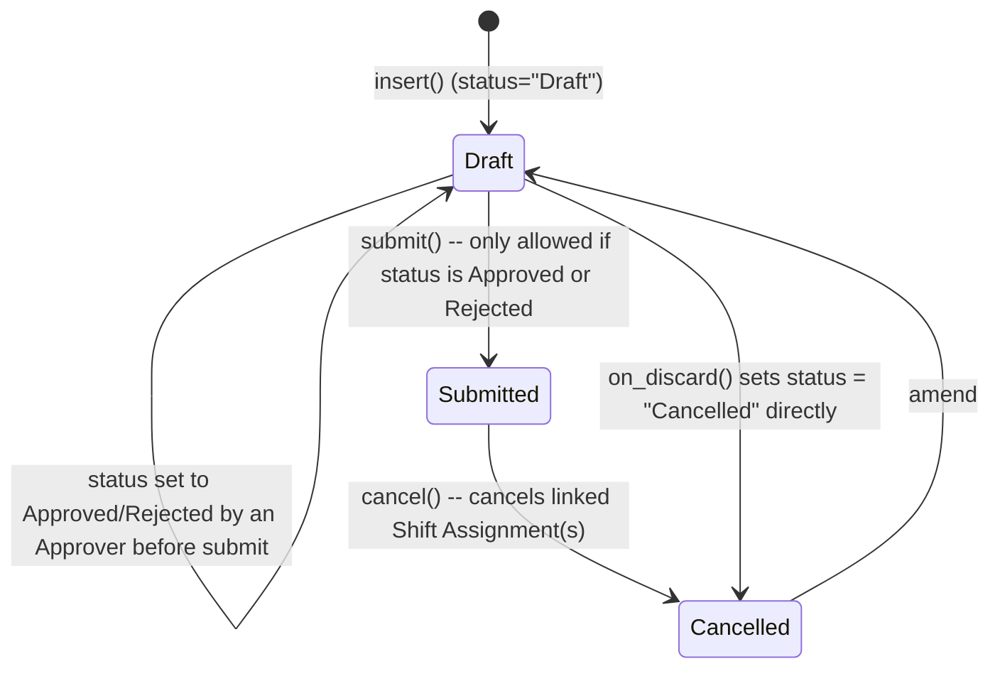

# Shift Request

**Source:** `hrms/hr/doctype/shift_request/shift_request.json`, `shift_request.py`, `shift_request.js`
**Submittable:** yes   **Tree:** no   **Naming:** `autoname: "HR-SHR-.YY.-.MM.-.#####"`
**Module:** HR

## Schema

| Field (fieldname) | Label | Type | Options/Link Target | Required | Default | Read-Only | Notes |
|---|---|---|---|---|---|---|---|
| shift_type | Shift Type | Link | [[Shift Type]] | yes | — | no | in_list_view |
| employee | Employee | Link | [[Employee Core Model]] | yes | — | no | in_list_view |
| employee_name | Employee Name | Data | — | no | — | yes | fetch_from `employee.employee_name` |
| department | Department | Link | Department | no | — | yes | fetch_from `employee.department` |
| status | Status | Select | Draft/Approved/Rejected | yes | Draft | no | |
| column_break_4 | (Column) | Column Break | — | — | — | — | |
| company | Company | Link | Company | yes | — | no | in_list_view |
| approver | Approver | Link | User | yes | — | no | fetch_from `employee.shift_request_approver`, `fetch_if_empty: 1` |
| from_date | From Date | Date | — | yes | — | no | |
| to_date | To Date | Date | — | no | — | no | |
| amended_from | Amended From | Link | Shift Request | no | — | yes | no_copy |

## Child Tables

None.

## State Machine

Plain list:
- (Draft, user/approver sets status field to "Approved" or "Rejected", still Draft docstatus) — guard: `validate_status_change` — only a user with Submit permission on this doctype may change `status` away from "Draft"; anyone else attempting to change it gets `frappe.PermissionError`.
- (Draft docstatus, submit, Submitted docstatus) — guard: `on_submit` throws `frappe.throw(_("Only Shift Request with status 'Approved' and 'Rejected' can be submitted"))` if `self.status not in ["Approved", "Rejected"]`.
- (Submitted+status=Approved, on_submit side effect) — creates and submits a new [[Shift Assignment]] (`company, shift_type, employee, start_date=from_date, end_date=to_date if set, shift_request=self.name`), inserted with `ignore_permissions=1`.
- (Submitted, cancel, Cancelled) — `on_cancel` cancels every submitted `Shift Assignment` where `employee=self.employee, shift_request=self.name, docstatus=1`.
- (Draft, discard, status="Cancelled") — `on_discard` sets `self.db_set("status", "Cancelled")` directly (this doctype DOES have a `status` field, unlike `Attendance Request`).

## Validation Rules (exact, in execution order)

`validate()`:
1. `validate_active_employee(self.employee)` -> throws `InactiveEmployeeStatusError` if Employee Inactive.
2. `self.validate_from_to_dates("from_date", "to_date")` (Frappe framework helper) -> throws if `to_date < from_date` (only applies when `to_date` is set, since it's optional).
3. `validate_overlapping_shift_requests()`:
   - `overlapping_dates = get_overlapping_dates()` — other Shift Requests for the same employee, `docstatus < 2`, `name != self.name`, where (`other.to_date >= self.from_date` OR `other.to_date` unset) AND (if `self.to_date` set) `other.from_date <= self.to_date`.
   - FOR EACH overlap: IF `has_overlapping_timings(self.shift_type, other.shift_type)` THEN `throw_overlap_error(other)`: `frappe.throw(_("Employee {0} has already applied for Shift {1}: {2} that overlaps within this period").format(...))`, `title=_("Overlapping Shift Requests")`, `exc=OverlappingShiftRequestError`.
4. `validate_approver()`:
   - `department = Employee.department`; `shift_approver = Employee.shift_request_approver`.
   - `dept_approvers` = all [[Department Approver]] child rows where `parent=department AND parentfield="shift_request_approver"`, collected as a list of approver users; append `shift_approver` to that list.
   - IF `self.approver` not in that combined list THEN `frappe.throw(_("Only Approvers can Approve this Request."))`.
5. `validate_default_shift()`: `default_shift = Employee.default_shift`. IF `self.shift_type == default_shift` THEN `frappe.throw(_("You can not request for your Default Shift: {0}").format(shift_type))`.
6. `validate_status_change()`: IF the current user has Submit permission on this Shift Request THEN skip (allowed to change status freely). ELSE IF `self.status != "Draft"` THEN `frappe.throw(_("You do not have permission to change the Status of a Shift Request."), frappe.PermissionError)`.

## Business Logic / Calculations

No numeric/date-math calculations beyond the overlap/date checks above. Shift Assignment creation on approval (see State Machine) is a straightforward field copy, not a computed transformation.

## Lifecycle Hooks (exact)

| Event | What Runs | Side Effects on Other Doctypes |
|---|---|---|
| after_insert | `notify_approver()` (via `PWANotificationsMixin`) | sends a PWA notification to the approver |
| validate | See Validation Rules | reads Employee, Department Approver, other Shift Request rows, Shift Type |
| on_update | `share_doc_with_approver(self, self.approver)` (grants the approver Submit-level document share if they lack it, and removes stale shares if the approver changed); `notify_approval_status()` (via mixin); `publish_update()` | writes `DocShare` records for the approver; frontend realtime refresh (`hrms:my_shift_requests`, `hrms:team_shift_requests`) |
| on_submit | Guard: status must be Approved/Rejected; if Approved, create+submit a `Shift Assignment` | creates and submits `Shift Assignment` |
| on_cancel | Cancel every submitted `Shift Assignment` linked via `shift_request=self.name` | cancels `Shift Assignment` record(s) |
| on_discard | `self.db_set("status", "Cancelled")` | none |
| after_delete | `publish_update()` | frontend realtime refresh only |
| doc_events (hooks.py) | `on_submit`: `hrms.telemetry.on_shift_request_submit` | telemetry only |

## Whitelisted / API Methods

None declared with `@frappe.whitelist()` on this controller. (The client script queries `hrms.hr.doctype.department_approver.department_approver.get_approvers` for the approver link field's dropdown, which is whitelisted on that other module, not here.)

## Permissions

| Role | Read | Write | Create | Delete | Submit | Cancel | Amend | Report | Export | Notes |
|---|---|---|---|---|---|---|---|---|---|---|
| Employee | yes | yes | yes | no | no | no | no | yes | yes | can create/edit own drafts, cannot submit (enforced additionally by `validate_status_change`) |
| HR Manager | yes | yes | yes | yes | yes | yes | yes | yes | yes | |
| HR User | yes | no | yes | no | yes | no | no | yes | yes | can create+submit, not general write/delete/cancel |

## Scheduled Jobs Touching This Doctype

None directly. Indirectly surfaced in bulk via [[Shift Assignment Tool]]'s "Process Shift Requests" action, which is user-triggered, not scheduled.

## Port Notes

- **`validate_approver` combines a child-table-derived list (`Department Approver` rows with `parentfield="shift_request_approver"`) with the Employee's direct `shift_request_approver` field** — a port needs both sources represented (department-level approver list + employee-level override) and must union them exactly as source does, not treat one as exclusive.
- **`share_doc_with_approver` is a Frappe-specific document-sharing/ACL mechanism** (`frappe.share.add_docshare`) used to grant the approver Submit rights on this specific document even if their role doesn't normally have Submit permission — a port needs an equivalent per-document ACL grant/revoke mechanism tied to the `approver` field, including revoking the previous approver's share when `approver` changes (see `share_doc_with_approver`'s "remove shared doc if approver changes" logic in `hrms/hr/utils.py`).
- **This doctype's own `status` field co-exists with `docstatus`** — Draft/Approved/Rejected is a data value that is validated/gate-kept independently of the submit action; a port must model both dimensions (submit-state and this custom status) and enforce that submission is only possible once status is Approved or Rejected, exactly as `on_submit` does.
- **`validate_status_change` uses a live permission check (`frappe.has_permission(..., "submit", self)`) inside `validate()`** to decide whether a `status` field change is even allowed — this is an unusual "field write permission conditional on a different permission type" pattern; a port's authorization layer needs an equivalent per-field-transition permission check, not just a coarse-grained "who can edit this doctype" rule.

## Related Doctypes

- [[Employee Core Model]] — the request is filed for this employee.
- [[Shift Type]] — the shift being requested; also used for overlap-timing checks.
- [[Shift Assignment]] — created and submitted automatically when this request is approved and submitted; cancelled when this request is cancelled.
- [[Department Approver]] — combined with the employee's own `shift_request_approver` to validate who may approve this request.
- [[Shift Assignment Tool]] — its "Process Shift Requests" action can bulk-approve/reject Shift Requests.
