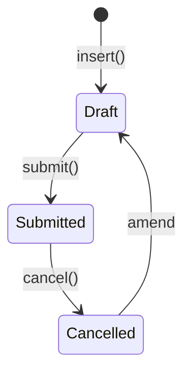

# Shift Schedule

**Source:** `hrms/hr/doctype/shift_schedule/shift_schedule.json`, `shift_schedule.py`, `shift_schedule.js`
**Submittable:** yes   **Tree:** no   **Naming:** `autoname: "prompt"` — user-entered name, no series
**Module:** HR

## Schema

| Field (fieldname) | Label | Type | Options/Link Target | Required | Default | Read-Only | Notes |
|---|---|---|---|---|---|---|---|
| schedule_settings_section | (Section) | Section Break | — | — | — | — | |
| frequency | Frequency | Select | Every Week / Every 2 Weeks / Every 3 Weeks / Every 4 Weeks | yes | — | no | in_list_view; drives the "gap" used in `Shift Schedule Assignment.create_shifts` |
| repeat_on_days | Repeat On Days | Table | Assignment Rule Day (child, Frappe framework standard doctype — has a single `day` Select field: Monday..Sunday) | yes | — | no | de-duplicated in `before_validate` |
| column_break_iprq | (Column) | Column Break | — | — | — | — | |
| shift_type | Shift Type | Link | [[Shift Type]] | yes | — | no | in_list_view, in_standard_filter |
| amended_from | Amended From | Link | Shift Schedule | no | — | yes | no_copy, search_index |

## Child Tables

- `repeat_on_days` -> child doctype **Assignment Rule Day** (Frappe framework core doctype, not owned by this module — reused as-is). Fields: `day` (Select: Monday/Tuesday/Wednesday/Thursday/Friday/Saturday/Sunday). Since this is a framework-provided doctype used generically, a port can model it simply as an owned child row `{parent_id, day}`; no HRMS-specific fields.

## State Machine

No custom `status`/`workflow_state` field; standard Draft->Submitted->Cancelled only. No controller-level `on_submit`/`on_cancel` overrides exist (none defined in `shift_schedule.py`).

## Validation Rules (exact, in execution order)

`before_validate()`:
1. De-duplicate `repeat_on_days`: walk the child rows tracking a `seen_days` set; any row whose `day` value has already been seen is marked for removal; after the scan, remove all marked rows via `self.remove(d)`. Net effect: only the first occurrence of each distinct `day` value is kept, silently dropping duplicates (no error thrown).

No other `validate()` overrides — `reqd` on `frequency`/`repeat_on_days`/`shift_type` is enforced by the framework's standard mandatory-field check only.

## Business Logic / Calculations

### `get_or_insert_shift_schedule(shift_type, frequency, repeat_on_days)` — module-level helper (used by callers wanting to reuse an existing matching schedule rather than always creating a new one)

1. Fetch all submitted `Shift Schedule` names matching `shift_type` and `frequency`.
2. FOR EACH candidate: compare its `repeat_on_days` child rows' `day` values (sorted) against the input `repeat_on_days` (sorted); IF they match exactly THEN return that existing schedule's name (reuse).
3. IF no match found: create a new `Shift Schedule` with a random 10-character name (`random_string(10)`, used directly as the document `name` despite `autoname: "prompt"` — bypassing the normal prompt-for-name UX since this is a programmatic path), `shift_type`, `frequency`, and `repeat_on_days` built from the input list; `insert()` then `submit()`; return its name.

This function is not itself called from anywhere else shown in this module's doctype folders (it is a reusable utility, likely invoked by UI/API code outside the assigned scope) — documented here for completeness since it is defined in this doctype's own controller file.

## Lifecycle Hooks (exact)

| Event | What Runs | Side Effects on Other Doctypes |
|---|---|---|
| before_validate | De-duplicate `repeat_on_days` rows | none |

No `on_submit`/`on_cancel`/`on_update` overrides.

## Whitelisted / API Methods

None declared with `@frappe.whitelist()` on this controller.

## Permissions

| Role | Read | Write | Create | Delete | Submit | Cancel | Amend | Report | Export | Notes |
|---|---|---|---|---|---|---|---|---|---|---|
| Employee | yes | no | no | no | no | no | no | yes | yes | share, email, print |
| HR User | yes | yes | yes | no | no | no | no | yes | yes | |
| HR Manager | yes | yes | yes | yes | yes | yes | yes | yes | yes | |

## Scheduled Jobs Touching This Doctype

None directly — read (not written) by `Shift Schedule Assignment.create_shifts` (see [[Shift Schedule Assignment]]), which is itself invoked from the `hourly_long` `process_auto_shift_creation` job.

## Port Notes

- **Silent de-duplication of `repeat_on_days` is a "correct and value" (not error) behavior** — a user adding "Monday" twice does not get an error, the second row is silently dropped in `before_validate`. Reproduce this exactly rather than adding a validation error for duplicates, unless product direction changes it.
- **`get_or_insert_shift_schedule` bypasses the doctype's own `autoname: "prompt"` convention** by directly assigning a random string as the document name during programmatic creation — a port modeling "prompt" naming as a UI-only concern (with an auto-generated fallback ID for programmatic creates) would match this behavior; do not assume every Shift Schedule record's identifier was manually chosen by a user.
- **`Assignment Rule Day` is a shared Frappe framework doctype** (used elsewhere for generic weekday-based rules, e.g. Assignment Rule) — in the port this can be a simple owned enum-valued child row scoped to Shift Schedule; there is no need to model it as a generic reusable framework entity unless the target stack has an equivalent generic "assignment rule" concept elsewhere that also needs it.

## Related Doctypes

- [[Shift Type]] — the shift this recurrence pattern applies to.
- [[Shift Schedule Assignment]] — binds employees to this schedule and consumes it to auto-generate Shift Assignment records.
- Assignment Rule Day — Frappe core child doctype used for `repeat_on_days`; not part of this repo's ported doctype set, so no matching file to wikilink.
