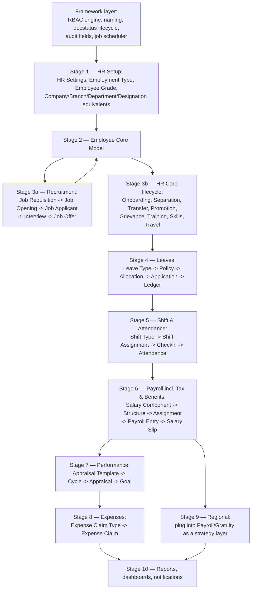

# Recommended Build Order

Based on actual foreign-key/data dependency, not source-folder order. Building out of
this order means stubbing foreign keys you'll have to backfill later.

## Why This Order

1. **Framework layer first** — [[Permission Model (RBAC)|RBAC]], [[Naming and Autoname Rules|naming]],
   [[Submittable Document Lifecycle|docstatus]], audit fields, and the
   [[Background Jobs (Scheduler Events)|job scheduler]] are load-bearing infrastructure
   every doctype spec assumes exists. Building doctypes before this layer means
   retrofitting security and lifecycle rules into already-built tables later, which is
   more error-prone.
2. **HR Setup before Employee** — Employee Grade, Employment Type, Department/
   Designation-equivalents must exist for Employee's own Link fields to have
   something to point at.
3. **Employee before literally everything else** — every module's doctypes carry a
   mandatory `employee` field; see [[Employee Core Model]] for the full field
   inventory a port needs before wiring later stages up.
4. **Recruitment can be built in parallel with HR Core lifecycle stuff** — Recruitment
   doesn't depend on Employee existing (it's what CREATES the first Employee via
   accepted [[Job Offer]]), but circles back to update Employee once hired
   (`update_job_applicant_and_offer`), so build Recruitment's own tables early but
   defer wiring that specific hook (see [[Cross-Doctype Hooks (doc_events)]]) until
   Employee exists.
5. **Leaves before Shift & Attendance** — approved [[Leave Application]] syncs into
   [[Attendance]]; if Attendance exists first with no Leave data to reconcile against,
   you'll need to backfill that reconciliation logic later.
6. **Shift & Attendance before Payroll** — [[Salary Slip]]'s payable-days calculation
   reads Attendance; get that right before building payroll math on top of it.
7. **Regional last, as a strategy layer** — it's designed as a pluggable override
   point (`erpnext.allow_regional` equivalent), so implement the base Payroll/Gratuity
   calculations correctly first, then add country-specific strategies without
   needing to touch the core calculation code again (see
   `01-Modules/Regional/_Module-Spec.md` for the recommended plugin interface shape).

## Cross-Cutting Reads

Read these regardless of stage, since they apply everywhere:
- [[Permission Model (RBAC)]]
- [[Submittable Document Lifecycle]]
- [[Naming and Autoname Rules]]
- [[Cross-Doctype Hooks (doc_events)]]
- [[Background Jobs (Scheduler Events)]]
- [[Implicit Framework Behaviors]]
- [[Employee Core Model]]
