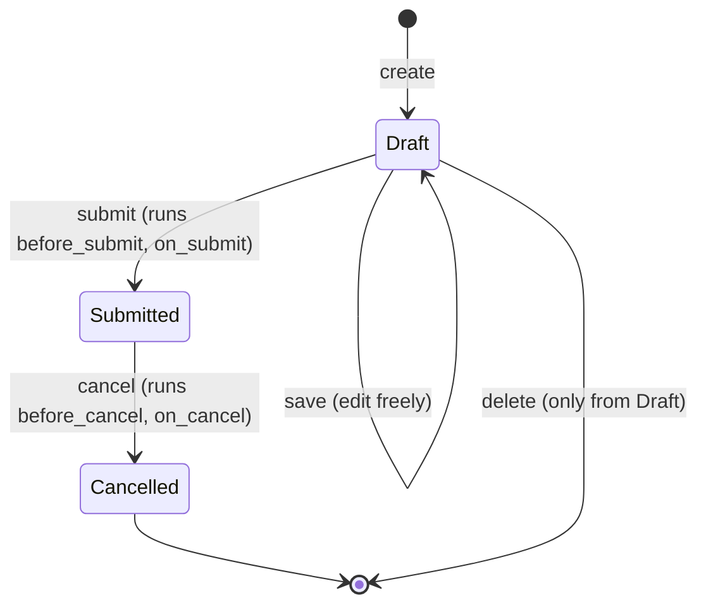

# Submittable Document Lifecycle

Frappe has a native document-state concept independent of any custom `status` field
a doctype adds. Any doctype marked `"is_submittable": 1` in its JSON gets this for
free — a port must build it explicitly since it's framework behavior, not
per-doctype code.

## The `docstatus` State Machine

Every submittable doctype has a hidden integer field `docstatus`:

```
0 = Draft      — freely editable, not yet a "real" transaction
1 = Submitted  — locked; most fields become read-only; represents a committed transaction
2 = Cancelled  — a submitted doc that was reversed; permanently read-only, cannot be resubmitted
```



Rules a port must enforce generically, for every submittable doctype, without
per-doctype code:

1. A document can only be **deleted** while `docstatus = 0` (Draft). Submitted or
   Cancelled documents can never be hard-deleted through the normal UI/API (only a
   System Manager doing a raw DB operation could, and this app doesn't rely on that
   happening).
2. A document can only be **submitted** from `docstatus = 0`, and only if it has a
   `name` already assigned per [[Naming and Autoname Rules]] (i.e., been saved at
   least once) and passes all `validate` logic, and the current user's role has the
   `can_submit` right per [[Permission Model (RBAC)]].
3. A document can only be **cancelled** from `docstatus = 1`.
4. Once `docstatus = 2` (Cancelled), the document is permanently terminal — the only
   way to get an equivalent "active" document again is to **amend** it, which creates
   a brand NEW document (new `name`, fresh `docstatus = 0`) with `amended_from` set to
   the cancelled document's name, copying its field values as a starting point. Not
   every doctype allows amend — check the doctype's own permissions table (per
   [[Permission Model (RBAC)]] Layer 1) for the `amend` right; several doctypes in this
   app (see [[Gratuity]] — flagged as `is_submittable` with no submit/cancel rights
   granted to any role in `01-Modules/Payroll/Gratuity.md`) have gaps here worth
   deciding deliberately in a port rather than copying blindly.
5. Editing a Submitted document is restricted to specific fields the doctype
   explicitly allows (Frappe's `allow_on_submit` field property) — everything else
   becomes read-only. Check each doctype's field table for any fields marked
   allow-on-submit in the per-doctype specs; if none are noted, treat ALL fields as
   locked on submit.
6. Cancelling a document must reverse its side effects. This app's
   [[Cross-Doctype Hooks (doc_events)]] (`hrms/hooks.py` `doc_events`) frequently run
   the SAME function on both `on_submit` and `on_cancel` for this reason (e.g.
   `update_payment_for_expense_claim` runs on Payment Entry/Journal Entry submit AND
   cancel) — the function itself checks `docstatus` to decide whether to apply or
   reverse the effect. A port must replicate this symmetry: every side effect a submit
   causes needs an explicit, tested reversal on cancel, not just "don't run the
   forward logic."

## Non-Submittable Doctypes

Most master/setup doctypes ([[Leave Type]], [[Salary Component]], [[Department Approver]],
etc.) have no `docstatus` concept at all — they're just normal editable/deletable
records gated only by the Layer 1/3 permission model (see [[Permission Model (RBAC)]]).
Check each doctype spec's `**Submittable:**` line.

## Custom Status Fields Layered on Top

Several submittable doctypes ALSO carry their own `status`/`workflow_state` field
(e.g. [[Leave Application]]: Open/Approved/Rejected; [[Job Applicant]]: Open/Replied/Rejected/
Hold/Accepted) that is business-logic-driven, set explicitly by controller code, and
independent of `docstatus`. A document can be `docstatus = 1` (Submitted) AND
`status = "Rejected"` simultaneously — submission and business approval are two
separate axes. Each doctype's own spec file's "State Machine" section documents both
axes together where relevant.
